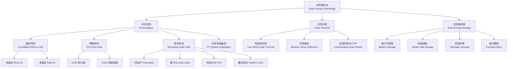

# 太阳能 (Solar Energy / Photovoltaics)

## 学科概述

太阳能利用技术（Solar Energy Technology）研究太阳辐射（Solar Radiation）的收集、转换、存储和利用。太阳每秒钟向地球辐射约 $1.74 \times 10^{17}$ J 的能量，相当于 500 万吨标准煤的发热量。太阳能利用分为两大技术路线：光伏发电（Photovoltaics, PV）通过半导体光生伏打效应将光能直接转换为电能，光热利用（Solar Thermal）将太阳辐射能转换为热能。随着全球光伏累计装机容量突破 1200 GW（2023 年），光伏已成为全球新增电源装机的主要形式。光伏组件成本从 2010 年的 $4/W 下降至目前的 $0.10~0.20/W，降幅超过 95%。

## 太阳能技术体系

## 核心概念对比

| 概念 | 符号 | 单位 | 定义 | 典型值 |
|:----|:-----|:-----|:-----|:-------|
| 太阳常数 (Solar Constant) | $G_{sc}$ | W/m² | 地球大气层外平均太阳辐照度 | 1361 W/m² |
| 峰值日照时数 (Peak Sun Hours) | PSH | h/day | 等效 1000 W/m² 日照时间 | 3~6 h/day (中国) |
| 组件额定功率 | $P_{\text{max}}$ | Wp | STC 条件下最大输出功率 | 400~700 Wp |
| 组件效率 (Module Efficiency) | $\eta_{\text{mod}}$ | % | $P_{\text{max}} / (G \times A)$ | 18%~24% |
| 系统效率 (System Efficiency) | $\eta_{\text{sys}}$ | % | 交流输出 / 组件阵列标称功率 | 78%~85% |
| 填充因子 (Fill Factor) | FF | — | $V_{mp} I_{mp} / (V_{oc} I_{sc})$ | 0.70~0.85 |
| 温度系数 | $\gamma$ | %/°C | 功率随温度的变化率 | -0.30~-0.40%/°C |
| 双面率 (Bifaciality Factor) | $f_{\text{bi}}$ | % | 背面效率 / 正面效率 | 70%~95% |
| 性能比 (Performance Ratio) | PR | % | 实际发电量 / 理论发电量 | 75%~85% |
| 平准化度电成本 | LCOE | USD/kWh | 全生命周期成本 / 总发电量 | 0.02~0.06 |

## 光伏发电原理

### 光伏效应 (Photovoltaic Effect)

光伏效应是指光照射到半导体 PN 结上时，能量 $h\nu \geq E_g$ 的光子被吸收产生电子-空穴对（Electron-Hole Pairs），在内建电场作用下分离，在 PN 结两端产生光生电压。当外电路接通时，产生光生电流。

### 光伏电池等效电路与 I-V 特性

光伏电池的电流-电压关系由单二极管模型描述：

$$ I = I_L - I_0 \left[ \exp\left( \frac{q(V + IR_s)}{nkT} \right) - 1 \right] - \frac{V + IR_s}{R_{sh}} $$

其中 $I_L$ 为光生电流，$I_0$ 为反向饱和电流，$q = 1.602 \times 10^{-19}$ C，$n$ 为理想因子（通常 1~2），$k = 1.381 \times 10^{-23}$ J/K，$T$ 为电池温度（K），$R_s$ 为串联电阻，$R_{sh}$ 为并联电阻。

### 关键性能参数

**开路电压 (Open-Circuit Voltage)**：
$$ V_{oc} = \frac{nkT}{q} \ln\left( \frac{I_L}{I_0} + 1 \right) $$

**短路电流 (Short-Circuit Current)**：$I_{sc} \approx I_L$，与辐照度成线性关系。

**最大功率点 (Maximum Power Point)**：
$$ P_{\text{max}} = V_{mp} \times I_{mp} $$

**填充因子 (Fill Factor)**：
$$ FF = \frac{V_{mp} I_{mp}}{V_{oc} I_{sc}} = \frac{P_{\text{max}}}{V_{oc} I_{sc}} $$

**转换效率 (Conversion Efficiency)**：
$$ \eta = \frac{P_{\text{max}}}{P_{\text{in}}} = \frac{V_{oc} I_{sc} FF}{G \cdot A} $$

其中 $G$ 为辐照度（STC 下 1000 W/m²），$A$ 为电池面积。

**SQ 详细平衡极限 (Shockley-Queisser Limit)**：单结太阳能电池在 AM1.5 光谱下的理论最大效率约为 33.7%（对应带隙 1.34 eV）。

## 太阳能电池类型与性能对比

| 电池类型 | 实验室最高效率 | 量产效率 | 优点 | 缺点 | 市场份额 (2023) |
|:---------|:--------------|:---------|:-----|:-----|:---------------|
| 单晶硅 PERC | 27.3% (HJT) | 21%~24% | 效率高、衰减低、寿命 > 30 年 | 成本较高于多晶 | ~70% |
| 多晶硅 | 23.8% | 17%~20% | 成本低、工艺成熟 | 效率低于单晶 | ~8% |
| n 型 TOPCon | 26.1% | 22%~25% | 高双面率、低衰减 | 工艺复杂 | ~15% |
| HJT 异质结 | 27.3% | 23%~25% | 对称结构、温度系数低 | 设备投资高 | ~3% |
| IBC 背接触 | 26.1% | 22%~24% | 正面无栅线、美观 | 工艺步骤多 | ~2% |
| CdTe 碲化镉 | 22.1% | 16%~18% | 弱光性好、温度系数小 | 含镉毒性 | ~5% |
| CIGS | 23.4% | 15%~18% | 柔性、可弯曲 | 大面积均匀性差 | ~2% |
| 钙钛矿 (Perovskite) | 26.1% (单结) | 15%~20%* | 材料成本低、效率提升快 | 稳定性差、大面积难 | 实验室/中试 |
| 钙钛矿/硅叠层 | 33.7% | 25%~30%* | 理论效率极限高 | 工艺复杂 | 实验室 |
| 有机 OPV | 18.2% | 8%~12% | 柔性透明、可印刷 | 效率低、寿命短 | 实验室 |

注：* 为实验室小面积数据，非量产数据。

## 光伏组件与系统设计

### 组件结构

典型光伏组件从外到内包括：钢化玻璃（低铁超白，透光率 > 91%）→ EVA 封装胶膜 → 电池片串焊 → EVA 背膜 → 含氟背板（或双玻玻璃）→ 铝边框 → 接线盒。STC 标准测试条件：辐照度 1000 W/m²，AM1.5 光谱，电池温度 25°C。

### 组件串并联设计

**串联设计**：组件串联数受逆变器最大输入电压限制：

$$ N_s \leq \frac{V_{\text{max,inverter}}}{V_{oc} \times (1 + \gamma_V (T_{\text{min}} - 25))} $$

**并联设计**：并联支路数受逆变器最大输入电流限制：

$$ N_p \leq \frac{I_{\text{max,inverter}}}{I_{sc} \times (1 + \gamma_I (T_{\text{max}} - 25))} $$

**组串比 (String Ratio)** $= P_{\text{array}} / P_{\text{inverter}}$，通常取 1.1~1.3，使逆变器在光照较弱时仍可启动 MPPT。

### 系统性能评价指标

**性能比 (Performance Ratio, PR)**：
$$ \text{PR} = \frac{E_{\text{actual}}}{E_{\text{theoretical}}} = \frac{E_{\text{actual}}}{G_{\text{poa}} \times P_{\text{rated}} / G_{STC}} $$

典型 PR = 75%~85%，影响 PR 的因素包括：
- 温度损失：3%~8%（温度每升高 1°C，功率下降 0.3~0.4%）
- 阴影遮挡损失：0%~10%
- 组件衰减：首年 2%，之后每年 0.45%~0.55%
- 直流线损：1%~3%
- 逆变器效率：96%~98%
- 积雪/灰尘遮挡：1%~5%

**平准化度电成本 (LCOE)**：
$$ \text{LCOE} = \frac{I_0 + \sum_{t=1}^T (O_t + M_t + F_t) (1 + r)^{-t}}{\sum_{t=1}^T E_t (1 + r)^{-t}} $$

其中 $I_0$ 为初始投资，$O_t$ 为运营成本，$M_t$ 为维护成本，$F_t$ 为财务费用，$E_t$ 为年发电量，$r$ 为折现率。

## 光伏系统分类

| 系统类型 | 容量范围 | 并网方式 | 应用场景 | 特点 |
|:---------|:---------|:---------|:---------|:-----|
| 居民屋顶分布式 | 3~20 kW | 并网/自发自用 | 家庭住宅 | 投资小，自发自用余电上网 |
| 工商业分布式 | 0.1~20 MW | 并网 | 工厂、仓库屋顶 | 规模效益好，白天负荷匹配 |
| 集中式地面电站 | 10~2000 MW | 并网 | 荒漠、戈壁、采煤塌陷区 | 规模大，LCOE 最低 |
| BIPV 光伏建筑一体化 | 按建筑定制 | 并网 | 幕墙、采光顶、遮阳棚 | 美观、替代建筑材料 |
| 农光互补 (Agri-PV) | 10~500 MW | 并网 | 农业大棚上架设 | 一地两用，农电互补 |
| 渔光互补 | 10~500 MW | 并网 | 鱼塘、水库上架设 | 水上发电、水下养鱼 |
| 漂浮式光伏 | 1~500 MW | 并网 | 湖泊、水库、近海 | 冷却效果好，效率高 |
| 离网光伏系统 | 0.1~100 kW | 离网 | 偏远地区、海岛 | 需配置储能 |
| 光伏微电网 | 10 kW~10 MW | 离网/并网 | 园区、海岛 | 综合能源管理 |

## 太阳能热利用

### 集热器技术

| 集热器类型 | 工作温度范围 | 热效率 | 典型用途 |
|:-----------|:-------------|:-------|:---------|
| 平板集热器 (Flat Plate) | 30~80°C | 40%~65% | 热水、采暖 |
| 真空管集热器 (Evacuated Tube) | 50~120°C | 50%~75% | 热水、采暖、制冷 |
| 复合抛物面 CPC 集热器 | 60~150°C | 50%~65% | 中温工业用热 |
| 线性菲涅尔集热器 (LFR) | 250~400°C | 35%~50% | 工业蒸汽、热发电 |
| 槽式抛物面集热器 (PTC) | 350~400°C | 55%~65% | 热发电（CSP） |
| 塔式定日镜场 (Power Tower) | 500~600°C | 50%~60% | 热发电（CSP） |

### 太阳能热发电 (CSP)

| CSP 技术 | 聚光比 | 工质 | 接收器温度 | 发电效率 | 储热能力 |
|:---------|:-------|:-----|:-----------|:---------|:---------|
| 槽式 (Parabolic Trough) | 30~80 | 导热油/熔盐 | 350~400°C | 15%~20% | 6~12 h 熔盐储热 |
| 塔式 (Power Tower) | 300~1500 | 熔盐/蒸汽/空气 | 500~600°C | 20%~25% | 10~15 h 熔盐储热 |
| 线性菲涅尔 (LFR) | 20~50 | 水/导热油 | 250~400°C | 10%~15% | 可带储热 |
| 碟式/斯特林 (Dish/Stirling) | 1000~3000 | 氢气/氦气 | 650~800°C | 25%~30% | 储热困难 |

### CSP vs PV 对比

| 对比维度 | 光伏 (PV) | 光热发电 (CSP) |
|:---------|:----------|:---------------|
| 初始投资成本 | $0.7~1.0/W | $3~6/W |
| LCOE | $0.02~0.05/kWh | $0.06~0.12/kWh |
| 输出电形式 | 直流 → 交流 | 交流（同步发电机） |
| 储能 | 电池储能（成本较高） | 熔盐储热（成本低，适合大规模） |
| 调度能力 | 受天气影响，需配储 | 带储热可全天候调度 |
| 适用资源区 | 全球大多数地区 | 高 DNI 地区（> 2000 kWh/m²/yr） |

## 太阳能发展历史与里程碑

| 年份 | 光伏里程碑 | 光热里程碑 |
|:----|:-----------|:-----------|
| 1839 | E. Becquerel 发现光伏效应 | — |
| 1876 | Adams & Day 在硒中发现光伏效应 | — |
| 1954 | Bell Labs 发明 6% 硅太阳能电池 | — |
| 1958 | 太阳能电池用于 Vanguard I 卫星 | — |
| 1970s | 石油危机推动地面应用研究 | 首个槽式 CSP 实验电站 |
| 1980s | 效率突破 20%，太空价格大幅下降 | SEGS 系列电站（加州，354 MW） |
| 2000~2010 | 中国光伏制造崛起，德国 EEG 推动 | 西班牙 50 MW 槽式电站群 |
| 2010~2015 | 多晶硅价格暴跌，光伏成本下降 80% | 熔盐储热技术商业化 |
| 2015~2020 | 全球光伏累计装机突破 500 GW | 迪拜 DEWA 塔式 700 MW |
| 2020~2025 | 钙钛矿效率突破 26%，TOPCon/HJT 量产 | 中国光热发电示范项目 |
| 2025+ | 叠层电池效率突破 30%，BIPV 规模化 | CSP 与 PV 混合电站模式 |

## 经典教材与参考书

- 王长贵《太阳能光伏发电技术》（化学工业出版社）
- A. Luque & S. Hegedus《Handbook of Photovoltaic Science and Engineering》（Wiley）
- 沈辉《太阳能光伏发电系统设计》（机械工业出版社）
- J. A. Duffie & W. A. Beckman《Solar Engineering of Thermal Processes》（Wiley）
- 李申生《太阳能热利用技术》（科学出版社）
- 《光伏发电站设计规范》GB 50797
- 《太阳能资源评估方法》GB/T 31163
- Green, M. A.《Solar Cells: Operating Principles, Technology and System Applications》

## 主要应用领域

- 分布式光伏发电（居民、工商业屋顶）
- 集中式大型地面光伏电站（沙漠、戈壁）
- 光热发电 CSP 及其储热调度系统
- 太阳能热水与建筑供暖系统
- 光伏建筑一体化（BIPV / BAPV）
- 太阳能制冷与吸收式空调
- 太阳能制氢（光催化/PEC/电解耦合）
- 太阳能海水淡化
- 太阳能农业应用（温室补光、灌溉）
- 离网光伏供电系统（偏远地区、通信基站）

## 相关条目

- [[WindEnergy]]
- [[HydrogenEnergy]]
- [[EnergyEfficiency]]
- [[EnergySystems]]
- [[SemiconductorPhysics]]
- [[PowerElectronics]]
- [[BatteryEnergyStorage]]
- [[ThermalEnergyStorage]]
- [[ConcentratedSolarPower]]
