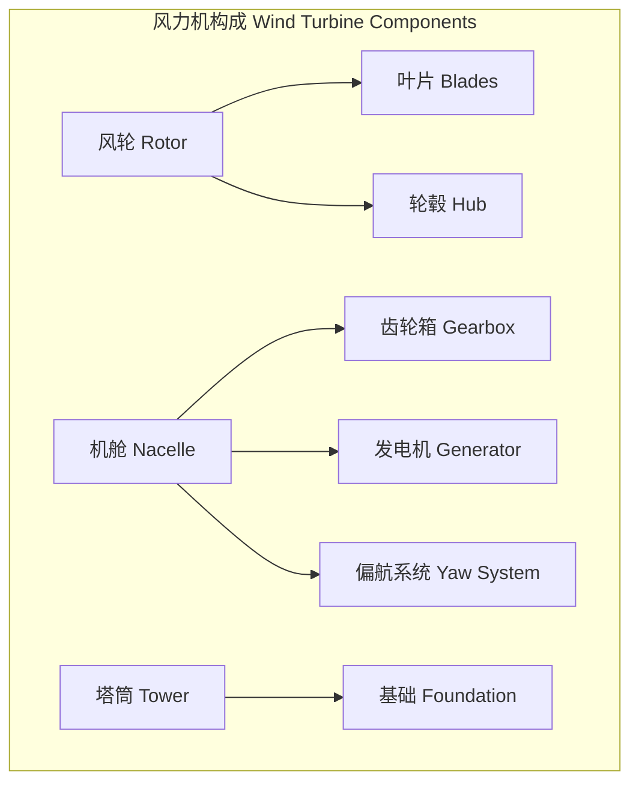
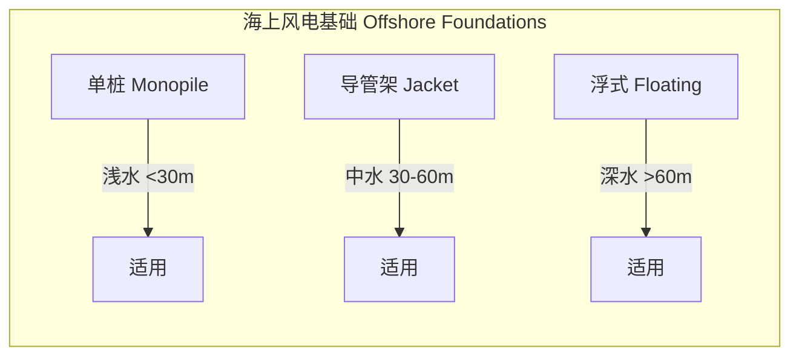
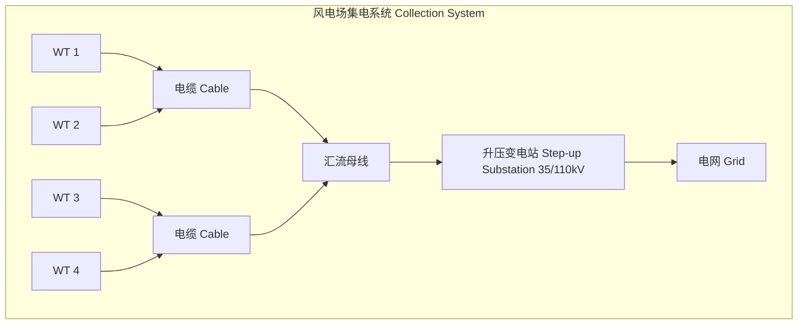

# 风能

## 概述

风能（Wind Energy）是利用风的动能转化为电能或机械能的清洁能源技术。风能是目前技术最成熟、商业化程度最高的可再生能源之一。

## 风力机空气动力学

### Betz 极限

Betz 极限（Betz Limit）是风力机理论最大效率：

$$
C_{p,\max} = \frac{16}{27} \approx 0.593
$$

其中 $C_p$ 为功率系数（Power Coefficient），定义为风力机捕获的机械功率与风通过扫掠面积的动能之比。

### 功率公式

风力发电机输出功率：

$$
P = \frac{1}{2} \rho A v^3 C_p \eta
$$

| 符号 | 含义 | 单位 |
|------|------|------|
| $\rho$ | 空气密度 | kg/m³ |
| $A$ | 风轮扫掠面积 | m² |
| $v$ | 风速 | m/s |
| $C_p$ | 功率系数 | 无量纲 |
| $\eta$ | 传动与发电机效率 | 无量纲 |

### 推力与转矩

轴向推力：

$$
F = \frac{1}{2} \rho A v^2 C_T
$$

其中 $C_T$ 为推力系数（Thrust Coefficient），最大值约为 1.0。

## 风力机结构

### 主要部件

### 类型对比

| 类型 | 额定功率 | 叶片数 | 转速 | 应用场景 |
|------|---------|--------|------|---------|
| 水平轴（HAWT） | 1 — 15 MW | 3 | 5 — 15 rpm | 大型风电场 |
| 垂直轴（VAWT） | 1 — 100 kW | 2 — 3 | 10 — 30 rpm | 城市分散式 |

## 风能资源评估

### 风速分布

Weibull 分布用于描述风速概率密度：

$$
f(v) = \frac{k}{c}\left(\frac{v}{c}\right)^{k-1} \exp\left[-\left(\frac{v}{c}\right)^k\right]
$$

其中 $k$ 为形状参数（Shape Parameter），$c$ 为尺度参数（Scale Parameter）。

### 风切变与湍流

风切变（Wind Shear）指数律：

$$
v(z) = v(z_r)\left(\frac{z}{z_r}\right)^\alpha
$$

其中 $\alpha$ 为风切变指数，典型值 0.1 — 0.3。

| 地形类型 | 粗糙度长度 $z_0$ (m) | 切变指数 $\alpha$ |
|---------|---------------------|------------------|
| 开阔海域 | 0.0002 | 0.10 — 0.13 |
| 农田 | 0.03 — 0.10 | 0.13 — 0.19 |
| 城市郊区 | 0.30 — 0.50 | 0.19 — 0.28 |
| 城市中心 | 1.0 — 2.0 | 0.28 — 0.40 |

## 风电场设计

### 布局优化

尾流效应（Wake Effect）导致下游风力机捕获风速降低。Jensen 尾流模型：

$$
v_x = v_0 \left[1 - \frac{1 - \sqrt{1 - C_T}}{(1 + 2\alpha x/D)^2}\right]
$$

### 风机间距

| 风向 | 建议间距 | 说明 |
|------|---------|------|
| 主导风方向 | 5D — 7D | D 为风轮直径 |
| 垂直风向 | 3D — 5D | 减少尾流影响 |
| 复杂地形 | 依 CFD 优化 | 考虑地形加速效应 |

## 电气系统与并网

### 发电机类型

| 类型 | 变频器容量 | 转速范围 | 特点 |
|------|-----------|---------|------|
| 异步发电机（SCIG） | 全功率 | 固定 | 结构简单 |
| 双馈异步发电机（DFIG） | 30% 额定 | ±30% | 性价比高 |
| 永磁同步发电机（PMSG） | 全功率 | 全范围 | 效率高 |

### 并网要求

- 频率：50/60 Hz ± 0.5%
- 电压：LVRT（Low Voltage Ride Through）能力
- 功率控制：有功/无功可调
- 谐波：THD < 5%

## 海上风电

海上风电相比于陆上风电的优势与挑战：

| 方面 | 陆上风电 | 海上风电 |
|------|---------|---------|
| 风资源 | 平均风速 6 — 8 m/s | 平均风速 8 — 12 m/s |
| 湍流度 | 较高 | 较低 |
| 基础成本 | 占总投资 5% — 10% | 占总投资 20% — 35% |
| 运维成本 | 0.01 — 0.02 $/kWh | 0.02 — 0.05 $/kWh |
| 环境影响 | 噪声、视觉 | 海洋生态、航运 |

### 基础形式

## 风力机控制

### 功率控制策略

| 控制方式 | 原理 | 实现方法 | 适用风速范围 |
|---------|------|---------|------------|
| 失速控制（Stall Control） | 叶片气动失速 | 固定桨距，失速自动限功率 | 额定风速以上 |
| 变桨控制（Pitch Control） | 调整叶片桨距角 | 液压或电动变桨执行器 | 全风速范围 |
| 主动失速（Active Stall） | 反向变桨诱发失速 | 同变桨机构 | 额定风速以上 |
| 偏航控制（Yaw Control） | 调整对风角度 | 偏航电机驱动 | 所有风速 |

### 变桨控制律

PID 变桨控制器：

$$
\beta(t) = K_p e(t) + K_i \int_0^t e(\tau) d\tau + K_d \frac{de(t)}{dt}
$$

其中 $e(t) = \Omega_{\text{ref}} - \Omega(t)$ 为转速偏差。

### 状态监测与故障诊断

风力机常见故障类型：

| 故障类型 | 检测方法 | 预警时间 | 维护策略 |
|---------|---------|---------|---------|
| 齿轮箱齿面磨损 | 振动分析、油液分析 | 2 — 6 个月 | 计划维修 |
| 轴承疲劳 | 加速度包络谱（GSE） | 1 — 3 个月 | 更换 |
| 叶片裂纹 | 声发射（AE）、光纤应变 | 取决于扩展速率 | 修补/更换 |
| 发电机绝缘老化 | 局部放电测量 | 6 — 12 个月 | 再绕线 |
| 塔筒螺栓松动 | 超声螺栓预紧力监测 | 即时 | 重新紧固 |

## 风电场电气系统

### 集电系统拓扑

### 功率预测

风速预测方法对比：

| 预测方法 | 预测时长 | 平均绝对误差 MAE | 计算成本 |
|---------|---------|----------------|---------|
| 持续法（Persistence） | 1 — 6 h | 15% — 25% | 极低 |
| 数值天气预报（NWP） | 6 — 72 h | 10% — 20% | 高 |
| 统计/机器学习 | 1 — 48 h | 8% — 18% | 中 |
| 混合方法（Hybrid） | 1 — 72 h | 5% — 15% | 中高 |

## 环境影响

| 环境影响类别 | 影响描述 | 缓解措施 |
|------------|---------|---------|
| 鸟类碰撞（Bird Collision） | 旋转叶片威胁飞鸟 | 鸟类雷达预警、暂停运行 |
| 噪声污染（Noise） | 机械+气动噪声 ≤ 45 dB(A) | 低噪声叶片、隔声屏障 |
| 视觉影响（Visual Impact） | 景观遮挡 | 布局优化、涂装配色 |
| 电磁干扰（EMI） | 旋转叶片反射信号 | 远离雷达站、屏蔽设计 |
| 海洋生态（Marine Ecology） | 施工噪声、底质扰动 | 气泡帷幕、人工鱼礁 |

## 参考

- Burton, T., Jenkins, N., et al. (2021). *Wind Energy Handbook*. Wiley.
- 贺德馨等. (2010). 《风工程与风能利用》. 科学出版社.
- IEC 61400 系列标准. *Wind Turbines*.
- Global Wind Energy Council. (2024). *Global Wind Report*.
- WindEurope. (2023). *Wind Energy in Europe: Outlook to 2025*.
