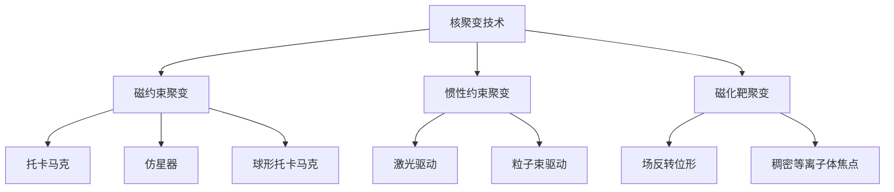

# 可再生能源最新进展（2024-2026）

## 一、概述

2024-2026年，可再生能源领域取得重大突破：钙钛矿太阳能电池效率突破30%、固态电池开始商业化、核聚变实验取得里程碑进展。全球可再生能源装机容量持续快速增长。

## 二、太阳能技术

### 2.1 钙钛矿太阳能电池

| 参数 | 2020年 | 2024年 | 2026年（预测） |
|------|--------|--------|---------------|
| 实验室效率 | 25.5% | 26.1% | 30%+ |
| 稳定性 | <1年 | 10年+ | 25年目标 |
| 成本 | $0.30/W | $0.15/W | $0.10/W |

**钙钛矿技术优势**：
- 带隙可调：从1.2eV到2.3eV
- 低温溶液加工：成本低于硅基电池
- 柔性基底：可制成柔性太阳能电池
- 叠层电池：与硅结合可达30%+效率

### 2.2 钙钛矿/硅叠层电池

| 公司/机构 | 效率 | 技术路线 | 状态 |
|---------|------|---------|------|
| **隆基绿能** | 33.9% | 钙钛矿/硅叠层 | 世界纪录 |
| **LONGi** | 33.5% | 钙钛矿/硅叠层 | 量产开发 |
| **Oxford PV** | 28.6% | 钙钛矿/硅叠层 | 商业化 |
| **Swift Solar** | 25%+ | 柔性钙钛矿 | 产品开发 |

### 2.3 太阳能成本趋势

$$
\text{学习率}: \text{成本每翻倍装机量下降约25\%}
$$

- **2010年**：$0.36/kWh
- **2020年**：$0.04/kWh
- **2024年**：$0.02-0.03/kWh
- **2030年（预测）**：$0.01/kWh

## 三、电池技术

### 3.1 锂离子电池进展

| 技术 | 能量密度 | 循环寿命 | 代表产品 |
|------|---------|---------|---------|
| **磷酸铁锂 (LFP)** | 160 Wh/kg | 6000+ | BYD刀片电池 |
| **三元锂 (NCM)** | 250 Wh/kg | 2000+ | 宁德时代麒麟 |
| **钠离子电池** | 140 Wh/kg | 3000+ | 宁德时代钠电池 |
| **4680电池** | 300 Wh/kg | 1500+ | Tesla 4680 |

### 3.2 固态电池

| 公司 | 电解质类型 | 能量密度 | 商业化时间 |
|------|-----------|---------|-----------|
| **丰田** | 硫化物 | 500 Wh/kg | 2027-2028 |
| **三星SDI** | 硫化物 | 900 Wh/L | 2027 |
| **宁德时代** | 凝聚态 | 500 Wh/kg | 2024（凝聚态） |
| **QuantumScape** | 氧化物 | 400+ Wh/kg | 2025-2026 |
| **Solid Power** | 硫化物 | 400 Wh/kg | 2026 |
| **清陶能源** | 氧化物 | 400 Wh/kg | 2024（半固态） |

**固态电池优势**：
- 更高能量密度：比液态锂电高50-100%
- 更安全：无液态电解质泄漏风险
- 更快充电：10分钟充至80%
- 更长寿命：循环次数>10000次

### 3.3 电池成本趋势

- **2020年**：$137/kWh
- **2023年**：$139/kWh（因原材料上涨）
- **2024年**：$115/kWh
- **2025年（预测）**：$100/kWh
- **2030年（预测）**：$60/kWh

## 四、核聚变能源

### 4.1 核聚变里程碑

| 事件 | 时间 | 机构 | 意义 |
|------|------|------|------|
| **NIF点火** | 2022.12 | 美国NIF | 首次实现聚变点火 |
| **Q>1** | 2022.12 | NIF | 输出能量大于输入 |
| **重复点火** | 2023 | NIF | 多次重复实验 |
| **ITER组装** | 2024 | ITER | 主要部件组装完成 |
| **SPARC磁体** | 2024 | MIT/CFS | 高温超导磁体测试成功 |

### 4.2 主要核聚变项目

| 项目 | 类型 | 目标 | 时间线 |
|------|------|------|--------|
| **ITER** | 托卡马克 | Q>10 | 2035年首次等离子体 |
| **SPARC** | 紧凑托卡马克 | Q>2 | 2025年建成 |
| **ARC** | 商业堆 | 500MW | 2030年代 |
| **STEP** | 球形托卡马克 | 商业示范 | 2040年 |
| **Helion** | 场反转位形 | 直接发电 | 2028年 |
| **TAE** | 场反转位形 | 商业化 | 2030年 |

### 4.3 核聚变技术路线

## 五、氢能技术

### 5.1 绿氢生产

| 技术 | 效率 | 成本 | 状态 |
|------|------|------|------|
| **碱性电解 (ALK)** | 70-80% | $3-5/kg | 成熟 |
| **PEM电解** | 65-75% | $4-6/kg | 商业化 |
| **固体氧化物 (SOEC)** | 80-90% | $5-8/kg | 示范 |
| **AEM电解** | 60-70% | $3-5/kg | 早期 |

### 5.2 氢能应用

| 应用 | 技术 | 状态 |
|------|------|------|
| **交通运输** | 燃料电池 | 商业化（商用车） |
| **工业脱碳** | 绿氢替代灰氢 | 示范阶段 |
| **储能** | 氢储能 | 试点 |
| **发电** | 氢燃气轮机 | 示范 |

### 5.3 氢能成本目标

- **2024年**：$4-6/kg（绿氢）
- **2030年（目标）**：$1-2/kg
- **2050年（目标）**：$0.5-1/kg

## 六、风能技术

### 6.1 海上风电

| 参数 | 2020年 | 2024年 | 2026年（预测） |
|------|--------|--------|---------------|
| 单机容量 | 10MW | 15MW | 20MW+ |
| 叶轮直径 | 164m | 236m | 260m+ |
| 离岸距离 | 30km | 50km | 100km+ |
| 成本 | $80/MWh | $50/MWh | $40/MWh |

### 6.2 浮式风电

| 项目 | 容量 | 位置 | 状态 |
|------|------|------|------|
| **Hywind Tampen** | 88MW | 挪威 | 运营 |
| **Kincardine** | 50MW | 苏格兰 | 运营 |
| **WindFloat Atlantic** | 25MW | 葡萄牙 | 运营 |
| **示范项目** | 100MW+ | 多地 | 开发中 |

## 七、储能技术

### 7.1 长时储能

| 技术 | 时长 | 成本 | 状态 |
|------|------|------|------|
| **液流电池** | 4-12h | $300-500/kWh | 商业化 |
| **压缩空气** | 4-24h | $100-200/kWh | 示范 |
| **重力储能** | 4-12h | $150-250/kWh | 试点 |
| **热储能** | 4-24h | $50-150/kWh | 商业化 |
| **氢储能** | 季节性 | 高 | 研发 |

### 7.2 储能市场

- **2023年**：全球新增储能装机45GW/99GWh
- **2024年**：预计新增70GW/150GWh
- **2030年**：预计累计装机1000GW+

## 八、智能电网

### 8.1 虚拟电厂 (VPP)

| 组成 | 功能 | 技术 |
|------|------|------|
| 分布式发电 | 太阳能、风电 | 光伏逆变器 |
| 储能系统 | 削峰填谷 | 电池管理系统 |
| 可调负荷 | 需求响应 | 智能电表 |
| 电动汽车 | V2G充放电 | 双向充电桩 |

### 8.2 电网数字化

- **高级计量基础设施 (AMI)**：智能电表普及
- **配电自动化**：故障自动隔离恢复
- **AI调度**：负荷预测、新能源出力预测
- **区块链**：点对点能源交易

## 九、挑战与展望

### 9.1 当前挑战

1. **并网消纳**：新能源波动性对电网的挑战
2. **储能成本**：长时储能成本仍需下降
3. **供应链**：关键矿物供应紧张
4. **土地资源**：大规模新能源项目用地
5. **公众接受**：核电、风电的社会接受度

### 9.2 未来趋势

1. **钙钛矿商业化**：下一代太阳能技术
2. **固态电池量产**：电动汽车续航革命
3. **核聚变突破**：2030年代商业化曙光
4. **绿氢经济**：工业脱碳关键路径
5. **智能电网**：源网荷储一体化

## 相关条目

- [[RenewableEnergy]]
- [[EnergyStorage]]
- [[NuclearEngineering]]
- [[EnvironmentalScience]]

## 参考资源

1. IEA. "World Energy Outlook 2024." 2024.
2. IRENA. "Renewable Power Generation Costs in 2023." 2024.
3. BloombergNEF. "New Energy Outlook 2024." 2024.
4. NREL. "Best Research-Cell Efficiency Chart." 2024.
5. ITER Organization. "ITER Project Status." 2024.
