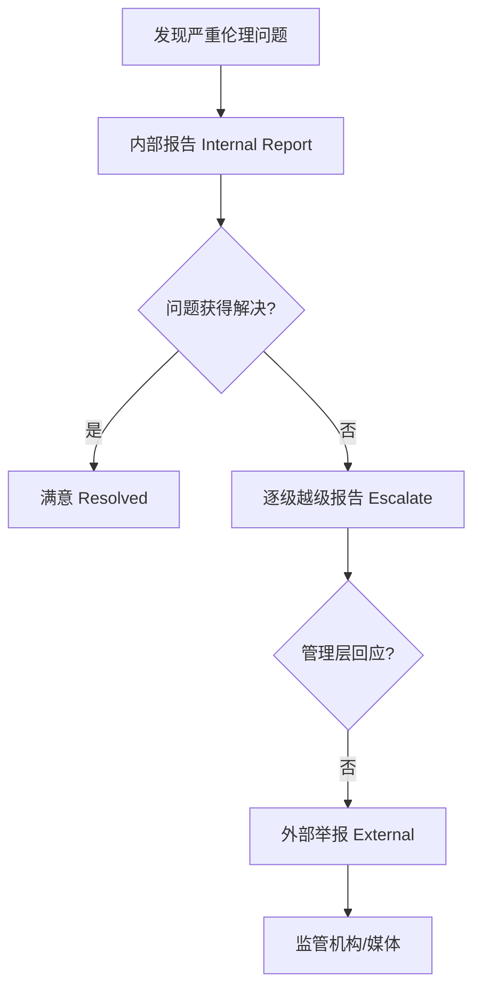

---
aliases: [EngineeringEthics]
tags: ['04_EngineeringAndTechnology', 'EngineeringFundamentals']
---

# 工程伦理 (Engineering Ethics)

## 一、概述

工程伦理 (Engineering Ethics) 是研究工程师在职业实践中道德责任 (Moral Responsibility) 和行为准则 (Code of Conduct) 的学科。
它关注工程师如何平衡技术效率 (Technical Efficiency)、经济效益 (Economic Benefit)、公共安全 (Public Safety)、环境保护 (Environmental Protection) 和社会公正 (Social Justice) 之间的冲突。
工程伦理不仅是"不违规"的底线要求，更要求工程师具备主动承担社会责任的专业精神。
工程项目对社会和环境的影响日益深远，伦理考量已成为工程教育与实践的核心组成部分。
工程伦理教育的目的是培养工程师的伦理敏感性 (Ethical Sensitivity) 和伦理推理能力 (Ethical Reasoning)。

## 二、伦理理论基础 (Ethical Theories)

### 2.1 主要伦理框架

| 伦理理论 | 核心原则 | 代表人物 | 工程应用示例 |
|---------|---------|---------|-------------|
| 功利主义 Utilitarianism | 最大多数人的最大幸福 | Bentham, Mill | 成本效益分析 (CBA) 的伦理基础 |
| 义务论 Deontology | 行为的对错取决于义务本身 | Kant (康德) | 不因好结果而使用欺骗手段 |
| 权利伦理 Rights Ethics | 尊重基本人权和尊严 | Locke, Rawls | 员工隐私、数据安全 |
| 美德伦理 Virtue Ethics | 培养正直、诚实等品格 | Aristotle (亚里士多德) | 工程师职业美德 (Professional Virtues) |
| 契约论 Contractarianism | 公平协议是道德的基础 | Rawls (罗尔斯) | 合同中各方权利义务对等 |

### 2.2 Rawls 正义原则 (Rawls' Principles of Justice)

1. **平等自由原则 (Equal Liberty Principle)**：每个人享有平等的基本自由权利
2. **差异原则 (Difference Principle)**：社会和经济不平等应使处境最不利者获得最大利益

**工程应用**：工程决策应优先考虑弱势群体 (Vulnerable Groups) 的安全和利益。

## 三、工程师的职业责任 (Professional Responsibilities)

### 3.1 核心责任

| 责任范畴 | 具体要求 | 现实案例 |
|---------|---------|---------|
| 公共安全 (Public Safety) | 产品不危害公众 | 凯悦天桥倒塌 (Hyatt Regency Walkway, 1981, 114死) |
| 专业能力 (Competence) | 只在自己胜任的领域执业 | 核电站控制设计失误 |
| 诚实正直 (Honesty & Integrity) | 不隐瞒缺陷、不伪造数据 | 大众排放门 (Volkswagen Dieselgate, 2015, 罚款$300亿) |
| 保密义务 (Confidentiality) | 保护雇主/客户商业机密 | 竞业限制纠纷 |
| 环境责任 (Environmental) | 减少污染、促进可持续发展 | 化工污染事件 |
| 公平公正 (Fairness) | 不歧视、不接受贿赂 | 招标利益冲突 |

### 3.2 职业伦理准则 (Codes of Ethics)

**中国注册工程师职业道德准则** (中国工程院)：
- 遵守法律法规和工程建设强制性标准
- 保证工程质量和安全
- 保护生态环境
- 诚实守信，保守商业秘密
- 公平竞争，维护市场秩序
- 接受国家和社会的监督

**IEEE 伦理准则 (IEEE Code of Ethics)** 核心要点：
1. 符合公众安全、健康和福祉
2. 避免利益冲突 (Conflict of Interest)
3. 基于数据和事实诚实行事
4. 拒绝贿赂 (Bribery)
5. 增进技术理解
6. 持续职业发展 (Continuing Professional Development)

**NSPE 基本准则 (NSPE Code of Ethics)**：
- 首要：公共安全、健康和福祉
- 只在自己能力范围内服务
- 客观诚实的公开声明
- 忠实代理人 (Faithful Agent)
- 通过职业行为建立声誉
- 持续职业发展

### 3.3 举报 (Whistleblowing)

**举报前需考虑**：
1. 是否有充分确凿的证据 (Sufficient Evidence)
2. 是否已穷尽所有内部渠道 (Exhaust Internal Channels)
3. 问题是否足够严重 (Severity)
4. 是否有法律保护 (Legal Protection)：中国《劳动法》第101条、美国 Whistleblower Protection Act

## 四、经典工程伦理案例 (Classic Cases)

### 4.1 挑战者号航天飞机 (Challenger, 1986)

**技术背景**：O 型密封环 (O-Ring) 在低温 (2°C) 下失去弹性 (Resilience Loss)，导致燃气泄漏 (Hot Gas Blow-by)。
**伦理问题**：工程师 Roger Boisjoly 强烈警告低温风险，NASA 管理层在发射压力下决定发射。
**教训**：工程师应坚持技术判断 (Technical Judgment)，不屈服于商业或政治压力。

### 4.2 福特 Pinto 油箱案 (Ford Pinto, 1970s)

**设计缺陷**：追尾碰撞 (Rear-End Collision) 中油箱起火爆炸 (Fuel Tank Fire)。
**福特成本效益分析 (Ford's CBA)**：
- 改造成本 (Fix Cost)：$1.375 亿 (每车 $11)
- 赔偿预估 (Compensation Estimate)：$4950 万 (180 死亡 × $20万 + 180 烧伤 × $6.7万)
- 结论：不改更经济

**伦理批判**：用金钱量化生命的正当性受到广泛质疑。权利伦理 vs 功利主义的冲突。

### 4.3 弗林特水危机 (Flint Water Crisis, 2014-2019)

**事件**：更换水源 (Flint River) 未使用防腐蚀剂 (Corrosion Inhibitor)，铅 (Lead) 从水管溶出，居民血铅水平升高。
**伦理问题**：为节省 $500万/年 忽略公众健康。涉及环境正义 (Environmental Justice)——低收入社区 (Low-Income Community) 遭受不当对待。

### 4.4 大众排放门 (Dieselgate, 2015)

**事件**：安装作弊软件 (Defeat Device / Cheat Software)，实验室检测 (NEDC) 中启用排放控制，实际 NOx 排放超标 40 倍。
**伦理层面**：技术团队全程参与开发作弊软件，企业文化和绩效考核 (Performance Metrics) 导致伦理失守。
**后果**：民事罚款 $150亿 + 刑事罚款 $43亿，多位工程师和高管被起诉。

## 五、技术伦理专题 (Technology Ethics)

### 5.1 人工智能伦理 (AI Ethics)

| 伦理问题 | 表现 | 应对 |
|---------|------|------|
| 算法偏见 (Algorithmic Bias) | 训练数据不均衡导致歧视 | 数据清洗 (Data Cleaning)、公平性约束 (Fairness Constraints) |
| 可解释性 (XAI, Explainable AI) | 深度学习"黑箱"问题 | LIME, SHAP 等可解释性工具 |
| 责任归属 (Accountability) | AI 事故的责任归谁 | 明确法律框架 |
| 隐私保护 (Privacy) | 大规模数据收集 | 差分隐私 (Differential Privacy)、联邦学习 (Federated Learning) |
| 就业替代 (Job Displacement) | 自动化导致岗位消失 | 社会保障 (Social Safety Net)、再培训 (Reskilling) |

**AI 伦理五原则**：透明性 (Transparency)、公平性 (Fairness)、问责制 (Accountability)、隐私保护 (Privacy)、人类控制 (Human Control)。

### 5.2 数据隐私与网络安全 (Data Privacy & Cybersecurity)

**GDPR (General Data Protection Regulation, 通用数据保护条例, 2018)** 七项原则：合法公平透明 (Lawfulness)、目的限制 (Purpose Limitation)、数据最小化 (Data Minimization)、准确性 (Accuracy)、存储限制 (Storage Limitation)、安全 (Security)、问责制 (Accountability)。

### 5.3 环境伦理与可持续发展 (Environmental Ethics & Sustainability)

**SDGs (Sustainable Development Goals, 可持续发展目标) 工程师角色**：SDG 9 (产业创新, Industry Innovation)、SDG 11 (可持续城市, Sustainable Cities)、SDG 13 (气候行动, Climate Action)、SDG 7 (清洁能源, Clean Energy)。

**预防原则 (Precautionary Principle)**：即使因果关系未完全证实 (Full Scientific Certainty)，也应采取预防措施避免潜在严重危害。

## 六、伦理决策方法 (Ethical Decision-Making)

### 6.1 Linehan 九步法 (Nine-Step Method)

1. 识别问题 (Identify Problem)
2. 确定利益相关者 (Identify Stakeholders)
3. 收集所有事实 (Gather Facts)
4. 列出可行方案 (List Alternatives)
5. 评估各方案影响 (Evaluate Impacts)
6. 应用伦理原则 (Apply Ethical Principles)
7. 做出决策 (Make Decision)
8. 实施并沟通 (Implement & Communicate)
9. 监督反思 (Monitor & Reflect)

### 6.2 伦理检查清单 (Ethical Checklist)

- □ 此决定是否合法合规 (Legal & Compliant)?
- □ 是否符合行业伦理准则 (Code of Ethics)?
- □ 是否可能造成伤害 (Harm)?
- □ 公众立场是否能接受 (Public Scrutiny)?
- □ 是否愿意公开 (Sunshine Test / Front Page Test)?
- □ 是否有更好的替代方案?
- □ 长期后果是什么 (Long-Term Consequences)?

## 七、继续教育与自律 (Continuing Education)

中国工程教育认证协会 (CEEAA, China Engineering Education Accreditation Association) 要求工科毕业生理解工程伦理。
2018 年起《工程伦理》成为中国工程硕士 (Master of Engineering) 必修课。
ABET (Accreditation Board for Engineering and Technology) 认证要求：毕业生应具有在工程情境中认识伦理和专业责任的能力。
工程师应终身学习职业伦理，通过案例研讨 (Case Study) 和同行交流保持伦理敏感性。

## 相关条目

- [[INDEX|当前目录索引]]
- [[04_EngineeringAndTechnology/EngineeringFundamentals/INDEX]]

## 七、工程伦理决策模型 (Ethical Decision Models)

### 7.1 伦理推理层次 (Levels of Ethical Reasoning)

**前惯例层次 (Pre-Conventional)**：基于奖惩和个人利益做出决策。
**惯例层次 (Conventional)**：遵循法律、规范和行业标准，关注社会期望。
**后惯例层次 (Post-Conventional)**：基于普遍伦理原则 (Universal Ethical Principles) 独立判断。

工程师应追求后惯例层次的伦理推理，超越"合法合规"的底线思维。

### 7.2 伦理矩阵 (Ethical Matrix)

伦理矩阵 (Ethical Matrix, Mepham 1996) 系统分析项目的利益相关者影响：

| 利益相关者 | 福利 (Well-being) | 自主 (Autonomy) | 公正 (Justice) |
|-----------|-----------------|----------------|---------------|
| 公众 | 安全无害 | 知情同意 (Informed Consent) | 公平分配利益和风险 |
| 客户 | 产品安全可靠 | 合同自由选择 | 公平交易 (Fair Dealing) |
| 工程师 | 职业尊严和报酬 | 专业判断独立 | 公平晋升和认可 |
| 环境 | 生态完整性 | 生物多样性 | 代际公平 (Intergenerational Equity) |

### 7.3 伦理诊断 (Ethical Diagnostic) 七问

1. 发生了什么？(事实层面 Factual)
2. 谁受到了影响？(利益相关者 Stakeholder)
3. 冲突的价值观或原则是什么？(伦理冲突 Ethical Conflict)
4. 可选方案有哪些？(Alternatives)
5. 各方案对利益相关者的影响？(Impact Assessment)
6. 哪个方案最符合伦理原则？(Ethical Justification)
7. 如何实施和监督？(Implementation & Oversight)

## 八、国际工程伦理比较 (International Comparison)

### 8.1 中美工程伦理教育差异

| 维度 | 中国 | 美国 |
|------|------|------|
| 伦理理论基础 | 马克思主义伦理学为主 | 功利主义+义务论+权利伦理多元 |
| 核心关注 | 国家安全、社会和谐、工程质量 | 公共安全、个人权利、环境保护 |
| 教学重点 | 案例分析与警示教育 | 伦理推理与道德想象力 (Moral Imagination) |
| 法规强调 | 法律法规和强制性标准 | 职业准则 (Code of Ethics) 和判例 |
| 举报保护 | 《劳动法》第101条基本保护 | Whistleblower Protection Act (1989) + 专项法律 |

### 8.2 欧洲工程师伦理特点

FEANI (European Federation of National Engineering Associations) 强调可持续发展 (Sustainable Development) 原则。
德国工程师协会 (VDI) 伦理准则包含技术评估 (Technology Assessment) 责任，要求工程师评估技术的长期社会影响。

### 8.3 发展中国家工程伦理挑战

**技术转移 (Technology Transfer)** 中的伦理问题：发达国家淘汰的高污染、高能耗技术向发展中国家转移。
**基础设施建设 (Infrastructure Development)** 中的拆迁补偿 (Resettlement Compensation) 和原住民权益 (Indigenous Rights)。
**合规成本 (Compliance Cost)**：小型企业难以承担高标准的安全和环保措施。

## 九、新兴技术伦理专题 (Emerging Technology Ethics)

### 9.1 基因编辑 (Gene Editing)

CRISPR-Cas9 技术在人类胚胎上的应用引发广泛伦理争议。
**基本原则**：体细胞编辑 (Somatic Editing) 治疗疾病可接受；生殖系编辑 (Germline Editing) 改变后代基因，涉及代际伦理和遗传多样性。

### 9.2 自动驾驶伦理 (Autonomous Vehicle Ethics)

**电车难题 (Trolley Problem)**：不可避碰撞中的伤害最小化决策。
**责任归属 (Responsibility Gap)**：算法决策导致的事故，责任归于制造商、软件开发者还是车主？
**Moral Machine 实验 (MIT)**：全球公众对自动驾驶道德偏好的大规模调查。

### 9.3 纳米技术伦理 (Nanotechnology Ethics)

纳米材料 (Nanomaterials) 的毒理学不确定性 (Toxicological Uncertainty)。
监管困境：传统风险评估方法 (Risk Assessment) 难以适用于纳米尺度物质。

## 十、工程伦理实践指南

### 10.1 工程师日常伦理清单

**设计阶段**：
- [ ] 设计是否满足所有适用标准和规范？
- [ ] 是否进行了充分的危害识别 (Hazard Identification)？
- [ ] 安全裕度 (Safety Margin) 是否合理？
- [ ] 是否考虑了极端情况和故障模式 (Failure Mode)？

**施工/制造阶段**：
- [ ] 材料是否符合设计规格？
- [ ] 施工/制造工艺是否经过验证？
- [ ] 质量检验 (Quality Inspection) 是否到位？

**运营/维护阶段**：
- [ ] 操作手册是否完整清晰？
- [ ] 应急预案 (Emergency Plan) 是否完备？
- [ ] 定期检查制度是否建立？

### 10.2 利益冲突管理 (Conflict of Interest Management)

利益冲突并非必然导致不道德行为 (Unethical Behavior)，但必须识别和披露。
**四步管理法**：
1. 识别 (Identify)：是否存在个人利益与职业责任的冲突？
2. 披露 (Disclose)：向雇主、客户或专业机构报告。
3. 回避 (Recuse)：在有利益冲突的决策中退出。
4. 记录 (Document)：保留决策过程和依据的完整记录。

### 10.3 工程师的持续伦理发展 (Continuing Ethical Development)

- 参加工程伦理继续教育课程 (CPD, Continuing Professional Development)
- 阅读和分析工程失败案例 (Failure Case Studies)
- 参与专业学会的伦理委员会活动
- 在工作中培养伦理敏感性 (Ethical Sensitivity)

## 十一、工程伦理案例深度分析

### 11.1 深水地平线 (Deepwater Horizon, 2010)

**技术背景**：BP 在墨西哥湾的 Macondo 油井发生井喷 (Blowout)，11 人死亡，490 万桶原油泄漏。
**直接原因**：固井 (Cementing) 不合格，压力测试 (Negative Pressure Test) 误判，防喷器 (BOP, Blowout Preventer) 失效。
**伦理问题**：
- 成本削减文化：BP 为节省时间/成本多次忽视安全警告
- 生产优先 (Production Priority) 压倒安全文化
- 供应链管理：承包商 (Halliburton, Transocean) 之间的沟通断裂

### 11.2 波音 737 MAX (2018-2019)

**事故**：印尼狮航 (Lion Air 610) 和埃塞俄比亚航空 (ET 302) 两起空难，共 346 人死亡。
**技术原因**：MCAS (Maneuvering Characteristics Augmentation System) 单传感器 (单一 AOA 迎角传感器) 设计导致错误触发，反复压低机头 (Nose-down Command)。
**伦理问题**：
- 设计决策将"避免飞行员再培训成本"置于安全之上
- 向 FAA 隐瞒 MCAS 存在和功能范围 (Scope)
- 安全评估 (System Safety Assessment) 中低估 MCAS 故障危害等级
- 工程师报告 (Internal Engineering Report) 被管理层忽视

**教训**：工程决策不应受商业目标 (Commercial Objectives) 影响。技术沟通渠道 (Technical Communication Channels) 必须独立于管理层级。

### 11.3 福岛第一核电站事故 (Fukushima Daiichi, 2011)

**技术背景**：地震+海啸 (14-15 m 浪高，设计基准 5.7 m) 导致全厂断电 (Station Blackout)，堆芯熔化 (Core Meltdown)。
**伦理问题**：
- 风险评估 (Risk Assessment) 严重低估海啸高度和频率
- 安全裕度设计不足：应急柴油发电机位于地下室，海水泵未防水
- 决策拖延：对严重事故管理指南 (SAMG, Severe Accident Management Guidelines) 准备不足
- 信息披露不完全，低估事故严重等级

### 11.4 三哩岛事故 (Three Mile Island, 1979)

**技术原因**：给水泵 (Feedwater Pump) 停转 + 泄压阀 (PORV, Pilot-Operated Relief Valve) 卡滞未关闭 + 操作员误判水位。
**人因工程教训**：
- 控制室布局不合理：关键报警 (Critical Alarm) 被遮挡
- 缺乏异常工况 (Abnormal Condition) 操作程序
- 操作员培训不足，缺乏模拟机 (Simulator) 训练
