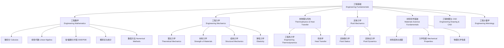

---
aliases: [EngineeringFundamentals, 工程基础, Engineering Foundations]
tags: ['EngineeringFundamentals', 'EngineeringBasics', 'Mechanics', 'Thermodynamics']
created: 2026-05-17
updated: 2026-05-17
---

# 工程基础 (Engineering Fundamentals)

## 学科概述

工程基础（Engineering Fundamentals）涵盖所有工程学科共用的基础理论和方法，是连接基础科学（数学、物理、化学）与专业工程知识的桥梁。核心内容包括工程数学（Engineering Mathematics）、工程力学（Engineering Mechanics）、工程热力学（Engineering Thermodynamics）、流体力学（Fluid Mechanics）、传热学（Heat Transfer）、材料科学基础（Materials Science Fundamentals）和工程计量学（Engineering Metrology）。扎实掌握工程基础知识是从事机械、土木、航空航天、能源、海洋等任何工程领域研究的先决条件。

## 知识体系结构

## 核心子领域对比

| 子领域 | 研究对象 | 核心方程 | 工程应用 | 基础课程 |
|:-------|:---------|:---------|:---------|:---------|
| 工程力学 | 力与运动、变形与强度 | $\sum F = ma$, $\sigma = E\varepsilon$ | 结构设计、机械系统 | 理论力学、材料力学 |
| 工程热力学 | 能量转换与传递过程 | $\Delta U = Q - W$, $dS \geq \delta Q/T$ | 热机、制冷、发电 | 热力学 |
| 流体力学 | 流体运动规律与受力 | $\rho \frac{D\mathbf{v}}{Dt} = -\nabla p + \mu\nabla^2\mathbf{v}$ | 管道、泵、飞行器 | 流体力学 |
| 材料科学 | 成分-结构-性能关系 | $\sigma = E\varepsilon$, Fick 定律 | 材料选择、热处理 | 材料科学基础 |
| 工程计量 | 测量理论与质量保证 | $\sigma_y^2 = \sum (\partial f/\partial x_i)^2 \sigma_i^2$ | 质检、校准、控制 | 互换性与测量 |

## 工程单位与量纲分析 (Engineering Units and Dimensional Analysis)

### SI 单位制

| 量 | SI 基本单位 | 量纲 | 常用工程单位 | 换算关系 |
|:---|:-----------|:-----|:-------------|:---------|
| 长度 | m (米) | L | mm, cm, km | 1 m = 1000 mm |
| 质量 | kg (千克) | M | g, t (吨) | 1 t = 1000 kg |
| 时间 | s (秒) | T | h, min, ms | 1 h = 3600 s |
| 力 | N (牛顿) | MLT⁻² | kN, MN | 1 kN = 1000 N |
| 应力/压力 | Pa (帕斯卡) | ML⁻¹T⁻² | MPa, kPa, bar, atm | 1 MPa = 10⁶ Pa |
| 能量/功/热量 | J (焦耳) | ML²T⁻² | kJ, MJ, kWh, cal | 1 kWh = 3.6 MJ |
| 功率 | W (瓦特) | ML²T⁻³ | kW, MW, hp (马力) | 1 hp = 745.7 W |
| 温度 | K (开尔文) | Θ | °C, °F | 0°C = 273.15 K |
| 黏度 | Pa·s | ML⁻¹T⁻¹ | cP (厘泊) | 1 cP = 0.001 Pa·s |

### Buckingham π 定理

如果一个物理问题涉及 $n$ 个物理量（量纲不独立）和 $k$ 个基本量纲，则可组成 $n-k$ 个独立的无量纲数 $\pi_1, \pi_2, \dots, \pi_{n-k}$。

例如管道流动压降 $\Delta p = f(D, V, \rho, \mu, L, \varepsilon)$ 可构造三个无量纲数：
$$ \pi_1 = \frac{\Delta p}{\rho V^2} \quad (\text{欧拉数}), \quad \pi_2 = \frac{\rho V D}{\mu} \quad (\text{雷诺数}), \quad \pi_3 = \frac{L}{D}, \quad \pi_4 = \frac{\varepsilon}{D} $$

## 误差分析与数据处理

### 测量误差基本概念

$$ \varepsilon = x - x_0 \quad (\text{绝对误差}), \quad \delta = \frac{\varepsilon}{x_0} \times 100\% \quad (\text{相对误差}) $$

**误差分类**：
- 随机误差（Random Error）：服从正态分布，多次测量取均值可减小
- 系统误差（Systematic Error）：恒定或规律变化，需校正模型消除
- 粗大误差（Gross Error）：明显偏离，统计检验后剔除

### 误差传播定律

对于函数 $y = f(x_1, x_2, \dots, x_n)$，各观测值独立时：

$$ \sigma_y^2 = \sum_{i=1}^n \left(\frac{\partial f}{\partial x_i}\right)^2 \sigma_{x_i}^2 $$

### 测量精度等级（工业仪表）

| 精度等级 | 允许误差 | 典型应用场景 |
|:---------|:---------|:-------------|
| 0.1 | ±0.1% | 精密实验室测量、计量校准基准 |
| 0.2 | ±0.2% | 科研实验、标准仪表 |
| 0.5 | ±0.5% | 工业过程关键参数控制 |
| 1.0 | ±1.0% | 一般工业过程测量与控制 |
| 1.5 | ±1.5% | 现场显示仪表 |
| 2.5 | ±2.5% | 非关键指示、粗略测量 |

## 工程统计基础

### 基本统计量

样本均值（Sample Mean）：
$$ \bar{x} = \frac{1}{n} \sum_{i=1}^n x_i $$

样本方差（Sample Variance）和标准差（Standard Deviation）：
$$ s^2 = \frac{1}{n-1} \sum_{i=1}^n (x_i - \bar{x})^2, \quad s = \sqrt{s^2} $$

变异系数（Coefficient of Variation）：
$$ CV = \frac{s}{\bar{x}} \times 100\% $$

### 正态分布与工程容差

设被测量 $X \sim N(\mu, \sigma^2)$，则：
$$ P(\mu - \sigma \leq X \leq \mu + \sigma) \approx 68.27\% $$
$$ P(\mu - 2\sigma \leq X \leq \mu + 2\sigma) \approx 95.45\% $$
$$ P(\mu - 3\sigma \leq X \leq \mu + 3\sigma) \approx 99.73\% $$

工程中常用 $3\sigma$ 原则定义统计容差（Statistical Tolerance）。

### 假设检验 (Hypothesis Testing)

$t$ 检验用于判断样本均值与参考值的差异显著性：

$$ t = \frac{\bar{x} - \mu_0}{s / \sqrt{n}} $$

若 $|t| > t_{\alpha/2, n-1}$，则在显著性水平 $\alpha$ 下拒绝原假设。

## 工程力学基础

**静力学**：$\sum \mathbf{F} = 0$, $\sum \mathbf{M}_O = 0$

**运动学**：$v = v_0 + at$, $s = v_0 t + \frac{1}{2} a t^2$

**动力学**：$\mathbf{F} = m\mathbf{a}$, $\mathbf{M} = I\boldsymbol{\alpha}$

**材料力学**：胡克定律 $\sigma = E\varepsilon$，轴向 $\Delta l = \frac{NL}{EA}$，弯曲 $\sigma = \frac{My}{I}$，扭转 $\tau = \frac{T\rho}{I_p}$，压杆稳定 $P_{cr} = \frac{\pi^2 EI}{(\mu l)^2}$

## 热物理基础

### 热力学定律

- 第零定律（热平衡传递）：$T_A = T_B, T_B = T_C \Rightarrow T_A = T_C$
- 第一定律（能量守恒）：$\Delta U = Q - W$
- 第二定律（熵增）：$dS \geq \delta Q / T$
- 第三定律（绝对零度不可达）：$\lim_{T\to 0} S = 0$

**理想气体**：$pV = nRT$，**卡诺效率**：$\eta = 1 - T_L / T_H$

### 传热学三大方式

| 传热方式 | 控制方程 | 关键参数 | 物理机制 |
|:---------|:---------|:---------|:---------|
| 热传导 (Conduction) | $q = -k \nabla T$ | 导热系数 $k$ (W/m·K) | 分子振动传递 |
| 热对流 (Convection) | $q = h (T_s - T_\infty)$ | 对流换热系数 $h$ (W/m²·K) | 流体宏观运动 |
| 热辐射 (Radiation) | $q = \varepsilon \sigma (T_1^4 - T_2^4)$ | 发射率 $\varepsilon$，$\sigma = 5.67 \times 10^{-8}$ W/m²K⁴ | 电磁波辐射 |

## 材料性能对比

| 材料 | 密度 (g/cm³) | $E$ (GPa) | 屈服强度 (MPa) | 抗拉强度 (MPa) | 热导率 (W/m·K) | 热膨胀 (10⁻⁶/K) | 典型应用 |
|:----|:-------------|:-----------|:---------------|:---------------|:---------------|:----------------|:---------|
| Q235 结构钢 | 7.85 | 200 | 235 | 370~500 | 50 | 12 | 建筑、桥梁 |
| 45 优质碳钢 | 7.85 | 200 | 355 | 600 | 50 | 12 | 轴、齿轮 |
| 铝合金 6061 | 2.70 | 70 | 240 | 290 | 200 | 23 | 航空、汽车 |
| 紫铜 T2 | 8.96 | 110 | 70 | 220 | 400 | 17 | 电气、换热器 |
| 钛合金 TC4 | 4.50 | 110 | 825 | 900 | 20 | 9 | 航空、医疗 |
| C30 混凝土 | 2.40 | 30 | 20 (抗压) | — | 1.5 | 10 | 建筑基础 |
| 尼龙 PA66 | 1.14 | 2 | 80 | 85 | 0.25 | 80 | 轴承、齿轮 |
| 聚碳酸酯 PC | 1.20 | 2.4 | 60 | 70 | 0.20 | 70 | 透明结构 |
| 碳纤维 CFRP | 1.60 | 230 | — | 3500 | 5~50 | -1~2 | 航空、体育 |

## 流体力学基础

**连续性方程（质量守恒）**：
$$ \rho_1 A_1 V_1 = \rho_2 A_2 V_2 $$

不可压缩流体简化：$A_1 V_1 = A_2 V_2$

**伯努利方程（理想不可压缩定常流）**：
$$ \frac{p}{\rho g} + \frac{V^2}{2g} + z = \text{常数} $$

**雷诺数（层流与湍流判据）**：
$$ Re = \frac{\rho V D}{\mu} $$

- $Re < 2000$：层流（Laminar Flow）
- $Re > 4000$：湍流（Turbulent Flow）
- $2000 < Re < 4000$：过渡流

**达西-魏斯巴赫公式（管道沿程水头损失）**：
$$ h_f = f \frac{L}{D} \frac{V^2}{2g} $$

## 核心课程体系

- 高等数学（微积分、常/偏微分方程、级数、向量分析）
- 线性代数（矩阵论、向量空间、特征值问题）
- 大学物理（力学、热学、电磁学、光学、原子物理）
- 工程力学（理论力学 + 材料力学）
- 工程热力学
- 传热学
- 流体力学
- 材料科学基础
- 工程制图与 AutoCAD/SolidWorks
- 互换性与测量技术 / 公差配合
- 电工与电子学
- 数值计算方法 / MATLAB 编程

## 主要应用领域

- 机械设计制造及其自动化
- 土木工程与建筑工程
- 航空航天工程
- 能源与动力工程（发电、热工、新能源）
- 车辆工程（汽车、轨道车辆）
- 海洋工程与船舶工程
- 材料成型及控制工程
- 核工程与核技术

## 经典教材

- 同济大学《高等数学》（高等教育出版社）
- 居余马《线性代数》（高等教育出版社）
- 哈尔滨工业大学《理论力学》（高等教育出版社）
- 刘鸿文《材料力学》（高等教育出版社）
- 沈维道《工程热力学》（高等教育出版社）
- 杨世铭、陶文铨《传热学》（高等教育出版社）
- 莫乃榕《流体力学》（华中科技大学出版社）
- 上海交通大学《材料科学基础》（上海交通大学出版社）
- 廖念钊《互换性与测量技术》（中国计量出版社）

## 相关条目

- [[01_K12/JuniorHigh/Mathematics/INDEX|Mathematics]]
- [[01_K12/JuniorHigh/Physics/INDEX|Physics]]
- [[04_EngineeringAndTechnology/MechanicsAndMaterials/INDEX|MechanicsAndMaterials]]
- [[04_EngineeringAndTechnology/EngineeringFundamentals/EngineeringMechanics/StrengthOfMaterials|StrengthOfMaterials]]
- [[04_EngineeringAndTechnology/MechanicsAndMaterials/Mechanics/FluidMechanics|FluidMechanics]]
- [[04_EngineeringAndTechnology/EngineeringFundamentals/EngineeringThermophysics/Thermodynamics|Thermodynamics]]
- [[04_EngineeringAndTechnology/EngineeringFundamentals/EngineeringThermophysics/HeatTransfer|HeatTransfer]]
- [[04_EngineeringAndTechnology/MechanicalAndElectricalEngineering/MechanicalEngineering/MachineDesign|MachineDesign]]
- [[EngineeringDrawing]]

