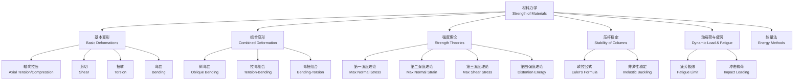

---
aliases: [StrengthOfMaterials, 材料力学, Mechanics of Materials]
tags: ['EngineeringFundamentals', 'EngineeringMechanics', 'StrengthOfMaterials', 'SolidMechanics']
created: 2026-05-17
updated: 2026-05-17
---

# 材料力学 (Strength of Materials / Mechanics of Materials)

## 学科概述

材料力学（Strength of Materials, also Mechanics of Materials）是研究变形固体（Deformable Solid）在外力作用下的内力（Internal Force）、应力（Stress）、应变（Strain）、变形（Deformation）和稳定性（Stability）的学科。它是固体力学（Solid Mechanics）的核心分支，是机械工程、土木工程、航空航天工程、船舶与海洋工程等工程领域的重要理论基础。材料力学的核心任务是建立工程构件的强度条件（Strength Criterion）、刚度条件（Stiffness Criterion）和稳定性条件（Stability Criterion），为结构的安全可靠设计提供理论依据。

## 学科体系

## 核心概念对比

| 概念 | 定义 | 符号 | 单位 | 计算公式 |
|:----|:-----|:-----|:-----|:---------|
| 正应力 (Normal Stress) | 垂直于截面的应力分量 | $\sigma$ | Pa, MPa | $\sigma = \frac{N}{A}$ |
| 剪应力 (Shear Stress) | 平行于截面的应力分量 | $\tau$ | Pa, MPa | $\tau = \frac{Q}{A}$ |
| 线应变 (Normal Strain) | 单位长度的伸缩量 | $\varepsilon$ | 无量纲 | $\varepsilon = \frac{\Delta L}{L}$ |
| 剪应变 (Shear Strain) | 直角的改变量 | $\gamma$ | rad | $\gamma = \frac{\tau}{G}$ |
| 弹性模量 (Young's Modulus) | 正应力与线应变之比 | $E$ | GPa | $E = \frac{\sigma}{\varepsilon}$ |
| 剪切模量 (Shear Modulus) | 剪应力与剪应变之比 | $G$ | GPa | $G = \frac{\tau}{\gamma}$ |
| 泊松比 (Poisson's Ratio) | 横向与纵向应变之比的负值 | $\nu$ | 无量纲 | $\nu = -\frac{\varepsilon_{\text{lat}}}{\varepsilon_{\text{long}}}$ |
| 截面惯性矩 (Moment of Inertia) | 截面抵抗弯曲的能力 | $I$ | m⁴ | $I = \int_A y^2 dA$ |
| 极惯性矩 (Polar Moment) | 截面抵抗扭转的能力 | $I_p$ | m⁴ | $I_p = \int_A \rho^2 dA$ |
| 抗弯截面系数 (Section Modulus) | 弯曲强度的几何特性 | $W$ | m³ | $W = I / y_{\text{max}}$ |

## 基本假设

材料力学分析建立以下五个基本假设：
- 连续性假设（Continuity Hypothesis）：材料无空隙地充满整个体积
- 均匀性假设（Homogeneity Hypothesis）：材料各处力学性能相同
- 各向同性假设（Isotropy Hypothesis）：材料沿各个方向的力学性能相同
- 小变形假设（Small Deformation Hypothesis）：构件的变形远小于其原始尺寸
- 线弹性假设（Linear Elasticity Hypothesis）：应力与应变成正比，服从胡克定律（Hooke's Law）

此外，还有平面假设（Planar Cross-section Assumption）：变形前的平面截面在变形后仍保持平面。

## 基本变形分析

### 轴向拉伸与压缩 (Axial Tension and Compression)

**轴力分析**：轴力 $N$ 沿杆件轴线方向，规定拉伸为正、压缩为负。利用截面法（Method of Sections）由平衡方程确定。

**应力计算**：
$$\sigma = \frac{N}{A}$$

**变形计算**（胡克定律）：
$$\Delta l = \frac{NL}{EA}$$

其中 $E$ 为弹性模量，$A$ 为横截面积，$L$ 为原始杆长。乘积 $EA$ 称为抗拉刚度（Axial Stiffness），衡量杆件抵抗轴向变形的能力。

**强度条件**：
$$\sigma_{\text{max}} = \frac{N_{\text{max}}}{A} \leq [\sigma]$$

其中 $[\sigma]$ 为材料的许用应力（Allowable Stress）。

**静不定问题（Statically Indeterminate Problems）**：当约束反力数量超过独立平衡方程数时，需补充变形协调条件求解。典型例子包括三杆桁架和套装组合杆。

### 剪切 (Shear)

**剪应力计算**：
$$\tau = \frac{Q}{A}$$

工程中常见的剪切问题：
- 铆接和螺栓连接的剪切强度校核
- 键连接的剪切强度校核
- 冲裁力的计算 $F = \tau_b \cdot A$

### 圆轴扭转 (Torsion of Circular Shafts)

圆轴扭转时横截面保持平面，半径保持直线，剪应力沿半径线性分布：

**剪应力计算**：
$$\tau = \frac{T \rho}{I_p}$$

最大剪应力发生在轴外表面：
$$\tau_{\text{max}} = \frac{T R}{I_p} = \frac{T}{W_p}$$

其中 $T$ 为扭矩，$\rho$ 为计算点到圆心的距离，$I_p = \frac{\pi D^4}{32}$ 为圆截面的极惯性矩，$W_p = \frac{\pi D^3}{16}$ 为抗扭截面系数。

**扭转变形（扭转角）**：
$$\varphi = \frac{TL}{GI_p}$$

其中 $G$ 为剪切模量，$GI_p$ 为抗扭刚度。钢材 $G \approx 79$ GPa。

**非圆截面扭转**：非圆截面杆扭转时横截面发生翘曲（Warping），矩形截面最大剪应力发生在长边中点，公式为 $\tau_{\text{max}} = \frac{T}{\alpha h b^2}$。

### 直梁弯曲 (Bending of Straight Beams)

**弯曲正应力**：
$$\sigma = \frac{My}{I}$$

最大弯曲正应力发生在离中性轴（Neutral Axis）最远的截面边缘：
$$\sigma_{\text{max}} = \frac{M_{\text{max}}}{W}$$

其中 $W = I / y_{\text{max}}$ 为抗弯截面系数。常见截面的 $W$：
- 矩形（宽 $b$、高 $h$）：$W = \frac{bh^2}{6}$
- 圆形（直径 $d$）：$W = \frac{\pi d^3}{32}$
- 圆管（外径 $D$、内径 $d$）：$W = \frac{\pi (D^4 - d^4)}{32D}$

**弯曲剪应力**：
$$\tau = \frac{Q S_z^*}{I_z b}$$

其中 $S_z^*$ 为截面上计算点一侧面积对中性轴的静矩（First Moment of Area）。对于矩形截面：
$$\tau_{\text{max}} = \frac{3Q}{2A}$$

弯曲剪应力在腹板中较大，在翼缘中较小。

**挠曲线微分方程（Deflection Curve）**：
$$\frac{d^2 w}{dx^2} = \frac{M(x)}{EI}$$

通过积分法或叠加法求解挠度 $w(x)$ 和转角 $\theta(x) = dw/dx$：

$$ \theta(x) = \frac{1}{EI} \int M(x) dx + C_1 $$
$$ w(x) = \frac{1}{EI} \iint M(x) dx dx + C_1 x + C_2 $$

**常见挠度公式**：
- 简支梁中点集中力 $P$：$w_{\text{max}} = \frac{PL^3}{48EI}$
- 悬臂梁端部集中力 $P$：$w_{\text{max}} = \frac{PL^3}{3EI}$
- 简支梁均布载荷 $q$：$w_{\text{max}} = \frac{5qL^4}{384EI}$

## 应力状态分析与强度理论

### 平面应力状态

单元体在平面应力状态下的主应力（Principal Stresses）：

$$ \sigma_{1,2} = \frac{\sigma_x + \sigma_y}{2} \pm \sqrt{\left(\frac{\sigma_x - \sigma_y}{2}\right)^2 + \tau_{xy}^2} $$

最大剪应力：
$$ \tau_{\text{max}} = \sqrt{\left(\frac{\sigma_x - \sigma_y}{2}\right)^2 + \tau_{xy}^2} = \frac{\sigma_1 - \sigma_2}{2} $$

### 强度理论 (Strength Theories)

| 理论 | 适用材料 | 相当应力 $\sigma_r$ | 表达式 |
|:-----|:---------|:-------------------|:-------|
| 第一强度理论（最大拉应力） | 脆性材料 | $\sigma_{r1} = \sigma_1$ | $\sigma_1 \leq [\sigma]$ |
| 第二强度理论（最大线应变） | 脆性材料 | $\sigma_{r2} = \sigma_1 - \nu(\sigma_2 + \sigma_3)$ | $\sigma_{r2} \leq [\sigma]$ |
| 第三强度理论（最大剪应力 / Tresca） | 塑性材料 | $\sigma_{r3} = \sigma_1 - \sigma_3$ | $\sigma_1 - \sigma_3 \leq [\sigma]$ |
| 第四强度理论（畸变能 / von Mises） | 塑性材料 $\sigma_{r4} = \sqrt{\frac{1}{2}[(\sigma_1 - \sigma_2)^2 + (\sigma_2 - \sigma_3)^2 + (\sigma_3 - \sigma_1)^2]}$ | $\sigma_{r4} \leq [\sigma]$ |

工程中塑性材料通常采用第三或第四强度理论，脆性材料采用第一强度理论。

## 压杆稳定 (Stability of Columns)

### 欧拉公式 (Euler's Formula)

细长压杆的临界载荷（Critical Buckling Load）：

$$P_{cr} = \frac{\pi^2 EI}{(\mu l)^2}$$

长度系数 $\mu$ 由约束条件决定：
- 两端铰支：$\mu = 1.0$
- 一端固定一端自由：$\mu = 2.0$
- 两端固定：$\mu = 0.5$
- 一端固定一端铰支：$\mu = 0.7$

### 柔度与欧拉公式适用范围

**柔度（Slenderness Ratio）**：
$$\lambda = \frac{\mu l}{i}$$

其中 $i = \sqrt{I/A}$ 为惯性半径（Radius of Gyration）。

**临界应力**：
$$\sigma_{cr} = \frac{P_{cr}}{A} = \frac{\pi^2 E}{\lambda^2}$$

**适用条件**：$\lambda \geq \lambda_p = \pi \sqrt{E / \sigma_p}$，其中 $\sigma_p$ 为材料比例极限。

**中长压杆**（$\lambda_s < \lambda < \lambda_p$）：采用直线公式 $\sigma_{cr} = a - b\lambda$ 或抛物线公式（Johnson 公式）。

**粗短杆**（$\lambda \leq \lambda_s$）：不发生失稳，强度条件 $\sigma \leq [\sigma]$。

**稳定条件**：
$$P \leq \frac{P_{cr}}{n_{st}} \quad \text{或} \quad \sigma \leq \frac{\sigma_{cr}}{n_{st}}$$

其中 $n_{st}$ 为稳定安全系数（通常 2~5）。

## 材料力学性能 (常用工程材料)

| 材料 | $E$ (GPa) | $\sigma_s$ (MPa) | $\sigma_b$ (MPa) | $\delta$ (%) | 主要特点 |
|:----|:----------|:-----------------|:-----------------|:-------------|:---------|
| Q235 钢 | 200 | 235 | 370~500 | 26 | 综合性能好，焊接性优 |
| 45 钢 | 200 | 355 | 600 | 16 | 调质后强度高 |
| 铝合金 6061 | 70 | 240 | 290 | 17 | 轻质，耐腐蚀 |
| 铸铁 HT150 | 120 | — | 150 (抗拉) | < 1 | 减震性好，抗压强度高 |
| 钛合金 TC4 | 110 | 825 | 900 | 10 | 比强度高，耐高温 |

## 疲劳强度初步

疲劳破坏指在循环应力 $\sigma_a$ 远低于屈服强度时发生的渐进式断裂。S-N 曲线描述 $\sigma_a^m N = C$，钢材有明确的疲劳极限 $\sigma_{-1}$（应力比 $R = -1$）。应力集中是裂纹萌生的主要诱因。

## 能量法 (Energy Methods)

应变能（Strain Energy）：轴向 $U = \frac{N^2 L}{2EA}$，扭转 $U = \frac{T^2 L}{2GI_p}$，弯曲 $U = \int \frac{M^2}{2EI} dx$。卡氏定理 $\delta_i = \partial U / \partial P_i$ 用于求解结构位移。

## 经典教材

- 刘鸿文《材料力学》（高等教育出版社）
- 孙训方《材料力学》（高等教育出版社）
- Beer & Johnston《Mechanics of Materials》（McGraw-Hill）
- Gere & Goodno《Mechanics of Materials》（Cengage Learning）
- Timoshenko《Strength of Materials》（Van Nostrand Reinhold）

## 主要应用领域

- 建筑钢结构与混凝土结构的强度与稳定分析
- 机械传动轴、齿轮轴、曲轴的强度设计
- 压力容器与管道强度与疲劳校核
- 起重机桁架、桥梁桁架的受力分析
- 航空航天飞行器结构的轻量化设计
- 医疗器械植入物的力学性能评估
- 电子设备跌落冲击与振动可靠性分析

## 相关条目

- [[TheoreticalMechanics]]
- [[StructureMechanics]]
- [[04_EngineeringAndTechnology/MechanicsAndMaterials/Mechanics/Elasticity|Elasticity]]
- [[04_EngineeringAndTechnology/EngineeringFundamentals/EngineeringFundamentals|EngineeringFundamentals]]
- [[04_EngineeringAndTechnology/MechanicsAndMaterials/Mechanics/FluidMechanics|FluidMechanics]]
- [[04_EngineeringAndTechnology/MechanicalAndElectricalEngineering/MechanicalEngineering/MachineDesign|MachineDesign]]
- [[04_EngineeringAndTechnology/MechanicsAndMaterials/Mechanics/Plasticity|Plasticity]]

