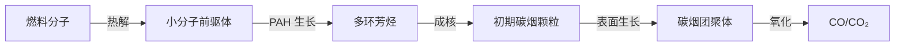

# 燃烧学 (Combustion Science)

## 定义

燃烧学是研究燃料与氧化剂之间剧烈放热化学反应的科学。它涉及化学动力学、热力学、流体力学和传热传质学，是能源动力工程的核心基础。

## 核心内容

### 燃烧基本概念

**燃烧三要素 (Fire Triangle)**：

- 可燃物 (Fuel)
- 助燃物/氧化剂 (Oxidizer)
- 点火源/着火温度 (Ignition Source)

**燃烧类型**：

| 分类方式 | 类型 | 特征 |
|---------|------|------|
| 混合方式 | 扩散燃烧 (Diffusion Flame) | 燃料与氧化剂分别进入反应区 |
| 混合方式 | 预混燃烧 (Premixed Flame) | 燃料与氧化剂预先混合 |
| 流动状态 | 层流燃烧 (Laminar Combustion) | $Re < 2300$ |
| 流动状态 | 湍流燃烧 (Turbulent Combustion) | $Re > 2300$ |
| 相态 | 均相燃烧 | 燃料与氧化剂同相 |
| 相态 | 多相燃烧 | 燃料与氧化剂不同相 |

### 燃烧化学 (Combustion Chemistry)

**碳氢燃料完全燃烧**：

$$
C_x H_y + \left(x + \frac{y}{4}\right) O_2 \to x CO_2 + \frac{y}{2} H_2O
$$

**化学计量空燃比 (Stoichiometric Air-Fuel Ratio)**：

$$
AF_{stoich} = \frac{(x + y/4) \times 32}{12x + y} \times 4.76
$$

其中 4.76 为空气中 $N_2/O_2$ 摩尔比倒数（空气中 $O_2$ 占 21%）。

**当量比 (Equivalence Ratio)**：

$$
\phi = \frac{AF_{stoich}}{AF_{actual}} = \frac{(F/A)_{actual}}{(F/A)_{stoich}}
$$

- $\phi = 1$：化学计量比燃烧
- $\phi > 1$：富燃料燃烧 (Fuel-Rich)
- $\phi < 1$：贫燃料燃烧 (Fuel-Lean)

### 化学反应动力学

**Arrhenius 定律**：

$$
k = A \exp\left(-\frac{E_a}{RT}\right)
$$

其中 $A$ 为指前因子，$E_a$ 为活化能，$R$ 为气体常数，$T$ 为绝对温度。

**反应速率**（基元反应）：

$$
r = k \prod_i [C_i]^{\nu_i}
$$

### 着火理论 (Ignition Theory)

**热着火理论 (Thermal Ignition Theory)**：

Semenov 模型——热平衡条件：

$$
Q_{gen} = V \cdot Q \cdot A \cdot C_A^n \cdot \exp\left(-\frac{E_a}{RT}\right)
$$

$$
Q_{loss} = hS(T - T_0)
$$

着火临界条件：

$$
Q_{gen} = Q_{loss}, \quad \frac{dQ_{gen}}{dT} = \frac{dQ_{loss}}{dT}
$$

**链式反应着火 (Chain Reaction Ignition)**：

- 链引发 (Chain Initiation)
- 链传递 (Chain Propagation)
- 链分支 (Chain Branching)
- 链终止 (Chain Termination)

**可燃极限 (Flammability Limits)**：燃料在空气中能维持火焰传播的浓度范围。

**着火延迟时间 (Ignition Delay)**：

$$
\tau_{ign} \propto \exp\left(\frac{E_a}{RT}\right)
$$

### 火焰传播 (Flame Propagation)

**层流预混火焰 (Laminar Premixed Flame)**：

**火焰速度 (Laminar Flame Speed)** $S_L$ 的理论表达：

$$
S_L \propto \sqrt{\alpha \cdot \frac{d\omega}{dT}\bigg|_b}
$$

其中 $\alpha$ 为热扩散率，$\omega$ 为反应速率。

**火焰厚度**：

$$
\delta_L \approx \frac{\alpha}{S_L}
$$

**层流扩散火焰 (Laminar Diffusion Flame)**：

Burke-Schumann 理论——火焰面位置由燃料与氧化剂的化学计量混合条件决定。

$$
Y_F \cdot Y_O = 0 \quad \text{在火焰面处}
$$

**混合分数 (Mixture Fraction)** $Z$：

$$
Z = \frac{sY_F - Y_O + Y_{O,\infty}}{sY_{F,0} + Y_{O,\infty}}
$$

### 湍流燃烧 (Turbulent Combustion)

**湍流火焰速度**：$S_T > S_L$

Borghi 图——基于 $u'/S_L$ 与 $l_t/\delta_L$ 的燃烧模式分类。

**火焰稳定机制**：

- 钝体稳定 (Bluff-Body Stabilization)
- 旋流稳定 (Swirl Stabilization)
- 值班火焰 (Pilot Flame)
- 射流驻点稳定

### 燃烧污染物生成 (Pollutant Formation)

**NO$_x$ 生成**：

| 类型 | 机理 | 关键参数 |
|------|------|---------|
| 热力型 NO$_x$ (Zeldovich) | $N_2 + O \to NO + N$ | $T > 1800K$ |
| 快速型 NO$_x$ (Fenimore) | 碳氢自由基与 $N_2$ 反应 | 富燃料区 |
| 燃料型 NO$_x$ | 燃料中氮化合物转化 | 燃料含氮量 |

**Zeldovich 机理**：

$$
N_2 + O \xrightarrow{k_1} NO + N
$$

$$
N + O_2 \xrightarrow{k_2} NO + O
$$

$$
N + OH \xrightarrow{k_3} NO + H
$$

**热力型 NO 生成速率**：

$$
\frac{d[NO]}{dt} = 2k_1[O][N_2]
$$

**SO$_x$ 生成**：燃料中硫的氧化：

$$
S + O_2 \to SO_2
$$

**碳烟生成 (Soot Formation)**：

### 燃烧诊断技术

| 技术 | 原理 | 测量对象 |
|------|------|---------|
| 热电偶 | 热平衡 | 气体温度 |
| 气体分析仪 | 红外/电化学 | CO、CO₂、NO$_x$、O₂ |
| 粒子图像测速 (PIV) | 激光散射 | 流场速度 |
| 激光诱导荧光 (LIF) | 荧光激发 | OH、CH 等自由基 |
| 激光诱导白炽光 (LII) | 碳烟加热辐射 | 碳烟浓度 |

### 燃烧效率 (Combustion Efficiency)

**燃烧效率定义**：

$$
\eta_c = 1 - \frac{Q_{loss}}{Q_{input}}
$$

其中 $Q_{loss}$ 为不完全燃烧损失（CO、未燃碳氢、碳烟），$Q_{input}$ 为燃料输入热量。

**过量空气系数 (Excess Air Ratio)**：

$$
\lambda = \frac{AF_{actual}}{AF_{stoich}} = \frac{1}{\phi}
$$

## 经典教材

- Turns《An Introduction to Combustion: Concepts and Applications》
- Glassman《Combustion》
- 傅维镳《燃烧学》
- Kuo《Fundamentals of Turbulent and Multiphase Combustion》
- 《锅炉燃烧技术》

## 主要应用领域

- 火力发电与锅炉燃烧
- 内燃机燃烧系统设计
- 航空发动机燃烧室
- 工业炉窑优化
- 燃气轮机低排放燃烧
- 火灾科学与防火工程
- 垃圾焚烧与污染控制

## 相关条目

- [[Thermodynamics]]
- [[HeatTransfer]]
- [[FluidMechanics]]
- [[EngineeringThermophysics]]
- [[AirPollutionControl]]
- [[ReactorDesign]]
