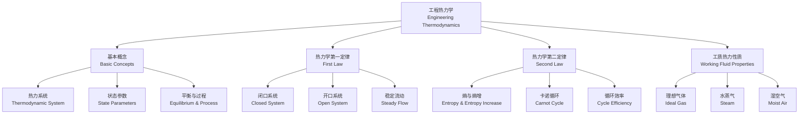

# 工程热力学 (Engineering Thermodynamics)

## 定义与概述

工程热力学（Engineering Thermodynamics）是研究热能（Thermal Energy）
与机械能（Mechanical Energy）以及其它形式能量之间相互转换规律的科学。
它是能源与动力工程（Energy and Power Engineering）的核心理论基础。

工程热力学以热力学第一定律（First Law of Thermodynamics）
和热力学第二定律（Second Law of Thermodynamics）为两大支柱，
建立了能量守恒与转换过程方向性的完整理论框架。

其研究对象涵盖热力系统（Thermodynamic System）
在各种热力过程（Thermodynamic Process）和循环（Cycle）中的
能量传递与转换规律。

---

## 基本概念 (Basic Concepts)

**热力系统（Thermodynamic System）**：研究对象的指定范围。
按系统与外界的关系分为闭口系统（Closed System，无质量交换）、
开口系统（Open System，有质量交换）和孤立系统（Isolated System，无任何交换）。

**状态参数（State Parameters）**：描述系统宏观状态的物理量，其值仅取决于状态本身而与路径无关。
基本状态参数包括温度 $T$（Temperature）、压力 $p$（Pressure）、比体积 $v$（Specific Volume）。
导出状态参数包括内能 $u$（Internal Energy）、焓 $h$（Enthalpy）、熵 $s$（Entropy）。

**热力学第零定律（Zeroth Law）**：
若系统 A 与系统 B 分别与系统 C 处于热平衡，则 A 与 B 也处于热平衡——这是温度测量的理论基础。

**准静态过程（Quasi-static Process）**：
过程进行得足够缓慢，使系统始终无限接近平衡态，是可逆过程（Reversible Process）的必要条件。

---

## 热力学第一定律 (First Law of Thermodynamics)

热力学第一定律即能量守恒与转换定律（Law of Energy Conservation and Conversion），指出能量既不能被创造也不能被消灭。

**闭口系统（Closed System）**：$Q = \Delta U + W$，其中 $Q$ 为系统吸收的热量，$\Delta U$ 为系统内能变化，$W$ 为系统对外做的功。

**开口系统（Open System）**：$Q = \Delta H + W_s + \Delta E_k + \Delta E_p$，其中 $H = U + pV$ 为焓（Enthalpy），$W_s$ 为轴功（Shaft Work）。

**稳定流动能量方程（Steady Flow Energy Equation, SFEE）**：$q = \Delta h + w_s$。
对于汽轮机（Turbine）、压气机（Compressor）、喷管（Nozzle）和换热器（Heat Exchanger），SFEE 有不同的简化形式。

---

## 理想气体 (Ideal Gas)

理想气体定律是工程热力学中最基本的工质状态方程。

**状态方程（Equation of State）**：$pv = RT$，其中 $R$ 为气体常数（Gas Constant）。

**比热容（Specific Heat Capacities）**：

| 名称 | 符号 | 定义式 |
|------|------|--------|
| 定容比热容（Specific Heat at Constant Volume） | $c_v$ | $c_v = \left.\frac{\partial u}{\partial T}\right|_v$ |
| 定压比热容（Specific Heat at Constant Pressure） | $c_p$ | $c_p = \left.\frac{\partial h}{\partial T}\right|_p$ |
| 绝热指数（Specific Heat Ratio） | $k$ | $k = c_p / c_v$ |

**理想气体的基本热力过程**：

| 过程 | 过程方程 | 热量 $q$ | 功 $w$ | 内能变化 $\Delta u$ | 熵变 $\Delta s$ |
|------|---------|----------|--------|---------------------|-----------------|
| 等容（Isochoric） | $v = \text{const}$ | $c_v\Delta T$ | $0$ | $c_v\Delta T$ | $c_v\ln(T_2/T_1)$ |
| 等压（Isobaric） | $p = \text{const}$ | $c_p\Delta T$ | $p\Delta v$ | $c_v\Delta T$ | $c_p\ln(T_2/T_1)$ |
| 等温（Isothermal） | $pv = \text{const}$ | $RT\ln(v_2/v_1)$ | $RT\ln(v_2/v_1)$ | $0$ | $R\ln(v_2/v_1)$ |
| 绝热（Adiabatic） | $pv^k = \text{const}$ | $0$ | $-\Delta u$ | $c_v\Delta T$ | $0$（可逆） |
| 多变（Polytropic） | $pv^n = \text{const}$ | $\frac{n-k}{n-1}c_v\Delta T$ | $\frac{R}{n-1}(T_1-T_2)$ | $c_v\Delta T$ | 视过程而定 |

绝热指数 $k = c_p/c_v$，多变指数 $n$ 可在 $-\infty$ 到 $+\infty$ 之间取值。
当 $n = 0$ 时为等压，$n = 1$ 时为等温，$n = k$ 时为绝热，$n = \pm \infty$ 时为等容。

---

## 热力学第二定律 (Second Law of Thermodynamics)

热力学第二定律揭示了自然界中过程进行的方向性——
并非所有符合第一定律的过程都能自发发生。

**克劳修斯表述（Clausius Statement）**：热量不可能自发地从低温物体传向高温物体而不引起其他变化。

**开尔文-普朗克表述（Kelvin-Planck Statement）**：不可能从单一热源吸热使之完全变为功而不产生其他效果。

**熵增原理（Principle of Entropy Increase）**：$dS_{iso} \geq 0$，孤立系统的熵永不减少。

**卡诺循环（Carnot Cycle）**：在给定温度界限内效率最高的热力循环，由两个等温过程和两个绝热过程组成。

$$
\eta_{\text{Carnot}} = 1 - \frac{T_L}{T_H}
$$

其中 $T_H$ 为高温热源温度，$T_L$ 为低温热源温度。

---

## 水蒸气 (Steam)

水蒸气是工程中最常用的工质（Working Fluid），其热力性质与理想气体有显著差异。

**水蒸气相图分区**：未饱和液（Compressed Liquid）、饱和液（Saturated Liquid）、
湿蒸汽（Wet Steam，干度 $x$ 表征气相质量分数）、饱和气（Saturated Vapor）、过热蒸汽（Superheated Vapor）。

**水蒸气表（Steam Tables）**：国际通用的工质热力性质数据表，包括饱和水蒸汽表（Saturation Table）和过热水蒸气表。

---

## 湿空气 (Moist Air)

湿空气（Moist Air）是干空气（Dry Air）与水蒸气（Water Vapor）的混合物，
是空调工程（Air Conditioning）和干燥工程（Drying Engineering）的核心研究对象。

| 参数 | 符号 | 表达式 | 物理含义 |
|------|------|--------|----------|
| 绝对湿度（Absolute Humidity） | $\rho_v$ | $\rho_v = m_v/V$ | 单位体积湿空气中的水蒸气质量 |
| 相对湿度（Relative Humidity） | $\phi$ | $\phi = p_v/p_s$ | 水蒸气分压与同温下饱和压力之比 |
| 含湿量（Humidity Ratio） | $d$ | $d = 0.622\frac{p_v}{p_B-p_v}$ | 单位质量干空气所携带的水蒸气质量 |

**焓湿图（Psychrometric Chart）**：以含湿量 $d$ 为横坐标、焓 $h$ 为斜坐标的工程图线，用于湿空气过程分析。

---

## 热力循环 (Thermodynamic Cycles)

### 朗肯循环 (Rankine Cycle)

朗肯循环是蒸汽动力装置（Steam Power Plant）的基本热力循环，由四个过程组成：
等压加热（锅炉）、绝热膨胀（汽轮机）、等压放热（凝汽器）、绝热压缩（给水泵）。

$$
\eta_{\text{th}} = \frac{w_{\text{net}}}{q_H} = 1 - \frac{h_4 - h_1}{h_3 - h_2}
$$

### 制冷循环与热泵循环

| 循环类型 | 目的 | 性能系数 (COP) |
|---------|------|---------------|
| 蒸气压缩制冷（Vapor Compression Refrigeration） | 从低温热源吸热实现制冷 | $COP_R = \frac{h_1 - h_4}{h_2 - h_1}$ |
| 吸收式制冷（Absorption Refrigeration） | 以热能驱动制冷循环 | $COP = \frac{q_L}{q_G}$ |
| 热泵循环（Heat Pump） | 向高温热源供热 | $COP_{HP} = \frac{h_2 - h_4}{h_2 - h_1}$ |

**卡诺循环的性能界限**：热机 $\eta_{\text{Carnot}} = 1 - T_L/T_H$，
制冷 $COP_{R,\text{Carnot}} = T_L/(T_H - T_L)$，
热泵 $COP_{HP,\text{Carnot}} = T_H/(T_H - T_L)$。

---

## 经典教材 (Classic Textbooks)

- 曾丹苓《工程热力学》（中文经典教材）
- 沈维道《工程热力学》（中国高校通用教材）
- Yunus Çengel《Thermodynamics: An Engineering Approach》（国际主流教材）
- Michael J. Moran《Fundamentals of Engineering Thermodynamics》

## 主要应用领域 (Major Applications)

- **火力发电（Thermal Power Generation）** — 燃煤、燃气、核电站的热力系统设计
- **制冷空调（Refrigeration & Air Conditioning）** — 制冷循环设计、HVAC 系统分析
- **内燃机（Internal Combustion Engines）** — 汽油机、柴油机的热力循环分析
- **航空发动机（Aero Engines）** — 燃气涡轮发动机的热力性能计算
- **化工过程（Chemical Processes）** — 精馏、蒸发等单元操作的热量平衡
- **新能源系统（Renewable Energy Systems）** — 太阳能热发电、地热发电、余热回收

---

## 相关条目 (Related Notes)

- [[HeatTransfer]] — 传热学（热量传递的三种基本方式）
- [[FluidMechanics]] — 流体力学（流体运动规律）
- [[EnergyConversion]] — 能量转换技术
- [[PowerPlantEngineering]] — 发电厂工程
- [[HVAC]] — 暖通空调
- [[GasDynamics]] — 气体动力学
