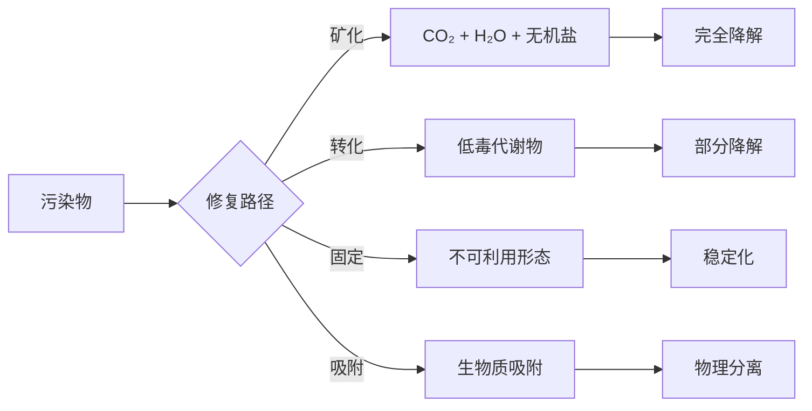

# 生物修复 (Bioremediation)

## 定义

生物修复是利用微生物、植物及其酶系统，通过代谢活动降解、转化或固定环境介质（土壤、地下水、沉积物）中污染物的技术。其核心在于利用生物体的自然净化能力，实现污染物的无害化或减量化。

## 核心内容

### 生物修复机制

### 微生物修复 (Microbial Remediation)

**降解动力学**：

**Monod 方程**描述微生物比生长速率与底物浓度的关系：

$$
\mu = \mu_{max} \frac{S}{K_s + S}
$$

其中 $\mu_{max}$ 为最大比生长速率，$K_s$ 为半饱和常数。

**一级降解动力学**：

$$
\frac{dC}{dt} = -kC \quad \Rightarrow \quad C(t) = C_0 e^{-kt}
$$

**原位修复 (In-Situ) 技术**：

| 技术 | 操作方式 | 适用场景 |
|------|---------|---------|
| 生物刺激 (Biostimulation) | 添加 N、P 等营养物质 | 石油烃污染 |
| 生物强化 (Bioaugmentation) | 接种高效降解菌株 | 难降解有机物 |
| 生物通气 (Biosparging) | 向饱和带注入空气/O₂ | 地下水污染 |
| 生物通风 (Bioventing) | 向不饱和带抽/注气 | 土壤气相污染物 |
| 监控自然衰减 (MNA) | 依赖天然降解能力 | 低浓度污染 |

**异位修复 (Ex-Situ) 技术**：

| 技术 | 工艺特征 | 处理周期 |
|------|---------|---------|
| 生物堆 (Biopiles) | 堆置+通风+营养 | 数周至数月 |
| 土地耕作 (Land Farming) | 翻耕+施肥+灌溉 | 6-24个月 |
| 泥浆相反应器 (Slurry Bioreactor) | 固液混合+控制条件 | 数天至数周 |
| 生物滤池 (Biofilter) | 固定化微生物+废气通入 | 连续运行 |

### 植物修复 (Phytoremediation)

**修复机制体系**：

$$
\text{植物提取} \xrightarrow{\text{吸收}} \text{植物体内富集} \xrightarrow{\text{收获}} \text{污染物移除}
$$

$$
\text{根际降解} \xrightarrow{\text{根系分泌物}} \text{微生物活性增强} \xrightarrow{\text{共代谢}} \text{污染物降解}
$$

**超富集植物 (Hyperaccumulators)**：

| 元素 | 植物种 | 富集阈值 |
|------|--------|---------|
| Ni | 庭芥属 (Alyssum) | >1000 mg/kg |
| Zn | 遏蓝菜 (Thlaspi caerulescens) | >10000 mg/kg |
| As | 蜈蚣草 (Pteris vittata) | >1000 mg/kg |
| Cd | 东南景天 (Sedum alfredii) | >100 mg/kg |
| Mn | 粗脉叶澳洲坚果 (Macadamia neurophylla) | >10000 mg/kg |

**植物修复类型**：

- **植物提取 (Phytoextraction)**：植物根系吸收并转移到地上部分
- **植物稳定 (Phytostabilization)**：根系固定污染物，减少迁移
- **植物挥发 (Phytovolatilization)**：吸收后转化为气态释放（如 Se、Hg）
- **根际过滤 (Rhizofiltration)**：根系从水体中吸附/沉淀污染物
- **植物降解 (Phytodegradation)**：植物体内酶直接降解有机物

### 真菌修复 (Mycoremediation)

真菌通过胞外酶系统（木质素过氧化物酶、锰过氧化物酶、漆酶）降解难降解有机物：

$$
\text{PAH} \xrightarrow{\text{白腐真菌酶系}} \text{醌类中间体} \xrightarrow{\text{开环}} \text{CO}_2 + \text{H}_2\text{O}
$$

### 影响生物修复效率的因素

**环境因子**：

- 温度：微生物活动的最佳温度范围（中温菌 20-40°C）
- pH：多数细菌偏好中性 (6.5-7.5)
- 溶解氧：好氧降解需 DO > 2 mg/L
- 氧化还原电位 (Eh)：决定电子受体类型
- 含水量：土壤湿度 40-60% 持水能力

**污染物特性**：

- 生物可利用性 (Bioavailability)：吸附-解吸平衡控制
- 化学结构：分子量、极性、取代基类型
- 浓度效应：高浓度抑制、低浓度限制生长

**电子受体序列**（按能量产出排序）：

$$
O_2 > NO_3^- > Mn^{4+} > Fe^{3+} > SO_4^{2-} > CO_2
$$

### 工程强化策略

**共代谢 (Co-metabolism)**：利用生长底物诱导酶系统降解非生长底物。

**表面活性剂强化**：提高疏水性污染物的表观溶解度：

$$
S_{app} = S_w (1 + K_m \cdot C_{surf})
$$

**固定化微生物技术**：将高效菌株固定在载体（生物炭、海藻酸盐）上。

**基因工程菌 (GEMs)**：构建具有多重降解能力的工程菌株。

## 经典教材

- Atlas & Philp《Bioremediation: Applied Microbial Solutions》
- Vidali《Bioremediation: An Overview》
- 张甲耀《环境生物技术》
- 环境保护部《污染土壤生物修复技术规范》

## 主要应用领域

- 石油烃污染场地修复
- 重金属污染农田治理
- 地下水有机污染修复
- 垃圾填埋场渗滤液处理
- 工业废气生物净化
- 海洋溢油生物处置
- 赤潮生物防治

## 相关条目

- [[Ecotoxicology]]
- [[EcologicalEngineering]]
- [[WastewaterTreatment]]
- [[WaterChemistry]]
- [[AirChemistry]]
