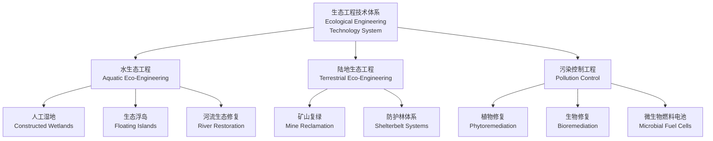
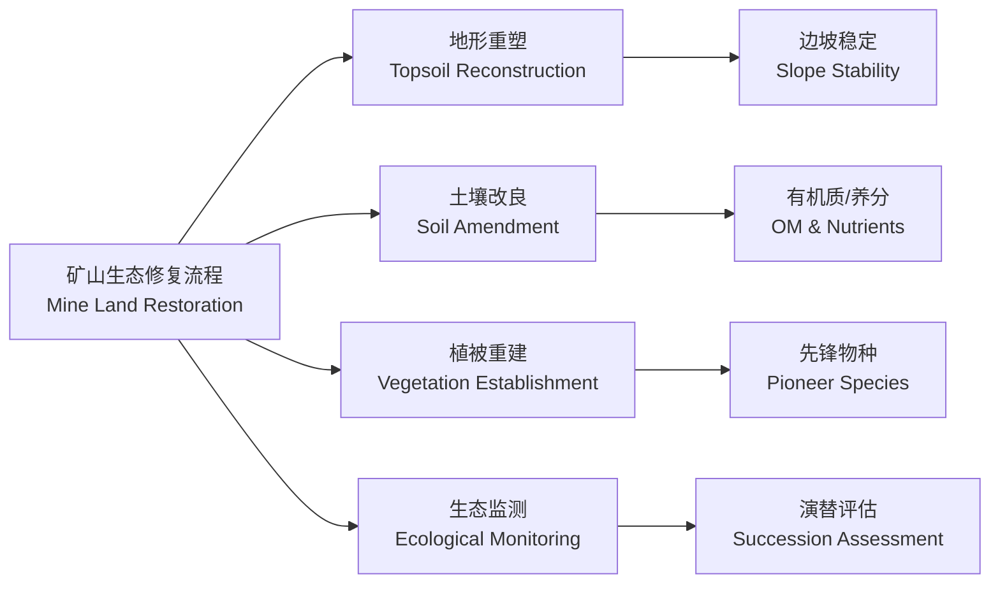
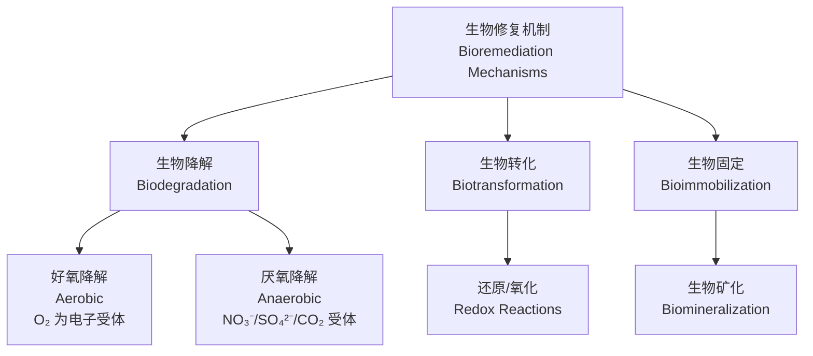

---
aliases: [生态工程, 生态工学, Ecological Engineering, Eco-Engineering]
tags: [生态工程, 环境工程, 生态修复, 人工湿地, 植物修复, 生物修复, 可持续工程]
created: 2026-05-17
updated: 2026-05-17
---

# 生态工程 (Ecological Engineering)

## 概述 (Overview)

生态工程（Ecological Engineering）是运用**生态学 (Ecology)** 与**工程学 (Engineering)** 原理，设计、构建和管理**人工生态系统 (Artificial Ecosystems)**，以修复退化环境、治理污染并提升生态系统服务的跨学科技术体系。由 H. T. Odum 于 1962 年首次系统提出。

核心原则：

$$
E_{system} = E_{solar} + E_{auxiliary}
$$

最大化利用**太阳能 (Solar Energy)** 驱动，最小化辅助能（化石燃料）投入。

## 生态工程类型 (Types of Ecological Engineering)

## 人工湿地 (Constructed Wetlands)

### 人工湿地类型 (Types of Constructed Wetlands)

| 类型 (Type) | 水流方式 (Flow Regime) | 基质 (Substrate) | 适用场景 (Application) |
|------------|----------------------|-----------------|----------------------|
| 表面流人工湿地 (FWS) | 水平表面流 | 土壤/砂砾 | 景观融合、大面积处理 |
| 潜流人工湿地 (SSF) | 水平/垂直潜流 | 砾石/沸石 | 较高处理效率、占地受限 |
| 垂直流人工湿地 (VF) | 垂直下向/上向流 | 分级砾石 | 硝化作用强、需氧处理 |
| 混合流人工湿地 (Hybrid) | 组合流态 | 复合基质 | 复杂水质、高标准出水 |

### 污染物去除机制 (Pollutant Removal Mechanisms)

**有机物 (Organics) 去除**：

$$
\frac{dC}{dt} = -k_{20} \cdot \theta^{T-20} \cdot C
$$

一级动力学模型，$k_{20}$ 为 $20°C$ 时降解速率常数，$\theta$ 为温度系数（通常 $1.06$）。

**氮 (Nitrogen) 去除途径**：

| 过程 (Process) | 反应式 (Reaction) | 微生物/植物 (Organism) |
|---------------|------------------|---------------------|
| 氨化 (Ammonification) | $R-NH_2 \rightarrow NH_4^+$ | 异养细菌 |
| 硝化 (Nitrification) | $NH_4^+ \rightarrow NO_2^- \rightarrow NO_3^-$ | 亚硝化/硝化菌 |
| 反硝化 (Denitrification) | $NO_3^- \rightarrow N_2$ | 反硝化菌 |
| 植物吸收 (Plant Uptake) | $NO_3^- / NH_4^+ \rightarrow$ 生物量 | 湿地植物 |
| 氨挥发 (Ammonia Volatilization) | $NH_4^+ \rightarrow NH_3 \uparrow$ | pH > 9.3 时显著 |

**磷 (Phosphorus) 去除**：

$$
P_{removed} = P_{adsorption} + P_{precipitation} + P_{plant\,uptake} + P_{sedimentation}
$$

吸附容量可用 Langmuir 等温线描述：

$$
q_e = \frac{q_{max} K_L C_e}{1 + K_L C_e}
$$

其中 $q_{max}$ 为最大吸附量，$K_L$ 为 Langmuir 常数。

### 湿地植物选择 (Wetland Plant Selection)

| 植物种类 (Species) | 功能 (Function) | 适应性 (Adaptation) |
|-------------------|----------------|--------------------|
| 芦苇 (Phragmites australis) | 输氧、根系分泌 | 广温性、耐污染 |
| 香蒲 (Typha spp.) | 重金属富集、除氮 | 耐寒、高生物量 |
| 美人蕉 (Canna indica) | 景观、有机物去除 | 热带/亚热带 |
| 灯芯草 (Juncus effusus) | 耐寒、重金属固定 | 温带湿地 |
| 水葱 (Scirpus validus) | 根系泌氧、磷去除 | 浅水区 |

## 生态修复 (Ecological Restoration)

### 恢复生态学原理 (Restoration Ecology Principles)

**SER 国际生态恢复学会定义**：

生态恢复是协助恢复已退化、受损或被破坏的生态系统的过程。

| 恢复目标 (Restoration Goal) | 指标 (Indicators) | 时间尺度 (Time Scale) |
|---------------------------|------------------|---------------------|
| 结构恢复 (Structure) | 物种组成、群落分层 | 数年–数十年 |
| 功能恢复 (Function) | 生产力、养分循环 | 数十年–数百年 |
| 韧性恢复 (Resilience) | 抗干扰、自维持 | 长期 |

### 矿山生态修复 (Mine Land Restoration)

土壤侵蚀控制：

$$
A = R \cdot K \cdot LS \cdot C \cdot P
$$

通用土壤流失方程（USLE），其中 $R$ 为降雨侵蚀力，$K$ 为土壤可蚀性，$LS$ 为坡长坡度因子，$C$ 为植被覆盖因子，$P$ 为工程措施因子。

## 植物修复 (Phytoremediation)

### 植物修复机制 (Phytoremediation Mechanisms)

| 机制 (Mechanism) | 过程 (Process) | 适用污染物 (Target Pollutants) | 超富集植物 (Hyperaccumulators) |
|-----------------|---------------|-----------------------------|------------------------------|
| 植物提取 (Phytoextraction) | 根系吸收→地上部转运 | 重金属（Cd, Ni, Zn） | 遏蓝菜 (Thlaspi caerulescens) |
| 植物稳定 (Phytostabilization) | 根系吸附→降低生物有效性 | Pb, Cr, As | 柳属 (Salix spp.) |
| 植物挥发 (Phytovolatilization) | 吸收→转化为气态释放 | Hg, Se | 印度芥菜 (Brassica juncea) |
| 植物降解 (Phytodegradation) | 植物酶促分解 | 有机污染物 | 杨树 (Populus spp.) |
| 根际过滤 (Rhizofiltration) | 根系吸附/沉淀 | 水中重金属 | 向日葵 (Helianthus annuus) |

### 重金属富集系数

富集系数（Bioaccumulation Factor, BAF）：

$$
BAF = \frac{C_{plant}}{C_{soil}}
$$

超富集植物标准：

- Cd：$> 100$ mg/kg 干重
- Ni、Co、Cu、Pb：$> 1000$ mg/kg 干重
- Mn、Zn：$> 10000$ mg/kg 干重

转运系数（Translocation Factor, TF）：

$$
TF = \frac{C_{shoot}}{C_{root}}
$$

$TF > 1$ 表示有效从根向地上部转运。

## 生物修复 (Bioremediation)

### 微生物修复机制 (Microbial Remediation)

### 典型生物修复技术

| 技术 (Technology) | 机制 (Mechanism) | 适用条件 (Conditions) | 应用案例 (Case Study) |
|------------------|-----------------|---------------------|---------------------|
| 生物通风 (Bioventing) | 原位好氧降解 VOCs | 非饱和带土壤 | 加油站场地修复 |
| 生物淋洗 (Bioleaching) | 微生物氧化/酸化溶解 | 重金属污染土壤 | 矿山酸性废水 |
| 生物反应器 (Bioreactor) | 异位控制条件降解 | 高浓度有机污染 | 污泥/沉积物处理 |
| 可渗透反应墙 (PRB) | 墙体填充反应介质 | 地下水羽流拦截 | 氯代烃污染 |
| 强化自然衰减 (ENA) | 原位刺激土著微生物 | 低浓度、大面积 | 石油烃污染 |

Monod 动力学描述微生物生长与底物降解：

$$
\mu = \mu_{max} \frac{S}{K_s + S}
$$

其中 $\mu$ 为比生长速率，$\mu_{max}$ 为最大比生长速率，$K_s$ 为半饱和常数。

## 生态系统服务评估 (Ecosystem Services Assessment)

### 服务价值量化 (Valuation)

| 服务类型 (Service Type) | 指标 (Indicator) | 估算方法 (Method) |
|-----------------------|-----------------|------------------|
| 水质净化 (Water Purification) | 污染物去除量 | 替代成本法 |
| 碳汇 (Carbon Sequestration) | CO₂ 固定量 | 碳市场价格 |
| 生物多样性 (Biodiversity) | 物种丰富度指数 | 意愿调查法 |
| 景观美学 (Aesthetic) | 游客人数 | 旅行成本法 |
| 调洪蓄洪 (Flood Regulation) | 蓄洪容积 | 避免损失法 |

## 参考文献 (References)

1. Mitsch, W. J., & Gosselink, J. G. (2015). *Wetlands* (5th ed.). Wiley.
2. Kadlec, R. H., & Wallace, S. D. (2009). *Treatment Wetlands* (2nd ed.). CRC Press.
3. Raskin, I., & Ensley, B. D. (2000). *Phytoremediation of Toxic Metals*. Wiley.
4. Atlas, R. M., & Philp, J. C. (2005). *Bioremediation*. Cambridge University Press.
5. 颜京松 等. (2013). 《生态工程学》. 化学工业出版社.

