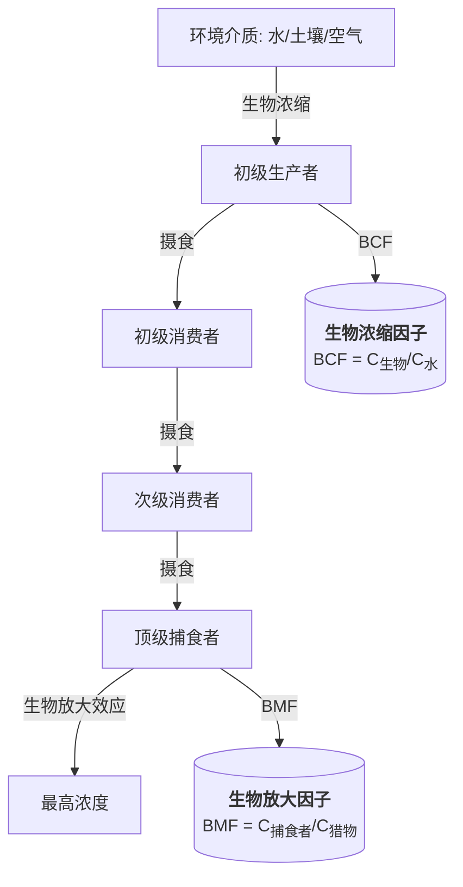

---
aliases: [Ecotoxicology, 生态毒理学]
tags: ['EnvironmentalScienceAndEngineering', 'EnvironmentalBiology', 'Ecotoxicology']
created: 2026-05-17
updated: 2026-05-17
---

# 生态毒理学 (Ecotoxicology)

## 定义

生态毒理学是研究环境污染物对生态系统各层次（分子、细胞、个体、种群、群落、生态系统）产生有害效应的科学。它整合了毒理学 (Toxicology) 与生态学 (Ecology)，关注污染物在环境中的迁移转化及其生态后果。

## 核心内容

### 污染物种类与来源

| 类别 | 典型污染物 | 主要来源 |
|------|-----------|---------|
| 持久性有机污染物 (POPs) | DDT、多氯联苯 (PCBs)、二噁英 | 农药、工业副产物 |
| 重金属 (Heavy Metals) | Hg、Pb、Cd、Cr、As | 采矿、冶炼、电池 |
| 内分泌干扰物 (EDCs) | 双酚 A (BPA)、邻苯二甲酸酯 | 塑料、日化产品 |
| 纳米材料 (Nanomaterials) | 纳米 TiO₂、纳米 Ag | 消费品、医疗 |
| 微塑料 (Microplastics) | PE、PP、PET 碎片 | 塑料降解、化妆品 |

### 毒物动力学 (Toxicokinetics)

**吸收 (Absorption)**：污染物进入生物体的途径（呼吸、摄食、皮肤渗透）。

**分布 (Distribution)**：污染物在生物体内的转运与蓄积。

**代谢 (Metabolism)**：生物转化过程——Ⅰ相反应（氧化、还原、水解）和Ⅱ相反应（结合反应）。

$$
\text{Rate of metabolism} = \frac{V_{max} \cdot C}{K_m + C}
$$

**排泄 (Excretion)**：污染物及其代谢产物的排出途径（肾、胆汁、肺、乳汁）。

### 生物蓄积与生物放大 (Bioaccumulation & Biomagnification)

**生物浓缩因子 (BCF)**：

$$
BCF = \frac{C_{organism}}{C_{water}}
$$

**生物放大因子 (BMF)**：

$$
BMF = \frac{C_{predator}}{C_{prey}}
$$

### 毒性效应 (Toxic Effects)

**急性毒性 (Acute Toxicity)**：短期高浓度暴露，常用指标为 $LD_{50}$（半数致死剂量）和 $LC_{50}$（半数致死浓度）。

**慢性毒性 (Chronic Toxicity)**：长期低浓度暴露，影响生长、繁殖、行为。

**分子效应**：

- 氧化应激 (Oxidative Stress)：活性氧 (ROS) 产生超过抗氧化防御能力
- DNA 损伤：加合物形成、链断裂
- 酶抑制：乙酰胆碱酯酶 (AChE) 抑制

**个体与种群效应**：

- 生殖毒性：受精率下降、畸形率升高
- 发育毒性：生长发育延迟
- 行为毒性：逃避反应改变、捕食能力下降

### 生物标志物 (Biomarkers)

| 水平 | 标志物 | 指示意义 |
|------|--------|---------|
| 分子水平 | 金属硫蛋白 (MT) | 重金属暴露 |
| 分子水平 | 细胞色素 P450 (CYP1A) | 有机污染物暴露 |
| 分子水平 | 热休克蛋白 (HSP70) | 通用应激响应 |
| 细胞水平 | 微核率 (Micronucleus) | 遗传毒性 |
| 细胞水平 | 溶酶体膜稳定性 | 细胞健康状态 |

### 生态风险评估 (Ecological Risk Assessment, ERA)

**四步法框架**：

1. **问题公式化 (Problem Formulation)**：确定评估终点和概念模型
2. **暴露评估 (Exposure Assessment)**：预测环境浓度 (PEC) 测定
3. **效应评估 (Effects Assessment)**：预测无效应浓度 (PNEC) 推导

   $$
   PNEC = \frac{NOEC}{AF}
   $$

   其中 $NOEC$ 为无观察效应浓度，$AF$ 为评估因子 (Assessment Factor)

4. **风险表征 (Risk Characterization)**：

   $$
   RQ = \frac{PEC}{PNEC}
   $$

   若 $RQ > 1$，表明存在潜在生态风险。

### 毒性测试方法

**标准测试生物**：

- 藻类 (Algae)：羊角月牙藻——生长抑制试验
- 水蚤 (Daphnia)：大型蚤——急性运动抑制试验
- 鱼类 (Fish)：斑马鱼——急性毒性、胚胎毒性
- 蚯蚓 (Earthworm)：赤子爱胜蚓——土壤毒性
- 植物 (Plant)：玉米、水稻——种子发芽与根伸长

**替代方法**：

- QSAR (定量构效关系) 模型预测
- 体外 (in vitro) 细胞试验
- 组学技术 (Omics)：转录组学、代谢组学

### 复合污染效应

**协同作用 (Synergism)**：联合毒性大于各组分毒性之和。

**拮抗作用 (Antagonism)**：联合毒性小于各组分毒性之和。

**加和作用 (Additivity)**：联合毒性等于各组分毒性之和。

$$
\text{浓度加和模型 (CA)}: \sum_{i=1}^{n} \frac{C_i}{EC_{x,i}} = 1
$$

$$
\text{独立作用模型 (IA)}: E(C_{mix}) = 1 - \prod_{i=1}^{n}[1 - E(C_i)]
$$

## 经典教材

- Walker《Principles of Ecotoxicology》
- 王德铭《环境毒理学》
- Newman《Fundamentals of Ecotoxicology》
- Hester《Ecotoxicology》

## 主要应用领域

- 化学品环境风险评估与管理
- 污染土壤生态毒性诊断
- 水环境生态安全评价
- 环境质量标准制定
- 新化学物质登记评估

## 相关条目

- [[Bioremediation]]
- [[EnvironmentalChemistry]]
- [[04_EngineeringAndTechnology/EnvironmentalScienceAndEngineering/SafetyScience/RiskAssessment|RiskAssessment]]
- [[04_EngineeringAndTechnology/EnvironmentalScienceAndEngineering/EnvironmentalChemistry/WaterChemistry|WaterChemistry]]
- [[04_EngineeringAndTechnology/EnvironmentalScienceAndEngineering/EnvironmentalChemistry/AirChemistry|AirChemistry]]

