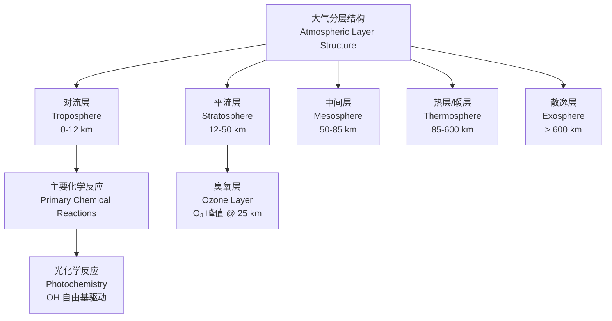
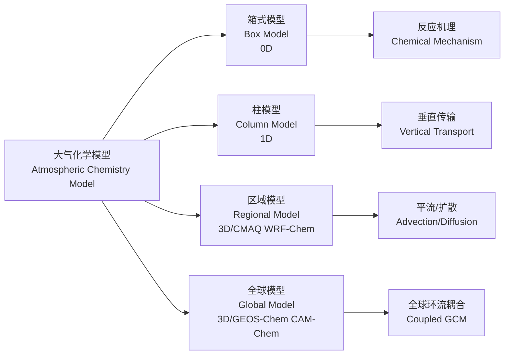

---
aliases: [大气化学, 空气化学, Atmospheric Chemistry, Air Chemistry]
tags: [环境科学, 大气科学, 化学, 污染控制, 气候变化, 气溶胶, 环境工程]
created: 2026-05-17
updated: 2026-05-17
---

# 大气化学 (Atmospheric Chemistry)

## 概述 (Overview)

大气化学（Atmospheric Chemistry）是研究**地球大气层 (Earth's Atmosphere)** 组成、结构、化学反应过程及其与环境、气候、生物圈相互作用的交叉学科。其核心关注**痕量气体 (Trace Gases)** 转化机制与**气溶胶 (Aerosols)** 理化特性。

## 大气组成 (Atmospheric Composition)

干洁空气主要成分：

| 组分 (Component) | 化学式 (Formula) | 体积分数 (Volume Fraction) | 来源 (Source) |
|-----------------|-----------------|----------------------------|--------------|
| 氮气 (Nitrogen) | N₂ | 78.08% | 生物固氮、火山喷发 |
| 氧气 (Oxygen) | O₂ | 20.95% | 光合作用 |
| 氩气 (Argon) | Ar | 0.93% | 放射性衰变 |
| 二氧化碳 (Carbon Dioxide) | CO₂ | ~420 ppm (2024) | 化石燃料燃烧、呼吸 |
| 甲烷 (Methane) | CH₄ | ~1.9 ppm | 湿地、畜牧业、天然气泄漏 |
| 一氧化二氮 (Nitrous Oxide) | N₂O | ~0.33 ppm | 农业施肥、工业过程 |

## 大气分层 (Atmospheric Layers)

| 层次 (Layer) | 高度 (Altitude) | 温度特征 (Temperature) | 化学特征 (Chemical Feature) |
|-------------|----------------|----------------------|---------------------------|
| 对流层 | 0–12 km | 随高度递减 $6.5$°C/km | OH 自由基主导氧化 |
| 平流层 | 12–50 km | 随高度递增 | O₃ 光解与生成平衡 |
| 中间层 | 50–85 km | 随高度递减 | 流星烧蚀、金属离子 |
| 热层 | 85–600 km | 随高度急剧递增 | 电离层、光致电离 |

## 光化学反应 (Photochemical Reactions)

### Chapman 臭氧循环 (Chapman Ozone Cycle)

臭氧生成（Ozone Formation）：

$$
\text{O}_2 + h\nu \xrightarrow{\lambda < 242 \, \text{nm}} \text{O} + \text{O}
$$

$$
\text{O} + \text{O}_2 + \text{M} \rightarrow \text{O}_3 + \text{M}
$$

臭氧光解（Ozone Photolysis）：

$$
\text{O}_3 + h\nu \xrightarrow{\lambda < 320 \, \text{nm}} \text{O}_2 + \text{O}(^1\text{D})
$$

臭氧消耗（Ozone Loss）：

$$
\text{O}_3 + \text{O} \rightarrow 2\text{O}_2
$$

### HOx 循环 (HOx Cycle)

氢氧自由基（Hydroxyl Radical, OH）是**大气清洁剂 (Atmospheric Detergent)**：

$$
\text{OH} + \text{CO} \rightarrow \text{H} + \text{CO}_2
$$

$$
\text{OH} + \text{CH}_4 \rightarrow \text{CH}_3 + \text{H}_2\text{O}
$$

OH 全球平均浓度约 $10^6$ molecules/cm³，日间峰值出现在对流层下部。

## 氮氧化物化学 (NOx Chemistry)

### 光化学烟雾形成 (Photochemical Smog Formation)

Leighton 关系（Leighton Relationship）：

$$
\frac{[\text{NO}_2]}{[\text{NO}]} = \frac{j_1}{k_1 [\text{O}_2]}
$$

其中 $j_1$ 为 NO₂ 光解速率常数，$k_1$ 为 NO 与 O₃ 反应速率常数。

### 对流层臭氧生成 (Tropospheric Ozone Production)

$$
\text{NO} + \text{HO}_2 \rightarrow \text{NO}_2 + \text{OH}
$$

$$
\text{NO}_2 + h\nu \rightarrow \text{NO} + \text{O}
$$

$$
\text{O} + \text{O}_2 + \text{M} \rightarrow \text{O}_3 + \text{M}
$$

净反应：

$$
\text{HO}_2 + \text{O}_2 \xrightarrow{\text{NO}_x, h\nu} \text{O}_3 + \text{OH}
$$

## 气溶胶 (Aerosols)

### 粒径分布 (Size Distribution)

**三模态模型 (Trimodal Model)**：

| 模态 (Mode) | 粒径范围 (Diameter) | 主要来源 (Primary Source) | 寿命 (Lifetime) |
|------------|-------------------|------------------------|----------------|
| 核模态 (Nucleation) | 3–20 nm | 气-粒转化、燃烧 | 数分钟至数小时 |
| 爱根核模态 (Aitken) | 20–100 nm | 核模态凝聚、燃烧 | 数小时至数天 |
| 积聚模态 (Accumulation) | 0.1–2.5 µm | 凝聚、云过程 | 数天至数周 |
| 粗模态 (Coarse) | > 2.5 µm | 机械破碎、海浪飞沫 | 数分钟至数天 |

### 气溶胶光学厚度 (Aerosol Optical Depth, AOD)

$$
\tau_\lambda = -\ln\left(\frac{I}{I_0}\right) = \int_0^H \sigma_{ext}(z) \, dz
$$

其中 $\sigma_{ext}$ 为消光系数，$H$ 为大气标高。AOD $> 0.5$ 表示严重气溶胶污染。

## 大气污染化学 (Air Pollution Chemistry)

### 硫氧化物转化 (Sulfur Oxide Transformation)

SO₂ 均相氧化（Homogeneous Oxidation）：

$$
\text{SO}_2 + \text{OH} + \text{M} \rightarrow \text{HOSO}_2 + \text{M}
$$

$$
\text{HOSO}_2 + \text{O}_2 \rightarrow \text{HO}_2 + \text{SO}_3
$$

$$
\text{SO}_3 + \text{H}_2\text{O} \rightarrow \text{H}_2\text{SO}_4
$$

SO₂ 非均相氧化（Heterogeneous Oxidation，云内）：

$$
\text{S}(\text{IV}) + \text{H}_2\text{O}_2 \rightarrow \text{S}(\text{VI}) + \text{H}_2\text{O}
$$

### 二次有机气溶胶 (Secondary Organic Aerosol, SOA)

挥发性有机物（Volatile Organic Compounds, VOCs）光氧化生成低挥发性产物：

$$
\text{VOC} + \text{OH}/\text{O}_3/\text{NO}_3 \rightarrow \text{OVOCs} \rightarrow \text{SOA}
$$

产率（Yield）：

$$
Y = \frac{\Delta \text{SOA}}{\Delta \text{VOC}} \times 100\%
$$

典型 SOA 前体物：单萜烯（Monoterpenes, $Y \approx 5$–$30\%$）、芳香烃（Aromatics, $Y \approx 10$–$40\%$）。

## 气候化学 (Climate Chemistry)

### 辐射强迫 (Radiative Forcing)

| 物种 (Species) | 辐射强迫 (RF, W/m², 1750–2019) | 作用机制 (Mechanism) |
|---------------|------------------------------|---------------------|
| CO₂ | +2.16 | 吸收红外辐射 |
| CH₄ | +0.54 | 直接 + 间接（O₃、H₂O） |
| N₂O | +0.21 | 吸收红外辐射 |
| 卤代烃 (Halocarbons) | +0.41 | 强温室效应 |
| O₃（对流层） | +0.47 | 温室气体 + 氧化剂 |
| O₃（平流层） | –0.05 | 冷却效应 |
| 气溶胶（直接） | –0.45 | 散射太阳辐射 |
| 气溶胶（间接） | –0.84 | 改变云反照率与寿命 |

### 全球增温潜势 (Global Warming Potential, GWP)

以 CO₂ 为基准，100 年时间尺度：

$$
\text{GWP}_i = \frac{\int_0^{TH} a_i [C_i(t)] \, dt}{\int_0^{TH} a_{CO_2} [C_{CO_2}(t)] \, dt}
$$

| 温室气体 | GWP₁₀₀ | 大气寿命 |
|---------|--------|----------|
| CO₂ | 1 | 可变 |
| CH₄ | 27–30 | 12.4 年 |
| N₂O | 273 | 121 年 |
| CFC-11 | 6,260 | 52 年 |
| SF₆ | 23,500 | 3,200 年 |

## 大气化学模型 (Atmospheric Chemistry Models)

**化学反应机理 (Chemical Mechanism)** 核心：

- **CB05**、**RACM2**、**MOZART-4** 等机理
- 包含 $100$–$500+$ 物种，$300$–$2000+$ 反应
- 光解速率由 **TUV** 或 **Fast-J** 计算

## 测量技术 (Measurement Techniques)

| 技术 (Technique) | 测量对象 (Target) | 检测限 (Detection Limit) | 时间分辨率 (Time Resolution) |
|-----------------|------------------|-------------------------|----------------------------|
| 化学电离质谱 (CIMS) | H₂SO₄、HOMs | $10^4$ molecules/cm³ | 1 Hz |
| 气溶胶质谱 (AMS) | 气溶胶化学组成 | 0.1 µg/m³ | 秒级 |
| FTIR 光谱 | CO、CH₄、N₂O | ppb 级 | 分钟级 |
| DOAS | NO₂、SO₂、HCHO | ppt 级 | 分钟级 |
| 质子转移质谱 (PTR-MS) | VOCs | pptv 级 | 秒级 |

## 参考文献 (References)

1. Seinfeld, J. H., & Pandis, S. N. (2016). *Atmospheric Chemistry and Physics* (3rd ed.). Wiley.
2. Finlayson-Pitts, B. J., & Pitts, J. N. (2000). *Chemistry of the Upper and Lower Atmosphere*. Academic Press.
3. Jacob, D. J. (1999). *Introduction to Atmospheric Chemistry*. Princeton University Press.
4. IPCC. (2021). *Climate Change 2021: The Physical Science Basis*. Cambridge University Press.
5. 王跃思 等. (2020). 《大气化学》. 科学出版社.

