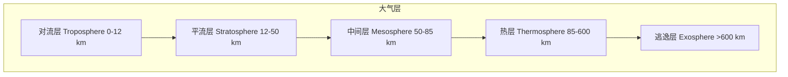
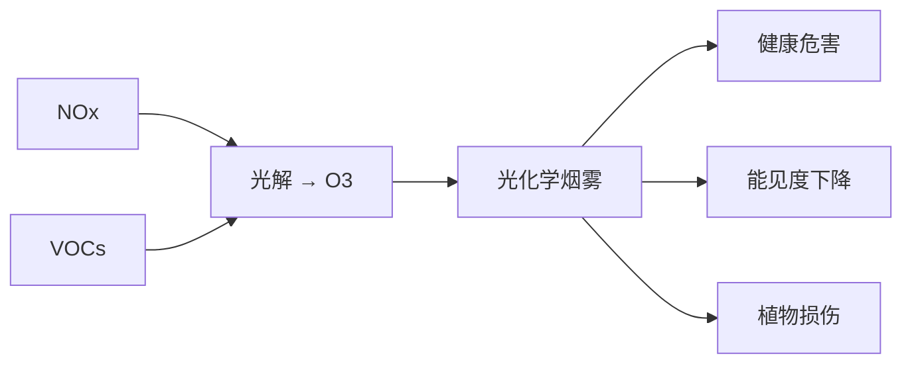

---
aliases: [AtmosphericChemistry]
tags: ['04_EngineeringAndTechnology', 'EnvironmentalScienceAndEngineering', 'EnvironmentalChemistry', 'AtmosphericChemistry']
created: 2026-05-17
updated: 2026-05-17
---

# 大气化学

## 一、概述
大气化学（Atmospheric Chemistry）研究地球大气及行星大气的化学组成、化学反应过程及时空变化规律。它是环境化学的重要分支，与气候科学、空气污染控制、臭氧层保护等问题密切相关。

## 二、大气组成与结构
### 2.1 大气垂直分层

| 层名 | 高度范围 | 温度变化 | 关键化学特征 |
|------|---------|---------|-------------|
| 对流层 | 0-12 km | 随高度下降（-6.5°C/km）| 大气污染主要发生层、温室效应 |
| 平流层 | 12-50 km | 随高度上升（臭氧吸收 UV）| 臭氧层（O$_3$ 浓度最大）、气溶胶层 |
| 中间层 | 50-85 km | 随高度下降 | 光化学反应活跃 |
| 热层 | 85-600 km | 随高度上升 | 电离层、极光 |

### 2.2 大气成分
**主要成分**（体积比 > 1%）：
- N$_2$：78.08%
- O$_2$：20.95%
- Ar：0.93%
**微量成分**（痕量气体，Trace Gases）：
- CO$_2$：~420 ppm（持续增长）
- H$_2$O：0-4%（变化大）
- O$_3$：0-0.1 ppm
- CH$_4$：~1.9 ppm
- N$_2$O：~0.33 ppm
- CFCs：ppt 级

## 三、大气光化学
### 3.1 光解过程
分子吸收光子后的键断裂过程（光解，Photolysis）：

$$
AB + h\nu \rightarrow A + B
$$

光解速率常数 $J$：

$$
J = \int_{\lambda} \sigma(\lambda) \phi(\lambda) I(\lambda) d\lambda
$$

其中 $\sigma(\lambda)$ 为吸收截面（Absorption Cross-Section），$\phi(\lambda)$ 为量子产率（Quantum Yield），$I(\lambda)$ 为太阳辐射通量。

### 3.2 OH 自由基化学
羟基自由基（OH· Radical）是大气的"洗涤剂"，驱动大多数痕量气体的氧化：
OH 的主要源：

$$
O_3 + h\nu \rightarrow O(^1D) + O_2 \quad (\lambda < 320 \text{ nm})
$$

$$
O(^1D) + H_2O \rightarrow 2\text{OH}
$$

OH 与 CH$_4$ 的反应：

$$
\text{CH}_4 + \text{OH} \rightarrow \text{CH}_3 + \text{H}_2\text{O}
$$

## 四、臭氧层化学
### 4.1 臭氧生成与消耗
**Chapman 机理**（1930）：

$$
O_2 + h\nu \rightarrow O + O \quad (\lambda < 242 \text{ nm})
$$

$$
O + O_2 + M \rightarrow O_3 + M
$$

$$
O_3 + h\nu \rightarrow O + O_2 \quad (\lambda < 320 \text{ nm})
$$

$$
O + O_3 \rightarrow 2O_2
$$

稳定臭氧浓度由生成速率与消耗速率的平衡决定。

### 4.2 催化消耗循环
卤素原子催化循环破坏臭氧：

$$
X + O_3 \rightarrow XO + O_2
$$

$$
XO + O \rightarrow X + O_2
$$

总反应：

$$
O + O_3 \rightarrow 2O_2
$$

其中 $X = \text{Cl}, \text{Br}, \text{NO}, \text{OH}$
一个 Cl 原子可破坏 $10^5$ 个 O$_3$ 分子。

### 4.3 南极臭氧空洞（Antarctic Ozone Hole）
臭氧空洞形成条件：
1. 极地涡旋（Polar Vortex）隔离空气
2. 极地平流层云（PSC, Polar Stratospheric Clouds）表面异相反应：

$$
\text{ClONO}_2 + \text{HCl} \rightarrow \text{Cl}_2 + \text{HNO}_3
$$

3. 极夜过后阳光激活 Cl$_2$ 光解产生活性氯：

$$
\text{Cl}_2 + h\nu \rightarrow 2\text{Cl}
$$

1987 年《蒙特利尔议定书》成功逐步淘汰 CFCs 生产，臭氧层预计 2060-2070 年完全恢复。

## 五、对流层空气污染
### 5.1 光化学烟雾（Photochemical Smog）
一次污染物：NO$_x$（NO + NO$_2$）、VOCs、CO
二次污染物：O$_3$、PAN（过氧乙酰硝酸酯）、二次有机气溶胶（SOA）

O$_3$ 生成的 Net 反应：

$$
\text{VOC} + \text{NO}_x + h\nu \rightarrow \text{O}_3
$$

大气中 O$_3$ 生成的等浓度线（EKMA 曲线）显示：O$_3$ 生成受 VOCs 和 NO$_x$ 的比率控制。

### 5.2 酸雨（Acid Rain）
酸雨是 pH < 5.6 的降水，主要由 SO$_2$ 和 NO$_x$ 转化所致：

$$
\text{SO}_2 + \text{OH} \rightarrow \text{HOSO}_2
$$

$$
\text{HOSO}_2 + \text{O}_2 \rightarrow \text{HO}_2 + \text{SO}_3
$$

$$
\text{SO}_3 + \text{H}_2\text{O} \rightarrow \text{H}_2\text{SO}_4
$$

NO$_2$ + OH $\rightarrow$ HNO$_3$
湿沉降 pH 表达式：

$$
[\text{H}^+] = 2[\text{SO}_4^{2-}] + [\text{NO}_3^-] - [\text{NH}_4^+] - [\text{Ca}^{2+}] - [\text{Mg}^{2+}]
$$

影响：土壤酸化（Al$^{3+}$ 活化毒害植物根系）、水体酸化（鱼类死亡）、建筑物腐蚀。

### 5.3 大气颗粒物（Particulate Matter, PM）

| 分类 | 粒径 | 来源 | 健康影响 |
|------|------|------|---------|
| PM$_{10}$ | $\leq 10\ \mu$m | 扬尘、建筑 | 上呼吸道 |
| PM$_{2.5}$ | $\leq 2.5\ \mu$m | 燃烧、二次转化 | 肺部、心血管 |
| PM$_{0.1}$（超细）| $\leq 0.1\ \mu$m | 成核过程 | 入血、全身 |

大气气溶胶（Aerosol）又分一次气溶胶（直接排放）和二次气溶胶（气体凝结形成）。

## 六、大气化学动力学
### 6.1 基元反应速率
基元反应 $A + B \rightarrow$ 产物的速率：

$$
-\frac{d[A]}{dt} = k[A][B]
$$

Arrhenius 公式：

$$
k(T) = A \exp\left(-\frac{E_a}{RT}\right)
$$

其中 $A$ 为指前因子（Pre-Exponential Factor），$E_a$ 为活化能。

### 6.2 大气化学模型
化学动力学模型求解常微分方程组：

$$
\frac{dC_i}{dt} = P_i - L_i C_i - \nabla \cdot (U C_i) + \nabla \cdot (\mathbf{K} \nabla C_i)
$$

其中 $P_i$ 为化学产生项，$L_i$ 为化学损失项，$U$ 为风速，$\mathbf{K}$ 为湍流扩散系数。
化学机理：RADM2、CB05、SAPRC-07、MCM（主化学机理，~17000 反应）。

## 七、大气污染物传输
### 7.1 扩散模型
高斯烟羽模型（Gaussian Plume）是评估点源污染物扩散的标准工具。
大气稳定度（Pasquill-Gifford 分类）：A（极不稳定）→ F（极稳定），决定扩散参数 $\sigma_y$ 和 $\sigma_z$。
混合层高度（Mixing Height）限定了污染物垂直扩散空间。逆温层（Inversion Layer）显著抑制扩散，导致重污染事件。

### 7.2 远距离传输
- 酸雨前体物的跨国传输（如中国 SO$_2$ → 韩国/日本）
- 沙尘暴跨太平洋传输（亚洲沙尘 → 北美）
- POPs（持久性有机污染物）的全球蒸馏效应（Global Distillation / Grasshopper Effect）

## 八、温室效应与气候变化
温室气体（GHGs）：CO$_2$、CH$_4$、N$_2$O、CFCs、O$_3$
辐射强迫（Radiative Forcing, $W/m^2$）：

| 气体 | 工业化前浓度 | 当前浓度 | 辐射强迫 |
|------|-------------|---------|---------|
| CO$_2$ | 280 ppm | ~420 ppm | +2.1 |
| CH$_4$ | 700 ppb | ~1900 ppb | +0.5 |
| N$_2$O | 270 ppb | ~330 ppb | +0.2 |

全球变暖潜势（GWP, Global Warming Potential）：

$$
GWP = \frac{\int_0^{TH} RF_{gas}(t) dt}{\int_0^{TH} RF_{CO_2}(t) dt}
$$

20 年时间尺度下 CH$_4$ 的 GWP 为 84-87，100 年尺度为 28-36。

## 九、大气化学模型
### 9.1 箱式模型（Box Model）
最简单的大气化学模型，假设污染物在混合均匀的箱体内：

$$
\frac{dC}{dt} = E + P - L \cdot C - (C - C_0) \frac{U}{L_{\text{box}}}
$$

其中 $E$ 为排放速率，$P$ 为化学产生速率，$L$ 为化学损失速率系数，$U$ 为风速，$L_{\text{box}}$ 为箱体特征长度。

### 9.2 三维化学传输模型（CTM, Chemical Transport Model）
将大气化学过程耦合到气象场中：

$$
\frac{\partial C_i}{\partial t} = -\nabla \cdot (\mathbf{v} C_i) + \nabla \cdot (K \nabla C_i) + P_i - L_i C_i + \frac{E_i}{\Delta z}
$$

主要模型：
- CMAQ（Community Multiscale Air Quality）：美国 EPA
- GEOS-Chem：全球大气化学传输模型
- WRF-Chem：在线气象-化学耦合模型
- CAM-Chem：CESM 气候模型中的化学模块

### 9.3 大气化学数据同化
利用卫星和地面观测数据通过卡尔曼滤波或 4D-Var 算法优化模型初始场和排放估计。

## 十、室内空气质量（IAQ）
室内空气污染物浓度通常高于室外（2-5 倍），主要污染物：
- PM$_{2.5}$ 和 PM$_{10}$：二次扬尘、吸烟、烹饪
- VOC 和甲醛：建材、家具、清洁剂释放
- CO$_2$：人员呼吸，> 1000 ppm 时空气质量下降
- O$_3$：打印机/复印机产生
- 氡（$^{222}$Rn）：地基岩石释放，放射性致癌物
通风量标准：ASHRAE 62.1 要求最小值 15 CFM/人。

## 十一、大气化学与社会
### 11.1 空气质量指数（AQI）
AQI（Air Quality Index）计算基于六种污染物分级：

| AQI 范围 | 等级 | 健康影响 | 颜色 |
|---------|------|---------|------|
| 0-50 | 优 | 无影响 | 绿色 |
| 51-100 | 良 | 可接受 | 黄色 |
| 101-150 | 轻度污染 | 敏感人群轻度影响 | 橙色 |
| 151-200 | 中度污染 | 公众轻度影响 | 红色 |
| 201-300 | 重度污染 | 公众明显影响 | 紫色 |
| > 300 | 严重污染 | 严重健康威胁 | 褐红色 |

### 11.2 排放清单
排放清单（Emission Inventory）是模型的基础输入，如 MEIC（中国多尺度排放清单）、EDGAR（全球）、EPA NEI（美国）。

## 十、大气化学观测与仪器

| 技术 | 测量对象 | 原理 |
|------|---------|------|
| 差分吸收光谱（DOAS）| NO$_2$, SO$_2$, O$_3$ | 紫外-可见吸收 |
| 气相色谱-质谱联用（GC-MS）| VOCs | 色谱分离 + 质谱检测 |
| 化学发光法 | NO, NO$_x$ | NO + O$_3$ 化学发光 |
| 激光雷达（LIDAR）| 气溶胶、O$_3$ 廓线 | 激光后向散射 |
| 卫星遥感（OMI, TROPOMI）| NO$_2$, SO$_2$, CH$_4$ | 太阳后向散射光谱 |
| 气溶胶质谱（AMS）| 颗粒物化学成分 | 热解析 + 质谱 |

## 相关条目
- [[04_EngineeringAndTechnology/EnvironmentalScienceAndEngineering/EnvironmentalChemistry/INDEX|当前目录索引]]
- [[04_EngineeringAndTechnology/EnvironmentalScienceAndEngineering/EnvironmentalEngineering/SoilAndWaterConservation|SoilAndWaterConservation]]

