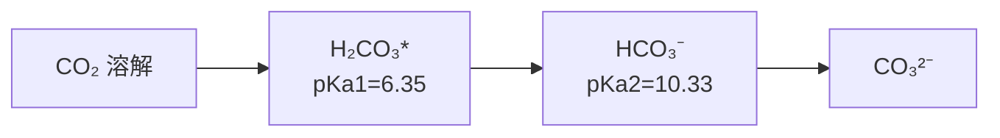

# 水化学（Water Chemistry）

## 概述

水化学（Water Chemistry）是研究天然水（Natural Water）和废水中化学组成、化学过程及其变化规律的学科。它是水环境保护、饮用水处理（Water Treatment）和污染控制（Pollution Control）的理论基础。水化学融合了无机化学、有机化学、物理化学和分析化学的原理，用于理解水体中各种物质的迁移转化行为。

天然水的化学组成受地质、气候、生物和人类活动的综合影响。从酸雨（Acid Rain）到海洋，从地下水（Groundwater）到冰川，不同水体的化学特征差异显著。掌握水化学原理对于水质评价、水处理工艺设计和环境修复至关重要。

## 水的物理化学性质

### 水的分子结构与特性

水分子（H₂O）具有独特的极性结构，氢氧键角约为 104.5°。这种结构赋予水许多特殊性质：

- **高介电常数**：促进离子溶解
- **高比热容**：4.18 kJ/(kg·K)，稳定环境温度
- **高汽化热**：2260 kJ/kg，影响蒸发过程
- **氢键网络**：决定水的液态结构和冰的密度异常

### 水的电离与 pH

水是一种两性电解质，发生自偶电离：

$$H_2O \rightleftharpoons H^+ + OH^-$$

在 25°C 时，水的离子积常数：

$$K_w = [H^+][OH^-] = 1.0 \times 10^{-14}$$

pH 的定义为：

$$pH = -\log[H^+]$$

天然水的 pH 范围通常为 6.5–8.5，受碳酸平衡、硅酸盐矿物和有机物的影响。

## 天然水化学组成

### 主要离子组成

天然水中溶解的主要离子来源于矿物风化：

| 阳离子（Cations） | 典型浓度范围（mg/L） | 主要来源 |
|-------------------|---------------------|----------|
| 钙离子 Ca²⁺ | 1–100 | 方解石、石膏溶解 |
| 镁离子 Mg²⁺ | 1–50 | 白云石、橄榄石风化 |
| 钠离子 Na⁺ | 1–100 | 岩盐、钠长石溶解 |
| 钾离子 K⁺ | 0.5–10 | 钾长石、云母风化 |

| 阴离子（Anions） | 典型浓度范围（mg/L） | 主要来源 |
|------------------|---------------------|----------|
| 碳酸氢根 HCO₃⁻ | 10–200 | 碳酸盐矿物溶解 |
| 硫酸根 SO₄²⁻ | 1–100 | 石膏溶解、硫化物氧化 |
| 氯离子 Cl⁻ | 1–100 | 岩盐溶解、大气沉降 |

### 水质指标体系

| 指标类别 | 具体指标 | 意义与常用单位 |
|----------|----------|---------------|
| 物理指标 | 浊度（Turbidity） | NTU，反映悬浮物含量 |
| 物理指标 | 色度（Color） | 铂钴色度单位 |
| 物理指标 | 电导率（EC） | μS/cm，反映总溶解固体 |
| 化学指标 | pH 值 | 无量纲，酸碱度 |
| 化学指标 | 溶解氧（DO） | mg/L，水体自净能力 |
| 化学指标 | 化学需氧量（COD） | mg/L，有机物总量 |
| 化学指标 | 生化需氧量（BOD₅） | mg/L，可生物降解有机物 |
| 化学指标 | 总溶解固体（TDS） | mg/L，矿物质总量 |
| 营养盐 | 总氮（TN） | mg/L，富营养化指标 |
| 营养盐 | 总磷（TP） | mg/L，富营养化指标 |

## 水溶液中的化学平衡

### 酸碱平衡

#### 碳酸平衡系统

碳酸系统是天然水中最重要的酸碱缓冲体系：

$$CO_2(g) + H_2O \rightleftharpoons H_2CO_3^* \rightleftharpoons H^+ + HCO_3^- \rightleftharpoons 2H^+ + CO_3^{2-}$$

其中 $H_2CO_3^*$ 表示溶解态 CO₂ 和真实碳酸的总和。碳酸的逐级解离常数：

$$K_{a1} = \frac{[H^+][HCO_3^-]}{[H_2CO_3^*]} = 4.45 \times 10^{-7} \quad (pK_{a1} = 6.35)$$

$$K_{a2} = \frac{[H^+][CO_3^{2-}]}{[HCO_3^-]} = 4.69 \times 10^{-11} \quad (pK_{a2} = 10.33)$$

### 溶解-沉淀平衡

#### 碳酸钙溶解度

碳酸钙（Calcite）的溶解平衡：

$$CaCO_3(s) \rightleftharpoons Ca^{2+} + CO_3^{2-}$$

溶度积常数：

$$K_{sp} = [Ca^{2+}][CO_3^{2-}] = 3.36 \times 10^{-9} \quad (25°C)$$

朗格利尔饱和指数（Langelier Saturation Index, LSI）用于预测碳酸钙的沉积或溶解趋势：

$$LSI = pH - pH_s$$

其中 $pH_s$ 为饱和 pH。LSI > 0 时水具有结垢倾向，LSI < 0 时具有腐蚀性。

### 氧化还原平衡

#### 氧化还原电位（ORP）

氧化还原电位（Oxidation-Reduction Potential）是衡量水体氧化还原状态的重要指标：

$$E_h = E^0 - \frac{RT}{nF} \ln Q$$

| 环境类型 | ORP 范围（mV） | 特征 |
|----------|---------------|------|
| 强氧化环境 | > +400 | 溶解氧充足 |
| 氧化环境 | +200 至 +400 | 好氧微生物活动 |
| 还原环境 | -100 至 +200 | 兼性厌氧 |
| 强还原环境 | < -200 | 厌氧发酵、产甲烷 |

#### 铁锰的氧化还原

铁和锰在水体中的形态受氧化还原条件控制：

$$Fe^{2+} \rightleftharpoons Fe^{3+} + e^- \quad E^0 = +0.77 \text{ V}$$

$$Mn^{2+} + 2H_2O \rightleftharpoons MnO_2 + 4H^+ + 2e^- \quad E^0 = +1.23 \text{ V}$$

## 水中污染物化学

### 重金属化学

重金属（Heavy Metals）在水中的迁移转化受多种因素影响：

#### 形态分布

| 形态 | 定义 | 环境行为 |
|------|------|----------|
| 溶解态 | <0.45 μm 滤膜可通过 | 迁移性强、生物可利用性高 |
| 颗粒态 | >0.45 μm | 易沉降、迁移性弱 |
| 自由离子 | 未络合的水合离子 | 毒性最强 |
| 络合态 | 与有机/无机配体结合 | 毒性降低、迁移性改变 |

#### 络合反应

天然有机物（NOM）与重金属的络合：

$$M^{n+} + L \rightleftharpoons ML^{n+}$$

络合稳定常数：

$$K_{stab} = \frac{[ML^{n+}]}{[M^{n+}][L]}$$

腐殖酸（Humic Acid）和富里酸（Fulvic Acid）是重要的天然络合剂。

### 有机污染物

#### 分类与特性

| 类别 | 代表性物质 | 来源 | 环境行为 |
|------|-----------|------|----------|
| 挥发性有机物（VOCs） | 三氯甲烷、苯系物 | 工业排放、消毒副产物 | 易挥发、迁移性强 |
| 持久性有机污染物（POPs） | DDT、二噁英、多氯联苯 | 农药、工业 | 难降解、生物富集 |
| 内分泌干扰物（EDCs） | 双酚 A、邻苯二甲酸酯 | 塑料、化妆品 | 低剂量效应 |
| 药品和个人护理品（PPCPs） | 抗生素、咖啡因 | 生活污水 | 持续输入 |
| 微塑料（Microplastics） | <5 mm 塑料颗粒 | 塑料降解 | 载体效应 |

#### 水解反应

有机污染物的水解是重要的自然衰减过程：

$$RX + H_2O \rightarrow ROH + HX$$

水解速率常数与 pH、温度有关：

$$k_{obs} = k_H[H^+] + k_N + k_{OH}[OH^-]$$

## 水质处理中的化学原理

### 混凝（Coagulation）

铝盐和铁盐作为混凝剂，通过电荷中和与网捕卷扫作用去除胶体：

$$Al^{3+} + 3H_2O \rightarrow Al(OH)_3 + 3H^+$$

### 消毒（Disinfection）

氯消毒的化学反应：

$$Cl_2 + H_2O \rightleftharpoons HOCl + H^+ + Cl^-$$

$$HOCl \rightleftharpoons H^+ + OCl^-$$

次氯酸（HOCl）是主要消毒成分，pKa = 7.5。

### 高级氧化工艺（AOPs）

羟基自由基（·OH）的产生与应用：

$$H_2O_2 + UV \rightarrow 2 \cdot OH$$

$$O_3 + H_2O_2 \rightarrow \cdot OH + O_2 + HO_2 \cdot$$

## 经典教材与标准

| 教材/标准 | 作者/机构 | 内容特点 |
|-----------|----------|----------|
| 《水环境化学》 | 陈静生 | 中国水环境化学经典教材 |
| 《环境化学》 | 戴树桂 | 环境化学基础教材 |
| *Water Chemistry* | Snoeyink & Jenkins | 国际经典水化学教材 |
| *Aquatic Chemistry* | Stumm & Morgan | 高级水生化学 |
| 《水质分析方法标准》 | 国家环保部 | 水质监测标准方法 |

## 主要应用领域

- 饮用水处理（Drinking Water Treatment）
- 污水处理（Wastewater Treatment）
- 工业废水处理
- 地下水修复（Groundwater Remediation）
- 湖泊富营养化治理
- 海水淡化（Desalination）
- 水质监测与评价

## 相关条目

- [[AirChemistry|大气化学]]
- [[WastewaterTreatment|污水处理]]
- [[Bioremediation|生物修复]]
- [[EcologicalEngineering|生态工程]]
- [[WaterQuality|水质学]]
- [[INDEX|EnvironmentalChemistry 索引]]
