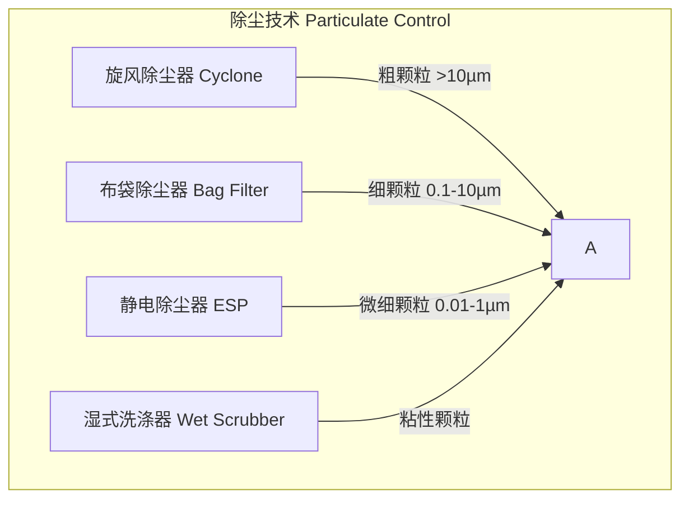

# 大气污染控制

## 概述

大气污染控制（Air Pollution Control）是研究大气污染物来源、扩散、转化规律以及控制技术与方法的工程技术学科。其目标是减少污染物排放，保护和改善大气环境质量。

## 大气污染物分类

### 主要污染物

| 污染物 | 化学式 | 主要来源 | 环境效应 |
|-------|--------|---------|---------|
| 颗粒物（PM₁₀、PM₂.₅） | — | 燃煤、工业粉尘、机动车 | 呼吸道疾病、雾霾 |
| 二氧化硫 | SO₂ | 燃煤电厂、冶炼 | 酸雨（Acid Rain） |
| 氮氧化物 | NOₓ | 汽车尾气、电厂 | 光化学烟雾、酸雨 |
| 一氧化碳 | CO | 不完全燃烧 | 血液缺氧 |
| 臭氧 | O₃ | 光化学反应 | 呼吸道刺激 |
| 挥发性有机物（VOCs） | CₓHᵧ | 涂料、化工、油品挥发 | 光化学烟雾前体物 |
| 铅及其他重金属 | Pb、Hg、As | 冶炼、电池制造 | 神经毒性 |

### 排放标准限值（中国 GB 16297 — 2014 示例）

| 污染物 | 最高允许排放浓度 (mg/m³) | 排放速率限值 (kg/h) |
|-------|------------------------|--------------------|
| SO₂ | 200 — 400 | 2.6 — 150 |
| NOₓ | 200 — 400 | 0.47 — 43 |
| 颗粒物 | 30 — 120 | 1.0 — 58 |
| 氟化物 | 3.0 — 9.0 | 0.10 — 0.91 |
| 铅及其化合物 | 0.5 — 0.7 | 0.004 — 0.28 |

## 颗粒物控制技术

### 除尘设备对比

| 设备类型 | 适用粒径 | 除尘效率 | 压降 (Pa) | 能耗 |
|---------|---------|---------|----------|------|
| 重力沉降室 | > 50 µm | 50% — 70% | 50 — 150 | 低 |
| 旋风除尘器 | > 10 µm | 85% — 95% | 500 — 1500 | 中 |
| 布袋除尘器 | > 0.1 µm | 99% — 99.9% | 1000 — 2000 | 中高 |
| 静电除尘器 | > 0.01 µm | 98% — 99.9% | 100 — 300 | 高 |
| 湿式洗涤器 | > 0.5 µm | 90% — 99% | 1500 — 5000 | 高 |

### 静电除尘器原理

静电除尘（Electrostatic Precipitation, ESP）利用高压电场使颗粒荷电，在电场力驱动下沉积于集尘极：

$$
v_d = \frac{q E}{3\pi \mu d_p}
$$

其中 $v_d$ 为驱进速度（Drift Velocity），$q$ 为颗粒荷电量，$E$ 为电场强度，$\mu$ 为气体粘度，$d_p$ 为颗粒直径。

## 气态污染物控制

### 湿法脱硫

石灰石-石膏湿法脱硫（Wet FGD, Flue Gas Desulfurization）：

$$
\text{CaCO}_3 + \text{SO}_2 + \frac{1}{2}\text{O}_2 + 2\text{H}_2\text{O} \rightarrow \text{CaSO}_4\cdot2\text{H}_2\text{O} + \text{CO}_2
$$

| 参数 | 典型值 |
|------|--------|
| 脱硫效率 | 95% — 99% |
| 液气比 (L/G) | 10 — 20 L/m³ |
| pH 值 | 5.0 — 6.0 |
| 副产物 | 脱硫石膏（CaSO₄·2H₂O） |

### 选择性催化还原脱硝

SCR（Selective Catalytic Reduction）反应：

$$
4\text{NO} + 4\text{NH}_3 + \text{O}_2 \xrightarrow{\text{催化剂}} 4\text{N}_2 + 6\text{H}_2\text{O}
$$

| 参数 | 典型值 |
|------|--------|
| 脱硝效率 | 80% — 95% |
| 反应温度 | 300 — 420°C |
| 催化剂 | V₂O₅-WO₃/TiO₂ |
| NH₃/NOₓ 摩尔比 | 0.8 — 1.0 |

### VOCs 控制技术

| 技术 | 原理 | 适用浓度 | 去除效率 | 适用范围 |
|------|------|---------|---------|---------|
| 蓄热式氧化（RTO） | 高温氧化 | 1 — 10 g/m³ | 95% — 99% | 高浓度连续排放 |
| 催化氧化（CO） | 催化剂辅助氧化 | 0.5 — 5 g/m³ | 90% — 98% | 中低浓度 |
| 活性炭吸附 | 物理吸附 | 0.1 — 5 g/m³ | 80% — 95% | 低浓度间歇 |
| 冷凝回收 | 低温冷凝 | > 10 g/m³ | 70% — 90% | 高浓度可回收 |
| 膜分离 | 选择性渗透 | 0.5 — 10 g/m³ | 85% — 99% | 有机蒸汽回收 |

## 大气扩散模型

### 高斯烟羽模型

高斯扩散（Gaussian Plume）模型是应用最广泛的大气扩散模型：

$$
C(x, y, z) = \frac{Q}{2\pi u \sigma_y \sigma_z} \exp\left(-\frac{y^2}{2\sigma_y^2}\right) \left[ \exp\left(-\frac{(z-H)^2}{2\sigma_z^2}\right) + \exp\left(-\frac{(z+H)^2}{2\sigma_z^2}\right) \right]
$$

| 符号 | 含义 | 单位 |
|------|------|------|
| $C$ | 污染物浓度 | g/m³ |
| $Q$ | 源强（排放速率） | g/s |
| $u$ | 平均风速 | m/s |
| $\sigma_y, \sigma_z$ | 水平/垂直扩散参数 | m |
| $H$ | 有效烟羽高度 | m |

### 大气稳定度分类

| Pasquill 等级 | 描述 | 日间太阳辐射 | 夜间云量 |
|--------------|------|------------|---------|
| A | 极度不稳定 | 强 | — |
| B | 中度不稳定 | 中等 | — |
| C | 轻度不稳定 | 弱 | — |
| D | 中性 | — | 阴天或大风 |
| E | 轻度稳定 | — | 少云 |
| F | 中度稳定 | — | 晴朗 |

## 排放监测

### CEMS 系统

CEMS（Continuous Emission Monitoring System）连续排放监测系统：

| 监测组分 | 常用方法 | 量程 | 精度 |
|---------|---------|------|------|
| SO₂ | 非色散红外（NDIR） | 0 — 500 ppm | ±1% FS |
| NOₓ | 化学发光法（CLD） | 0 — 250 ppm | ±1% FS |
| CO | NDIR | 0 — 1000 ppm | ±1% FS |
| O₂ | 顺磁法（PMD） | 0 — 25% | ±0.5% FS |
| 颗粒物 | 光散射/光透射 | 0 — 500 mg/m³ | ±10% |

## 室内空气质量控制

### 常见室内污染物

| 污染物 | 来源 | 健康影响 | 国家标准限值 |
|-------|------|---------|-------------|
| 甲醛（HCHO） | 板材、胶黏剂 | 致癌、呼吸道刺激 | ≤ 0.10 mg/m³ |
| 苯（C₆H₆） | 油漆、溶剂 | 白血病、贫血 | ≤ 0.11 mg/m³ |
| TVOC | 装修材料、清洁剂 | 头痛、过敏 | ≤ 0.60 mg/m³ |
| PM₂.₅ | 室外渗入、烹饪 | 心血管疾病 | ≤ 75 µg/m³ |
| CO₂ | 人体呼吸、燃烧 | 嗜睡、注意力下降 | ≤ 1000 ppm |
| 氡（Rn） | 地基土壤、石材 | 肺癌 | ≤ 200 Bq/m³ |

### 室内净化技术

| 技术 | 去除对象 | 效率 | 维护成本 |
|------|---------|------|---------|
| HEPA 过滤 | PM₂.₅、PM₁₀ | 99.97%（≥ 0.3 µm） | 中 |
| 活性炭吸附 | VOCs、异味 | 取决于碳量和接触时间 | 中（需更换） |
| 光催化氧化（PCO） | VOCs、微生物 | 60% — 95% | 低 |
| 等离子体 | 细菌、VOCs | 50% — 80% | 低 |
| UV-C 杀菌 | 病原微生物 | 99.9% | 低 |

### 新风系统设计

新风量计算：

$$
Q_v = nV
$$

其中 $n$ 为换气次数（次/h），$V$ 为房间体积（m³）。公共建筑换气次数一般取 1 — 3 次/h。

## 烟气脱白

### 湿烟羽成因与治理

湿法脱硫后排烟温度约 45 — 55°C，含饱和水蒸气，遇冷空气凝结形成白色烟羽（White Plume）。

烟气脱白技术：

| 技术方案 | 原理 | 能耗增加 | 投资成本 |
|---------|------|---------|---------|
| 烟气再热（GGH） | 间接换热升温至 75°C 以上 | 3% — 5% | 中 |
| MGGH（水媒式） | 热媒循环换热 | 2% — 4% | 中 |
| 烟气冷凝 | 降温除水后再热 | 5% — 8% | 高 |
| 膜法除湿 | 选择性透过水蒸气 | 1% — 2% | 高 |

## 碳捕集技术

### 燃烧后捕集

| 技术 | 原理 | 捕集效率 | 能耗 |
|------|------|---------|------|
| 胺法吸收（MEA） | 化学吸收-解吸 | 85% — 95% | 2.5 — 4.0 GJ/tCO₂ |
| 氨水吸收 | 化学吸收-解吸 | 90% — 99% | 2.0 — 3.5 GJ/tCO₂ |
| 膜分离 | 选择性渗透 | 75% — 90% | 1.0 — 2.5 GJ/tCO₂ |
| 钙循环（Calcium Looping） | CaO → CaCO₃ → CaO | 90% — 98% | 1.5 — 2.5 GJ/tCO₂ |
| 相变吸收剂 | 低温分相减少再热 | 90% — 95% | 1.5 — 2.5 GJ/tCO₂ |

## 参考

- de Nevers, N. (2017). *Air Pollution Control Engineering*. Waveland Press.
- 郝吉明等. (2021). 《大气污染控制工程》（第四版）. 高等教育出版社.
- US EPA. (2023). *AP-42: Compilation of Air Pollutant Emissions Factors*.
- GB 16297 — 2014. 《大气污染物综合排放标准》.
- GB/T 18883 — 2022. 《室内空气质量标准》.
- IPCC. (2022). *Carbon Dioxide Capture and Storage*.
- 中国环境保护产业协会. (2023). 《除尘脱硫脱硝技术手册》.
