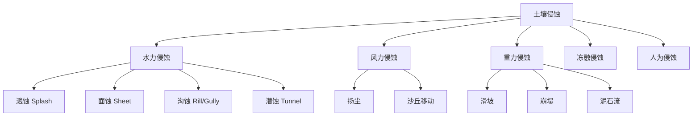
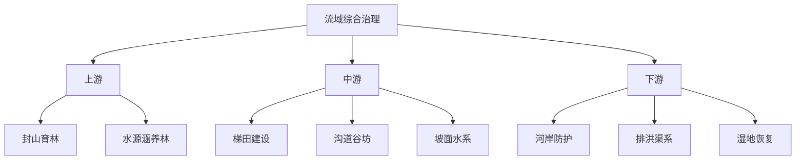

---
aliases: [SoilAndWaterConservation]
tags: ['04_EngineeringAndTechnology', 'EnvironmentalScienceAndEngineering', 'EnvironmentalEngineering', 'SoilAndWaterConservation']
created: 2026-05-17
updated: 2026-05-17
---

# 水土保持

## 一、概述
水土保持（Soil and Water Conservation）是防治水土流失、保护与合理利用水土资源的工程技术学科。它综合运用农学、林学、工程力学、水文学等多学科知识，在流域尺度上实现水土资源的可持续利用。

## 二、水土流失机理
### 2.1 土壤侵蚀类型

### 2.2 水蚀动力学
**雨滴溅蚀**：雨滴动能 $E_k$ 与雨强 $I$ 的关系：

$$
E_k = \frac{1}{2} m v_d^2
$$

其中终端速度 $v_d \propto d^{1/2}$，$d$ 为雨滴直径。
**USLE 方程**（Universal Soil Loss Equation，通用土壤流失方程）：

$$
A = R \cdot K \cdot L \cdot S \cdot C \cdot P
$$

| 因子 | 含义 | 典型范围 |
|------|------|---------|
| $A$ | 年均土壤流失量（t/ha·yr）| - |
| $R$ | 降雨侵蚀力因子 | 500-15000 (MJ·mm)/(ha·h·yr) |
| $K$ | 土壤可蚀性因子 | 0.02-0.69 (t·ha·h)/(ha·MJ·mm) |
| $L$ | 坡长因子 | 1.0（22.13 m 基准）|
| $S$ | 坡度因子 | 1.0（9% 坡度基准）|
| $C$ | 植被覆盖与管理因子 | 0.001（森林）- 1.0（裸露）|
| $P$ | 水土保持措施因子 | 0.1（梯田）- 1.0（无措施）|

**RUSLE**（Revised USLE）改进了各因子的算法精度，加入了季节变化和侵蚀沉积过程。

### 2.3 土壤侵蚀过程
侵蚀的全过程分为四个子过程：
1. **分离（Detachment）**：雨滴击溅和径流冲刷使土粒脱离土体
2. **输移（Transport）**：径流挟带土粒沿坡面运动
3. **沉积（Deposition）**：输移能力下降时土粒沉降
4. **搬运（Export）**：泥沙进入河道系统
临界剪切应力（Critical Shear Stress）$\tau_c$ 是土壤抵抗径流侵蚀的阈值：

$$
\tau = \rho g h S_f > \tau_c \quad \rightarrow \quad \text{侵蚀发生}
$$

其中 $\tau$ 为径流剪切应力，$\rho$ 为水的密度，$h$ 为水深，$S_f$ 为水力坡度。

## 三、土壤保持措施
### 3.1 工程措施

| 措施 | 类型 | 原理 | 适用条件 |
|------|------|------|---------|
| 梯田（Terrace）| 坡面改造 | 降低坡度，缩短坡长 | 坡耕地 5-25° |
| 水平沟 | 截流蓄水 | 拦截坡面径流 | 陡坡造林 |
| 鱼鳞坑 | 整地 | 局部蓄水保土 | 干旱山地造林 |
| 谷坊（Check Dam）| 沟道治理 | 抬高侵蚀基准面 | 切沟、冲沟 |
| 淤地坝 | 沟道拦蓄 | 拦泥淤地 | 黄土高原 |
| 护坡（Riprap）| 坡面防护 | 块石覆盖防冲刷 | 道路边坡、河岸 |

### 3.2 生物措施
植被覆盖率 $C$ 与土壤流失率的关系：

$$
A_{\text{cover}} = A_{\text{bare}} \times e^{-k \cdot \text{VCF}}
$$

其中 VCF（Vegetation Cover Fraction）为植被覆盖度。
**植物篱（Hedgerow）**：等高种植灌木带，带宽 1-2 m，间距依坡度而定，减缓流速、拦截泥沙、增加入渗。
**退耕还林（Grassland Restoration）**：在坡度 > 25° 的耕地上实施自然恢复或人工造林，是中国最重要的水土保持国策。

### 3.3 耕作措施

| 措施 | 描述 | 保土效率 |
|------|------|---------|
| 等高耕作（Contour Farming）| 沿等高线耕作 | 30-50% |
| 沟垄耕作（Ridge Tillage）| 起垄种植 | 40-60% |
| 免耕（No-Tillage）| 不翻耕，残留物覆盖 | 60-90% |
| 覆盖作物（Cover Crop）| 非主季种植覆盖 | 50-80% |
| 带状间作（Strip Cropping）| 条带交替种植 | 40-70% |

## 四、流域综合治理
### 4.1 小流域综合治理
以流域为单元，工程、生物、耕作措施相结合，山、水、林、田、路统一规划。

### 4.2 治理评价指标

| 指标 | 公式 | 含义 |
|------|------|------|
| 土壤流失率 | $SL = \frac{A}{A_0} \times 100\%$ | 治理后/治理前流失比 |
| 泥沙拦截率 | $TE = \frac{W_{\text{in}} - W_{\text{out}}}{W_{\text{in}}}$ | 流域出口减沙效率 |
| 径流减少率 | $RR = \frac{Q_0 - Q}{Q_0}$ | 洪峰削减效果 |
| 植被覆盖度 | $VCF = \frac{A_{\text{green}}}{A_{\text{total}}}$ | 生态系统恢复程度 |
| 土壤有机质增量 | $\Delta SOM = SOM_{\text{after}} - SOM_{\text{before}}$ | 土壤质量改善 |

## 五、水资源保护
### 5.1 面源污染控制
水土流失是面源污染（Non-Point Source Pollution）的主要载体。氮磷等营养物随泥沙迁移进入水体。
**SWAT 模型**（Soil and Water Assessment Tool）是流域面源污染模拟的标准工具，可模拟：
- 水文过程：蒸散发、入渗、地表径流、地下水
- 侵蚀过程：USLE 方程计算产沙
- 污染物输移：N、P、农药随径流和泥沙的迁移

### 5.2 水源涵养
水源涵养能力（Water Conservation Capacity）$W$：

$$
W = P - ET - R_s
$$

其中 $P$ 为降水量，$ET$ 为蒸散发量，$R_s$ 为地表径流（补充的地下水部分）。
森林的水源涵养功能：林冠截留（Interception）10-30%，枯落物持水（Litter Water Holding）200-400%，土壤蓄水（Soil Water Storage）在根系层可达 2000-3000 m$^3$/ha。

## 六、水土保持规划
### 6.1 规划原则
- 因地制宜，分区治理
- 综合治理（综合措施 > 单项措施效益之和 × 协同因子）
- 生态效益与经济效益相结合
- 预防为主，防治结合

### 6.2 中国水土保持区划
中国分为 8 个水土保持一级区：
1. 东北黑土区——沟蚀防治
2. 北方风沙区——风蚀防治
3. 黄土高原区——沟道治理（最重点区域）
4. 北方土石山区——坡面治理
5. 南方红壤区——崩岗治理
6. 西南紫色土区——坡耕地整治
7. 青藏高原区——冻融侵蚀防治
8. 云贵高原区——石漠化治理

## 七、土壤侵蚀监测

| 方法 | 设备/技术 | 精度 | 成本 |
|------|----------|------|------|
| 径流小区 | 标准侵蚀小区 | 高 | 中 |
| 侵蚀针法 | 金属钉/量尺 | 中 | 低 |
| $^{137}$Cs 示踪 | 放射性同位素 | 十年尺度 | 高 |
| 遥感监测 | 高分影像、LiDAR | 区域尺度 | 中 |
| UAV 航测 | 无人机摄影测量 | 高分辨率 | 中 |

## 八、水土保持效益评价
### 8.1 生态效益
水土保持的生态效益包括：
- 减少土壤流失：泥沙减少率 60-95%
- 提高土壤有机质：每年增加 0.1-0.5 g/kg
- 改善土壤结构：孔隙度增加 5-15%
- 增加生物多样性：物种数恢复至自然水平的 60-80%
- 改善水质：N、P 面源输出减少 40-70%

### 8.2 经济效益
水土保持投入产出比通常为 1:2 至 1:5（中国黄土高原典型值）。

| 效益类型 | 量化指标 | 年值（元/ha）|
|---------|---------|-------------|
| 增产效益 | 粮食/果品增产 | 2000-8000 |
| 减沙效益 | 水库清淤节省 | 500-2000 |
| 水源涵养 | 增加水资源量 | 1000-3000 |
| 固碳效益 | 土壤/植被固碳 | 300-800 |
| 防灾减灾 | 减少洪涝损失 | 500-1500 |

### 8.3 社会效益
- 改善农村饮水和生产条件
- 减少下游洪灾威胁
- 促进土地利用结构优化
- 推动生态旅游和乡村发展

## 九、全球土壤侵蚀现状
根据 FAO 和 UNEP 的全球评估：
- 全球约 33% 的土地受到中度至重度侵蚀
- 年均土壤流失量约 750 亿吨
- 耕地土壤流失速率（平均 10-40 t/ha·yr）远超土壤形成速率（0.1-2 t/ha·yr）
- 中国水土流失面积约 270 万 km$^2$（约占国土面积 28%）
重点区域：
1. **黄土高原**：中国最严重的水土流失区，年输沙量曾达 16 亿吨/年（黄河三门峡站），经过 70 年治理目前减少至 2-3 亿吨/年
2. **东北黑土区**：黑土层厚度从开垦初期的 60-80 cm 减薄至 20-40 cm
3. **南方红壤区**：崩岗侵蚀（Gully Erosion）危害严重
4. **非洲 Sahel 地区**：沙漠化 + 水蚀的叠加作用
5. **亚马逊流域**：森林砍伐后水土流失急剧增加

## 十、气候变化对水土流失的影响
- 极端降水强度增加 5-15%/°C（Clausius-Clapeyron 关系）
- 土壤水分变化影响产流机制
- 季节降雨变化影响植被覆盖
- 干旱-洪水交替加剧沟蚀
适应策略：加设排洪设施、改变种植制度、增加工程措施设防标准。

## 八、相关政策法规
- 《中华人民共和国水土保持法》（1991 年颁布，2010 年修订）
- 《全国水土保持规划（2015-2030 年）》
- "三同时制度"：水土保持设施与主体工程同时设计、同时施工、同时投产使用
- 生产建设项目水土保持方案审批制度

## 十一、水土保持监测实例
### 中国黄土高原治理
黄土高原是世界水土流失最严重的地区之一。黄河年输沙量曾达 16 亿吨（三门峡站，1930-1960 年代平均）。
治理措施与效果：

| 措施 | 规模（至 2020 年）| 效果 |
|------|------------------|------|
| 退耕还林还草 | 约 400 万 ha | 植被覆盖度从 31% 升至 65% |
| 梯田建设 | 约 500 万 ha | 坡耕地减少 70% |
| 淤地坝 | > 10 万座 | 拦泥约 200 亿吨 |
| 封山育林 | 持续 | 自然恢复面积 200 万 ha |

黄河年输沙量已降至约 2-3 亿吨/年（减沙 80-85%），入黄泥沙大幅减少。

## 十二、水土保持工程的未来方向
- **基于自然的解决方案（NbS, Nature-based Solutions）**：利用生态系统服务功能实现水土保持
- **精准水土保持**：遥感+GIS+AI 优化治理措施的空间布局
- **生态补偿机制**：通过财政转移支付激励上游保护
- **气候变化适应性**：增强型水土保持措施应对极端气象

相关国际倡议：联合国可持续发展目标 SDG 15（陆地生态系统）、联合国防治荒漠化公约（UNCCD）、IPCC 土地利用报告。

## 十三、总结
水土保持是人类应对土地退化和水资源短缺的重要技术手段。从 USLE 的科学评估到梯田和植被恢复的工程实践，从黄土高原的成功治理到气候变化的适应性管理，水土保持始终处于生态保护的前沿。中国的水土流失面积已从高峰期大幅减少，但治理任务依然艰巨。水土保持工作需要工程、生物、农业和管理措施的综合运用。

## 相关条目
- [[04_EngineeringAndTechnology/EnvironmentalScienceAndEngineering/EnvironmentalEngineering/INDEX|当前目录索引]]
- [[04_EngineeringAndTechnology/EnvironmentalScienceAndEngineering/EnvironmentalChemistry/AtmosphericChemistry|AtmosphericChemistry]]

