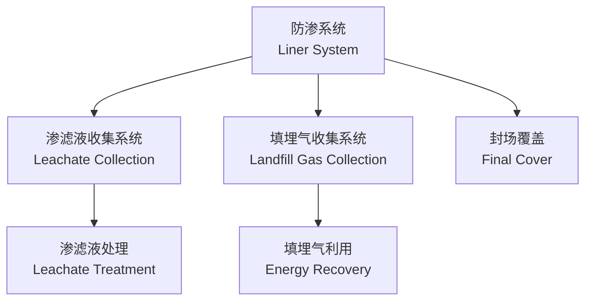

# 固体废物管理 (Solid Waste Management)

## 概述

固体废物管理 (Solid Waste Management) 是研究固体废物的产生、收集、运输、处理、处置及资源化利用全过程的综合性学科。其核心目标是实现固体废物的减量化 (Reduce)、资源化 (Reuse/Recycle) 和无害化 (Harmless)，即"三化"原则。随着城市化进程加快和"无废城市"建设的推进，固体废物管理已成为环境工程领域的重要分支。

根据《中华人民共和国固体废物污染环境防治法》，固体废物是指在生产、生活和其他活动中产生的丧失原有利用价值或者虽未丧失利用价值但被抛弃或者放弃的固态、半固态和置于容器中的气态物品、物质。

## 固体废物分类 (Waste Classification)

### 按来源分类

| 类别 | 英文 | 主要来源 | 典型组分 |
|------|------|---------|---------|
| 生活垃圾 | Municipal Solid Waste (MSW) | 居民生活、商业活动 | 厨余、塑料、纸张、玻璃 |
| 工业固废 | Industrial Solid Waste | 工业生产过程 | 矿渣、粉煤灰、炉渣 |
| 农业固废 | Agricultural Waste | 农业生产 | 秸秆、畜禽粪便、农膜 |
| 危险废物 | Hazardous Waste | 工业、医疗、科研 | 重金属污泥、废酸废碱、医疗废物 |
| 建筑垃圾 | Construction & Demolition Waste | 建筑施工、拆除 | 混凝土块、砖瓦、废钢筋 |
| 电子废物 | E-waste | 废弃电子产品 | 电路板、电池、显示器 |

### 按性质分类

- **有机废物 (Organic Waste)**：厨余、园林废物、秸秆等，可生物降解
- **无机废物 (Inorganic Waste)**：玻璃、陶瓷、金属等，难以生物降解
- **可燃废物 (Combustible Waste)**：纸张、塑料、织物等，热值较高
- **不可燃废物 (Non-combustible Waste)**：玻璃、金属、灰渣等
- **可回收废物 (Recyclable Waste)**：纸张、金属、塑料、玻璃等可循环利用物质

## 固体废物收运系统 (Collection & Transportation)

### 收集系统

**收集方式**：
- **定点收集**：垃圾桶、垃圾箱定点放置
- **定时收集**：垃圾车按固定时间路线收集
- **分类收集**：按照可回收物、有害垃圾、厨余垃圾、其他垃圾四分类标准收集

### 运输系统

| 运输方式 | 适用距离 | 特点 | 设备 |
|---------|---------|------|------|
| 公路运输 | <50 km | 灵活机动 | 压缩式垃圾车、勾臂车 |
| 铁路运输 | 50~500 km | 大运量、低成本 | 集装箱列车 |
| 水路运输 | >100 km | 适合沿江沿海城市 | 垃圾驳船 |

**转运站设计参数**：
- 服务半径：城市道路 0.7~1.0 km，农村地区适当扩大
- 转运效率：大型转运站日转运能力可达 1000 t 以上
- 环境影响：需配备除臭、渗滤液收集、噪声控制设施

## 预处理技术 (Pretreatment)

### 压实 (Compaction)

压实通过机械力减小固体废物的体积，提高运输效率。

$$\text{压缩比} = \frac{V_i}{V_f}$$

其中 $V_i$ 为压实前体积，$V_f$ 为压实后体积。生活垃圾压缩比通常为 3~5。

### 破碎 (Crushing / Shredding)

- **剪切破碎**：适用于塑料、橡胶、织物
- **冲击破碎**：适用于脆性材料如玻璃、陶瓷
- **颚式破碎**：适用于建筑垃圾中的混凝土块

### 分选 (Separation)

| 分选方法 | 原理 | 适用物料 |
|---------|------|---------|
| 磁选 | 磁力差异 | 铁磁性金属 |
| 涡电流分选 | 电磁感应 | 铝、铜等非铁金属 |
| 风选 | 密度与空气动力学差异 | 轻质塑料、纸张与重质物质 |
| 光电分选 | 光学特性差异 | 不同颜色塑料、玻璃 |
| 重介质分选 | 密度差异 | 金属与非金属分离 |

## 生物处理技术 (Biological Treatment)

### 好氧堆肥 (Aerobic Composting)

好氧堆肥是在有氧条件下，利用好氧微生物分解有机物的生物化学过程。

**工艺参数**：
- 碳氮比 (C/N)：25~35:1
- 含水率：50~60%
- 温度：55~65°C（高温期维持 3~5 天以杀灭病原菌）
- 氧气浓度：>10%
- 堆肥周期：20~30 天（主发酵），后熟 20~30 天

**堆肥产品质量指标**：
- 有机质含量：>20%（干基）
- 总养分 (N+P₂O₅+K₂O)：>3%
- 种子发芽指数 (GI)：>70%

### 厌氧消化 (Anaerobic Digestion)

厌氧消化是在无氧条件下，通过厌氧微生物将有机物转化为沼气的过程。

**三阶段理论**：
1. **水解阶段**：大分子有机物水解为小分子
2. **产酸阶段**：产酸菌将水解产物转化为挥发性脂肪酸 (VFA)
3. **产甲烷阶段**：产甲烷菌将 VFA 转化为 CH₄ 和 CO₂

**沼气产量估算**：

$$Q = \eta \cdot m \cdot Y$$

其中 $Q$ 为沼气产量 (m³/d)，$\eta$ 为有机物降解率，$m$ 为进料量 (kg/d)，$Y$ 为单位有机物产气量 (m³/kg VS)。

## 热处理技术 (Thermal Treatment)

### 焚烧 (Incineration)

焚烧是将固体废物在高温下氧化分解的处理方法，同时可回收热能。

**焚烧炉型**：

| 炉型 | 英文 | 特点 | 适用范围 |
|------|------|------|---------|
| 机械炉排炉 | Mechanical Grate | 技术成熟、运行稳定 | 大规模生活垃圾处理 |
| 流化床焚烧炉 | Fluidized Bed | 燃烧效率高、炉渣热酌减率低 | 低热值垃圾、污泥 |
| 回转窑 | Rotary Kiln | 适应性强、可处理危险废物 | 工业固废、医废 |
| 热解气化 | Pyrolysis/Gasification | 缺氧热分解，产生燃气 | 高有机质废物 |

**焚烧烟气净化系统**：
- **脱酸**：半干法喷雾脱酸、干法石灰喷射
- **除尘**：布袋除尘器、电除尘器
- **脱硝**：选择性非催化还原 (SNCR)、选择性催化还原 (SCR)
- **二噁英控制**："3T+E"原则（温度 Temperature、时间 Time、湍流 Turbulence、过量空气 Excess Air）

### 热解与气化 (Pyrolysis & Gasification)

热解是在缺氧条件下有机物热分解的过程，产物包括：
- 热解气（可燃气体）
- 热解油（液体燃料）
- 炭黑（固体残渣）

## 填埋处置 (Landfilling)

### 卫生填埋场设计

卫生填埋场是采用工程措施防止环境污染的固体废物最终处置方法。

**填埋场主要系统**：

**防渗系统**：
- 单层防渗：HDPE 土工膜 (厚度 1.5~2.0 mm) + 压实粘土层
- 双层防渗：主防渗层 + 渗漏检测层 + 次防渗层（适用于危险废物填埋）

### 渗滤液处理

渗滤液成分复杂，COD 可达 10000~50000 mg/L。

| BOD₅/COD 比值 | 处理工艺路线 | 特点 |
|-------------|------------|------|
| >0.3 | 生物处理 + 深度处理 | 可生化性好 |
| 0.1~0.3 | 预处理 + 生物处理 + 深度处理 | 可生化性一般 |
| <0.1 | 物化预处理 + 高级氧化 + 膜处理 | 难降解有机物多 |

**深度处理技术**：纳滤 (NF)、反渗透 (RO)、碟管式反渗透 (DTRO)

### 填埋气利用

填埋气主要成分为 CH₄ (50~60%) 和 CO₂ (40~50%)，具有较高的温室效应（CH₄ 的 GWP 是 CO₂ 的 28 倍）。

**利用方式**：
- 直接燃烧发电
- 提纯制取天然气（车用燃气）
- 锅炉燃料

## 资源化利用 (Resource Recovery)

### 物质回收

| 回收物质 | 回收技术 | 再生产品 |
|---------|---------|---------|
| 废纸 | 脱墨、制浆 | 再生纸、纸板 |
| 废塑料 | 分选、熔融造粒 | 再生塑料制品 |
| 废金属 | 磁选、涡电流、熔炼 | 再生金属锭 |
| 废玻璃 | 破碎、清洗、熔融 | 再生玻璃、建筑材料 |
| 电子废物 | 拆解、湿法冶金、火法冶金 | 稀贵金属回收 |

### 能量回收

- **垃圾焚烧发电**：每吨垃圾发电 250~400 kWh
- **填埋气发电**：吨垃圾产气 100~200 m³，可发电 150~250 kWh
- ** RDF (Refuse-Derived Fuel)**：垃圾衍生燃料，替代水泥窑燃煤

## 危险废物管理 (Hazardous Waste Management)

### 危险废物鉴别

根据《国家危险废物名录》，危险废物具有以下特性之一：
- 腐蚀性 (Corrosivity)
- 毒性 (Toxicity)
- 易燃性 (Ignitability)
- 反应性 (Reactivity)
- 感染性 (Infectivity)

### 处置技术

| 技术 | 适用废物 | 特点 |
|------|---------|------|
| 焚烧 | 有机危废、医废 | 高温破坏有机物 |
| 稳定化/固化 | 重金属污泥 | 水泥固化、化学稳定 |
| 安全填埋 | 固化后残渣 | 刚性填埋、柔性填埋 |
| 物化处理 | 废酸废碱 | 中和、氧化还原 |

## 政策法规与标准

- 《固体废物污染环境防治法》
- 《生活垃圾分类制度实施方案》
- GB 18485《生活垃圾焚烧污染控制标准》
- GB 16889《生活垃圾填埋场污染控制标准》
- GB 18597《危险废物贮存污染控制标准》

## 经典教材

- 宁平《固体废物处理与处置》
- 张益《固体废物处理与处置》
- Tchobanoglous《Integrated Solid Waste Management》
- 聂永丰《固体废物处理工程技术手册》

## 相关条目

- [[WastewaterTreatment]]
- [[AirPollutionControl]]
- [[EnvironmentalEngineering]]
- [[CircularEconomy]]
- [[INDEX|EnvironmentalScienceAndEngineering 索引]]
