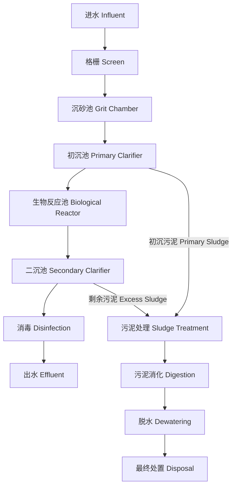
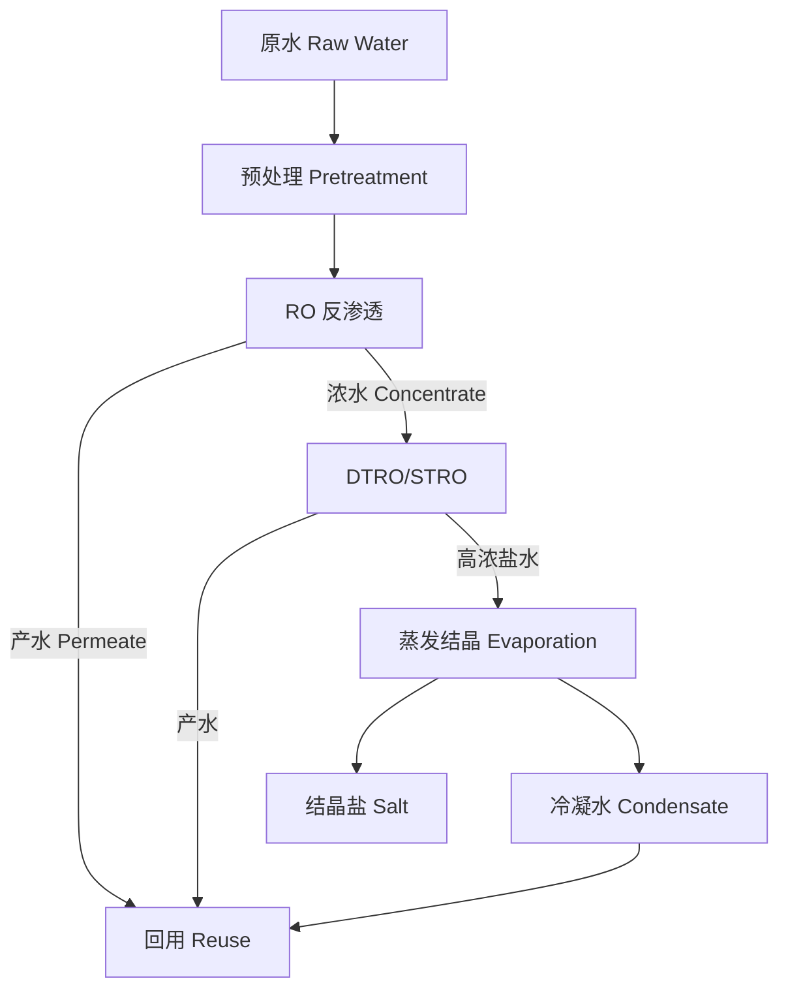

# 废水处理

## 概述

废水处理（Wastewater Treatment）是利用物理、化学和生物方法去除废水中的污染物，使其达到排放标准或回用要求的技术过程。涉及生活污水、工业废水和雨水的收集与处理。

## 废水水质指标

### 主要污染指标

| 指标 | 定义 | 单位 | 典型生活污水浓度 |
|------|------|------|----------------|
| BOD₅ | 五日生化需氧量（Biochemical Oxygen Demand） | mg/L | 100 — 400 |
| COD | 化学需氧量（Chemical Oxygen Demand） | mg/L | 200 — 800 |
| SS | 悬浮固体（Suspended Solids） | mg/L | 150 — 400 |
| TN | 总氮（Total Nitrogen） | mg/L | 20 — 80 |
| TP | 总磷（Total Phosphorus） | mg/L | 5 — 15 |
| NH₃-N | 氨氮（Ammonia Nitrogen） | mg/L | 15 — 50 |
| pH | 酸碱度 | — | 6.5 — 8.5 |
| TDS | 总溶解固体（Total Dissolved Solids） | mg/L | 300 — 800 |

### 排放标准限值

| 污染物 | 一级 A 标准 | 一级 B 标准 | 二级标准 |
|-------|-----------|-----------|---------|
| COD ≤ | 50 mg/L | 60 mg/L | 100 mg/L |
| BOD₅ ≤ | 10 mg/L | 20 mg/L | 30 mg/L |
| SS ≤ | 10 mg/L | 20 mg/L | 30 mg/L |
| TN ≤ | 15 mg/L | 20 mg/L | — |
| TP ≤ | 0.5 mg/L | 1.0 mg/L | 3.0 mg/L |
| NH₃-N ≤ | 5 (8) mg/L | 8 (15) mg/L | 25 (30) mg/L |

## 处理工艺流程

### 典型城市污水处理

## 物理处理

### 固液分离

| 工艺 | 原理 | 去除目标 | 去除率 |
|------|------|---------|--------|
| 格栅（Screen） | 截留大块杂物 | 漂浮物、粗大固体 | — |
| 沉砂池（Grit Chamber） | 重力沉降 | 砂粒、煤渣 | 80% — 95% |
| 初沉池（Primary Clarifier） | 自由沉淀 | SS、部分 BOD | SS 50% — 70% |
| 气浮（DAF） | 微气泡附着 | 油脂、轻质颗粒 | 80% — 95% |
| 过滤（Filtration） | 介质截留 | 微细 SS | 60% — 90% |

沉淀速度由 Stokes 定律描述：

$$
v_s = \frac{(\rho_p - \rho_f)g d_p^2}{18\mu}
$$

## 生物处理

### 活性污泥法

活性污泥法（Activated Sludge Process）是好氧生物处理的核心工艺：

有机底物降解动力学（Monod 方程）：

$$
\mu = \mu_{\max} \frac{S}{K_s + S}
$$

| 工艺变型 | F/M 比 (kg/kg·d) | 泥龄 SRT (d) | 剩余污泥产量 | 适用场景 |
|---------|-----------------|-------------|------------|---------|
| 传统活性污泥 | 0.2 — 0.4 | 5 — 10 | 高 | 一般城市污水 |
| SBR | 0.1 — 0.3 | 10 — 20 | 中 | 小型污水厂 |
| MBR | 0.05 — 0.2 | 20 — 40 | 低 | 高标准出水 |
| MBBR | 0.2 — 0.5 | 5 — 15 | 中 | 提标改造 |

### 生物脱氮除磷

硝化反应（Nitrification）：

$$
\text{NH}_4^+ + 1.5\text{O}_2 \xrightarrow{\text{AOB}} \text{NO}_2^- + 2\text{H}^+ + \text{H}_2\text{O}
$$

$$
\text{NO}_2^- + 0.5\text{O}_2 \xrightarrow{\text{NOB}} \text{NO}_3^-
$$

反硝化反应（Denitrification）：

$$
\text{NO}_3^- + 1.25\text{CH}_3\text{OH} \xrightarrow{\text{异养菌}} 0.5\text{N}_2 + 1.25\text{CO}_2 + 0.25\text{H}_2\text{O} + \text{OH}^-
$$

| 生物反应池分区 | 环境条件 | 功能 | DO 控制 |
|--------------|---------|------|---------|
| 厌氧区 Anaerobic | 无 O₂、无 NO₃⁻ | 聚磷菌释磷 | — |
| 缺氧区 Anoxic | 无 O₂、有 NO₃⁻ | 反硝化脱氮 | — |
| 好氧区 Aerobic | 有 O₂ | COD 降解、硝化、吸磷 | 2 — 4 mg/L |

## 深度处理

### 混凝与絮凝

混凝剂的水解反应（以 Al₂(SO₄)₃ 为例）：

$$
\text{Al}^{3+} + 3\text{HCO}_3^- \rightarrow \text{Al(OH)}_3 + 3\text{CO}_2
$$

| 混凝剂 | 最佳 pH 范围 | 适用条件 | 投加量 |
|--------|------------|---------|--------|
| Al₂(SO₄)₃ | 5.5 — 7.5 | 浊度去除 | 10 — 50 mg/L |
| PAC（聚合氯化铝） | 6.0 — 8.5 | 低温低浊 | 5 — 30 mg/L |
| FeCl₃ | 5.0 — 8.0 | 色度去除 | 10 — 40 mg/L |
| PAM（聚丙烯酰胺） | 6.0 — 9.0 | 助凝剂 | 0.1 — 1.0 mg/L |

### 消毒

| 消毒方法 | 灭活机理 | CT 值 (mg·min/L) | 副产物 |
|---------|---------|-----------------|--------|
| 氯消毒（Chlorine） | 氧化破坏细胞壁 | 30 — 60（游离氯） | THMs、HAAs |
| 臭氧（O₃） | 强氧化分解 | 1 — 5 | 溴酸盐 |
| UV 消毒 | DNA 损伤 | 40 — 80 mJ/cm² | 无 |
| 氯胺（Chloramine） | 缓慢渗透 | 100 — 500 | 亚硝酸盐 |

## 膜处理技术

### 膜分类

| 膜类型 | 孔径 | 操作压力 | 截留物质 | 典型通量 |
|-------|------|---------|---------|---------|
| MF（微滤） | 0.1 — 10 µm | 0.1 — 2 bar | SS、细菌 | 50 — 200 L/m²·h |
| UF（超滤） | 0.01 — 0.1 µm | 1 — 5 bar | 病毒、大分子 | 30 — 100 L/m²·h |
| NF（纳滤） | 0.001 — 0.01 µm | 5 — 15 bar | 二价盐、小分子 | 10 — 30 L/m²·h |
| RO（反渗透） | < 0.001 µm | 10 — 70 bar | 几乎所有溶解物 | 5 — 20 L/m²·h |

### MBR 工艺

膜生物反应器（Membrane Bioreactor, MBR）结合了活性污泥法与膜分离：

$$
J = \frac{\Delta P}{\mu(R_m + R_c + R_f)}
$$

其中 $J$ 为膜通量，$\Delta P$ 为跨膜压力（TMP），$R_m$ 为膜固有阻力，$R_c$ 为滤饼层阻力，$R_f$ 为污染阻力。

## 污泥处理

### 处理流程

| 工艺 | 目的 | 效果 |
|------|------|------|
| 浓缩（Thickening） | 减少体积 | 含水率 97% → 95% |
| 厌氧消化（Anaerobic Digestion） | 稳定化、产甲烷 | VS 降低 40% — 60% |
| 脱水（Dewatering） | 进一步减容 | 含水率 95% → 75% — 80% |
| 干化（Drying） | 深度干化 | 含水率 → < 10% |
| 焚烧（Incineration） | 彻底处置 | 减量 > 90% |

## 高级氧化技术

### Fenton 氧化

Fenton 反应利用 Fe²⁺ 催化 H₂O₂ 产生强氧化性 ·OH：

$$
\text{Fe}^{2+} + \text{H}_2\text{O}_2 \rightarrow \text{Fe}^{3+} + \text{OH}^- + \cdot\text{OH}
$$

$$
\text{Fe}^{3+} + \text{H}_2\text{O}_2 \rightarrow \text{Fe}^{2+} + \text{HO}_2\cdot + \text{H}^+
$$

| 参数 | 传统 Fenton | 电-Fenton | 非均相 Fenton |
|------|-----------|----------|-------------|
| pH 范围 | 2.5 — 3.5 | 2.5 — 3.5 | 3 — 9 |
| H₂O₂/COD 比 | 1 — 3 | 0.5 — 1.5 | 0.5 — 2 |
| COD 去除率 | 60% — 90% | 70% — 95% | 50% — 85% |
| 铁泥产生量 | 高 | 低 | 中 |

### 臭氧氧化

O₃ 直接氧化与 ·OH 间接氧化联合作用：

$$
O_3 + \text{OH}^- \rightarrow HO_2^- + O_2
$$

$$
O_3 + HO_2^- \rightarrow \cdot\text{OH} + O_2^- + O_2
$$

臭氧高级氧化组合工艺：

| 工艺 | 特点 | 适用废水 | 去除效果 |
|------|------|---------|---------|
| O₃/H₂O₂ | 促进 ·OH 生成 | 工业废水 | COD 去除 50% — 80% |
| O₃/UV | 光解 O₃ 产 ·OH | 难降解有机物 | TOC 去除 60% — 90% |
| O₃/催化 | 催化剂强化传质 | 制药、印染废水 | COD 去除 60% — 85% |

## 工业废水处理

### 典型行业废水

| 行业 | 主要污染物 | 处理工艺路线 | 出水标准 |
|------|-----------|------------|---------|
| 印染（Textile Dyeing） | 色度、COD、表面活性剂 | 混凝+水解酸化+A/O+MBR | 回用或一级 A |
| 造纸（Pulp & Paper） | COD、SS、AOX | 沉淀+厌氧+好氧+Fenton | 制浆造纸排放标准 |
| 制药（Pharmaceutical） | 抗生素、溶剂残留 | 微电解+水解酸化+O₃+MBR | 发酵类制药标准 |
| 电镀（Electroplating） | 重金属（Cr⁶⁺、Ni、Cu） | 化学沉淀+离子交换+RO | 电镀排放标准 |
| 食品加工（Food Processing） | 油脂、COD、氨氮 | 隔油+气浮+A/O+消毒 | 三级标准或回用 |

### 零排放工艺

近零排放（Near Zero Liquid Discharge, NZLD）工艺路线：

## 雨水管理

### 海绵城市技术

| 技术 | 功能 | 径流削减率 | 建设成本 |
|------|------|-----------|---------|
| 雨水花园（Rain Garden） | 渗透、净化 | 50% — 80% | 低 |
| 绿色屋顶（Green Roof） | 截留、蒸发 | 40% — 70% | 中 |
| 透水铺装（Permeable Pavement） | 下渗 | 60% — 90% | 中 |
| 下沉绿地（Sunken Green Space） | 滞蓄、渗透 | 70% — 95% | 低 |
| 蓄水池（Rainwater Tank） | 收集回用 | 30% — 60% | 中高 |

## 参考

- Metcalf & Eddy. (2014). *Wastewater Engineering: Treatment and Resource Recovery*. McGraw-Hill.
- 张自杰等. (2022). 《排水工程》（第四版）. 中国建筑工业出版社.
- GB 18918 — 2002. 《城镇污水处理厂污染物排放标准》.
- Tchobanoglous, G., et al. (2015). *Membrane Bioreactors for Wastewater Treatment*. IWA Publishing.
- 任南琪等. (2019). 《废水生物处理原理》. 哈尔滨工业大学出版社.
- US EPA. (2023). *Guidelines for Water Reuse*.
- GB/T 51345 — 2018. 《海绵城市建设评价标准》.
