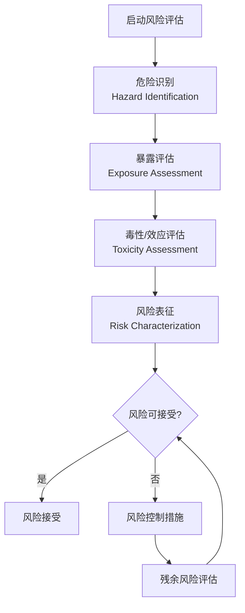
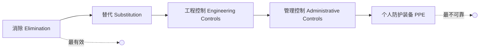

# 风险评估 (Risk Assessment)

## 定义

风险评估是识别、分析和评价系统或活动中潜在风险，并制定控制措施的系统化过程。其核心目标是通过科学方法量化风险，为风险管理决策提供依据。

## 核心内容

### 风险基本概念

**风险 (Risk)** 的定义：危险事件发生的可能性与后果严重程度的组合。

$$
R = P \times C
$$

其中 $R$ 为风险值，$P$ 为事故发生率，$C$ 为后果严重度。

**风险三要素**：危害 (Hazard)、暴露 (Exposure)、后果 (Consequence)。

### 风险评估框架

### 危险识别 (Hazard Identification)

**系统安全性分析方法**：

| 方法 | 英文 | 特点 | 适用阶段 |
|------|------|------|---------|
| 安全检查表 | SCL | 预先列出检查项目 | 设计/运行 |
| 危险与可操作性分析 | HAZOP | 引导词+偏差分析 | 工艺设计 |
| 故障模式与影响分析 | FMEA | 单点故障分析 | 设备/组件 |
| 故障树分析 | FTA | 演绎推理，自上而下 | 复杂系统 |
| 事件树分析 | ETA | 归纳推理，自下而上 | 事故序列 |
| 预先危险性分析 | PHA | 初步识别主要危险 | 概念设计 |
| 作业危害分析 | JHA | 分步骤分析作业风险 | 操作程序 |

### 暴露评估 (Exposure Assessment)

**暴露途径**：吸入 (Inhalation)、经口摄入 (Ingestion)、皮肤接触 (Dermal Contact)。

**暴露剂量计算**：

**吸入暴露**：

$$
ADD_{inh} = \frac{C_{air} \times IR \times EF \times ED}{BW \times AT}
$$

**经口暴露**：

$$
ADD_{oral} = \frac{C_{soil} \times IR_s \times EF \times ED \times CF}{BW \times AT}
$$

其中 $ADD$ 为日均暴露剂量 (Average Daily Dose)，$IR$ 为摄入速率，$EF$ 为暴露频率，$ED$ 为暴露持续时间，$BW$ 为体重，$AT$ 为平均时间。

### 毒性/效应评估 (Toxicity Assessment)

**剂量-效应关系 (Dose-Response Relationship)**：

**非致癌物**——参考剂量 (Reference Dose, RfD)：

$$
RfD = \frac{NOAEL \text{ 或 } LOAEL}{UF}
$$

其中 $NOAEL$ 为未观察到有害作用的剂量，$LOAEL$ 为观察到有害作用的最低剂量，$UF$ 为不确定性因子。

**致癌物**——致癌斜率因子 (Cancer Slope Factor, CSF)：

$$
Risk = ADD \times CSF
$$

### 风险表征 (Risk Characterization)

**非致癌风险**——危害指数 (Hazard Index, HI)：

$$
HI = \sum_{i=1}^{n} \frac{ADD_i}{RfD_i}
$$

若 $HI > 1$，表明存在潜在非致癌风险。

**致癌风险** (Carcinogenic Risk)：

$$
Risk = 1 - \exp(-ADD \times CSF) \approx ADD \times CSF \quad (\text{低剂量下})
$$

可接受风险水平通常为 $10^{-6} \sim 10^{-4}$。

### 风险矩阵法 (Risk Matrix)

| 可能性\后果 | 轻微 | 一般 | 严重 | 重大 |
|-------------|------|------|------|------|
| 极低 | 低 | 低 | 中 | 中 |
| 低 | 低 | 中 | 中 | 高 |
| 中 | 中 | 中 | 高 | 高 |
| 高 | 中 | 高 | 高 | 极高 |
| 极高 | 高 | 高 | 极高 | 极高 |

### ALARP 原则 (As Low As Reasonably Practicable)

风险应在合理可行范围内尽可能降低。分为三个区域：

- **不可接受区**：风险必须降低
- **ALARP 区**：进一步降低风险，权衡成本与效益
- **广泛可接受区**：无需进一步措施

### 风险控制层级 (Hierarchy of Controls)

### 定量风险评估 (QRA)

**失效概率计算**：

串联系统可靠度：

$$
R_s = \prod_{i=1}^{n} R_i
$$

并联系统可靠度：

$$
R_p = 1 - \prod_{i=1}^{n} (1 - R_i)
$$

**个人风险 (Individual Risk)**：

$$
IR = F \times P_f \times P_d
$$

其中 $F$ 为事故发生频率，$P_f$ 为失效概率，$P_d$ 为致死概率。

**社会风险 (Societal Risk)**：F-N 曲线——累积频率与死亡人数关系。

## 经典教材

- 刘铁民《安全评价》
- 吴宗之《风险评估》
- Aven《Risk Assessment》
- CCPS《Guidelines for Chemical Process Quantitative Risk Analysis》
- GB 18218《危险化学品重大危险源辨识》
- AQ 8001《安全评价通则》

## 主要应用领域

- 化工与危险化学品安全评价
- 核电站概率安全评价 (PSA)
- 建筑与消防安全评估
- 城市生命线工程风险评估
- 环境健康风险评估
- 金融与保险风险量化

## 相关条目

- [[Ecotoxicology]]
- [[FireScience]]
- [[SystemAnalysis]]
- [[IndustrialAutomation]]
- [[ReactorDesign]]
- [[AirPollutionControl]]
