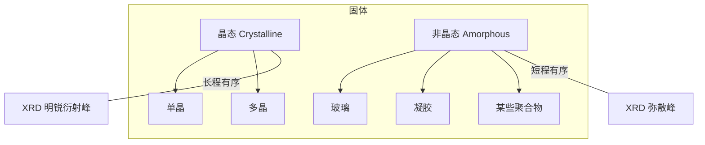
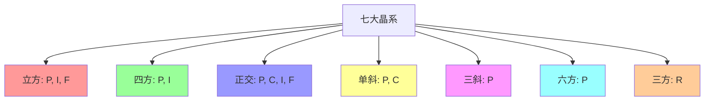
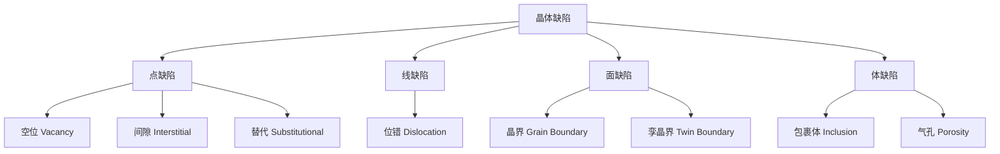

# 晶体学
## 一、概述
晶体学（Crystallography）是研究晶体的几何形态、内部结构、物理性质及其形成规律的学科。晶体是原子或分子在三维空间中有规则、周期重复排列的固体，其根本特征在于**长程有序（Long-Range Order）**和**周期性（Periodicity）**。

## 二、晶体基本性质
### 2.1 晶体特性

| 特性 | 描述 | 物理本质 |
|------|------|---------|
| 自限性（Self-Limiting）| 自然形成规则几何形态 | 原子排列的对称性 |
| 均一性（Homogeneity）| 不同部位性质相同 | 周期性平移不变 |
| 各向异性（Anisotropy）| 不同方向性质不同 | 原子排列的方向依赖 |
| 对称性（Symmetry）| 对某些操作保持不变 | 空间群的数学约束 |
| 固定熔点 | 熔化温度不变 | 长程有序解体所需能量 |
| 解理性（Cleavage）| 沿特定晶面规则破裂 | 面间键合强度差异 |

### 2.2 晶体与非晶体的区别

## 三、晶体学基础
### 3.1 空间点阵（Space Lattice）
空间点阵由一系列在空间中周期排列的几何点构成，每个点的周围环境完全相同。点阵矢量 $\mathbf{a}, \mathbf{b}, \mathbf{c}$ 定义单位晶胞：

$$
\mathbf{r} = u\mathbf{a} + v\mathbf{b} + w\mathbf{c}
$$

其中 $u, v, w$ 为整数，指定任意阵点位置。

### 3.2 七大晶系（Seven Crystal Systems）
所有晶体可归入七大晶系：

| 晶系 | 轴长关系 | 轴角关系 | 晶胞类型 | 对称性最低要求 |
|------|---------|---------|---------|-------------|
| 立方（Cubic）| $a = b = c$ | $\alpha = \beta = \gamma = 90^\circ$ | 简单、体心、面心 | 四个三次轴 |
| 四方（Tetragonal）| $a = b \neq c$ | $\alpha = \beta = \gamma = 90^\circ$ | 简单、体心 | 一个四次轴 |
| 正交（Orthorhombic）| $a \neq b \neq c$ | $\alpha = \beta = \gamma = 90^\circ$ | 简单、底心、体心、面心 | 三个互相垂直的二次轴 |
| 单斜（Monoclinic）| $a \neq b \neq c$ | $\alpha = \gamma = 90^\circ, \beta \neq 90^\circ$ | 简单、底心 | 一个二次轴 |
| 三斜（Triclinic）| $a \neq b \neq c$ | $\alpha \neq \beta \neq \gamma \neq 90^\circ$ | 简单 | 无对称轴（仅对称中心）|
| 六方（Hexagonal）| $a = b \neq c$ | $\alpha = \beta = 90^\circ, \gamma = 120^\circ$ | 简单 | 一个六次轴 |
| 三方（Trigonal）| $a = b = c$ | $\alpha = \beta = \gamma \neq 90^\circ$ | 简单 | 一个三次轴 |

### 3.3 14 种布拉维点阵（Bravais Lattices）
法国晶体学家 Bravais 证明，七大晶系共有 14 种不同的点阵类型：

其中 P = 简单（Primitive），C = 底心（Base-centered），I = 体心（Body-centered），F = 面心（Face-centered），R = 菱面体（Rhombohedral）。

### 3.4 晶面指数（Miller Indices）
Miller 指数 $(hkl)$ 用于标记晶面方向，求解步骤：
1. 求晶面在三轴上的截距（用晶格常数 $a, b, c$ 表示）
2. 取倒数
3. 化为最小整数
晶面间距公式（立方晶系）：

$$
d_{hkl} = \frac{a}{\sqrt{h^2 + k^2 + l^2}}
$$

一般公式：

$$
\frac{1}{d_{hkl}^2} = \frac{h^2}{a^2} + \frac{k^2}{b^2} + \frac{l^2}{c^2}
$$

### 3.5 晶带与晶带定律
晶体中相交于同一直线（晶带轴）的一组晶面构成晶带。晶带轴方向 $[uvw]$ 与晶面 $(hkl)$ 满足：

$$
hu + kv + lw = 0
$$

（Weiss 晶带定律，Zone Law）

## 四、晶体对称性
### 4.1 对称操作（Symmetry Operations）

| 操作 | 符号 | 描述 |
|------|------|------|
| 旋转轴（Rotation）| $n$（$n=1,2,3,4,6$）| 绕轴旋转 $360^\circ/n$ |
| 反射面（Mirror）| $m$ | 平面的镜象反射 |
| 对称中心（Inversion）| $\bar{1}$ 或 $i$ | 空间反演 |
| 旋转反演（Rotoinversion）| $\bar{n}$ | 旋转 + 反演复合 |
| 螺旋轴（Screw Axis）| $n_m$ | 旋转 + 平移复合 |
| 滑移面（Glide Plane）| $a,b,c,n,d$ | 反射 + 平移复合 |

### 4.2 点群（Point Groups）与空间群（Space Groups）
晶体对称性共有 32 个点群（描述宏观对称性）和 230 个空间群（描述微观对称性，包括平移对称元素）。
国际符号（Hermann-Mauguin Notation）：
- 点群示例：$4/m \bar{3} 2/m$（立方晶系最高对称性，= $O_h$）
- 空间群示例：$P2_1/c$（单斜晶系，简单点阵 + $2_1$ 螺旋轴 + $c$ 滑移面）

## 五、X 射线晶体学
### 5.1 X 射线衍射
**布拉格定律（Bragg's Law）**：

$$
n\lambda = 2d\sin\theta
$$

其中 $n$ 为反射级数，$\lambda$ 为入射 X 射线波长，$d$ 为晶面间距，$\theta$ 为掠射角。
XRD 图谱中的衍射峰位置（$2\theta$）反映晶面间距，峰强度反映原子种类和位置。

### 5.2 衍射强度
结构因子（Structure Factor）决定衍射强度：

$$
F_{hkl} = \sum_j f_j \exp[2\pi i (h x_j + k y_j + l z_j)]
$$

其中 $f_j$ 为第 $j$ 个原子的散射因子，$(x_j, y_j, z_j)$ 为其分数坐标。
衍射强度 $I_{hkl} \propto |F_{hkl}|^2$。
系统消光（Systematic Absences）：由于螺旋轴或滑移面的存在，某些衍射峰消失，可据此推断空间群。

### 5.3 粉末衍射
粉末 X 射线衍射（XRD）是物相分析的标准方法。
PDF 卡片（Powder Diffraction File，国际衍射数据中心 ICDD）用于物相检索。
Scherrer 公式计算晶粒尺寸：

$$
D = \frac{K\lambda}{\beta \cos\theta}
$$

其中 $D$ 为晶粒尺寸（nm），$K \approx 0.89$，$\beta$ 为半峰宽（FWHM，弧度）。

### 5.4 单晶衍射
单晶衍射能精确测定晶体结构和原子坐标（$R$ 因子 < 0.05）。
四圆衍射仪和 CCD 探测器是常用设备。通过 Patterson 法、直接法或电荷翻转法求解初始相位的**相位问题（Phase Problem）**。

## 六、晶体缺陷
### 6.1 缺陷分类

### 6.2 点缺陷热力学
空位浓度（Schottky 缺陷）：

$$
\frac{n_v}{N} = \exp\left(-\frac{\Delta H_f}{k_B T}\right)
$$

其中 $\Delta H_f$ 为空位形成焓。

## 七、液相与纳米结晶
### 7.1 准晶（Quasicrystal）
准晶具有长程有序但无平移周期性，呈现五次对称（在传统晶体学中不允许）。由 Shechtman 于 1984 年发现（获 2011 年诺贝尔化学奖）。

### 7.2 液晶（Liquid Crystal）
液晶态介于晶体和液体之间，分子取向有序而位置无序，是显示技术的基础材料。

### 7.3 纳米晶的尺寸效应
纳米晶的热力学性质与块体不同。Debye 温度 $\Theta_D$ 随着尺寸减小而降低。Scherrer 公式（已在 XRD 部分提到）适用于纳米晶粒尺寸测量。

## 八、晶体生长
### 7.1 成核
均相成核的自由能变化：

$$
\Delta G = -\frac{4}{3}\pi r^3 \Delta G_v + 4\pi r^2 \gamma
$$

临界半径 $r^*$：

$$
r^* = \frac{2\gamma}{\Delta G_v}
$$

临界成核势垒：

$$
\Delta G^* = \frac{16\pi \gamma^3}{3\Delta G_v^2}
$$

### 7.2 晶体生长方法

| 方法 | 原理 | 应用 |
|------|------|------|
| Czochralski 法 | 提拉熔体 | 单晶硅 |
| Bridgman 法 | 坩埚移动 | GaAs、金属单晶 |
| 水热法（Hydrothermal）| 高温高压水溶液 | 石英、沸石 |
| 溶液蒸发 | 过饱和析出 | 食盐、明矾 |
| 气相沉积（CVD）| 气相化学反应 | SiC、金刚石薄膜 |
| 区域熔炼（Zone Melting）| 移动加热区提纯 | 高纯金属 |

## 九、现代晶体学应用
### 9.1 药物晶型
同一药物分子的不同晶型（Polymorphs）具有不同的溶解度和生物利用度。专利保护覆盖晶型和结晶工艺。
**利托那韦（Ritonavir）**：1998 年发现更稳定的晶型 II 导致原晶型 I 产品的生物利用度下降，被迫退市。
**仿制药晶型策略**：避开原研专利的晶型，开发新晶型或共晶（Cocrystal）。

### 9.2 蛋白质晶体学
X 射线蛋白质晶体学是生物大分子三维结构测定的主要方法。结构基因组学（Structural Genomics）已解析超过 20 万个蛋白质结构。
分辨率 < 2.0 Å 的结构可清晰显示氨基酸侧链和水分子。
同步辐射光源（Synchrotron Radiation）提供高强度 X 射线，可解析小晶体（~10 μm）。

### 9.3 电子晶体学
冷冻电镜（Cryo-EM, Cryo-Electron Microscopy）在无需结晶的条件下解析生物大分子结构。2017 年诺贝尔化学奖授予 Jacques Dubochet、Joachim Frank 和 Richard Henderson。

## 十、晶体学计算

| 软件 | 用途 | 功能 |
|------|------|------|
| SHELX | 小分子结构解析与精修 | 直接法、Patterson 法 |
| Olex2 | 小分子结构精修 | 图形化界面 |
| CCP4 | 蛋白质晶体学 | 分子置换、精修 |
| Phenix | 蛋白质晶体学 | 自动结构解析 |
| GSAS | 粉末衍射精修 | Rietveld 精修 |
| VESTA | 晶体结构可视化 | 3D 显示、多面体 |
| Mercury | 剑桥结构数据库 | 结构搜索、分析 |

## 八、晶体学应用

| 领域 | 应用 |
|------|------|
| 矿物学 | 矿物鉴定与分类、物相分析 |
| 材料科学 | 晶体结构-性能关系、缺陷工程 |
| 药物晶型 | 多晶型筛选、API 结晶工艺开发 |
| 半导体 | 晶体生长工艺、外延薄膜质量 |
| 地质学 | 岩石组构、变质作用 P-T-t 路径 |
| 结构生物学 | 蛋白质/核酸三维结构测定 |

## 相关条目
- [[04_EngineeringAndTechnology/GeologicalAndMiningEngineering/GeologicalEngineering/INDEX|当前目录索引]]
- [[Mineralogy]]
