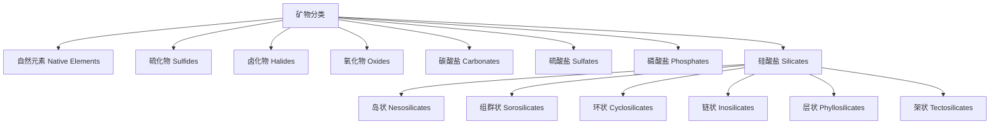
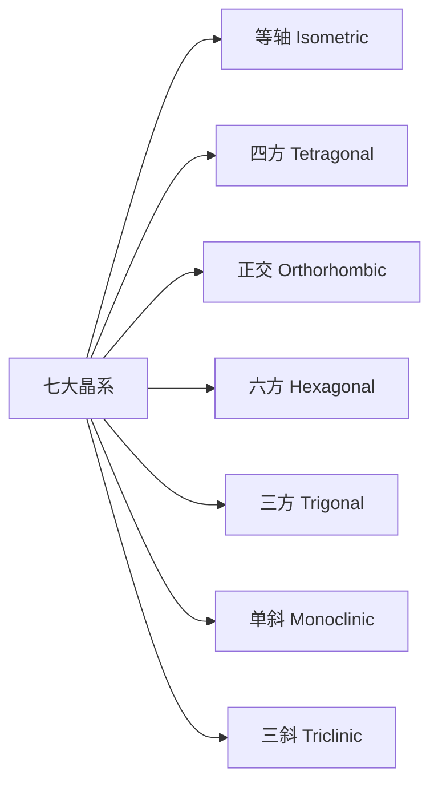
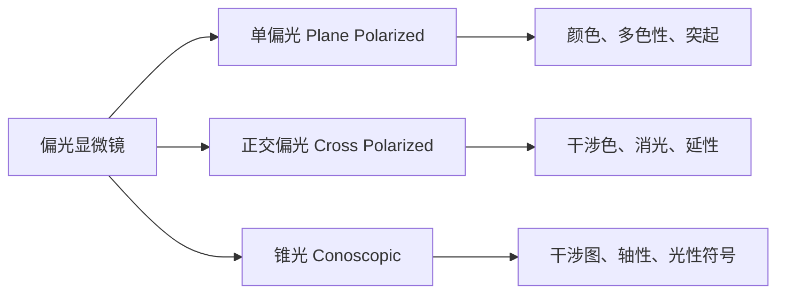

# 矿物学 (Mineralogy)

## 一、概述 (Overview)

矿物学是研究矿物的化学成分、晶体结构、物理性质、成因产状和工业用途的地球科学基础学科。矿物 (Mineral) 是天然形成的、具有确定化学成分和有序原子排列的无机固体。目前国际矿物学协会 (IMA) 认可的矿物超过 6000 种。

### 1.1 矿物的定义 (Definition of a Mineral)

| 特征 | 说明 |
|------|------|
| 天然形成 | 非人工合成 |
| 固态 | 在标准条件下为固体 |
| 无机 | 非生物直接产生 |
| 有序原子排列 | 具有晶体结构 |
| 确定化学成分 | 可用化学式表达 |

### 1.2 矿物与岩石的关系 (Minerals vs. Rocks)

> 矿物是岩石的基本组成单元。岩石是由一种或多种矿物组成的天然集合体。

## 二、矿物分类体系 (Mineral Classification)

### 2.1 化学成分分类 (Chemical Classification)

根据阴离子或阴离子团的类型，矿物分为如下大类：

### 2.2 硅酸盐分类 (Silicate Classification)

硅酸盐矿物以 [SiO₄]⁴⁻ 四面体为基本结构单元，按聚合方式分类：

| 类型 | 聚合方式 | 示例 | Si:O 比 |
|------|----------|------|---------|
| 岛状 Nesosilicates | 孤立四面体 | 橄榄石 (Olivine) | 1:4 |
| 组群状 Sorosilicates | 双四面体 | 绿帘石 (Epidote) | 2:7 |
| 环状 Cyclosilicates | 环状结构 | 电气石 (Tourmaline) | 1:3 |
| 链状 Inosilicates | 单链/双链 | 辉石 (Pyroxene), 角闪石 (Amphibole) | 1:3, 4:11 |
| 层状 Phyllosilicates | 片层结构 | 云母 (Mica), 高岭石 (Kaolinite) | 2:5 |
| 架状 Tectosilicates | 三维骨架 | 长石 (Feldspar), 石英 (Quartz) | 1:2 |

## 三、晶体结构 (Crystal Structure)

### 3.1 七大晶系 (Seven Crystal Systems)

### 3.2 布拉维格子 (Bravais Lattices)

14 种布拉维格子描述晶体中空间点的排列方式：

- **原始格子 (P)**：每个晶胞角顶各有一个格点
- **底心格子 (C)**：除角顶外在两个平行面上各有一个格点
- **体心格子 (I)**：除角顶外在体心有一个格点
- **面心格子 (F)**：除角顶外在每个面心各有一个格点

### 3.3 晶面指数 (Miller Indices)

米勒指数 $(hkl)$ 用于描述晶面方向，晶面间距公式为：

$$
d_{hkl} = \frac{a}{\sqrt{h^2 + k^2 + l^2}} \quad \text{(立方晶系)}
$$

## 四、物理性质 (Physical Properties)

### 4.1 光学性质 (Optical Properties)

| 性质 | 描述 | 示例矿物 |
|------|------|----------|
| 颜色 | 矿物对可见光的选择性吸收 | 紫水晶 (Amethyst) |
| 条痕 | 矿物粉末的颜色 | 赤铁矿 (Hematite) — 红褐色 |
| 光泽 | 矿物表面对光的反射能力 | 金属光泽、玻璃光泽、金刚光泽 |
| 透明度 | 矿物透过可见光的能力 | 透明、半透明、不透明 |
| 折射率 | 光在矿物中的传播速度变化 | $n = \frac{c}{v}$ |

### 4.2 力学性质 (Mechanical Properties)

- **硬度 (Hardness)**：莫氏硬度 (Mohs Scale) 1-10
- **解理 (Cleavage)**：矿物沿特定结晶方向破裂
- **断口 (Fracture)**：贝壳状、锯齿状、参差状
- **比重 (Specific Gravity)**：$G = \frac{\rho_{\text{mineral}}}{\rho_{\text{water}}}$

### 4.3 莫氏硬度表 (Mohs Hardness Scale)

| 硬度 | 矿物 | 常见参照物 |
|------|------|-----------|
| 1 | 滑石 Talc | 指甲 (2.5) |
| 2 | 石膏 Gypsum | 铜币 (3) |
| 3 | 方解石 Calcite | 铁钉 (4.5) |
| 4 | 萤石 Fluorite | 玻璃 (5.5) |
| 5 | 磷灰石 Apatite | 钢刀 (6.5) |
| 6 | 正长石 Orthoclase | 锉刀 (7) |
| 7 | 石英 Quartz | — |
| 8 | 黄玉 Topaz | — |
| 9 | 刚玉 Corundum | — |
| 10 | 金刚石 Diamond | — |

## 五、光性矿物学 (Optical Mineralogy)

### 5.1 偏光显微镜 (Polarizing Microscope)

利用单偏光、正交偏光和锥光系统鉴定矿物：

### 5.2 光性参数 (Optical Parameters)

- **折射率 (Refractive Index)**：$n = \frac{\sin i}{\sin r}$
- **双折射率 (Birefringence)**：$\Delta n = n_{\text{max}} - n_{\text{min}}$
- **光率体 (Indicatrix)**：描述光在矿物中传播速度的几何体

| 光性 | 特征 | 示例 |
|------|------|------|
| 均质体 Isotropic | 各方向折射率相同 | 石榴石 (Garnet) |
| 一轴晶 Uniaxial | 一个光轴方向 | 石英 (Quartz) |
| 二轴晶 Biaxial | 两个光轴方向 | 长石 (Feldspar) |

## 六、成因矿物学 (Genetic Mineralogy)

### 6.1 矿物形成过程 (Mineral Formation)

- **岩浆作用 (Magmatic)**：岩浆冷却结晶
- **热液作用 (Hydrothermal)**：热水溶液沉淀
- **沉积作用 (Sedimentary)**：化学或机械沉积
- **变质作用 (Metamorphic)**：温度和压力改变
- **风化作用 (Weathering)**：地表氧化和水解

### 6.2 矿物共生组合 (Mineral Paragenesis)

| 成矿环境 | 特征矿物组合 |
|----------|-------------|
| 超基性岩 | 橄榄石 + 辉石 + 铬铁矿 |
| 花岗伟晶岩 | 石英 + 长石 + 云母 + 电气石 |
| 矽卡岩 | 石榴石 + 辉石 + 绿帘石 + 磁铁矿 |
| 热液脉 | 石英 + 方解石 + 黄铁矿 + 闪锌矿 |

## 七、矿物鉴定方法 (Mineral Identification Methods)

### 7.1 简易鉴定法 (Simple Identification)

- **肉眼观察**：颜色、光泽、晶形、解理
- **硬度测试**：指甲 (2.5)、铜币 (3)、铁钉 (4.5)、玻璃 (5.5)、钢刀 (6.5)
- **条痕测试**：在无釉瓷板上划出粉末颜色
- **密度测试**：手感估重或静水力学称重
- **酸反应**：方解石遇稀 HCl 起泡

### 7.2 仪器分析法 (Instrumental Analysis)

| 方法 | 原理 | 获取信息 |
|------|------|----------|
| X 射线衍射 XRD | 晶体对 X 射线的衍射 | 晶体结构、物相鉴定 |
| 电子探针 EPMA | 电子束激发 X 射线 | 微区化学成分 |
| 扫描电镜 SEM | 电子束扫描成像 | 矿物形貌、粒度 |
| 红外光谱 FTIR | 分子振动吸收 | 官能团、结构水 |
| 拉曼光谱 Raman | 分子散射光谱 | 矿物分子结构 |

## 八、矿物加工与选矿 (Mineral Processing)

### 8.1 选矿方法 (Beneficiation Methods)

- **重选 (Gravity Separation)**：利用矿物密度差异，如摇床、跳汰机
- **磁选 (Magnetic Separation)**：利用矿物磁性差异
- **浮选 (Flotation)**：利用矿物表面润湿性差异，添加捕收剂和起泡剂
- **电选 (Electrostatic Separation)**：利用矿物导电性差异
- **手选 (Hand Sorting)**：人工拣选高品位矿石

### 8.2 浮选原理 (Flotation Principle)

矿物表面疏水性是浮选的基础，通过添加捕收剂 (Collector) 改变矿物表面性质：

$$
\gamma_{\text{固-液}} < \gamma_{\text{固-气}} + \gamma_{\text{液-气}} \cdot \cos\theta
$$

其中 $\theta$ 为接触角，$\theta > 0$ 表示矿物具有可浮性。

## 九、工业应用 (Industrial Applications)

### 9.1 重要工业矿物 (Important Industrial Minerals)

- **石英 (Quartz)**：电子元件、光学器件、玻璃原料
- **长石 (Feldspar)**：陶瓷、玻璃工业
- **高岭石 (Kaolinite)**：造纸、陶瓷、涂料
- **方解石 (Calcite)**：水泥、冶金熔剂
- **重晶石 (Barite)**：石油钻井加重剂
- **萤石 (Fluorite)**：冶金、氟化工

### 7.2 宝石矿物 (Gem Minerals)

$$
\text{宝石价值} = f(\text{颜色}, \text{净度}, \text{切工}, \text{克拉重量})
$$

按照莫氏硬度，宝石分为珍贵宝石 ($H \geq 8$) 和半宝石 ($H < 8$)。

## 八、最新进展 (Recent Advances)

- **高温高压矿物学**：模拟地幔和地核条件下矿物的行为
- **矿物计算学**：利用第一性原理计算矿物性质
- **纳米矿物学**：研究纳米尺度矿物的特殊性质
- **环境矿物学**：矿物在污染物处理中的应用
