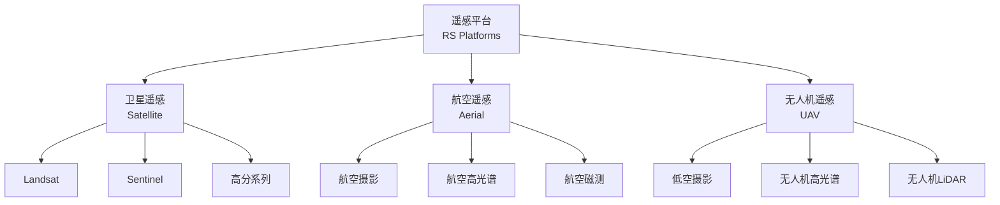
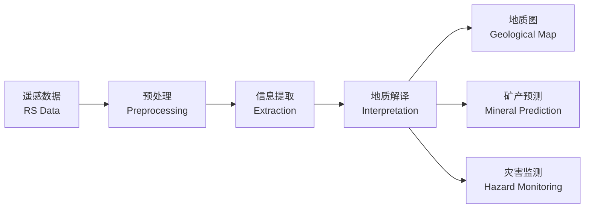

# 遥感地质 (Remote Sensing in Geology)

## 概述 (Overview)

遥感地质（Remote Sensing in Geology）是利用遥感技术（Remote Sensing Technology）对地球表面进行观测，获取地质信息并进行解译分析的学科。通过分析地物的电磁波谱特征，遥感地质能够在大范围内快速识别岩性、构造、矿产和地质灾害等信息，是地质调查、矿产勘查和环境监测的重要手段。

遥感技术与地质学、地球物理学、地球化学相结合，形成了现代地质勘查的核心技术体系。

## 遥感物理基础 (Remote Sensing Physics)

### 电磁波谱与地质应用

| 波段 | 波长范围 | 地质应用 |

|------|----------|----------|

| 可见光 (VIS) | 0.4–0.7 μm | 岩性识别、地质制图 |

| 近红外 (NIR) | 0.7–1.3 μm | 矿物蚀变、植被干扰去除 |

| 短波红外 (SWIR) | 1.3–2.5 μm | 含水矿物、黏土矿物识别 |

| 热红外 (TIR) | 8–14 μm | 岩性识别、地热异常 |

| 微波 (SAR) | 1 mm–1 m | 穿透植被、构造解译 |

### 地物光谱特性

不同地质体具有独特的光谱反射特征：

| 地质体 | 可见光特征 | 近红外特征 |

|--------|-----------|-----------|

| 植被 | 绿光反射峰、红光吸收 | 强反射 |

| 水体 | 蓝绿光透过、红光吸收 | 强吸收 |

| 铁氧化物 | 红光吸收、蓝光反射 | 中等反射 |

| 黏土矿物 | 平坦 | 含水吸收带 |

| 碳酸盐 | 平坦 | 平坦 |

## 遥感平台 (Remote Sensing Platforms)

### 卫星遥感系统

| 卫星系列 | 传感器 | 空间分辨率 | 主要地质应用 |

|----------|--------|-----------|-------------|

| Landsat | OLI/TIRS | 15–30 m | 区域地质调查 |

| Sentinel-2 | MSI | 10–60 m | 矿物蚀变填图 |

| ASTER | VNIR/SWIR/TIR | 15–90 m | 热红外岩性 |

| WorldView | 多光谱 | 0.3–1.2 m | 精细构造解译 |

| 高分系列 | 多光谱 | 2–8 m | 矿产勘查 |

### 航空与无人机遥感

## 地质解译 (Geological Interpretation)

### 岩性识别 (Lithology Mapping)

岩性识别是遥感地质的核心任务：

| 识别方法 | 数据源 | 识别精度 |

|----------|--------|----------|

| 光谱角匹配 (SAM) | 高光谱 | 高 |

| 波段比值 | 多光谱 | 中等 |

| 主成分分析 (PCA) | 多光谱 | 中等 |

| 监督分类 | 多/高光谱 | 取决于训练样本 |

| 机器学习 | 多源数据 | 高 |

### 构造解译 (Structural Interpretation)

线性构造（Lineament）解译是遥感地质的重要应用：

- **断裂识别**：色调线、地貌线、水系线
- **褶皱识别**：环形构造、对称水系
- **节理识别**：平行线状特征

## 矿产勘查 (Mineral Exploration)

### 蚀变矿物遥感

热液蚀变带是寻找金属矿产的重要标志：

| 蚀变类型 | 特征矿物 | 光谱特征波段 |

|----------|----------|-------------|

| 绢英岩化 | 绢云母、石英 | 2.20 μm |

| 青磐岩化 | 绿泥石、绿帘石 | 2.33 μm |

| 泥化 | 高岭石、蒙脱石 | 2.16 μm |

| 硅化 | 石英 | 无特征吸收 |

| 钾化 | 钾长石 | 无特征吸收 |

### 蚀变信息提取方法

1. **波段比值法**：

$$\text{粘土指数} = \frac{SWIR1}{SWIR2}$$

2. **主成分分析（PCA）**：提取蚀变信息主分量

3. **光谱角匹配（SAM）**：

$$\theta = \cos^{-1}\left(\frac{\sum_{i=1}^{n} t_i \cdot r_i}{\sqrt{\sum_{i=1}^{n} t_i^2} \cdot \sqrt{\sum_{i=1}^{n} r_i^2}}\right)$$

其中 $t_i$ 为参考光谱，$r_i$ 为像元光谱。

## 图像处理 (Image Processing)

### 预处理流程

| 步骤 | 目的 | 方法 |

|------|------|------|

| 辐射校正 (Radiometric) | 消除大气影响 | 大气辐射传输模型 |

| 几何校正 (Geometric) | 消除几何畸变 | 多项式拟合、DEM |

| 图像融合 (Fusion) | 提高空间分辨率 | PAN-SHARP |

| 图像增强 (Enhancement) | 突出地质信息 | 对比度拉伸、滤波 |

### 图像增强技术

| 技术 | 原理 | 应用 |

|------|------|------|

| 对比度拉伸 | 扩展灰度范围 | 增强线性构造 |

| 空间滤波 | 卷积运算 | 边缘增强 |

| 波段组合 | 多波段假彩色 | 岩性区分 |

| 比值分析 | 波段相除 | 矿物蚀变 |

## 分类方法 (Classification Methods)

### 监督分类

| 方法 | 原理 | 适用 |

|------|------|------|

| 最大似然法 (MLC) | 概率统计 | 正态分布数据 |

| 支持向量机 (SVM) | 最优超平面 | 高维特征空间 |

| 随机森林 (RF) | 集成学习 | 多源数据 |

| 神经网络 (NN) | 深度学习 | 大数据量 |

### 非监督分类

| 方法 | 原理 | 适用 |

|------|------|------|

| K-means | 距离聚类 | 已知类别数 |

| ISODATA | 迭代自组织 | 未知类别数 |

| 层次聚类 | 树状聚类 | 小样本 |

## 遥感应用 (Applications)

### 地质调查

- 区域地质填图
- 岩性识别与划分
- 构造体系分析

### 矿产勘查

- 蚀变信息提取
- 成矿远景预测
- 找矿靶区圈定

### 环境与灾害

- 滑坡监测
- 地面沉降
- 矿区环境恢复

## 经典教材与参考资料

- 孙家炳《遥感原理与应用》
- 李德仁《遥感导论》
- Lillesand《Remote Sensing and Image Interpretation》
- 《遥感地质解译规范》(DZ/T 0264-2014)

## 相关条目

- [[RemoteSensing|遥感技术 (Remote Sensing)]]
- [[GeologicalMapping|地质填图 (Geological Mapping)]]
- [[MineralExploration|矿产勘查 (Mineral Exploration)]]
- [[HyperspectralRemoteSensing|高光谱遥感 (Hyperspectral RS)]]
- [[ImageProcessing|图像处理 (Image Processing)]]
- [[INDEX|GeologicalEngineering 索引]]
