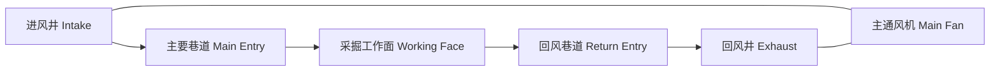
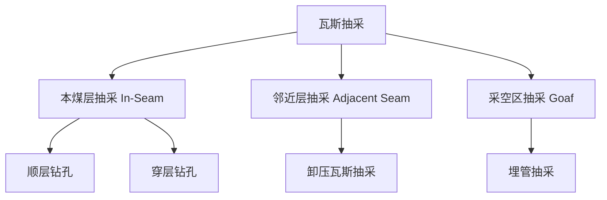
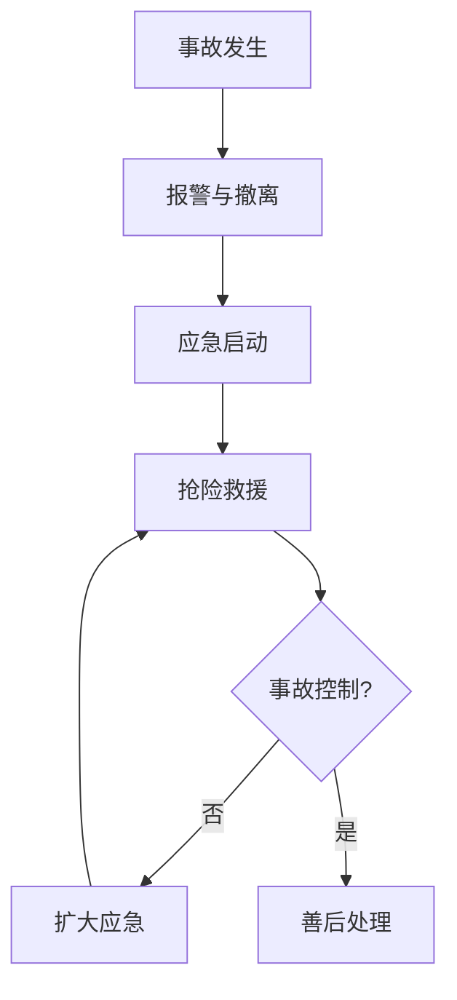

# 矿山安全 (Mine Safety)

## 一、概述 (Overview)

矿山安全是采矿工程的重要组成部分，涵盖通风、瓦斯防治、顶板管理、爆破安全和应急救援等方面。矿山事故的主要类型包括瓦斯爆炸、透水、冒顶、火灾和中毒窒息。系统化的安全管理是保障矿工生命和矿山正常运营的基础。

## 二、矿井通风 (Mine Ventilation)

### 2.1 通风系统 (Ventilation System)

### 2.2 通风方式 (Ventilation Methods)

| 方式 | 风机位置 | 特点 | 适用场景 |
|------|----------|------|----------|
| 压入式 Forced | 进风侧 | 正压，防外部瓦斯涌入 | 瓦斯矿井 |
| 抽出式 Exhaust | 回风侧 | 负压，管理方便 | 低瓦斯矿井 |
| 混合式 Combined | 两侧 | 兼有两者优点 | 大型矿井 |

### 2.3 通风参数 (Ventilation Parameters)

- **风量 (Air Quantity)**：$Q = A \cdot v$，其中 $A$ 为巷道断面，$v$ 为风速
- **通风阻力 (Ventilation Resistance)**：$h = R \cdot Q^2$ (通风阻力定律)
- **有效风量率 (Effective Air Ratio)**：$\eta = Q_{\text{工作面}} / Q_{\text{总}} \geq 85\%$

### 2.4 需风量计算 (Air Requirement)

$$
Q_{\text{总}} = \max(Q_{\text{人员}}, Q_{\text{瓦斯}}, Q_{\text{粉尘}}, Q_{\text{温度}})
$$

| 因素 | 计算标准 |
|------|----------|
| 人员 | 每人 ≥ 4 m³/min |
| 瓦斯 | 回风流瓦斯浓度 ≤ 0.75% |
| 粉尘 | 风速 ≥ 0.25 m/s (最低排尘风速) |
| 温度 | 工作面温度 ≤ 26°C |

## 三、瓦斯防治 (Gas Control)

### 3.1 瓦斯性质 (Gas Properties)

- 主要成分：甲烷 (CH₄)
- 爆炸极限：5%~16%（空气中体积浓度）
- 密度：0.716 kg/m³ (比空气轻)
- 相对涌出量：$q = Q_{\text{CH}_4} / P$ (m³/t)

### 3.2 瓦斯等级 (Gas Classification)

| 等级 | 相对涌出量 | 绝对涌出量 |
|------|-----------|-----------|
| 低瓦斯矿井 | $q \leq 10$ m³/t | $Q \leq 40$ m³/min |
| 高瓦斯矿井 | $q > 10$ m³/t | $Q > 40$ m³/min |
| 煤与瓦斯突出矿井 | — | 具有突出危险性 |

### 3.3 瓦斯抽采 (Gas Drainage)

### 3.4 防爆措施 (Explosion Prevention)

- **杜绝火源**：防爆电气设备、杜绝明火、静电消除
- **瓦斯监测**：$CH_4 \geq 1.0\%$ 报警，$\geq 1.5\%$ 断电
- **主动抑爆**：岩粉棚、水棚、自动抑爆装置
- **通风稀释**：将瓦斯浓度控制在 0.5% 以下

## 四、顶板管理 (Roof Support)

### 4.1 支护类型 (Support Types)

| 支护类型 | 材料 | 适用条件 |
|----------|------|----------|
| 锚杆支护 Rock Bolt | 螺纹钢 | 中等稳定顶板 |
| 锚索支护 Cable Bolt | 钢绞线 | 破碎顶板 |
| 金属支架 Steel Set | U 型钢 | 地压大、变形大 |
| 喷射混凝土 Shotcrete | 混凝土 | 风化岩面封闭 |
| 液压支架 Hydraulic Support | 液压 | 综合机械化采煤 |

### 4.2 锚杆支护设计 (Bolt Support Design)

悬吊理论 (Suspension Theory)：

$$
L = L_1 + L_2 + L_3
$$

其中 $L$ 为锚杆长度，$L_1$ 为外露长度，$L_2$ 为有效锚固长度，$L_3$ 为锚入稳定岩层长度。

锚杆间距计算：

$$
S \leq \sqrt{\frac{F}{n \cdot k \cdot \gamma \cdot h}}
$$

### 4.3 顶板监测 (Roof Monitoring)

- **顶板离层仪 (Roof Separation Indicator)**：监测岩层分层位移
- **锚杆测力计 (Bolt Dynamometer)**：监测锚杆载荷
- **声发射监测 (Acoustic Emission)**：岩石破裂声响定位
- **钻孔窥视 (Borehole Camera)**：直接观测顶板裂隙

## 五、爆破安全 (Blasting Safety)

### 5.1 爆破器材 (Explosives)

| 类型 | 成分 | 特点 |
|------|------|------|
| 铵油炸药 ANFO | NH₄NO₃ + 柴油 | 成本低，无抗水 |
| 乳化炸药 Emulsion | 硝酸铵水相 + 油相 | 抗水性能好 |
| 水胶炸药 Water Gel | 硝酸甲胺 + 水 | 安全性高 |

### 5.2 爆破安全距离 (Safety Distance)

地震波安全距离：

$$
R = K \cdot \sqrt[3]{Q}
$$

其中 $R$ 为安全距离 (m)，$K$ 为地质系数，$Q$ 为最大单段药量 (kg)。

### 5.3 拒爆处理 (Misfire Handling)

- 警戒时间：炮眼法 ≥ 15 min，深孔法 ≥ 30 min
- 处理原则：严禁掏出或拉出起爆药包
- 处理方法：平行新眼装药爆破（距原眼 ≥ 0.3 m）

## 六、矿井火灾与透水 (Mine Fire & Water Inrush)

### 6.1 矿井火灾 (Mine Fire)

| 类型 | 原因 | 防治 |
|------|------|------|
| 外因火灾 External | 电气短路、摩擦、明火 | 防爆设备、消防设施 |
| 内因火灾 Spontaneous Combustion | 煤自燃氧化放热 | 注浆、注氮、均压通风 |

### 6.2 矿井透水 (Water Inrush)

突水系数 (Water Inrush Coefficient)：

$$
T_s = \frac{p}{M}
$$

其中 $p$ 为水压 (MPa)，$M$ 为隔水层厚度 (m)。$T_s > 0.1$ MPa/m 时存在突水危险。

防治水原则：**预测预报、有疑必探、先探后掘、先治后采**

## 七、应急救援 (Emergency Response)

### 7.1 应急预案 (Emergency Plan)

### 7.2 自救设备 (Self-Rescue Equipment)

| 设备 | 用途 | 有效时间 |
|------|------|----------|
| 自救器 Self-Rescuer | 过滤/隔绝 CO | 30~60 min |
| 氧气呼吸器 Oxygen Breathing Apparatus | 隔绝式供氧 | 2~4 h |
| 避难硐室 Refuge Chamber | 临时避难 | ≥ 96 h |
| 生命管 Lifeline Tube | 压风供气 | 持续 |

## 八、安全法规与管理 (Safety Regulations & Management)

### 8.1 安全管理体系 (Safety Management System)

- 安全生产责任制
- 安全教育培训 (三级教育)
- 隐患排查治理 (双重预防机制)
- 职业健康监护 (粉尘、噪声、有害气体)
- 安全标准化建设 (一级、二级、三级)

### 8.2 主要法律法规 (Key Regulations)

| 法规 | 主要内容 |
|------|----------|
| 矿山安全法 | 矿山建设、生产、监督基本法律 |
| 煤矿安全规程 | 煤矿生产各环节技术标准 |
| 安全生产许可证条例 | 企业安全准入条件 |
| 职业病防治法 | 职业健康保护 |

## 九、最新技术 (Latest Technologies)

- **智能瓦斯预警系统**：基于大数据和 AI 的瓦斯浓度预测
- **无人机巡检**：采空区、高陡边坡安全巡检
- **矿工定位系统**：UWB 厘米级井下人员定位
- **智能应急通信**：5G + Mesh 网络井下全覆盖
- **虚拟现实培训**：VR 矿工安全模拟训练
