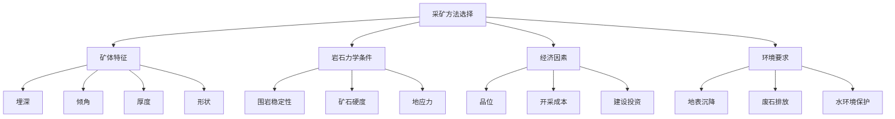
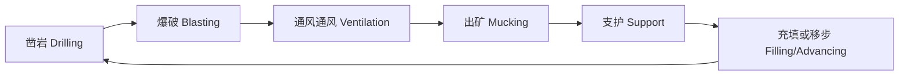

# 采矿工程

## 一、概述
采矿工程（Mining Engineering）是研究从地壳中有经济价值地开采固体矿产资源工程学科。它涵盖矿床勘探、矿山设计、岩石力学、爆破工程、矿井通风、矿山安全、矿物加工等全产业链技术领域。

## 二、采矿方法选择
### 2.1 选择依据
采矿方法的选择取决于矿床地质条件和经济因素：



### 2.2 主要采矿方法

| 方法 | 适用条件 | 优点 | 缺点 |
|------|---------|------|------|
| 露天开采（Open-Pit）| 埋深浅、矿体厚大 | 安全、低成本（为地下 1/3-1/2）、规模化 | 占地大、环境扰动大 |
| 地下开采（Underground）| 埋藏深 > 300-500 m | 占地小、环境影响小 | 成本高、安全风险大 |
| 溶液采矿（Solution Mining）| 可溶性矿物（岩盐、钾盐）| 无需人员下井 | 只适用特定矿种 |
| 海洋采矿（Deep-Sea Mining）| 海底锰结核、多金属硫化物 | 资源潜力巨大 | 环保争议、技术复杂 |

## 三、露天开采
### 3.1 开采工艺
露天开采的典型工艺流程：
```
剥离覆盖岩层 → 穿孔爆破 → 采装运输 → 排土/堆矿
```
**台阶参数**：

| 参数 | 定义 | 典型值 |
|------|------|-------|
| 台阶高度 $H$ | 相邻水平间垂直距离 | 10-15 m |
| 台阶坡面角 $\alpha$ | 台阶斜面与水平面夹角 | 60-80° |
| 安全平台宽度 | 保障通行安全 | 4-6 m |
| 清扫平台宽度 | 收集滚落岩石 | 6-8 m |
| 最终边坡角 $\beta$ | 采场整体边坡角 | 35-55° |

### 3.2 剥采比
经济合理剥采比（Stripping Ratio）决定露天开采的经济可行性：

$$
N = \frac{V_{\text{waste}}}{V_{\text{ore}}}
$$

临界剥采比 $N_{\max}$ 由露天与地下开采成本相等确定：

$$
N_{\max} = \frac{C_{\text{underground}} - C_{\text{mining}}}{C_{\text{stripping}}}
$$

## 四、地下开采
### 4.1 开拓系统
矿山开拓（Mine Development）是通往矿体的井巷工程体系：

| 开拓方式 | 主要工程 | 适用条件 |
|---------|---------|---------|
| 平硐开拓 | 水平巷道直达矿体 | 山地/丘陵矿床 |
| 斜井开拓 | 斜坡提升 | 缓倾斜矿体 < 30° |
| 竖井开拓 | 垂直提升 | 深埋矿体 > 300 m |
| 斜坡道开拓 | 无轨车辆行驶 | 大型机械化矿山 |
| 联合开拓 | 多种方式组合 | 复杂地形条件 |

### 4.2 采矿方法
**空场采矿法（Open Stoping）**：
- 矿房回采后形成空区，靠矿柱支撑围岩
- 适用：矿石与围岩稳定
- 回收率：80-90%
**充填采矿法（Backfill Stoping）**：
- 采空区用充填料充填（尾砂、废石、膏体）
- 适用：高价值矿石、围岩不稳、地表需保护
- 回收率 > 95%
- 充填成本占采矿总成本的 20-40%
**崩落采矿法（Caving）**：
- 崩落矿石同时诱导围岩崩落充填空区
- 适用：低品位、大规模矿体
- 成本最低的地下方法
- 地表沉降不可避免

### 4.3 回采工艺



## 五、爆破工程
### 5.1 炸药物理化学特性

| 炸药类型 | 爆速（m/s）| 爆力 | 抗水性 | 成本 |
|---------|-----------|------|--------|------|
| 铵油炸药（ANFO）| 2000-3500 | 中 | 差 | 低 |
| 乳化炸药（Emulsion）| 3500-5500 | 中高 | 好 | 中 |
| 水胶炸药（Water Gel）| 3500-5000 | 中高 | 好 | 中 |
| 硝化甘油（NG）| 6000-7500 | 高 | 好 | 高 |

### 5.2 爆破参数设计

```
钻孔直径 d: 64-165 mm
孔深 L: 台阶高度 + 超深 (0.5-2 m)
孔距 a: 3-7 m
排距 b: (0.7-0.9) a
炸药单耗 q: 0.3-0.6 kg/m³（岩石），0.1-0.3 kg/m³（煤）
```

炮眼装药量计算：

$$
Q = q \cdot V = q \cdot a \cdot b \cdot H
$$

### 5.3 爆破危害控制
- **爆破振动**：质点振动速度 $v = K \cdot \left( \frac{D}{\sqrt[3]{Q}} \right)^{-\alpha}$
- **飞石**：控制最小抵抗线方向，覆盖防护
- **爆破冲击波**：延时起爆降低叠加效应
- **有毒气体**：充分通风后进入作业面

## 六、矿井通风
### 6.1 通风系统
矿井通风的任务：保证井下氧气浓度 > 19.5%，稀释有害气体（CH$_4$、CO、NO$_x$），排除粉尘。
通风方式：

| 方式 | 风路 | 适用 |
|------|------|------|
| 中央并列式 | 进风井和回风井相邻 | 中小型矿山 |
| 中央对角式 | 中央进风，两翼回风 | 大型矿山 |
| 对角式 | 两翼进风和回风 | 走向长的矿山 |
| 分区式 | 多个独立通风系统 | 多采区矿山 |

### 6.2 风量计算
按排尘风速计算：

$$
Q = v_{\min} \cdot S
$$

其中 $v_{\min} \geq 0.15 \text{ m/s}$（最低排尘风速），$S$ 为巷道断面积。
按最低人数计算：

$$
Q = 4 \times N \quad (\text{m}^3/\text{min})
$$

按稀释瓦斯计算（煤矿）：

$$
Q = \frac{q_{\text{CH}_4}}{0.01 \cdot (C_{\max} - C_0)}
$$

### 6.3 通风阻力
摩擦阻力：

$$
h_f = R_f \cdot Q^2 = \frac{\alpha \cdot L \cdot U}{S^3} \cdot Q^2
$$

其中 $\alpha$ 为摩擦阻力系数（N·s$^2$/m$^4$），$L$ 为巷道长度，$U$ 为断面周长，$S$ 为断面积。
全矿总风阻：

$$
R = \sum R_i
$$

主扇选型：根据等积孔 $A = 1.19 \frac{Q}{\sqrt{h}}$ 评价通风难易程度。

## 七、矿山安全
### 7.1 瓦斯治理
瓦斯（煤层气，主要成分 CH$_4$）爆炸界限：5-16%（空气中）。
**瓦斯抽采**：采前预抽、边采边抽、采空区抽采。
**瓦斯突出**（Coal and Gas Outburst）是严重灾害，预测指标：
- 钻屑瓦斯解吸指标 $K_1$
- 钻屑量 $S$
- 瓦斯压力 $P$

### 7.2 地压控制
地压（Rock Pressure）是地下采掘空间周围岩体的应力重新分布。
**支护类型**：

| 类型 | 原理 | 适用 |
|------|------|------|
| 锚杆支护 | 锚入稳定岩层锁定 | 中等稳定围岩 |
| 喷射混凝土 | 封闭围岩，防止风化 | 各类围岩 |
| 锚网喷 | 锚杆+金属网+喷浆 | 破碎围岩 |
| 钢支架 | U 型钢拱架支撑 | 软弱围岩、大断面 |
| 充填体 | 人工矿柱传递载荷 | 充填采矿法 |
| 矿柱留设 | 保留部分矿石支撑 | 空场法 |

### 7.3 矿井水害
突水（Water Inrush）是地下采矿的重大风险。
预防措施：
- 物探（瞬变电磁法 TEM、高密度电法）探测富水区
- 超前探水钻探
- 疏干排水系统
- 防水矿柱留设
- 注浆堵水

## 八、矿山环境
### 8.1 酸性矿井排水（AMD, Acid Mine Drainage）
硫化矿物（黄铁矿 FeS$_2$）暴露后氧化生成酸性水：

$$
2\text{FeS}_2 + 7\text{O}_2 + 2\text{H}_2\text{O} \rightarrow 2\text{Fe}^{2+} + 4\text{SO}_4^{2-} + 4\text{H}^+
$$

$$
4\text{Fe}^{2+} + \text{O}_2 + 4\text{H}^+ \rightarrow 4\text{Fe}^{3+} + 2\text{H}_2\text{O}
$$

$$
\text{Fe}^{3+} + 3\text{H}_2\text{O} \rightarrow \text{Fe(OH)}_3 \downarrow + 3\text{H}^+
$$

AMD 的典型 pH 为 2-4，含高浓度重金属（Fe、Cu、Pb、Zn、As、Cd），对水环境造成严重污染。

### 8.2 复垦（Reclamation）
矿山土地复垦是采矿全生命周期的一部分：

| 复垦阶段 | 主要工作 | 时间 |
|---------|---------|------|
| 剥离表土 | 单独堆存用于后期复垦 | 开采前 |
| 废石场整治 | 边坡整形、截排水 | 开采中 |
| 土地平整 | 回填采坑、覆土 | 开采后 |
| 植被恢复 | 乡土植物播种、造林 | 复垦末 |
| 长期监测 | 地面沉降、水质监测 | 5-20 年 |

## 九、智能矿山
智能矿山（Smart Mining）通过工业物联网（IIoT）、大数据、人工智能和自动化技术实现矿山的数字化和智能化：
- **自动驾驶矿车**：GPS + 激光雷达导航，降低人力成本
- **远程操控钻机**：5G 远程操控凿岩台车
- **数字孪生**：矿山三维实时模拟和优化
- **用于通风的 AI 优化**：基于传感器数据的风量动态调节
- **智能选矿**：XRT 智能分选 + 在线品位分析
- **安全监测**：微震监测、边坡雷达、人员定位系统

## 十、采矿工程法规
- 《中华人民共和国矿产资源法》（1986 年颁布，1996 年、2009 年修订）
- 《安全生产法》和《矿山安全法》
- 采矿许可证制度：探矿权 + 采矿权两级管理
- 安全生产许可证制度
- 绿色矿山建设标准：六项要求——矿区环境、资源开发、综合利用、节能减排、科技创新、企业管理

## 八、选矿概论
开采出的矿石需经过选矿（Mineral Processing）提高品位：
- **破碎破碎**：颚式破碎机、圆锥破碎机
- **磨矿**：球磨机、半自磨机（SAG）
- **分选**：
  - 浮选（Flotation）：利用矿物表面疏水性差异
  - 磁选（Magnetic Separation）：利用磁性差异
  - 重选（Gravity Separation）：利用密度差异
  - 电选（Electrostatic Separation）：利用导电性差异

## 相关条目
- [[04_EngineeringAndTechnology/GeologicalAndMiningEngineering/MiningEngineering/INDEX|当前目录索引]]
- [[04_EngineeringAndTechnology/MetallurgicalEngineering/ExtractiveMetallurgy/INDEX]]
- [[Crystallography]]
- [[Mineralogy]]
