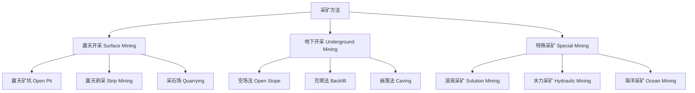
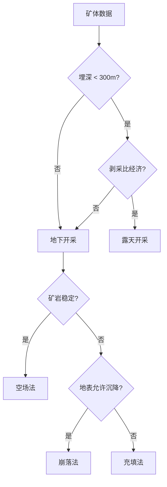

---
aliases: [MiningMethods, 采矿方法]
tags: ['04_EngineeringAndTechnology', 'GeologicalAndMiningEngineering', 'MiningEngineering', 'MiningMethods']
created: 2026-05-17
updated: 2026-05-17
---

# 采矿方法 (Mining Methods)

## 一、概述 (Overview)

采矿方法是指从地壳中开采有用矿物的工程技术体系。根据开采空间位置，分为露天开采和地下开采两大类。选择采矿方法需综合考虑矿床赋存条件、矿石价值、安全要求和经济效益。

## 二、采矿方法分类 (Classification of Mining Methods)

## 三、露天开采 (Surface Mining)

### 3.1 露天开采要素 (Open Pit Parameters)

| 参数 | 符号 | 说明 |
|------|------|------|
| 最终边坡角 | $\beta$ | 安全稳定极限角 |
| 台阶高度 | $H$ | 10~15 m (常规) |
| 安全平台宽度 | $W_s$ | ≥ 3 m |
| 运输平台宽度 | $W_t$ | 满足运输设备通行 |

### 3.2 剥采比 (Stripping Ratio)

$$
SR = \frac{V_{\text{剥离}}}{V_{\text{矿石}}} \quad (m^3/t \text{ 或 } t/t)
$$

经济合理剥采比 (Break-Even Stripping Ratio)：

$$
SR_{\text{max}} = \frac{C - C_o}{C_w}
$$

其中 $C$ 为矿石售价，$C_o$ 为采矿加工成本，$C_w$ 为剥离成本。

### 3.3 露天开采工艺 (Surface Mining Process)

主要设备：

| 设备 | 功能 | 适用条件 |
|------|------|----------|
| 牙轮钻机 Rotary Drill | 穿凿爆破孔 | 中硬以上岩石 |
| 液压挖掘机 Hydraulic Excavator | 装载矿石 | 灵活高效 |
| 电动铲 Electric Shovel | 大规模装载 | 大型露天矿 |
| 自卸卡车 Dump Truck | 运输 | 载重 40~400 t |

## 四、地下开采 (Underground Mining)

### 4.1 空场采矿法 (Open Stope Methods)

| 方法 | 适用条件 | 特点 |
|------|----------|------|
| 房柱法 Room and Pillar | 水平或缓倾斜矿体 | 保留矿柱支撑顶板 |
| 分段空场法 Sublevel Open Stope | 急倾斜厚矿体 | 大规模机械化开采 |
| 留矿法 Shrinkage Stoping | 急倾斜薄矿体 | 矿石自留作工作台 |
| 全面法 Breast Stoping | 薄至中厚矿体 | 连续回采 |

房柱法参数：

- 矿房宽度 (Room Width)：8~15 m
- 矿柱尺寸 (Pillar Size)：5~8 m 方形
- 回收率 (Recovery Rate)：60~75%
- 矿柱应力 (Pillar Stress)：$\sigma_p = \sigma_v \cdot \frac{A_t}{A_p}$

### 4.2 充填采矿法 (Backfill Methods)

充填类型 (Backfill Types)：

| 充填材料 | 特点 | 应用 |
|----------|------|------|
| 干式充填 Dry Fill | 废石充填，成本低 | 小型矿山 |
| 水砂充填 Hydraulic Fill | 尾砂水力输送 | 中等规模 |
| 胶结充填 Cemented Fill | 添加水泥，强度高 | 高价值矿体 |
| 膏体充填 Paste Fill | 全尾砂膏体泵送 | 环保要求高 |

### 4.3 崩落采矿法 (Caving Methods)

- **长壁法 (Longwall Mining)**：煤炭开采主要方法，采煤机往复切割
- **分段崩落法 (Sublevel Caving)**：自上而下分段崩落，覆盖岩层随之下沉
- **阶段崩落法 (Block Caving)**：大规模自然崩落，适用于厚大矿体

## 五、溶液采矿 (Solution Mining)

### 5.1 原地浸出 (In-Situ Leaching, ISL)

适用于铀、铜、金等矿产，通过注液井将浸出剂注入矿层：

$$
\text{浸出反应: } UO_2 + 2Fe^{3+} \rightarrow UO_2^{2+} + 2Fe^{2+}
$$

### 5.2 盐类溶解采矿 (Salt Solution Mining)

注水溶解地下岩盐，抽取卤水加工：

- 井距 (Well Spacing)：100~300 m
- 溶腔形状控制：油垫法控制上溶方向

## 六、采矿方法选择 (Method Selection)

### 6.1 影响因素 (Influencing Factors)

| 因素 | 考虑内容 |
|------|----------|
| 矿体产状 | 倾角、厚度、走向长度 |
| 岩石力学 | 矿岩稳定性、地应力 |
| 水文地质 | 涌水量、含水层分布 |
| 经济因素 | 矿石价值、投资回报 |
| 安全环保 | 地表沉降、尾矿处理 |
| 法规要求 | 采矿许可、环保标准 |

### 6.2 选择矩阵 (Selection Matrix)

## 七、现代采矿技术 (Modern Mining Technologies)

### 7.1 自动化与智能化 (Automation & Intelligence)

- **自动钻孔系统 (Automated Drilling)**：GPS 定位自动穿孔
- **无人驾驶运输 (Autonomous Haulage)**：自动驾驶卡车编队
- **远程操控铲装 (Remote Loading)**：操作员在地面控制中心
- **数字孪生矿山 (Digital Twin)**：三维可视化实时监控

### 7.2 绿色采矿 (Green Mining)

- 充填法减少尾矿地表排放
- 生物浸出 (Bioleaching) 替代化学药剂
- 矿井水循环利用
- 采矿迹地生态修复

## 八、经济评价 (Economic Evaluation)

### 8.1 现金流模型 (Cash Flow Model)

$$
NPV = \sum_{t=0}^{n} \frac{CF_t}{(1 + r)^t}
$$

### 8.2 关键指标 (Key Metrics)

- **内部收益率 (IRR)**：$NPV = 0$ 时的折现率
- **投资回收期 (Payback Period)**：累计现金流回正时间
- **吨矿成本 (Unit Cost)**：$C_{\text{unit}} = \frac{\text{总成本}}{\text{矿石产量}}$

## 八、采矿设备 (Mining Equipment)

### 8.1 地下开采设备 (Underground Mining Equipment)

| 设备 | 功能 | 功率/规格 |
|------|------|-----------|
| 凿岩台车 Drill Jumbo | 钻凿爆破孔 | 2~4 臂 |
| 铲运机 LHD (Load-Haul-Dump) | 装载运输 | 3~21 yd³ |
| 凿岩机 Rock Drill | 钻孔 | 液压/气动 |
| 锚杆台车 Bolter | 安装锚杆 | 单/双臂 |
| 矿用卡车 Underground Truck | 矿石运输 | 20~60 t |
| 破碎机 Crusher | 矿石粗破 | 颚式/旋回式 |

### 8.2 连续采矿机 (Continuous Miner)

用于煤及软岩开采，集切割、装载、输送于一体：

- 切割宽度：3.0~5.0 m
- 切割高度：1.5~4.5 m
- 生产能力：10~30 t/min

### 8.3 长壁综采设备 (Longwall Equipment)

## 九、经济评价 (Economic Evaluation)

### 9.1 现金流模型 (Cash Flow Model)

净现值 (Net Present Value, NPV) 是评价采矿项目经济性的核心指标：

$$
NPV = \sum_{t=0}^{n} \frac{CF_t}{(1 + r)^t}
$$

其中 $CF_t$ 为第 $t$ 年净现金流，$r$ 为折现率。

### 9.2 关键指标 (Key Metrics)

| 指标 | 公式 | 意义 |
|------|------|------|
| 内部收益率 IRR | $NPV = 0$ 时的 $r$ | 项目盈利能力 |
| 投资回收期 Payback | 累计现金流回正时间 | 资金风险 |
| 吨矿成本 Unit Cost | 总成本 / 产量 | 运营效率 |
| 净现值比 NPVR | $NPV / I$ | 单位投资效益 |

### 9.3 边际品位 (Cut-off Grade)

边际品位是决定矿石与废石边界的最低品位：

$$
g_c = \frac{C_m + C_p}{P \cdot R}
$$

其中 $C_m$ 为采矿成本，$C_p$ 为加工成本，$P$ 为产品价格，$R$ 为回收率。

## 十、最新进展 (Recent Advances)

- **深部开采 (Deep Mining)**：>1,000 m 深井高温高压问题
- **太空采矿 (Space Mining)**：小行星矿产资源可行性研究
- **原位流体化采矿 (In-Situ Fluidization)**：钻孔水力破碎抽取
- **共伴生资源综合回收**：尾矿中有价元素再选
- **绿色矿山标准体系**：废弃物零排放、碳中和开采目标

