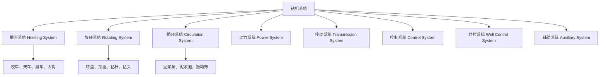
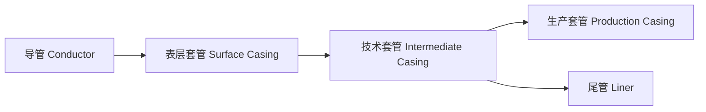

# 钻井工程 (Drilling Engineering)

## 一、概述 (Overview)

钻井工程是石油天然气勘探开发的核心环节，通过机械方式钻穿地层形成井眼，建立油气从储层到地面的通道。现代钻井技术涵盖钻机系统、钻头选型、钻井液设计、固井完井和井控等多个专业领域。

## 二、钻机系统 (Drilling Rig System)

### 2.1 钻机八大系统 (Eight Rig Systems)



### 2.2 钻机类型 (Rig Types)

| 类型 | 适用场景 | 最大深度 |
|------|----------|----------|
| 陆地钻机 Land Rig | 陆上钻井 | 15,000 m |
| 自升式平台 Jack-up | 浅海 (≤120 m) | 10,000 m |
| 半潜式平台 Semi-submersible | 深海 (≤3,000 m) | 12,000 m |
| 钻井船 Drillship | 超深海 | 15,000 m |

## 三、钻头 (Drill Bits)

### 3.1 钻头分类 (Bit Classification)

```
钻头分类
├── 刮刀钻头 Drag Bit — 软地层、高效
├── 牙轮钻头 Roller Cone Bit
│   ├── 单牙轮 Single Cone
│   ├── 三牙轮 Tricone — 最常用
│   └── 镶齿牙轮 Insert Bit — 硬地层
└── 金刚石钻头 Diamond Bit
    ├── 天然金刚石 Natural Diamond
    ├── PDC (聚晶金刚石复合片) — 中硬地层
    └── TSP (热稳定聚晶金刚石) — 硬地层
```

### 3.2 钻头选型原则 (Bit Selection Criteria)

- **地层硬度**：软地层用 PDC 或刮刀钻头，硬地层用牙轮或金刚石钻头
- **可钻性 (Drillability)**：通过室内实验和测井数据评估
- **成本效益**：$C = \frac{B + R \cdot (t + T)}{H}$，其中 $B$ 为钻头成本，$R$ 为钻机日费，$t$ 为纯钻时间，$T$ 为起下钻时间，$H$ 为进尺

## 四、钻井液 (Drilling Mud)

### 4.1 钻井液功能 (Mud Functions)

- 携带岩屑 (Cuttings Transport)
- 平衡地层压力 (Pressure Balance)
- 稳定井壁 (Wellbore Stability)
- 冷却润滑钻头 (Cooling & Lubrication)
- 传递水力功率 (Hydraulic Power Transmission)

### 4.2 钻井液类型 (Mud Types)

| 类型 | 基液 | 特点 | 应用 |
|------|------|------|------|
| 水基泥浆 WBM | 水 | 成本低、环保 | 大多数地层 |
| 油基泥浆 OBM | 柴油/矿物油 | 润滑好、抑制性强 | 页岩、高温井 |
| 合成基泥浆 SBM | 合成油 | 环保优于 OBM | 海洋钻井 |
| 气体钻井 Fluid | 空气/氮气 | 低压地层 | 漏失地层 |

### 4.3 泥浆流变参数 (Mud Rheology Parameters)

$$
\mu_a = \frac{\tau}{\dot{\gamma}} \quad \text{(表观粘度)}
$$

$$
\tau_y = \tau_0 + \mu_p \dot{\gamma} \quad \text{(宾汉模式)}
$$

## 五、套管与固井 (Casing & Cementing)

### 5.1 套管柱设计 (Casing String Design)



### 5.2 套管尺寸 (Casing Sizes)

| 套管类型 | 外径 (in) | 下深范围 | 功能 |
|----------|-----------|----------|------|
| 导管 | 20~30 | 30~100 m | 封隔地表松散层 |
| 表层套管 | 13⅜~20 | 300~1,500 m | 封隔淡水层 |
| 技术套管 | 9⅝~13⅜ | 1,500~5,000 m | 隔离复杂地层 |
| 生产套管 | 4½~7 | 至油层 | 油气生产通道 |

### 5.3 水泥浆设计 (Cement Slurry Design)

水泥浆性能参数：

$$
\text{水泥浆密度} \rho = \frac{W_c + W_w}{V_c + V_w}
$$

- 水灰比 (Water-to-Cement Ratio)：0.38~0.46
- 稠化时间 (Thickening Time)：满足施工要求 + 1~2 小时安全余量
- 抗压强度 (Compressive Strength)：24 小时后 ≥ 3.5 MPa

## 六、井控 (Well Control)

### 6.1 地层压力体系 (Formation Pressure System)

| 压力类型 | 定义 | 公式 |
|----------|------|------|
| 静水压力 | 液柱产生的压力 | $p_h = \rho g h$ |
| 上覆岩层压力 | 上覆地层总压力 | $p_{ob} = \int \rho_b g \, dh$ |
| 地层孔隙压力 | 孔隙流体压力 | $p_p = p_h$ (正常) |
| 破裂压力 | 地层破裂的压力 | $p_f = p_p + \sigma_{\text{min}}$ |

### 6.2 井控设备 (BOP Stack)

防喷器组合 (Blowout Preventer Stack)：

- **环形防喷器 (Annular BOP)**：密封任意形状的钻具
- **闸板防喷器 (Ram BOP)**：全封、半封、剪切闸板
- **节流/压井管汇 (Choke & Kill Manifold)**

### 6.3 压井方法 (Kill Methods)

| 方法 | 原理 | 特点 |
|------|------|------|
| 工程师法 Engineer's Method | 一次循环压井 | 效率最高 |
| 等待加重法 Wait & Weight | 先加重泥浆后循环 | 操作简单 |
| 司钻法 Driller's Method | 两次循环 | 最安全 |

## 七、定向钻井 (Directional Drilling)

### 7.1 井眼轨迹参数 (Wellbore Trajectory Parameters)

- **井斜角 (Inclination)**：井眼轴线与铅垂线的夹角
- **方位角 (Azimuth)**：井眼水平投影与正北方向的夹角
- **狗腿度 (Dogleg Severity)**：$DLS = \frac{\Delta\theta}{\Delta L}$ (°/30m)

### 7.2 定向井类型 (Directional Well Types)

- **J 型 (Type J)**：造斜后稳斜至靶点
- **S 型 (Type S)**：造斜-稳斜-降斜
- **水平井 (Horizontal Well)**：井斜角 ≥ 86°
- **大位移井 (Extended Reach)**：水平位移 ≥ 垂直深度 2 倍

## 八、钻井参数优化 (Drilling Parameters Optimization)

### 8.1 机械钻速 (Rate of Penetration)

$$
ROP = \frac{0.8 \cdot WOB \cdot RPM}{d \cdot \sigma}
$$

其中 $WOB$ 为钻压，$RPM$ 为转速，$d$ 为井径，$\sigma$ 为岩石强度。

### 8.2 水力参数 (Hydraulic Parameters)

- **射流速度 (Jet Velocity)**：$v_j = C_d \sqrt{\frac{2\Delta p_b}{\rho}}$
- **水力功率 (Hydraulic Power)**：$P_h = \Delta p_b \cdot Q$
- **钻头压降 (Bit Pressure Drop)**：$\Delta p_b = \frac{8.311 \times 10^{-5} \rho Q^2}{C_d^2 A_n^2}$

## 九、固井工艺 (Cementing Operations)

### 9.1 注水泥流程 (Cementing Procedure)


### 9.2 固井质量评价 (Cement Quality Evaluation)

- **声幅变密度测井 (CBL/VDL)**：评价水泥胶结质量
- **扇区水泥胶结测井 (SBT)**：周向胶结成像
- **声波扫描 (Ultrasonic Scanner)**：三维水泥成像

固井质量等级：

| 等级 | CBL 幅度 | 胶结质量 |
|------|----------|----------|
| 优秀 | < 10% | 完全胶结 |
| 良好 | 10~30% | 基本胶结 |
| 合格 | 30~50% | 部分胶结 |
| 不合格 | > 50% | 胶结差 |

## 十、钻井事故处理 (Drilling Trouble Shooting)

### 10.1 常见事故 (Common Drilling Problems)

| 事故类型 | 原因 | 处理方法 |
|----------|------|----------|
| 卡钻 Pipe Stuck | 压差、键槽、岩屑床 | 泡油、震击、套铣 |
| 井漏 Lost Circulation | 地层孔隙大、裂缝 | 桥堵、水泥堵漏 |
| 井塌 Hole Collapse | 地层不稳定 | 提高泥浆密度、封堵 |
| 断钻具 String Break | 疲劳、磨损 | 打捞工具 |

### 10.2 打捞工具 (Fishing Tools)

- **打捞筒 (Overshot)**：套住落鱼打捞
- **打捞矛 (Spear)**：内孔打捞
- **磁力打捞器 (Magnet)**：铁质碎屑打捞
- **壁钩 (Wall Hook)**：引导工具入鱼腔

## 十一、最新技术 (Latest Technologies)

- **自动垂直钻井 (Automated Vertical Drilling)**：主动防斜
- **旋转导向系统 (Rotary Steerable System, RSS)**：实时轨迹控制
- **随钻测量 (Measurement While Drilling, MWD)**：实时地质参数
- **随钻测井 (Logging While Drilling, LWD)**：实时物性评价
- **控压钻井 (Managed Pressure Drilling, MPD)**：精确控制井底压力
