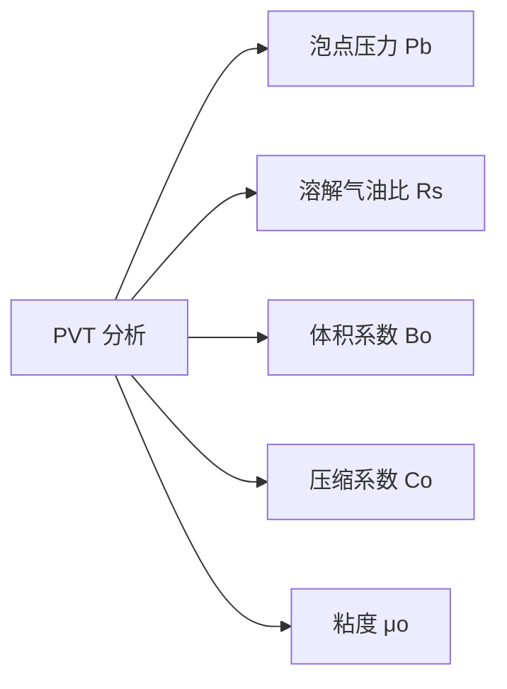
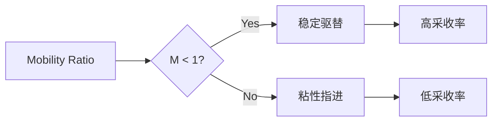
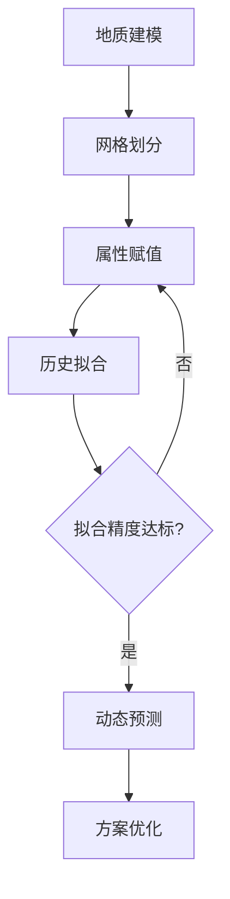
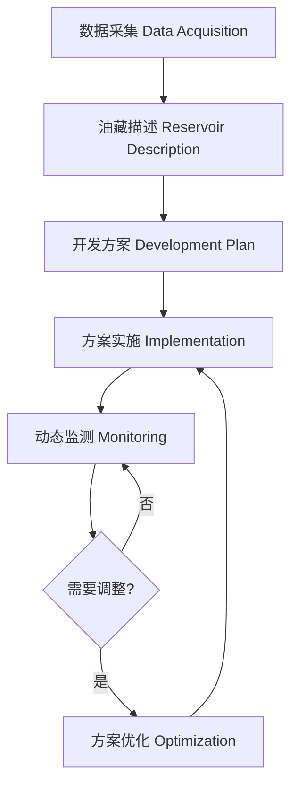

# 油藏工程 (Reservoir Engineering)

## 一、概述 (Overview)

油藏工程是石油工程的核心分支，研究油气藏中流体的流动规律、储量计算、开发方案设计和提高采收率技术。其目标是科学高效地开发油气资源，实现最大经济收益。

## 二、油藏特征 (Reservoir Characterization)

### 2.1 储层物性参数 (Reservoir Properties)

| 参数 | 符号 | 单位 | 定义 |
|------|------|------|------|
| 孔隙度 Porosity | $\phi$ | % | 孔隙体积 / 总体积 |
| 渗透率 Permeability | $k$ | mD | 流体通过能力 |
| 含油饱和度 | $S_o$ | % | 油占孔隙体积比例 |
| 含水饱和度 | $S_w$ | % | 水占孔隙体积比例 |
| 含气饱和度 | $S_g$ | % | 气占孔隙体积比例 |

### 2.2 孔隙度分类 (Porosity Classification)

- **绝对孔隙度 (Absolute Porosity)**：$\phi_a = V_p / V_b$
- **有效孔隙度 (Effective Porosity)**：$\phi_e = V_{\text{conn}} / V_b$
- **原生孔隙度 (Primary Porosity)**：沉积时形成
- **次生孔隙度 (Secondary Porosity)**：成岩后改造形成

### 2.3 渗透率 (Permeability)

达西定律 (Darcy's Law)：

$$
Q = \frac{kA}{\mu} \cdot \frac{\Delta p}{\Delta L}
$$

| 渗透率范围 | 储层评价 |
|-----------|----------|
| k > 1,000 mD | 极好 Excellent |
| 100 ~ 1,000 mD | 好 Good |
| 10 ~ 100 mD | 中等 Fair |
| 1 ~ 10 mD | 差 Poor |
| k < 1 mD | 致密 Tight |

## 三、流体性质 (Fluid Properties)

### 3.1 PVT 参数 (PVT Parameters)

### 3.2 流体相态 (Fluid Phase Behavior)

- **黑油 (Black Oil)**：中等挥发，Rs < 2000 scf/bbl
- **挥发油 (Volatile Oil)**：Rs = 2000 ~ 3300 scf/bbl
- **反凝析气 (Retrograde Gas)**：等温降压析出液体
- **干气 (Dry Gas)**：无液相析出

## 四、储量计算 (Reserves Estimation)

### 4.1 容积法 (Volumetric Method)

$$
N = \frac{7758 A h \phi (1 - S_{wi})}{B_{oi}}
$$

其中 $N$ 为原油地质储量 (STB)，$A$ 为含油面积 (acres)，$h$ 为有效厚度 (ft)。

### 4.2 物质平衡法 (Material Balance Method)

$$
N = \frac{N_p [B_o + (R_p - R_s) B_g] - (W_e - W_p B_w)}{(B_o - B_{oi}) + (R_{si} - R_s) B_g + m B_{oi} \left( \frac{B_g}{B_{gi}} - 1 \right) + (1 + m) B_{oi} \frac{c_w S_{wi} + c_f}{1 - S_{wi}} \Delta p}
$$

### 4.3 递减曲线分析 (Decline Curve Analysis)

阿普斯递减 (Arps Decline)：

$$
q(t) = \frac{q_i}{(1 + b D_i t)^{1/b}}
$$

| 递减类型 | b 值 | 特征 |
|----------|------|------|
| 指数递减 Exponential | b = 0 | 常数递减率 |
| 双曲递减 Hyperbolic | 0 < b < 1 | 递减率递减 |
| 调和递减 Harmonic | b = 1 | 最缓递减 |

## 五、流体流动 (Fluid Flow in Porous Media)

### 5.1 基本流动方程 (Basic Flow Equations)

径向流稳态方程 (Radial Steady-State Flow)：

$$
Q = \frac{2\pi k h (p_e - p_w)}{\mu \ln(r_e / r_w)}
$$

- 表皮效应 (Skin Effect)：$s$，附加压降 $\Delta p_s = \frac{Q \mu s}{2\pi k h}$

### 5.2 流度比 (Mobility Ratio)

$$
M = \frac{\lambda_{\text{驱替}}}{\lambda_{\text{被驱替}}} = \frac{k_{rD} / \mu_D}{k_{rR} / \mu_R}
$$

- $M < 1$：有利驱替 (稳定指进)
- $M > 1$：不利驱替 (粘性指进)

## 六、提高采收率 (Enhanced Oil Recovery, EOR)

### 6.1 EOR 分类 (EOR Classification)

| 类型 | 方法 | 原理 | 适用油藏 |
|------|------|------|----------|
| 气驱 Gas Injection | CO₂, N₂, 烃气 | 混相/非混相驱替 | 轻质油 |
| 化学驱 Chemical | 聚合物、表面活性剂 | 改善流度比、降低界面张力 | 中质油 |
| 热力采油 Thermal | 蒸汽吞吐、火烧油层 | 降低原油粘度 | 重质油 |
| 微生物采油 MEOR | 微生物代谢产物 | 改变岩石润湿性 | 各类油藏 |

### 6.2 采收率影响因素 (Recovery Factor Factors)

$$
E_R = E_D \times E_A \times E_V
$$

- **驱替效率 (Displacement Efficiency)** $E_D = \frac{S_{oi} - S_{or}}{S_{oi}}$
- **面积波及效率 (Areal Sweep)** $E_A$
- **垂向波及效率 (Vertical Sweep)** $E_V$

## 七、试井分析 (Well Testing)

### 7.1 试井方法 (Well Test Methods)

| 方法 | 操作 | 获取参数 |
|------|------|----------|
| 压力恢复 Pressure Buildup | 关井测压恢复 | k, s, p* |
| 压降试井 Pressure Drawdown | 定产测压降 | k, s, 储层体积 |
| 干扰试井 Interference | 观测井间干扰 | 连通性、方向渗透率 |
| 钻杆测试 DST | 临时完井测试 | 产能、流体样品 |

### 7.2 典型曲线分析 (Type Curve Analysis)

霍纳法 (Horner Plot)：

$$
p_{ws} = p_i - \frac{Q \mu}{4 \pi k h} \ln \left( \frac{t_p + \Delta t}{\Delta t} \right)
$$

绘制 $p_{ws}$ 与 $\ln[(t_p + \Delta t)/\Delta t]$ 关系图，直线斜率 $m$ 用于计算渗透率：

$$
k = \frac{2.121 Q \mu B}{m h}
$$

## 八、油藏数值模拟 (Reservoir Simulation)

### 8.1 模拟流程 (Simulation Workflow)

### 8.2 基本控制方程 (Governing Equations)

质量守恒方程 (Mass Conservation)：

$$
\nabla \cdot \left( \frac{k k_r \rho}{\mu} \nabla \Phi \right) + q = \frac{\partial (\phi \rho S)}{\partial t}
$$

## 九、特殊油藏开发 (Special Reservoir Development)

### 9.1 低渗透油藏 (Low Permeability Reservoirs)

低渗透油藏 ($k < 50$ mD) 开发挑战：

- **启动压力梯度 (Threshold Pressure Gradient)**：低速非线性渗流
- **应力敏感性 (Stress Sensitivity)**：压力下降导致渗透率降低
- **储层改造 (Reservoir Stimulation)**：大规模水力压裂是关键技术

### 9.2 页岩油气藏 (Shale Oil & Gas Reservoirs)

页岩油气藏具有纳米级孔隙 ($k < 0.1$ mD)：

| 特征 | 参数范围 |
|------|----------|
| 孔隙直径 | 5~200 nm |
| 基质渗透率 | 10~500 nD |
| 有机质含量 TOC | 2~10% |
| 脆性矿物含量 | > 40% |

关键开发技术：水平井 + 多级水力压裂 (Horizontal Well + Multi-Stage Hydraulic Fracturing)

### 9.3 稠油油藏 (Heavy Oil Reservoirs)

稠油定义：$API^\circ < 20$，粘度 $> 100$ cP。

- 冷采 (Cold Production)：携砂生产
- 蒸汽吞吐 (Cyclic Steam Stimulation, CSS)：注汽-焖井-采油循环
- 蒸汽驱 (Steam Flooding)：连续注汽驱替
- SAGD (Steam Assisted Gravity Drainage)：水平井注汽采油

### 9.4 凝析气藏 (Condensate Reservoirs)

反凝析伤害机理 (Condensate Banking)：当井底压力低于露点压力时，凝析液在近井地带析出堵塞孔隙，造成产能下降。

$$
k_{rg} = f \left( \frac{S_c - S_{cc}}{1 - S_{wi} - S_{cc}} \right)^n
$$

治理方法：循环注气、注干气、水力压裂。

## 十、油藏管理 (Reservoir Management)

### 10.1 管理流程 (Management Workflow)

### 10.2 关键指标 (Key Performance Indicators)

| 指标 | 定义 | 目标 |
|------|------|------|
| 采出程度 Recovery Factor | $N_p / N$ | 越高越好 |
| 含水率 Water Cut | $W_p / (N_p + W_p)$ | 控制上升速度 |
| 储采比 Reserve-Production Ratio | $N_r / Q$ | 保持合理水平 |
| 注采比 Injection-Production Ratio | $Q_{inj} / Q_{prod}$ | 维持地层压力 |

## 十一、最新技术 (Latest Technologies)

- **智能完井 (Intelligent Completion)**：井下传感器实时监测各层段
- **数字岩心 (Digital Core)**：CT 扫描构建三维孔隙网络模型
- **机器学习预测 (ML Prediction)**：基于历史数据的产量预测
- **微地震监测 (Microseismic Monitoring)**：水力压裂裂缝实时成像
