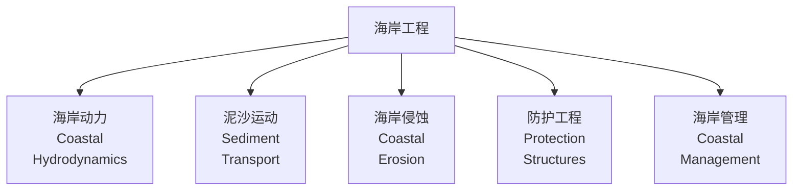

---
aliases: [CoastalEngineering, 海岸工程, CoastalZoneManagement]
tags: ['HydraulicAndMarineEngineering', 'HarborAndCoastalEngineering', 'CoastalEngineering', 'Waves', 'Erosion']
created: 2026-05-17
updated: 2026-05-17
---

# 海岸工程（Coastal Engineering）

## 概述

海岸工程（Coastal Engineering）是研究海岸带（Coastal Zone）自然过程和人类活动影响，进行海岸防护（Coastal Protection）和开发利用的工程学科。海岸带是陆地与海洋相互作用的地带，包括潮间带（Intertidal Zone）、近岸水域和沿海陆地，是人口密集、经济活跃、生态敏感的关键区域。

海岸工程涉及波浪力学（Wave Mechanics）、潮汐动力学（Tidal Dynamics）、泥沙运动（Sediment Transport）、海岸地貌演变和工程结构设计等多学科知识。全球约 40% 的人口居住在距海岸 100 km 范围内，海平面上升（Sea Level Rise）和极端天气事件使海岸工程面临前所未有的挑战。

## 海岸波浪理论

### 波浪基本要素

| 要素 | 符号 | 定义 | 典型量级 |
|------|------|------|----------|
| 波高（Wave Height） | $H$ | 波峰至波谷的垂直距离 | 0.5–5 m（常浪）；>10 m（巨浪） |
| 波长（Wave Length） | $L$ | 相邻波峰间的水平距离 | 10–200 m |
| 周期（Wave Period） | $T$ | 相邻波峰通过某点的时间 | 5–15 s |
| 波速（Wave Celerity） | $C$ | 波形传播速度 | $C = L/T$ |
| 波陡（Wave Steepness） | $\delta$ | $H/L$ | 通常 < 1/7（破碎限） |

### 波浪理论

#### 微幅波理论（Airy Wave Theory / Linear Wave Theory）

适用于波高相对于波长较小的情况：

$$\eta = a \cos(kx - \omega t)$$

其中 $a$ 为波幅，$k = 2\pi/L$ 为波数，$\omega = 2\pi/T$ 为角频率。

色散关系（Dispersion Relation）：

$$\omega^2 = gk \tanh(kh)$$

其中 $h$ 为水深，$g$ 为重力加速度。

深水（$h/L > 0.5$）：$C = \sqrt{gL/(2\pi)}$，波速与波长相关

浅水（$h/L < 0.05$）：$C = \sqrt{gh}$，波速仅与水深相关

#### 有限振幅波理论

| 理论 | 适用条件 | 特点 |
|------|----------|------|
| Stokes 波 | 深水至中等水深 | 波峰变尖、波谷变平 |
| 孤立波（Solitary Wave） | 浅水 | 单个波峰、无波谷 |
| 椭圆余弦波（Cnoidal Wave） | 浅水 | 考虑非线性效应 |

### 波浪传播变形

#### 浅水变形（Shoaling）

波浪从深水向浅水传播时，波高发生变化：

$$\frac{H}{H_0} = K_s = \sqrt{\frac{C_{g0}}{C_g}}$$

其中 $K_s$ 为浅水变形系数，$C_g$ 为群速度。

#### 波浪折射（Refraction）

波浪斜向传入浅水时，波峰线转向与等深线平行：

$$\frac{\sin\alpha_1}{C_1} = \frac{\sin\alpha_2}{C_2}$$

其中 $\alpha$ 为波向与等深线法线的夹角。

#### 波浪绕射（Diffraction）

波浪遇到障碍物或港口口门时向遮蔽区传播：

$$H_d = K_d \cdot H_i$$

其中 $K_d$ 为绕射系数，与口门宽度、波长和位置有关。

#### 波浪反射（Reflection）

$$H_r = K_r \cdot H_i$$

反射系数 $K_r$ 取决于结构物坡度和透水性：垂直墙 $K_r \approx 0.7–1.0$；缓坡 $K_r \approx 0.1–0.3$。

### 波浪破碎（Wave Breaking）

| 破碎类型 | 发生条件 | 特征 |
|----------|----------|------|
| 崩破型（Spilling） | 缓坡、小波陡 | 波峰出现白色泡沫，逐渐破碎 |
| 卷破型（Plunging） | 中等坡度 | 波峰卷曲向前扣击 |
| 激破型（Surging） | 陡坡 | 波浪冲上滩面后破碎 |

破碎波高判据（Miche 判据）：

$$\frac{H_b}{h_b} = 0.88 \tanh\left(\frac{\gamma h_b}{L_0}\right)$$

其中 $\gamma = 2\pi/7 \approx 0.9$。

## 潮汐与海平面

### 潮汐基本理论

潮汐由天体引力产生，主要分潮：

| 分潮 | 符号 | 周期 | 来源 |
|------|------|------|------|
| 主太阴半日潮 | M₂ | 12.42 h | 月球引力 |
| 主太阳半日潮 | S₂ | 12.00 h | 太阳引力 |
| 太阴日潮 | K₁ | 23.93 h | 月球赤纬 |
| 太阳日潮 | O₁ | 25.82 h | 月球轨道倾角 |

潮位预测：

$$\eta(t) = \sum_{i} A_i \cos(\omega_i t + \phi_i)$$

### 设计水位

| 水位类型 | 定义 | 工程应用 |
|----------|------|----------|
| 极端高水位 | 重现期 50–100 年 | 堤顶高程设计 |
| 设计高潮位 | 重现期 20–50 年 | 港口陆域高程 |
| 平均海平面 | 多年平均 | 基准面 |
| 极端低水位 | 重现期 50 年 | 港池疏浚设计 |

## 海岸泥沙运动

### 泥沙分类与特性

| 分类 | 粒径范围 | 运动方式 | 工程意义 |
|------|----------|----------|----------|
| 砾石（Gravel） | >2 mm | 滚动 | 人工沙滩填料 |
| 砂（Sand） | 0.062–2 mm | 推移 + 悬移 | 海滩主体 |
| 粉砂（Silt） | 0.004–0.062 mm | 悬移为主 | 浑浊度来源 |
| 粘土（Clay） | <0.004 mm | 絮凝悬移 | 淤积问题 |

### 起动条件

泥沙起动的 Shields 判据：

$$\theta = \frac{\tau_0}{(\rho_s - \rho)gd} > \theta_c$$

其中 $\theta$ 为 Shields 参数，$\tau_0$ 为底床剪切应力，$\rho_s$ 为泥沙密度，$d$ 为粒径，$\theta_c \approx 0.03–0.06$ 为临界 Shields 参数。

### 沿岸输沙（Longshore Sediment Transport）

沿岸流（Longshore Current）和沿岸输沙是海岸演变的核心驱动力。

沿岸流速度（Komar 公式）：

$$V_l = K \cdot \sqrt{gH_b} \cdot \sin\alpha_b \cdot \cos\alpha_b$$

其中 $\alpha_b$ 为破波波向与岸线的夹角。

沿岸输沙率（CERC 公式）：

$$Q = K \cdot H_b^{5/2} \cdot \sin(2\alpha_b)$$

其中 $K$ 为经验系数，$Q$ 为单位时间单宽输沙量。

## 海岸侵蚀与防护

### 侵蚀原因分析

| 因素 | 机制 | 影响程度 |
|------|------|----------|
| 海平面上升 | 基准面升高、波浪作用增强 | 全球长期趋势 |
| 波浪作用 | 波能输入、泥沙搬运 | 主要动力因素 |
| 风暴潮 | 极端水位 + 巨浪 | 短期剧烈侵蚀 |
| 河流来沙减少 | 水库拦截、采砂 | 泥沙收支失衡 |
| 人工采砂 | 直接移除海滩泥沙 | 局部严重 |
| 海岸工程影响 | 结构物上下游冲刷 | 局部调整 |

### 防护措施

#### 硬性措施（Hard Structures）

| 工程类型 | 结构形式 | 功能 | 局限性 |
|----------|----------|------|--------|
| 海堤（Seawall） | 直立式、斜坡式 | 直接挡浪、保护陆域 | 反射波浪、前滩侵蚀 |
| 护岸（Revetment） | 块石、混凝土板 | 坡面防护 | 外观生硬、生态性差 |
| 丁坝（Groin） | 垂直岸线延伸 | 拦截沿岸流、促淤 | 下游侧侵蚀 |
| 离岸堤（Breakwater） | 平行岸线、离岸布置 | 消浪、形成静水区 | 投资大、维护成本高 |
| 潜堤（Submerged Breakwater） | 潜没式结构 | 消浪而不影响景观 | 效果有限 |

#### 软性措施（Soft Engineering）

| 措施 | 原理 | 应用 |
|------|------|------|
| 人工补沙（Beach Nourishment） | 外部泥沙补充海滩 | 维持海滩宽度 |
| 植被恢复 | 植物固沙、消浪 | 沙丘稳定 |
| 沙丘养护 | 人工沙丘 + 植被 | 自然缓冲带 |
| 滩涂湿地恢复 | 生态缓冲 | 消浪、生态改善 |

### 防护措施选择矩阵

| 海岸类型 | 主要问题 | 推荐措施 |
|----------|----------|----------|
| 砂质海滩 | 侵蚀、变窄 | 人工补沙 + 离岸堤 |
| 基岩海岸 | 淘刷 | 护岸 + 海堤 |
| 粉砂质海岸 | 冲刷、不稳定 | 保滩促淤工程 |
| 红树林海岸 | 生态退化 | 植被恢复 |

## 海岸带管理

### 功能区划

| 功能区 | 范围 | 管理目标 |
|--------|------|----------|
| 开发利用区 | 港口、工业、城镇 | 集约利用、集约建设 |
| 限制利用区 | 生态敏感、灾害风险 | 适度开发、保护措施 |
| 保护恢复区 | 自然保护区、湿地 | 严格保护、生态修复 |

### 环境影响评价

海岸工程环评需评估：

| 影响类型 | 评价内容 | 关键指标 |
|----------|----------|----------|
| 水动力影响 | 波浪、潮流改变 | 流速变化、波高变化 |
| 泥沙影响 | 冲淤平衡改变 | 冲淤量、等深线变化 |
| 生态影响 | 栖息地改变 | 生物量、多样性指数 |
| 地貌影响 | 岸线变化 | 侵蚀/淤积速率 |

## 经典教材与规范

| 教材/规范 | 作者/机构 | 内容重点 |
|-----------|----------|----------|
| 《海岸工程》 | 严恺 | 中国海岸工程经典教材 |
| 《海岸动力学》 | 陈士荫 | 海岸动力过程 |
| 《海港水文规范》JTS 145 | 交通运输部 | 港口工程设计标准 |
| *Coastal Engineering Manual* | USACE | 美国海岸工程手册 |
| *Coastal Processes with Engineering Applications* | Komar | 海岸过程与工程应用 |

## 主要应用领域

- 海岸侵蚀防护（Coastal Erosion Protection）
- 海港建设与维护（Harbor Construction）
- 滨海旅游开发（Coastal Tourism）
- 海洋能源开发（Offshore Energy）
- 沿海城市防灾减灾（Disaster Prevention）
- 海岸生态修复（Coastal Restoration）
- 围海造地（Land Reclamation）

## 相关条目

- [[04_EngineeringAndTechnology/HydraulicAndMarineEngineering/NavalArchitecture/OceanEngineering|海洋工程]]
- [[HarborEngineering|港口工程]]
- [[OffshoreStructures|离岸结构]]
- [[SedimentTransport|泥沙运动]]
- [[WaveEnergy|波浪能]]
- [[ClimateChangeAdaptation|气候适应]]
- [[INDEX|HarborAndCoastalEngineering 索引]]

