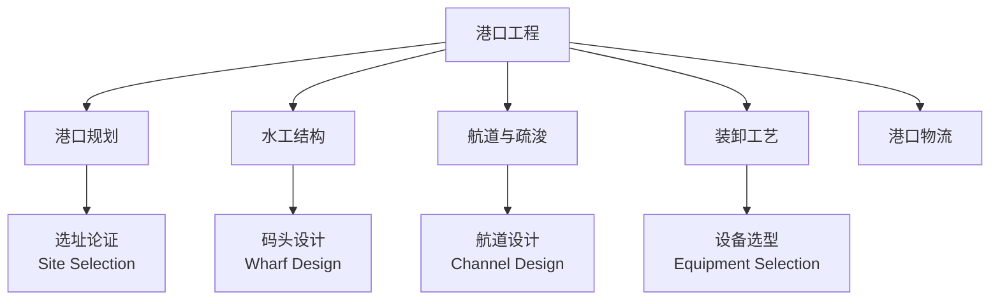

# 港口工程 (Port Engineering)

## 概述

港口工程（Port Engineering）是研究港口规划、设计、施工和运营管理的综合性工程技术学科。港口作为水陆运输的枢纽节点和国际贸易的关键门户，承担着货物装卸、船舶停泊、旅客集散、物流配送等多重功能。港口工程涉及水工结构、航道工程、装卸工艺、物流系统、环境保护等多个专业领域的交叉与融合。

现代港口已从传统的货物转运节点发展为集运输、贸易、工业、信息服务于一体的综合物流平台。第四代港口（Fourth-Generation Port）强调供应链整合、信息化管理和环境可持续性。

## 港口规划与布置

### 港口选址

港口选址是港口工程的首要环节，需综合考虑自然条件、经济条件和社会条件。

**水域条件**：

- **水深条件**：泊位前沿水深需满足设计船型的满载吃水要求，考虑潮汐和泥沙回淤
- **波浪条件**：天然掩护条件或需建设防波堤后的泊稳条件
- **泥沙运动**：河口港和海岸港需分析泥沙来源、运移路径和回淤强度
- **水流条件**：流速不宜过大（一般 <2.5 m/s），流态平顺

**陆域条件**：

- **地形地貌**：陆域纵深需满足堆场、道路和辅助设施布局
- **工程地质**：地基承载力、地震烈度、液化潜力评估
- **用地条件**：后方陆域的可拓展性和土地征用可行性

**交通与经济**：

- **集疏运系统**：铁路、公路、内河、管道的衔接条件
- **经济腹地**：货源生成量和增长潜力
- **城市关系**：与城市规划、产业布局的协调

### 港口布置形式

| 布置形式 | 特点 | 适用条件 |
|----------|------|----------|
| 顺岸式 | 码头前沿线平行于岸线 | 岸线充裕、水域开阔 |
| 突堤式 | 码头伸入水域形成突堤 | 岸线有限、需要多泊位 |
| 挖入式 | 向陆域开挖港池 | 泥沙回淤严重地区 |
| 离岸式 | 码头远离岸线，栈桥连接 | 深水离岸、保护环境 |
| 岛式 | 人工岛布置码头 | 超大型深水港 |

## 码头结构设计与类型

### 重力式码头 (Gravity Wharf)

依靠结构自重抵抗船舶荷载和土压力，适用于地基承载力较好的情况。

**主要结构形式**：

- **沉箱结构**：预制的钢筋混凝土箱形构件，浮运沉放后填充砂石
  - 优点：整体性好、施工速度快、水上工作量小
  - 缺点：预制场地要求高、浮运受气象条件限制

- **方块结构**：由预制混凝土方块逐层砌筑
  - 优点：构件标准化、耐久性好
  - 缺点：施工工序多、接缝处理复杂

- **扶壁结构**：带扶壁的挡土墙结构
  - 适用于墙高较大（>10 m）的情况

**设计荷载**：$P = P_{船舶} + P_{堆货} + P_{机械} + P_{土压力} + P_{波浪}$

其中船舶荷载包括系缆力（bollard pull）和撞击力（berthing energy）：$E = \frac{1}{2} C_m M v^2$，$M$ 为船舶排水量，$v$ 为靠泊速度，$C_m$ 为附加质量系数。

### 高桩码头 (Piled Wharf)

通过桩基将上部荷载传递至深部持力层，适用于软土地基。桩基类型包括钢管桩（强度高、可打入密实砂层）、预应力混凝土桩（耐腐蚀、造价低）和钢管混凝土组合桩。上部结构分为梁板式、承台式和无梁板式。

### 板桩码头 (Sheet Pile Wharf)

由连续板桩墙组成挡土结构，适用于中小型泊位。钢板桩（拉森 U 型、Z 型）可重复使用；钢筋混凝土板桩耐久性好但重量大。

### 码头前沿水深设计

设计低水位（设计通航水位）下的码头前沿水深：

$$D = T + Z_1 + Z_2 + Z_3 + Z_4$$

| 符号 | 名称 | 一般取值 |
|------|------|----------|
| $T$ | 设计船型满载吃水 | 根据船型确定 |
| $Z_1$ | 龙骨下最小富裕水深 | 0.2-0.5 m |
| $Z_2$ | 波浪富裕水深 | 按波高计算 |
| $Z_3$ | 船舶纵倾富裕水深 | 0.15-0.3 m |
| $Z_4$ | 备淤深度 | 0.4-0.6 m |

## 防波堤与海岸防护

### 防波堤结构形式

**斜坡式防波堤 (Rubble Mound Breakwater)**：

- 由堤心石、垫层和护面层组成
- 护面块体：扭王字块（Accropode）、四角锥体（Tetrapod）、扭工字块
- 特点：消波效果好、适应地基变形、可就地取材

**直立式防波堤 (Upright Breakwater)**：

- 沉箱式、方块式、大圆筒式
- 适用于水深较大、地基较好的情况
- 港内反射波较强，需配合消浪设施

**混合式防波堤 (Composite Breakwater)**：

- 下部斜坡 + 上部直立结构
- 综合两者优点，适用于多种水深条件

### 设计波浪标准

防波堤设计波浪通常采用：**重现期 50 年或 100 年一遇的极端波浪**

主要波浪参数：

- $H_s$：有效波高（significant wave height），对应波列中最高 1/3 波浪的平均波高
- $T_p$：谱峰周期（peak period），波浪能量谱密度最大处的周期
- $L$：波长，与周期和水深相关：$L = \frac{gT^2}{2\pi} \tanh\left(\frac{2\pi d}{L}\right)$

## 航道与疏浚工程

### 航道设计

**航道尺度**：

- **航道宽度**：$W = n \cdot B + 2c$，$n$ 为船舶系数，$B$ 为船宽，$c$ 为安全间距
- **航道水深**：按设计船型吃水 + 富余水深计算
- **弯曲半径**：一般不小于最大设计船型长度的 5 倍
- **回旋水域**：供船舶调头，直径一般取 2.0-2.5 倍船长

### 疏浚工程 (Dredging)

港口运营期间需定期进行维护性疏浚，以保持设计水深。

**疏浚方式**：

| 方式 | 适用土质 | 特点 |
|------|----------|------|
| 绞吸式挖泥船 | 淤泥、砂 | 效率高，可吹填 |
| 耙吸式挖泥船 | 淤泥、松散砂 | 自航、机动性好 |
| 抓斗式挖泥船 | 砾石、卵石 | 适应硬土 |
| 链斗式挖泥船 | 砂、砾石 | 精度高 |

**疏浚土处理**：

- 海上抛填：需符合环保要求，远离敏感生态区
- 陆域吹填：用于港口后方陆域形成
- 资源化利用：制作建筑材料、填海造地

## 港口装卸工艺

### 集装箱码头 (Container Terminal)

集装箱码头是现代港口的核心设施，其装卸工艺高度机械化、自动化。

**典型工艺流程**：

**关键设备**：

- **岸桥（Quay Crane, QC）**：前沿装卸船，起重量 40-80 吨，外伸距满足最大船型
- **场桥（Yard Crane）**：轮胎式（RTG）或轨道式（RMG）
- **水平运输**：自动导引车（AGV）、跨运车（Straddle Carrier）、集装箱卡车

**自动化水平**：

- 半自动化码头：自动堆场 + 人工岸桥
- 全自动化码头：自动导引、自动装卸、无人堆场
- 代表：青岛港全自动化集装箱码头、鹿特丹 Maasvlakte 2

### 散货码头 (Bulk Terminal)

**干散货**（矿石、煤炭、粮食）：

- **卸船**：抓斗卸船机、链斗卸船机、螺旋卸船机
- **装船**：移动式装船机、固定式装船机
- **堆取**：堆料机（Stacker）、取料机（Reclaimer）、堆取料机（Stacker-Reclaimer）
- **输送**：带式输送机系统

**液体散货**（原油、成品油、LNG）：

- 专用码头和卸料臂
- 储罐区与管道系统
- 油气回收与消防系统

## 港口安全与环境保护

### 港口安全

- **通航安全**：VTS（船舶交通服务）系统、助航标志、引航服务
- **结构安全**：定期检测、结构健康监测、防撞设施
- **消防与防污染**：消防船、围油栏、溢油应急设施

## 经典教材与规范

- 邱大洪《港口工程》
- 严恺《海港工程》
- 《海港总体设计规范》（JTS 165-2013）
- 《港口工程荷载规范》（JTS 144-1-2010）
- 《防波堤设计与施工规范》（JTS 154-2018）
- PIANC（国际航运协会）相关技术报告

## 主要应用领域

- 商业港口与集装箱枢纽港建设
- 工业码头（电厂、钢厂专用码头）
- 渔港与游艇码头
- 军港与国防设施
- 邮轮母港与客运码头
- 海上风电运维码头

## 相关条目

- [[CoastalEngineering|海岸工程]]
- [[DredgingEngineering|疏浚工程]]
- [[MarineStructure|海洋结构物]]
- [[OffshoreEngineering|海洋工程]]
- [[HydraulicEngineering|水利工程]]
- [[TransportationEngineering|交通运输工程]]
