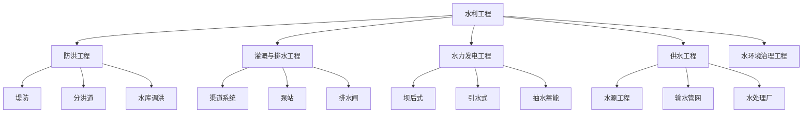

# 水利工程

## 一、概述

水利工程（Hydraulic Engineering）是研究水资源的开发、利用、治理、配置和保护的工程学科。其核心任务包括水资源保障（供水、灌溉）、防洪减灾、水力发电、水生态保护和水环境治理等。

## 二、工程分类

## 三、水工建筑物

### 3.1 主要类型与功能

| 类型 | 功能 | 结构形式 | 典型工程 |
|------|------|---------|---------|
| 挡水建筑物 | 拦截水流，形成水库 | 重力坝、拱坝、土石坝、支墩坝 | 三峡大坝（重力坝） |
| 泄水建筑物 | 宣泄多余水量 | 溢洪道、泄洪洞、溢流坝 | 坝身溢洪道 |
| 取水建筑物 | 引水灌溉/供水 | 进水闸、取水塔、虹吸管 | 多泥沙河流取水 |
| 输水建筑物 | 输送水流 | 渠道、隧洞、渡槽、倒虹吸 | 南水北调渡槽 |
| 河道整治建筑物 | 控制水流与河势 | 丁坝、顺坝、护岸、潜坝 | 黄河险工控导工程 |
| 通航建筑物 | 船舶过坝 | 船闸、升船机 | 三峡双线五级船闸 |

### 3.2 重力坝（Gravity Dam）

重力坝依靠自身重量维持稳定，受力分析：

稳定性分析（抗滑稳定）：

$$
K_s = \frac{f \cdot \Sigma W}{\Sigma P} \geq [K_s]
$$

其中 $f$ 为坝基摩擦系数，$\Sigma W$ 为垂直力总和（自重+扬压力+泥沙压力），$\Sigma P$ 为水平力总和（水压力+波浪压力+地震荷载）。

坝体应力（材料力学法）：

$$
\sigma = \frac{\Sigma W}{B} \pm \frac{6\Sigma M}{B^2}
$$

要求上游面无拉应力或拉应力不超过允许值。

### 3.3 拱坝（Arch Dam）

拱坝将水压力通过拱作用传递至两岸岩体，利用拱结构抗压强度高的特点。

拱圈厚度公式：

$$
T_c = \frac{p R_c}{\sigma_a}
$$

其中 $p$ 为水压力，$R_c$ 为拱圈曲率半径，$\sigma_a$ 为允许压应力。

拱坝的厚高比：薄拱坝 $<0.2$，中厚拱坝 $0.2-0.35$，厚拱坝 $>0.35$。

世界上最高的拱坝——锦屏一级拱坝（305 m）。

### 3.4 土石坝（Earth-Rock Dam）

土石坝由散粒体（土、砂、石）填筑而成，依靠重量和颗粒间摩擦力稳定。

坝坡稳定分析（简化 Bishop 法）：

$$
F_s = \frac{\sum [c_i l_i + (W_i - u_i l_i \cos\alpha_i) \tan\phi_i]}{\sum W_i \sin\alpha_i}
$$

防渗系统：心墙、斜墙、面板、截水墙、灌浆帷幕。

## 四、水文分析

### 4.1 设计洪水（Design Flood）

洪水频率 $P$ 与重现期 $T$：

$$
P = \frac{1}{T} \quad \text{或} \quad T = \frac{1}{P}
$$

我国水工建筑物设计洪水标准：

| 建筑物等级 | 正常运用（设计洪水） | 非常运用（校核洪水） |
|-----------|-------------------|-------------------|
| I 级 | 1000-500 年一遇 | PMF（可能最大洪水）或 10000 年 |
| II 级 | 500-100 年一遇 | 10000-2000 年一遇 |
| III 级 | 100-50 年一遇 | 2000-1000 年一遇 |
| IV 级 | 50-30 年一遇 | 1000-300 年一遇 |

频率曲线线型：P-III 型（Pearson-III）曲线是中国水文计算的标准线型。

### 4.2 流量计算

**明渠均匀流（谢才公式，Chézy Formula）**：

$$
v = C\sqrt{Ri}
$$

其中 $v$ 为流速，$C$ 为谢才系数，$R$ 为水力半径，$i$ 为水力坡降。

Manning 公式：

$$
v = \frac{1}{n} R^{2/3} i^{1/2}
$$

其中 $n$ 为曼宁糙率系数（Manning's Roughness Coefficient）。

流量：

$$
Q = A \cdot v = A \cdot \frac{1}{n} R^{2/3} i^{1/2}
$$

### 4.3 调洪演算

水库调洪的基本原理——水量平衡方程：

$$
\frac{Q_1 + Q_2}{2} \Delta t - \frac{q_1 + q_2}{2} \Delta t = V_2 - V_1
$$

其中 $Q$ 为入库流量，$q$ 为出库流量，$\Delta t$ 为时段长，$V$ 为库容。

调洪演算求解最大下泄流量 $q_{\max}$ 和最高洪水位 $Z_{\max}$。

## 五、水力学基础

### 5.1 明渠水流

**临界水深（Critical Depth）**：

$$
\frac{Q^2 B_c}{g A_c^3} = 1
$$

其中 $A_c$ 为临界水深对应的过水断面积，$B_c$ 为水面宽度。

弗劳德数（Froude Number）：

$$
Fr = \frac{v}{\sqrt{gh}}
$$

- $Fr < 1$：缓流（Subcritical Flow）
- $Fr = 1$：临界流（Critical Flow）
- $Fr > 1$：急流（Supercritical Flow）

### 5.2 水跃（Hydraulic Jump）

急流过渡到缓流时的水面突变现象。

共轭水深关系（矩形断面）：

$$
\frac{h_2}{h_1} = \frac{1}{2} \left( \sqrt{1 + 8Fr_1^2} - 1 \right)
$$

水跃消能率：

$$
\Delta E = \frac{(h_2 - h_1)^3}{4h_1 h_2}
$$

## 六、施工导流

### 6.1 导流方式

| 导流方式 | 方法 | 适用条件 |
|---------|------|---------|
| 分期围堰 | 围堰+明渠/隧洞导流 | 宽河谷 |
| 隧洞导流 | 导流隧洞+上下游围堰 | 狭窄河谷 |
| 明渠导流 | 开挖人工明渠 | 岸坡宽阔 |
| 涵管导流 | 坝下埋设涵管 | 中小型工程 |
| 渡汛 | 坝体临时挡水断面 | 碾压混凝土坝 |

### 6.2 截流

截流难度取决于龙口流速和落差，通常采用立堵法或平堵法。

龙口水力计算：

$$
Q = \mu B \sqrt{2g} H^{3/2}
$$

其中 $\mu$ 为流量系数，$B$ 为龙口宽度，$H$ 为堰顶水头。

## 七、灌溉与排水

### 7.1 灌溉制度

灌水定额（净定额）：

$$
m = 10 \gamma H (\beta_{\max} - \beta_0) \quad (\text{mm})
$$

其中 $\gamma$ 为土壤干容重，$H$ 为计划湿润层深度，$\beta_{\max}$ 为田间持水率，$\beta_0$ 为灌前土壤含水率。

灌溉水利用系数：

$$
\eta = \eta_s \cdot \eta_c \cdot \eta_f
$$

其中 $\eta_s$ 为渠系水利用系数，$\eta_c$ 为田间水利用系数，$\eta_f$ 为回归水利用系数。

### 7.2 排水工程

排水模数（设计排涝流量）：

$$
q = \frac{P - E - \Delta W}{86.4 T}
$$

其中 $P$ 为设计暴雨量，$E$ 为蒸发量，$\Delta W$ 为土壤蓄水量，$T$ 为排涝历时。

## 八、水力发电

### 8.1 水电站类型

| 类型 | 工作水头 | 特点 | 示例 |
|------|---------|------|------|
| 坝后式 | 高/中水头 | 厂房位于坝后 | 三峡（1820 万 kW） |
| 引水式 | 中/低水头 | 通过引水隧洞获得落差 | 二滩 |
| 混合式 | 中/高水头 | 坝 + 引水结合 | 漫湾 |
| 抽水蓄能 | - | 低谷储能，高峰发电 | 天荒坪 |
| 潮汐能 | 低水头 | 利用潮差发电 | 江厦 |
| 径流式 | 无调节 | 天然流量发电 | - |

### 8.2 水轮机

水轮机是把水流能量转换为旋转机械能的设备。比转速 $n_s$ 是水轮机选型的核心参数：

$$
n_s = \frac{n\sqrt{P}}{H^{5/4}}
$$

| 水轮机类型 | 适用水头 | 比转速范围 |
|-----------|---------|-----------|
| 冲击式（Pelton） | > 300 m | 10-70 |
| 混流式（Francis） | 30-700 m | 50-400 |
| 轴流式（Kaplan） | < 60 m | 300-1000 |
| 贯流式（Bulb） | < 20 m | 600-1200 |

水轮机出力：

$$
P = \eta \rho g Q H
$$

其中 $\eta$ 为效率（0.85-0.95），$Q$ 为流量，$H$ 为有效水头。

### 8.3 水力发电的可持续发展

- 水库移民：中国三峡工程移民约 130 万人
- 生态影响：鱼类洄游阻隔、水温变化、泥沙淤积
- 温室气体：热带水库淹没有机质产生 CH$_4$（比亚热带/温带严重）
- 减排效益：水电替代煤电可减少 CO$_2$ 排放约 800 g/kWh

## 九、水力工程数值模拟

| 模拟类型 | 软件 | 应用 |
|---------|------|------|
| 水力学（1D/2D） | Mike 11, HEC-RAS | 河道洪水演进 |
| 水力学（2D/3D） | FLOW-3D, OpenFOAM | 溢洪道、消力池 |
| 水文模型 | SWAT, HSPF | 流域产汇流 |
| 地下水 | MODFLOW, FEFLOW | 渗流分析 |
| 结构分析 | ANSYS, ABAQUS | 大坝应力/抗震 |
| 渗流/固结 | GeoStudio (SEEP/W, SLOPE/W) | 坝坡稳定 |

## 十、水利工程管理

- **大坝安全监测**：变形（GPS、引张线）、渗流（测压管、量水堰）、应力应变
- **水库调度**：防洪调度图、兴利调度图、生态流量保障
- **河道管理**：河床演变监测、岸线管控、采砂管理
- **现代化技术**：GIS+BIM 数字孪生、自动化监测、智慧水利平台

## 相关条目
- [[04_EngineeringAndTechnology/HydraulicAndMarineEngineering/HydraulicEngineering/INDEX|当前目录索引]]
- [[04_EngineeringAndTechnology/HydraulicAndMarineEngineering/NavalArchitecture/NavalArchitecture]]
