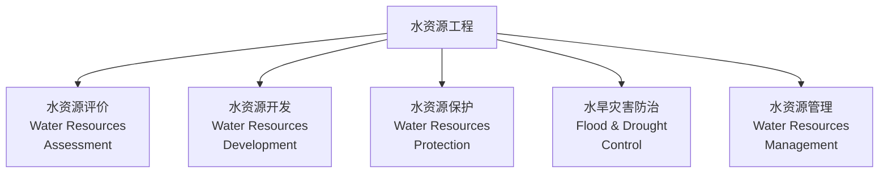
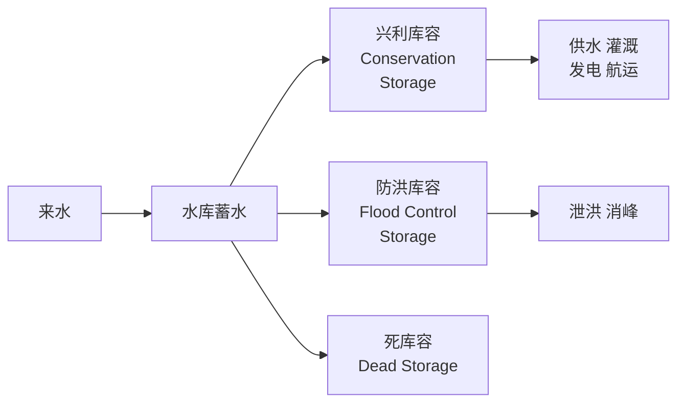

---
aliases: [WaterResources, 水资源工程, WaterResourcesEngineering, Hydrology]
tags: ['HydraulicAndMarineEngineering', 'HydraulicEngineering', 'WaterResources', 'Hydrology', 'Irrigation']
created: 2026-05-17
updated: 2026-05-17
---

# 水资源工程（Water Resources Engineering）

## 概述

水资源工程（Water Resources Engineering）是研究水资源的开发、利用、保护和管理，以及防治水旱灾害的工程学科。它融合了水文学（Hydrology）、水力学（Hydraulics）、经济学（Economics）和环境科学（Environmental Science）的原理，旨在实现水资源的可持续利用（Sustainable Utilization）。

全球淡水资源仅占地球总水量的约 2.5%，其中易于利用的河川径流和浅层地下水不足 1%。随着人口增长、经济发展和气候变化（Climate Change）的影响，水资源短缺（Water Scarcity）和洪涝灾害（Flood Disaster）已成为全球性挑战。水资源工程通过科学的规划、设计和管理，协调不同用水部门之间的矛盾，保障供水安全、生态安全和防洪安全。

## 水文学基础

### 水文循环

水文循环（Hydrologic Cycle）是水资源形成的自然基础：

$$P = E + R + \Delta S + G$$

其中 $P$ 为降水量（Precipitation），$E$ 为蒸发蒸腾量（Evapotranspiration），$R$ 为径流量（Runoff），$\Delta S$ 为蓄水量变化，$G$ 为地下水交换量。

### 径流计算

#### 降雨径流关系

单位线法（Unit Hydrograph）是流域汇流计算的经典方法：

$$Q(t) = \int_0^t i(\tau) \cdot u(t-\tau) \, d\tau$$

其中 $Q(t)$ 为出口断面流量过程，$i(\tau)$ 为净雨过程，$u(t)$ 为单位线。

#### 设计洪水

设计洪水的推求方法：

| 方法 | 适用条件 | 优点 | 局限性 |
|------|----------|------|--------|
| 频率分析法 | 有长系列观测资料 | 统计基础坚实 | 需要 30 年以上资料 |
| 暴雨推求法 | 资料短缺地区 | 物理基础明确 | 参数地区移用困难 |
| 可能最大降水（PMP） | 大型水利工程 | 安全性高 | 计算复杂、结果偏安全 |

### 水文统计

皮尔逊 III 型分布常用于水文频率分析：

$$f(x) = \frac{\beta^\alpha}{\Gamma(\alpha)} (x-a_0)^{\alpha-1} e^{-\beta(x-a_0)}$$

## 水资源评价

### 水资源量计算

#### 地表水资源量

地表水资源量通常以河川径流量（River Runoff）表征：

$$W_s = R_{\text{天然}} - R_{\text{不可利用}}$$

#### 地下水资源量

地下水资源量采用补给量法计算：

$$W_g = Q_{\text{降水入渗}} + Q_{\text{河道渗漏}} + Q_{\text{侧向补给}} - Q_{\text{排泄}}$$

#### 水资源总量

水资源总量需扣除地表水与地下水的重复计算量：

$$W_t = W_s + W_g - W_{\text{重复}}$$

### 水资源评价指标

| 指标名称 | 计算公式 | 分级标准 |
|----------|----------|----------|
| 人均水资源量 | $W_t / P$ | >3000 m³/人：丰富；1700–3000：轻度短缺；1000–1700：中度短缺；<1000：重度短缺 |
| 亩均水资源量 | $W_t / A$ | >2000 m³/亩：丰富；<1000 m³/亩：短缺 |
| 水资源开发利用率 | $(W_{\text{取用}} / W_t) \times 100\%$ | <40%：可持续；40–60%：紧张；>60%：过度开发 |
| 干旱指数 | $E_0 / P$ | <1.0：湿润；1.0–3.0：半湿润；3.0–7.0：半干旱；>7.0：干旱 |

## 水资源开发利用工程

### 蓄水工程

#### 水库（Reservoir）

水库通过拦蓄洪水和调节径流，实现防洪、供水、发电、灌溉等多重目标。

水库特征水位：

| 水位名称 | 定义 | 功能 |
|----------|------|------|
| 死水位（Dead Water Level） | 水库运行的最低水位 | 保证进水口淹没、泥沙淤积空间 |
| 正常蓄水位（Normal Pool Level） | 正常运行条件下的最高水位 | 确定兴利库容 |
| 防洪限制水位（Flood Limit Level） | 汛期允许蓄水的上限 | 预留防洪库容 |
| 设计洪水位（Design Flood Level） | 设计洪水条件下的最高水位 | 确定大坝高度 |
| 校核洪水位（Check Flood Level） | 校核洪水条件下的最高水位 | 大坝安全校核 |

### 引水工程

#### 引水枢纽

引水工程包括引水闸（Diversion Gate）、泵站和渠道系统。引水能力的计算：

$$Q = C_d \cdot A \cdot \sqrt{2gH}$$

其中 $C_d$ 为流量系数，$A$ 为过水断面面积，$H$ 为上下游水头差。

#### 跨流域调水

跨流域调水（Inter-basin Water Transfer）是解决区域水资源分布不均的重大工程措施：

| 工程名称 | 调水规模 | 主要功能 |
|----------|----------|----------|
| 南水北调中线 | 95 亿 m³/年 | 京、津、冀、豫供水 |
| 南水北调东线 | 88 亿 m³/年 | 苏、鲁、冀、津供水 |
| 引滦入津 | 10 亿 m³/年 | 天津城市供水 |

### 提水工程

#### 泵站设计

泵站（Pumping Station）的扬程计算：

$$H = H_{\text{静扬程}} + h_{\text{沿程损失}} + h_{\text{局部损失}} + \frac{v^2}{2g}$$

水泵功率：

$$P = \frac{\rho g Q H}{\eta}$$

其中 $\eta$ 为水泵效率，通常 0.7–0.85。

## 灌溉工程

### 灌溉制度

灌溉定额（Irrigation Quota）的计算：

$$M = E_{\text{作物需水}} - P_{\text{有效降水}} + W_{\text{渗漏}}$$

作物需水量采用 Penman-Monteith 公式计算：

$$ET_0 = \frac{0.408 \Delta (R_n - G) + \gamma \frac{900}{T+273} u_2 (e_s - e_a)}{\Delta + \gamma (1 + 0.34 u_2)}$$

### 灌溉方式

| 灌溉方式 | 水分利用效率 | 适用条件 | 优缺点 |
|----------|-------------|----------|--------|
| 漫灌（Flood Irrigation） | 40–50% | 地形平坦、水源充足 | 简单但浪费水 |
| 沟灌（Furrow Irrigation） | 50–60% | 行播作物 | 较漫灌节水 |
| 喷灌（Sprinkler） | 70–80% | 多种作物、地形起伏 | 投资较高 |
| 滴灌（Drip Irrigation） | 85–95% | 经济作物、温室 | 最节水但易堵塞 |
| 微喷灌（Micro-sprinkler） | 80–90% | 果树、花卉 | 介于喷灌和滴灌之间 |

## 防洪工程

### 防洪体系

#### 工程措施

| 工程类型 | 功能 | 典型结构 |
|----------|------|----------|
| 堤防（Levee） | 约束洪水、保护两岸 | 土堤、混凝土防洪墙 |
| 水库 | 拦蓄洪水、消峰滞洪 | 重力坝、土石坝 |
| 蓄滞洪区 | 分蓄超额洪水 | 分洪闸、滞洪洼地 |
| 河道整治 | 增大泄洪能力 | 裁弯取直、护岸工程 |

#### 非工程措施

- 洪水预报预警系统（Flood Forecasting and Warning）
- 洪水风险图编制
- 洪水保险制度
- 土地利用规划与洪水管理
- 应急响应预案

### 防洪标准

| 防护对象 | 防洪标准（重现期） |
|----------|-------------------|
| 特大城市 | 200 年一遇 |
| 大城市 | 100–200 年一遇 |
| 中等城市 | 50–100 年一遇 |
| 一般城镇 | 20–50 年一遇 |
| 农田 | 10–20 年一遇 |

## 水资源管理与保护

### 水资源配置

基于规则的水库调度：

$$\text{下泄流量} = \begin{cases} Q_{\text{生态基流}} & \text{if } V < V_{\text{死}} \\ Q_{\text{供水}} + Q_{\text{生态}} & \text{if } V_{\text{死}} \leq V < V_{\text{汛限}} \\ Q_{\text{供水}} + Q_{\text{生态}} + Q_{\text{弃水}} & \text{if } V \geq V_{\text{汛限}} \end{cases}$$

### 水生态修复

- 河流生态基流（Ecological Base Flow）保障
- 湿地（Wetland）保护与恢复
- 水土保持（Soil and Water Conservation）
- 地下水超采治理

## 经典教材与规范

| 教材/规范 | 作者/机构 | 内容重点 |
|-----------|----------|----------|
| 《水资源规划与管理》 | 左其亭 | 水资源系统分析 |
| 《水资源利用》 | 任伯承 | 水资源开发利用 |
| 《工程水文学》 | 詹道江 | 水文计算原理 |
| 《中国水资源公报》 | 水利部 | 年度水资源状况 |
| 《水资源评价导则》SL/T 238 | 水利部 | 水资源评价技术标准 |

## 主要应用领域

- 水资源规划与管理（Water Resources Planning）
- 水利工程建设（Water Conservancy Engineering）
- 城市供水系统（Urban Water Supply）
- 农业灌溉（Agricultural Irrigation）
- 生态环境保护（Ecological Protection）
- 防洪减灾（Flood Control and Disaster Reduction）
- 水电开发（Hydropower Development）

## 相关条目

- [[Hydrology|水文学]]
- [[HydraulicEngineering|水工结构]]
- [[04_EngineeringAndTechnology/CivilEngineering/IrrigationEngineering|灌溉工程]]
- [[FloodControl|防洪工程]]
- [[DamEngineering|大坝工程]]
- [[WaterQuality|水质学]]
- [[INDEX|HydraulicEngineering 索引]]

