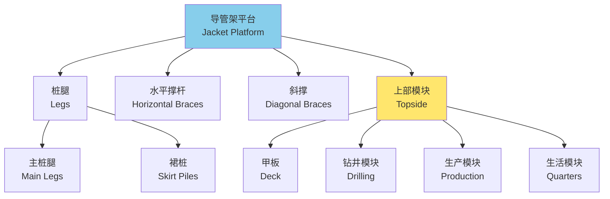
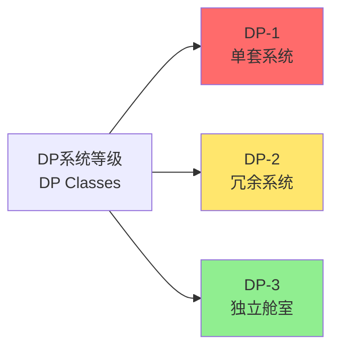
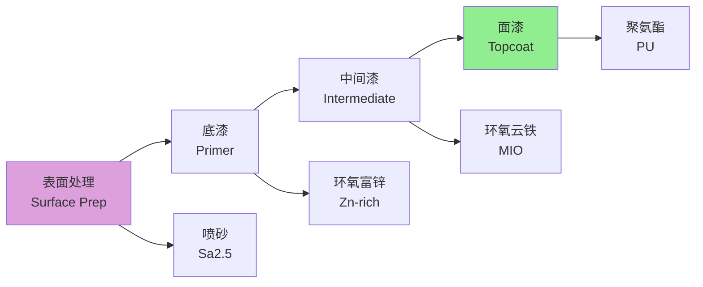

---
aliases:
  - Marine Structures
  - Offshore Structures
  - Subsea Systems
  - Ocean Engineering
tags:
  - engineering
  - marine
  - offshore
  - structures
  - corrosion
  - hydrodynamics
---

# 海洋结构物 (Marine Structures)

## 概述 (Overview)

海洋结构物（Marine Structures）是指在海洋环境中建造和使用的各类工程结构，包括固定式平台、浮式平台、海底管线、水下生产系统等。这些结构物需要承受恶劣的海洋环境载荷，包括波浪、海流、风、海冰和地震等。

## 海洋环境载荷 (Environmental Loads)

### 波浪载荷 (Wave Loading)

海浪通常用波高 $H$、周期 $T$ 和波长 $\lambda$ 描述。对于规则波，艾里波理论（Airy Wave Theory）给出：

$$\eta(x,t) = \frac{H}{2} \cos(kx - \omega t)$$

色散关系：

$$\omega^2 = gk \tanh(kd)$$

深水近似（$d > \lambda/2$）：

$$\omega^2 = gk, \quad c = \frac{gT}{2\pi}$$

### 莫里森方程 (Morison Equation)

对于小尺度构件（直径 $D < \lambda/5$），波浪力计算采用莫里森方程：

$$F = F_D + F_I = \frac{1}{2} \rho C_D D u|u| + \rho C_M \frac{\pi D^2}{4} \frac{\partial u}{\partial t}$$

| 参数 | 符号 | 典型值 | 说明 |
|------|------|--------|------|
| 阻力系数 | $C_D$ | $0.6-1.2$ | 与雷诺数有关 |
| 惯性力系数 | $C_M$ | $1.5-2.0$ | $C_M = 1 + C_a$ |
| 附加质量系数 | $C_a$ | $0.5-1.0$ | 圆柱体 $C_a = 1.0$ |

### 随机海浪 (Random Seas)

实际海浪是不规则的，通常用波能谱描述。皮尔逊-莫斯科维茨谱（Pierson-Moskowitz Spectrum）：

$$S_{\eta}(\omega) = \frac{5}{16} H_s^2 \omega_p^4 \omega^{-5} \exp\left[-\frac{5}{4}\left(\frac{\omega_p}{\omega}\right)^4\right]$$

$H_s$ 为有义波高，$\omega_p$ 为谱峰频率。

## 固定式平台 (Fixed Platforms)

### 导管架平台 (Jacket Platforms)

导管架是最常见的固定式平台形式，由钢管构件焊接成空间桁架结构。

### 重力式平台 (Gravity-Based Structures)

依靠自身重量保持稳定的混凝土平台，典型应用于：

| 类型 | 特点 | 适用水深 |
|------|------|----------|
| 混凝土重力式 | 大型沉箱基础 | 10-300m |
| 混合式 | 混凝土基座+钢导管架 | 100-400m |
| 顺应塔 | 细长柔性结构 | 300-1000m |

## 浮式平台 (Floating Platforms)

### 平台类型 (Platform Types)

| 类型 | 缩写 | 特征 | 适用水深 |
|------|------|------|----------|
| 半潜式平台 | Semi | 下船体提供稳性 | 300-3000m |
| 张力腿平台 | TLP | 张力筋腱系泊 | 300-1500m |
| Spar | Spar | 单柱深吃水 | 500-3000m |
| FPSO | FPSO | 储油卸油功能 | 100-3000m |
| FLNG | FLNG | 液化天然气生产 | 200-3000m |

### 系泊系统 (Mooring Systems)

系泊线恢复力：

$$T = T_0 + k_{eq} \cdot \delta$$

其中 $T_0$ 为预张力，$k_{eq}$ 为等效刚度，$\delta$ 为位移。

系泊线静态方程（悬链线）：

$$y = a \left(\cosh\frac{x}{a} - 1\right), \quad a = \frac{T_H}{w}$$

$w$ 为单位长度水中重量。

### 动力定位 (Dynamic Positioning)

DP系统通过推进器自动保持位置。控制方程：

$$\tau = K_p \cdot e + K_i \int e \, dt + K_d \frac{de}{dt}$$

DP等级分类：

## 海底系统 (Subsea Systems)

### 海底生产系统 (Subsea Production)

海底生产系统组成：

| 组件 | 功能 | 关键技术 |
|------|------|----------|
| 采油树（XMT） | 井口控制 | 高压密封 |
| 管汇（Manifold） | 多井汇集 | 流动保障 |
| 管道终端（PLET） | 管线连接 | 热胀补偿 |
| 跨接管（Jumper） | 设备连接 | 柔性设计 |
| 脐带缆（Umbilical） | 液压/电力/信号 | 复合缆 |

### 立管系统 (Riser Systems)

立管是连接海底与海面的关键构件。类型包括：

- **刚性立管（Rigid Riser）**：钢管，适用于固定平台
- **柔性立管（Flexible Riser）**：多层复合结构，适用于浮式平台
- **塔式立管（SCR）**：钢悬链线立管，适用于Spar和TLP
- **顶部张紧立管（TTR）**：张力补偿，适用于TLP

立管疲劳分析：

$$D = \sum \frac{n_i}{N_i} < 1.0$$

Miner累积损伤准则。

## 腐蚀与防护 (Corrosion and Protection)

### 海洋腐蚀环境 (Corrosive Environment)

海洋腐蚀分区：

| 区域 | 环境特征 | 腐蚀速率 (mm/年) |
|------|----------|------------------|
| 大气区 | 盐雾、紫外线 | $0.05-0.2$ |
| 飞溅区 | 干湿交替、富氧 | $0.3-0.8$ |
| 潮差区 | 周期性浸没 | $0.2-0.5$ |
| 全浸区 | 海水、生物 | $0.1-0.3$ |
| 海泥区 | 缺氧、微生物 | $0.05-0.15$ |

### 阴极保护 (Cathodic Protection)

牺牲阳极法：

$$I_{req} = A \cdot i_{req}$$

所需阳极质量：

$$M = \frac{I_{req} \cdot t \cdot 8760}{\varepsilon \cdot C}$$

$\varepsilon$ 为阳极电流效率，$C$ 为阳极电容量（A·h/kg）。

外加电流法：

$$V = I_{req} \cdot R_{total}$$

$R_{total}$ 包括海水电阻、涂层电阻和极化电阻。

### 涂层保护 (Coating Protection)

典型涂层体系：

## 结构分析 (Structural Analysis)

### 疲劳分析 (Fatigue Analysis)

S-N曲线（应力-寿命曲线）：

$$N \cdot S^m = A$$

Palmgren-Miner累积损伤：

$$D = \sum_{i} \frac{n_i}{N_i}$$

设计寿命要求：$D \leq 0.1$（安全系数10）。

### 断裂力学评估 (Fracture Mechanics)

应力强度因子：

$$K_I = Y \sigma \sqrt{\pi a}$$

断裂判据：

$$K_I \leq K_{IC}/\gamma_m$$

其中 $\gamma_m$ 为材料安全系数。

## 参考文献 (References)

1. Chakrabarti, S. K. (2005). *Handbook of Offshore Engineering*. Elsevier.
2. Bartlrop, N. D. P. (1998). *Floating Structures: A Guide for Design and Analysis*. Elsevier.
3. DNV GL. (2017). *DNVGL-ST-0126: Support structures for wind turbines*.
4. API RP 2A-WSD. (2014). *Planning, Designing and Constructing Fixed Offshore Platforms*.

---

**相关概念**: [[Naval Architecture|船舶设计]] | [[Offshore Engineering|海洋工程]] | [[Fracture Mechanics|断裂力学]] | [[Corrosion Engineering|腐蚀工程]]
