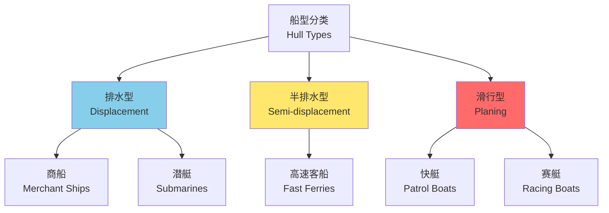
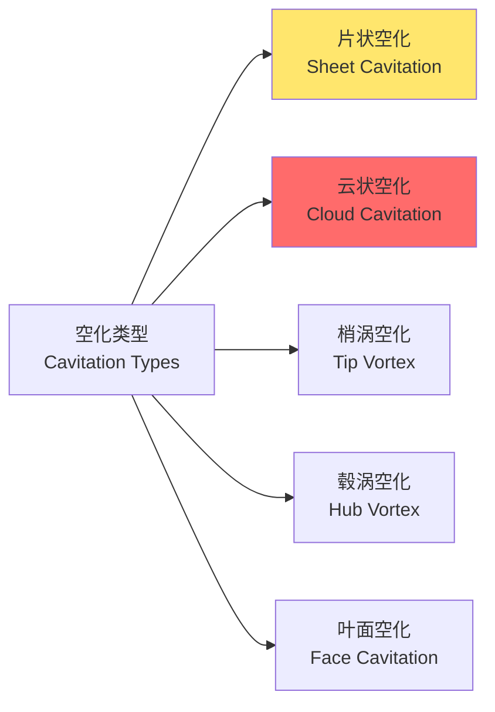
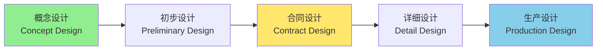

---
aliases:
  - Naval Architecture
  - Ship Design
  - Hull Design
  - Marine Engineering
tags:
created: 2026-05-17
updated: 2026-05-17
  - engineering
  - marine
  - naval
  - hydrodynamics
  - shipbuilding
  - offshore
---

# 船舶设计 (Naval Architecture)

## 概述 (Overview)

船舶设计（Naval Architecture）是综合应用流体力学、结构力学、材料科学等多学科知识，进行船舶及相关海洋结构物设计的工程领域。船舶设计需要平衡性能、安全、经济性和环保等多方面要求。

## 船体几何 (Hull Geometry)

### 主尺度 (Principal Dimensions)

描述船体大小的基本参数：

| 参数 | 符号 | 定义 | 典型比值 |
|------|------|------|----------|
| 总长（LOA） | $L_{OA}$ | 船体最前端到最后端 | - |
| 垂线间长（LPP） | $L_{PP}$ | 首垂线到尾垂线 | 基准长度 |
| 型宽 | $B$ | 两舷最大宽度 | $B/L \approx 0.1-0.2$ |
| 型深 | $D$ | 龙骨到主甲板 | $D/L \approx 0.05-0.1$ |
| 设计吃水 | $T$ | 龙骨到设计水线 | $T/L \approx 0.03-0.06$ |
| 方形系数 | $C_b$ | $\nabla/(L \cdot B \cdot T)$ | $0.5-0.85$ |

### 船体型线 (Hull Lines)

船体表面由型线图（Lines Plan）定义，包括三个投影：

- **半宽水线图（Waterlines）**：水平剖面
- **纵剖线图（Buttocks）**：纵向垂直剖面
- **横剖线图（Body Plan）**：横向剖面

水线面系数：

$$C_w = \frac{A_w}{L \cdot B}$$

中横剖面系数：

$$C_m = \frac{A_m}{B \cdot T}$$

棱形系数：

$$C_p = \frac{\nabla}{A_m \cdot L} = \frac{C_b}{C_m}$$

### 船型分类 (Hull Form Types)

## 浮性与稳性 (Buoyancy and Stability)

### 浮力原理 (Buoyancy Principle)

根据阿基米德原理（Archimedes' Principle）：

$$\Delta = \rho g \nabla$$

$\Delta$ 为排水量（Displacement），$\nabla$ 为排水体积。

船舶重量方程：

$$\Delta = W_{structure} + W_{machinery} + W_{fuel} + W_{cargo} + W_{misc}$$

### 初稳性 (Initial Stability)

初稳性高（Metacentric Height）：

$$GM = KB + BM - KG$$

其中：
- $KB$：浮心高度
- $BM = \frac{I_T}{\nabla}$：横稳心半径
- $KG$：重心高度
- $I_T$：水线面对纵向轴的惯性矩

横倾复原力矩：

$$M_R = \Delta \cdot GM \cdot \sin\phi$$

对于小角度横倾（$\phi < 10°$）：

$$M_R \approx \Delta \cdot GM \cdot \phi$$

稳性判据：

| 船舶类型 | 最小 GM 值 | 说明 |
|----------|----------|------|
| 客船 | GM > 0.15m | 舒适性要求 |
| 货船 | GM > 0.3m | 稳性储备 |
| 军舰 | GM > 0.5m | 武器平台稳定性 |
| 渔船 | GM > 0.45m | 恶劣海况 |

### 大倾角稳性 (Large Angle Stability)

复原力臂（Righting Arm）：

$$GZ = KN - KG \sin\phi$$

静稳性曲线（Static Stability Curve）特征：

- 初稳性高：$GM = \left.\frac{d(GZ)}{d\phi}\right|_{\phi=0}$
- 最大复原力臂：$GZ_{max}$ 及其对应角 $\phi_{max}$
- 稳性消失角：$\phi_v$（$GZ = 0$ 的角度）
- 稳性范围：$0$ 到 $\phi_v$

IMO 稳性要求：

- 初稳性高 $GM > 0.15$ m
- 横倾角 $30°$ 时 $GZ \geq 0.2$ m
- 最大 $GZ$ 对应角 $\geq 25°$

## 船舶阻力 (Ship Resistance)

### 阻力成分 (Resistance Components)

总阻力分解：

$$R_T = R_F + R_R + R_{AW} + R_{AA}$$

| 阻力成分 | 符号 | 成因 | 占比 |
|----------|------|------|------|
| 摩擦阻力 | $R_F$ | 黏性剪切 | 70-80% |
| 兴波阻力 | $R_W$ | 重力波 | 10-25% |
| 黏压阻力 | $R_{PV}$ | 黏性压力 | 5-10% |
| 空气阻力 | $R_{AA}$ | 上层建筑 | 2-4% |

### 弗劳德数 (Froude Number)

$$Fr = \frac{V}{\sqrt{gL}}$$

兴波阻力系数：

$$C_W = \frac{R_W}{\frac{1}{2}\rho S V^2}$$

弗劳德数对兴波阻力的影响：

| 弗劳德数 | 流动特征 | 兴波阻力 |
|----------|----------|----------|
| $Fr < 0.25$ | 亚临界 | 较低 |
| $Fr \approx 0.4$ | 阻力峰 | 显著增加 |
| $Fr > 0.5$ | 超临界 | 可能降低 |

### 有效功率 (Effective Power)

$$P_E = R_T \cdot V$$

推进效率：

$$\eta_D = \eta_H \cdot \eta_0 \cdot \eta_R$$

其中：
- $\eta_H$：船身效率
- $\eta_0$：螺旋桨敞水效率
- $\eta_R$：相对旋转效率

## 船舶推进 (Ship Propulsion)

### 螺旋桨理论 (Propeller Theory)

进速系数（Advance Coefficient）：

$$J = \frac{V_A}{nD}$$

推力系数、转矩系数：

$$K_T = \frac{T}{\rho n^2 D^4}, \quad K_Q = \frac{Q}{\rho n^2 D^5}$$

敞水效率：

$$\eta_0 = \frac{T \cdot V_A}{2\pi n Q} = \frac{J}{2\pi} \cdot \frac{K_T}{K_Q}$$

### 螺旋桨空化 (Cavitation)

空化数（Cavitation Number）：

$$\sigma = \frac{p_0 - p_v}{\frac{1}{2}\rho V^2}$$

空化类型：

## 船舶结构 (Ship Structures)

### 纵向强度 (Longitudinal Strength)

船体梁弯曲应力：

$$\sigma = \frac{M \cdot y}{I}$$

总纵弯矩由静水弯矩和波浪弯矩叠加：

$$M_T = M_S + M_W$$

许用应力标准（按船级社规范）：

| 构件类型 | 许用应力 (MPa) | 说明 |
|----------|----------------|------|
| 甲板 | $0.5 \sigma_y$ | 拉应力 |
| 底部 | $0.5 \sigma_y$ | 压应力 |
| 舷侧 | $0.6 \sigma_y$ | 剪切 |

### 局部强度 (Local Strength)

板格弯曲（Plate Bending）：

$$\sigma_{max} = k \cdot p \cdot \left(\frac{b}{t}\right)^2$$

$k$ 为边界条件系数，$b$ 为短边长度，$t$ 为板厚。

骨架梁弯曲：

$$\sigma = \frac{M}{Z}$$

$Z$ 为剖面模数。

## 船舶设计流程 (Ship Design Process)

### 设计阶段 (Design Stages)

| 设计阶段 | 内容 | 输出 |
|----------|------|------|
| 概念设计 | 船型选择、主尺度确定 | 技术规格书 |
| 初步设计 | 型线设计、总布置 | 基本图纸 |
| 合同设计 | 技术协议、报价基础 | 合同文件 |
| 详细设计 | 结构、舾装、系统 | 送审图纸 |
| 生产设计 | 建造工艺、放样 | 施工图纸 |

## 参考文献 (References)

1. Schneekluth, H., & Bertram, V. (1998). *Ship Design for Efficiency and Economy*. Butterworth-Heinemann.
2. Rawson, K. J., & Tupper, E. C. (2001). *Basic Ship Theory* (5th ed.). Butterworth-Heinemann.
3. Carlton, J. S. (2018). *Marine Propellers and Propulsion* (4th ed.). Butterworth-Heinemann.
4. 中国船级社. (2023). 《钢质海船入级规范》.

---

**相关概念**: [[Marine Structures|海洋结构物]] | [[Offshore Engineering|海洋工程]] | [[Aerodynamics|空气动力学]] | [[Fluid Dynamics|流体力学]]
