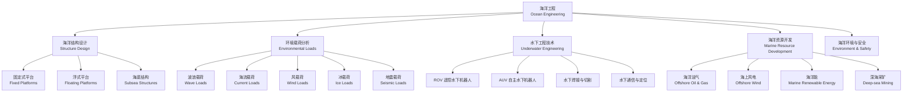

---
aliases: [OceanEngineering, 海洋工程, Offshore Engineering]
tags: ['HydraulicAndMarineEngineering', 'NavalArchitecture', 'OceanEngineering', 'OffshoreEngineering']
created: 2026-05-17
updated: 2026-05-17
---

# 海洋工程 (Ocean Engineering / Offshore Engineering)

## 学科概述

海洋工程（Ocean Engineering）是研究海洋资源开发、海洋空间利用和海洋环境保护的工程技术学科，涵盖海洋平台结构设计、海洋环境载荷分析、水下工程技术和海洋能源开发等核心领域。海洋工程与船舶工程（Naval Architecture）同源但侧重不同：船舶工程关注航行体的水动力学性能，海洋工程关注固定式和浮式海洋结构的静力与动力响应。随着深海油气开发向 3000 米以上水深迈进、海上风电装机突破 100 GW，以及海洋可再生能源技术的产业化加速，海洋工程正成为全球工程领域最具活力的分支之一。

## 学科体系

## 核心概念对比

| 概念 | 定义 | 适用水深 | 关键技术参数 | 典型工程 |
|:----|:-----|:---------|:-------------|:---------|
| 导管架平台 (Jacket) | 钢质框架固定式平台 | < 300 m | 桩深 50~150 m，自重 5000~30000 t | 渤海 PL19-3 |
| 半潜式平台 (Semi-sub) | 浮式柱稳式平台 | 500~3000 m | 排水量 30000~60000 t | 深水钻井平台 |
| TLP 张力腿平台 | 垂直锚固浮式平台 | 200~1500 m | 张力 5000~20000 t/根 | 北海 Heidrun |
| SPAR 平台 | 单柱式浮体 | 500~3000 m | 直径 20~40 m，总长 150~250 m | Perdido (墨西哥湾) |
| FPSO | 浮式生产储卸油装置 | 50~2000 m | 储油能力 100~300 万桶 | 海洋石油 118 |
| 海上风机基础 | 固定/浮式风机支撑 | < 60 m (固定) | 单机容量 8~15 MW | Hornsea (英国) |
| 海底管道 | 水下输送管线 | 任意水深 | 直径 4~48 in，设计压力 10~30 MPa | 南海荔湾管线 |

## 海洋结构设计

### 固定式平台 (Fixed Platforms)

固定式平台直接固定于海床，适用于大陆架浅水区域。

**导管架平台（Jacket Platform）**：钢质框架空间桁架结构，通过钢管桩固定在海底。导管架由主管、斜撑、水平撑和桩套筒组成。上部组块（Topside）包含钻井、采油、处理和生活设施。导管架适用于水深小于 300 m 的浅海，全球约有 8000 座导管架平台。

**重力式平台（Gravity Base Structure, GBS）**：钢筋混凝土或钢质重力基础结构，依靠自身重量抵抗环境载荷的倾覆力矩。不需打桩，适用于软土海底。Troll A 平台为全球最高的混凝土重力式平台，总高 472 m，混凝土用量 24.5 万 m³。

**顺应式平台（Compliant Tower）**：细长钢质塔架结构，具有一定的柔性，通过顺应波浪运动减小载荷，适用于 300~600 m 水深。

### 浮式平台 (Floating Platforms)

浮式平台通过浮力支撑结构重量，通过锚泊系统或动力定位（Dynamic Positioning, DP）保持位置，适用于深水和超深水环境。

**半潜式平台（Semi-submersible）**：由下部浮体（Pontoon）、立柱（Column）和上部甲板（Deck）组成。作业时下潜压载以减小波浪响应。全球约 200 座半潜式平台用于深水钻井和生产。

**张力腿平台（Tension Leg Platform, TLP）**：通过垂直张力筋腱（Tendons）锚固于海底基础。垂向固有周期短（< 3 s），垂向运动极小，适合干式采油树（Dry Christmas Tree）。世界首座 TLP 为 1984 年安装的 Hutton TLP。

**SPAR 平台**：单柱式圆形截面浮体，重心低于浮心，静稳性极佳。SPAR 分为经典式、桁架式和 Cell SPAR 三种。适用于超深水（> 1500 m）生产。

**FPSO（Floating Production Storage and Offloading）**：船形浮式生产装置，集油气处理、储存和外输（Offloading）于一体。全球约 200 艘 FPSO 在役，单艘处理能力可达 25 万桶/天。FPSO 通过内转塔式或外转塔式单点系泊系统（SPM）定位。

## 海洋环境载荷

### 波浪载荷 (Wave Loads)

波浪是海洋结构最主要的动态载荷。分析方法的选取取决于结构尺度 $D$ 与波长 $L$ 的比值。

**Morison 方程**（适用于小尺度结构，$D < 0.2L$）：

$$ dF = \frac{1}{2} \rho C_D D |u| u \, dz + \rho C_M \frac{\pi D^2}{4} \frac{\partial u}{\partial t} \, dz $$

其中 $\rho$ 为海水密度（1025 kg/m³），$C_D$ 为拖曳力系数（约 0.6~1.2），$C_M$ 为惯性力系数（约 1.5~2.0），$D$ 为构件直径，$u$ 为水质点水平速度。

**绕射理论（Diffraction Theory）**：当 $D > 0.2L$ 时，需考虑波浪绕射效应，采用势流理论（Potential Flow Theory）求解：

$$ \nabla^2 \Phi = 0 $$

边界条件：海底 $\partial\Phi/\partial z = 0$，自由水面 $\partial^2\Phi/\partial t^2 + g\partial\Phi/\partial z = 0$，结构表面 $\partial\Phi/\partial n = 0$，辐射条件。

**波浪谱描述**：随机海浪用频谱描述，常用谱模型包括：
- Pierson-Moskowitz (PM) 谱：$S(\omega) = \frac{\alpha g^2}{\omega^5} \exp\left[-\beta\left(\frac{g}{U\omega}\right)^4\right]$
- JONSWAP 谱：在 PM 谱基础上乘以峰增强因子 $\gamma$，表征有限风区风浪
- 每种谱由有效波高 $H_s$（Significant Wave Height）和谱峰周期 $T_p$ 参数化

### 海流载荷 (Current Loads)

海流包括风生流、潮汐流、环流和密度流：

$$ F_C = \frac{1}{2} \rho C_D D V_c^2 $$

其中 $V_c$ 为流速剖面。墨西哥湾暖流流速可达 2 m/s，对浮式平台产生显著的拖曳力和涡激振动（Vortex Induced Vibration, VIV）。

### 风载荷 (Wind Loads)

作用于水面以上结构的风载荷：

$$ F_W = \frac{1}{2} \rho_a C_W A V_W^2 $$

其中 $\rho_a = 1.225$ kg/m³ 为空气密度，$C_W$ 为形状系数（通常 1.0~1.5），$A$ 为迎风投影面积。设计风速通常采用百年一遇的 1 分钟平均风速或 3 秒阵风风速。

### 冰载荷 (Ice Loads)

极地和寒冷海域的冰载荷是控制性设计载荷，包括：
- 冰挤压（Ice Crushing）：水平力 $F = k \cdot \sigma_c \cdot h \cdot l$
- 冰弯曲破裂（Ice Bending）：$F = C \cdot \sigma_f \cdot h^2 \cdot l$
- 冰撞击（Iceberg Impact）：动能 $E_k = \frac{1}{2} m v^2$ 需被结构吸收

API RP 2N、ISO 19906 等规范给出了冰载荷的详细计算方法。渤海和北极海域是冰载荷的重点研究区域。

## 水下工程与机器人

### ROV（遥控水下机器人）

| ROV 类型 | 工作水深 | 动力 | 主要用途 |
|:---------|:---------|:-----|:---------|
| 观察级 | 300~1000 m | 电动 | 水下检查、视频巡检、环境监测 |
| 轻型作业级 | 1000~3000 m | 电动/液压 | 水下干预、采样、切割 |
| 重型作业级 | 3000~6000 m | 液压 | 海底管道安装、水下结构安装 |
| 拖曳式 | 6000 m | 电动 | 深海调查、侧扫声纳拖曳 |

ROV 的核心传感器包括：声学定位系统（USBL/LBL）、多波束声纳、机械臂力反馈传感器、水下高清晰度摄像头。

### AUV（自主水下机器人）

AUV（Autonomous Underwater Vehicle）通过惯性导航系统（INS）和多普勒测速仪（DVL）进行组合导航，配合卡尔曼滤波实现精确的水下定位：

$$ \mathbf{v}_{\text{fused}} = \mathbf{v}_{\text{INS}} + \mathbf{K} \cdot (\mathbf{v}_{\text{DVL}} - \mathbf{v}_{\text{INS}}) $$

其中 $\mathbf{K}$ 为卡尔曼增益矩阵。AUV 的续航时间通常为 8~72 小时，航速 2~5 节。典型 AUV 包括 Hugin（Kongsberg）、Remus（Hydroid）和 Bluefin。

### 水下焊接与维修

| 焊接方法 | 适用水深 | 接头质量 | 作业特点 |
|:---------|:---------|:---------|:---------|
| 干式焊接 (Habitat) | < 300 m | 最优，与陆地相当 | 需要干式舱，设备复杂 |
| 湿式焊接 | < 100 m | 受水深影响 | 直接在水下施焊，简单灵活 |
| 局部干式焊接 | < 200 m | 较好 | 排水罩保护电弧区，折中方案 |
| 摩擦搅拌焊 (FSW) | 任意 | 优秀 | 无需熔化，变形小，设备特殊 |

## 海洋资源开发

### 深水油气开发技术

**水下生产系统（Subsea Production System）**：包括水下采油树（Subsea Christmas Tree）、水下管汇（Manifold）、水下分离器和水下增压泵。核心技术包括流动保障（Flow Assurance）——水合物抑制、蜡沉积防治、段塞流控制。

**立管系统（Riser System）**：连接海底与浮式平台的输送管道，包括钢悬链线立管（Steel Catenary Riser, SCR）、柔性立管和顶部张紧式立管（Top Tensioned Riser, TTR）。

### 海上风电基础

| 基础类型 | 适用水深 | 结构特点 | 代表项目 |
|:---------|:---------|:---------|:---------|
| 单桩 (Monopile) | < 30 m | 钢质圆管，直径 4~10 m | Hornsea (UK) |
| 导管架 (Jacket) | < 50 m | 空间桁架，4~6 腿 | 三峡大丰 |
| 重力式 (Gravity) | < 30 m | 混凝土/钢质重力底座 | 丹麦近海 |
| 吸力桶 (Suction Bucket) | < 40 m | 倒置桶形基础 | Aberdeen Bay |
| 浮式半潜 (Floating Semi) | > 60 m | 半潜式浮体 + 锚链 | Hywind Scotland |
| 张力腿 (TLP Wind) | > 60 m | 张力腿锚固 | Goto City (日本) |

### 海洋可再生能源

- 潮汐能（Tidal Energy）：潮差发电 $P = \frac{1}{4} \rho g A H^2$，潮流能 $P = \frac{1}{2} \rho A V^3 C_p$
- 波浪能（Wave Energy）：振荡水柱（OWC）、点吸收（Point Absorber）、衰减式（Attenuator）
- 海洋温差能（OTEC, Ocean Thermal Energy Conversion）：利用表层温水（~26°C）与深层冷水（~5°C）的温差，朗肯循环发电，理论效率 3%~5%

## 经典教材与参考书

- 李润培《海洋工程导论》（上海交通大学出版社）
- O. M. Faltinsen《Sea Loads on Ships and Offshore Structures》（Cambridge University Press）
- S. K. Chakrabarti《Handbook of Offshore Engineering》（Elsevier）
- API RP 2A-WSD《Recommended Practice for Planning, Designing and Constructing Fixed Offshore Platforms》
- DNV-OS-J101《Design of Offshore Wind Turbine Structures》
- ISO 19900~19906 Offshore Structures Standards
- 中国船级社《海洋平台设计指南》

## 主要应用领域

- 海洋油气勘探、开发与生产（深水、超深水）
- 海上风电场规划、设计与建设
- 海底矿产资源（多金属结核、富钴结壳）开采
- 海底隧道与人工岛工程
- 海洋环境监测网建设与运行
- 深海科学考察与研究
- 水下考古与文化遗产保护
- 深海空间站与水下实验室

## 相关条目

- [[NavalArchitecture]]
- [[OffshoreWindPower]]
- [[04_EngineeringAndTechnology/MechanicsAndMaterials/Mechanics/FluidMechanics|FluidMechanics]]
- [[MarineRenewableEnergy]]
- [[StructuralDynamics]]
- [[SubseaEngineering]]
- [[UnderwaterRobotics]]
- [[04_EngineeringAndTechnology/HydraulicAndMarineEngineering/HydraulicEngineering/HydraulicEngineering|HydraulicEngineering]]

