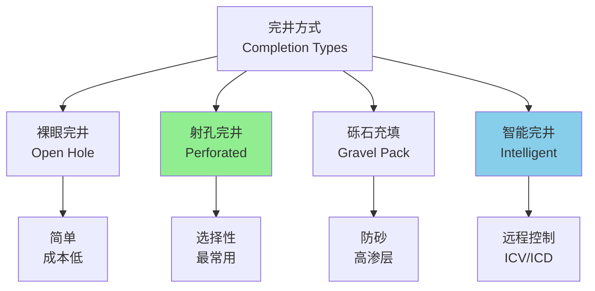
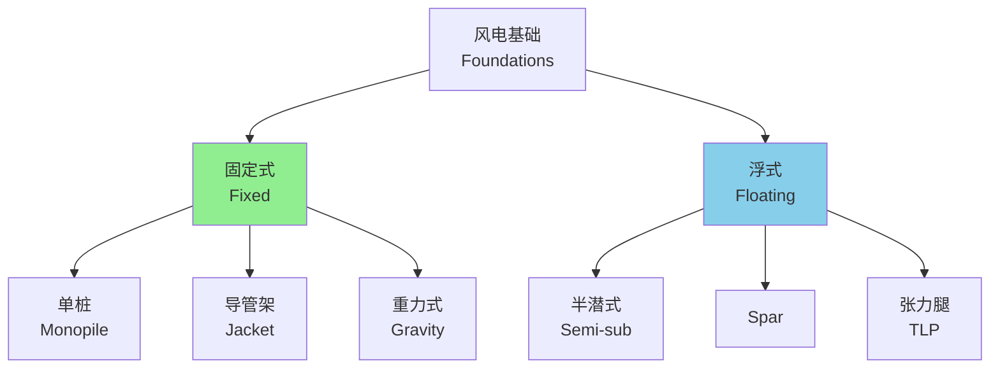

---
aliases:
  - Offshore Engineering
  - Offshore Drilling
  - Subsea Technology
  - Marine Renewable Energy
tags:
  - engineering
  - offshore
  - petroleum
  - renewable-energy
  - subsea
  - drilling
---

# 海洋工程 (Offshore Engineering)

## 概述 (Overview)

海洋工程（Offshore Engineering）涵盖海洋油气开发、海底管道铺设、海洋可再生能源利用等工程领域。随着陆地资源的日益枯竭，海洋成为人类获取能源和资源的重要领域，海洋工程技术因此得到快速发展。

## 海洋油气开发 (Offshore Oil & Gas Development)

### 开发模式 (Development Concepts)

| 开发模式 | 特点 | 适用条件 |
|----------|------|----------|
| 固定平台开发 | 平台+井口 | 浅水（<300m） |
| 浮式生产 | FPSO/TLP/Semi | 深水（300-3000m） |
| 水下生产 | 海底工厂+立管 | 超深水（>1500m） |
| 水下回接 | 卫星井+中心平台 | 边际油田 |

### 钻井工程 (Drilling Engineering)

钻井过程的基本参数：

$$ROP = K \cdot \frac{N^a \cdot W^b}{D^c}$$

$ROP$ 为机械钻速，$N$ 为转速，$W$ 为钻压，$D$ 为钻头直径。

循环系统中的压力平衡：

$$P_{bottom} = P_{mud} + P_{annulus} = P_{formation}$$

井控要求：

$$P_{pore} < P_{mud} < P_{frac}$$

其中 $P_{pore}$ 为孔隙压力，$P_{frac}$ 为破裂压力。

### 完井技术 (Completion Technology)

## 海底管道 (Subsea Pipelines)

### 管道设计 (Pipeline Design)

管道壁厚设计：

$$t = \frac{P_{design} \cdot D}{2 \sigma_y \cdot F \cdot E \cdot T}$$

$F$ 为设计系数，$E$ 为纵向焊缝系数，$T$ 为温度折减系数。

| 设计阶段 | 压力系数 | 壁厚系数 |
|----------|----------|----------|
| 水压试验 | 1.25 | 1.0 |
| 运行工况 | 1.0 | 0.72 |
| 极端工况 | 1.0 | 0.85 |

### 管道铺设 (Pipeline Laying)

主要铺设方法：

| 方法 | 原理 | 适用水深 | 特点 |
|------|------|----------|------|
| S铺设法 | 船尾入水 | <1000m | 传统方法 |
| J铺设法 | 近乎垂直入水 | >1000m | 适合深水 |
| 卷筒铺设法 | 卷盘释放 | <400m | 效率高 |
| 牵引铺设法 | 预挖沟牵引 | 近岸 | 浅水专用 |

铺设应力分析：

$$\sigma_{total} = \sigma_{bending} + \sigma_{axial} + \sigma_{hoop}$$

弯曲应力限制：

$$\varepsilon_{bending} < 0.15\% \sim 0.25\%$$

### 管道稳定性 (Pipeline Stability)

海底管道需要抵抗波浪和海流引起的水平移动。

侧向稳定性判据：

$$F_{resist} \geq \gamma_{sc} \cdot F_{hydrodynamic}$$

抵抗力来源：

- 管道自重（ submerged weight ）
- 土壤摩擦力：$F_f = \mu \cdot W_s$
- 土壤被动阻力

稳定性增强措施：

| 措施 | 原理 | 适用 |
|------|------|------|
| 混凝土配重层 | 增加重量 | 常规 |
| 管沟埋设 | 遮蔽海流 | 近岸 |
| 机械锚固 | 主动约束 | 岩石底质 |

## 海洋可再生能源 (Marine Renewable Energy)

### 海上风电 (Offshore Wind)

风力发电功率：

$$P = \frac{1}{2} \rho A C_p V^3$$

贝兹极限（Betz Limit）：$C_{p,max} = 16/27 \approx 0.593$。

海上风电基础类型：

### 波浪能 (Wave Energy)

波浪能功率密度：

$$P_{wave} = \frac{\rho g^2}{64\pi} H_s^2 T_e \approx 0.5 H_s^2 T_e \quad \text{(kW/m)}$$

主要波浪能转换装置：

| 类型 | 原理 | 代表装置 |
|------|------|----------|
| 振荡水柱 | 气室压缩 | LIMPET |
| 振荡浮子 | 体运动 | PowerBuoy |
| 越浪式 | 水位差 | Wave Dragon |
| 点吸收式 | 垂荡运动 | WaveBob |

### 潮汐能 (Tidal Energy)

潮汐能功率：

$$P = \frac{1}{2} \rho A V^3$$

与风能公式类似，但海水密度约为空气的800倍，因此能量密度大。

潮汐能转换装置：

- **水平轴涡轮**：类似风力机
- **垂直轴涡轮**：万向性更好
- **潮汐堰坝**：筑坝蓄水发电

## 水下技术 (Underwater Technology)

### 潜水器 (Submersibles)

| 类型 | 特点 | 应用深度 |
|------|------|----------|
| ROV | 遥控， tethered | 6000m |
| AUV | 自主航行 | 6000m |
| HOV | 载人深潜 | 11000m |
| 潜水钟 | 人员转运 | 300m |

### 水下机器人 (ROV/AUV)

ROV运动控制：

$$\tau = M \dot{\nu} + C(\nu)\nu + D(\nu)\nu + g(\eta)$$

其中：
- $M$：质量矩阵（含附加质量）
- $C(\nu)$：科里奥利力矩阵
- $D(\nu)$：阻尼矩阵
- $g(\eta)$：恢复力向量

## 安全与环保 (Safety and Environment)

### 风险评估 (Risk Assessment)

定量风险评估（QRA）：

$$Risk = P_{failure} \times Consequence$$

个体风险（IR）和社会风险（F-N曲线）：

$$F(N) = a \cdot N^{-b}$$

ALARP原则（As Low As Reasonably Practicable）。

### 溢油应急 (Oil Spill Response)

溢油扩散模型：

$$A = \pi k^2 (\Delta \rho / \rho_w)^2 t^4$$

Fay扩散三阶段：

1. **重力-惯性阶段**：扩展迅速
2. **重力-黏性阶段**：扩展减缓
3. **表面张力阶段**：最终扩散

应急措施：

| 措施 | 方法 | 效率 |
|------|------|------|
| 围控 | 围油栏 | 物理隔离 |
| 回收 | 收油机 | 60-80% |
| 分散 | 消油剂 | 化学分散 |
| 燃烧 | 现场焚烧 | >95% |
| 生物降解 | 微生物 | 长期 |

## 参考文献 (References)

1. Guo, B., & Song, S. (2019). *Offshore Pipelines* (2nd ed.). Gulf Professional Publishing.
2. Bai, Y., & Bai, Q. (2019). *Subsea Engineering Handbook* (2nd ed.). Gulf Professional Publishing.
3. DNV GL. (2017). *DNVGL-ST-F101: Submarine Pipeline Systems*.
4. API RP 1111. (2015). *Design, Construction, Operation, and Maintenance of Offshore Hydrocarbon Pipelines*.

---

**相关概念**: [[Naval Architecture|船舶设计]] | [[Marine Structures|海洋结构物]] | [[Renewable Energy|可再生能源]] | [[Subsea Technology|水下技术]]
