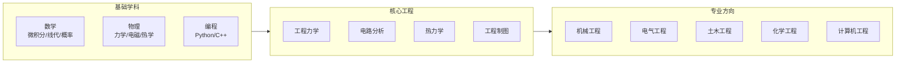
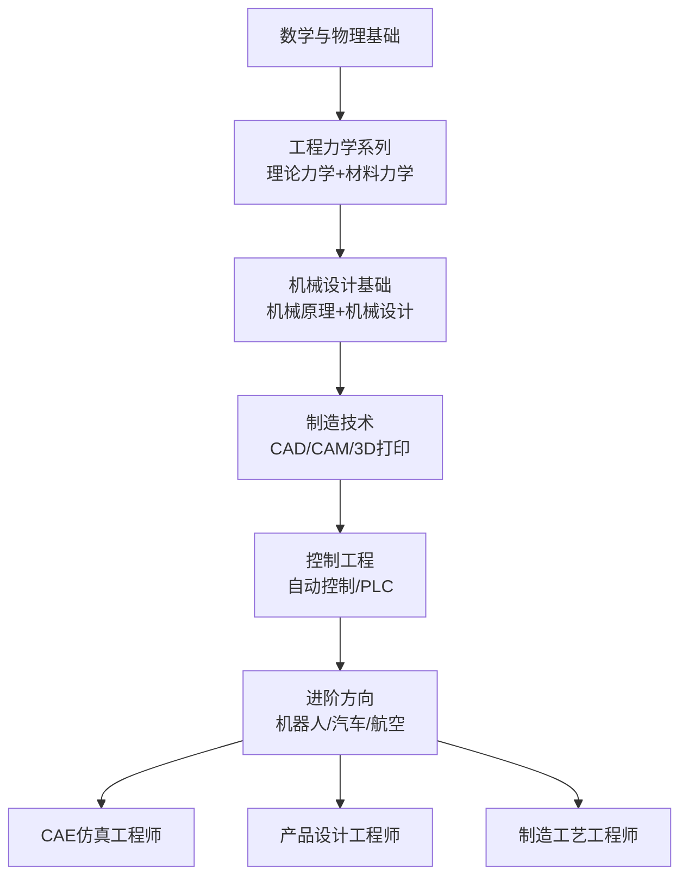

# 工程技术学习路径 (Engineering & Technology Learning Path)

> 工程技术是应用科学原理解决实际问题的学科领域。本路径覆盖从基础到高级的全面学习规划，适用于希望进入工程行业的学习者。

## 领域概览 (Domain Overview)

### 工程学科分类
| 分支领域 | 英文名称 | 核心关注 | 典型职业 |
|----------|----------|----------|----------|
| 机械工程 | Mechanical Engineering | 力学、热学、设计制造 | 机械工程师、CAE分析师 |
| 电气工程 | Electrical Engineering | 电路、电机、电力系统 | 电气工程师、电网设计 |
| 电子与信息工程 | Electronics & Communication | 信号、通信、微电子 | 射频工程师、嵌入式工程师 |
| 土木工程 | Civil Engineering | 结构、岩土、交通 | 结构工程师、项目经理 |
| 化学工程 | Chemical Engineering | 反应工程、分离过程 | 工艺工程师、石化专家 |
| 计算机工程 | Computer Engineering | 硬件、软件、系统 | 系统架构师、FPGA工程师 |
| 材料科学与工程 | Materials Science & Engineering | 材料结构、性能、加工 | 材料工程师、研发专家 |
| 生物医学工程 | Biomedical Engineering | 医疗设备、生物力学 | 医疗设备工程师 |
| 环境工程 | Environmental Engineering | 水处理、大气治理 | 环境咨询师 |
| 工业工程 | Industrial Engineering | 运筹、质量控制 | 精益生产专家 |
| 航空航天工程 | Aerospace Engineering | 空气动力学、推进 | 飞机设计、卫星工程师 |
| 核工程 | Nuclear Engineering | 核反应堆、辐射防护 | 核能工程师 |

## 基础学科体系 (Foundational Subjects)

### 数学基础 (Mathematics Foundation)
- **微积分 (Calculus)**：单变量与多变量微积分、微分方程、向量分析
- **线性代数 (Linear Algebra)**：矩阵运算、向量空间、特征值、奇异值分解
- **概率与统计 (Probability & Statistics)**：分布理论、假设检验、回归分析、贝叶斯方法
- **数值方法 (Numerical Methods)**：有限差分、插值、优化算法、蒙特卡洛模拟
- **复变函数 (Complex Analysis)**：留数定理、傅里叶与拉普拉斯变换、Z变换

### 物理基础 (Physics Foundation)
- **经典力学 (Classical Mechanics)**：牛顿定律、能量守恒、动量定理、拉格朗日力学
- **电磁学 (Electromagnetism)**：麦克斯韦方程组、电路理论、电磁波传播
- **热力学与统计物理 (Thermodynamics & Statistical Physics)**：热力学定律、熵、能级分布
- **波动与光学 (Waves & Optics)**：干涉、衍射、偏振、光纤光学

### 通用工程基础
- **工程力学 (Engineering Mechanics)**：静力学、动力学、材料力学
- **工程制图 (Engineering Drawing)**：CAD建模、三视图、尺寸标注、公差配合
- **计算机编程 (Computer Programming)**：Python/C++、面向对象、数据结构、算法
- **工程伦理 (Engineering Ethics)**：职业道德、社会责任、安全规范、环境意识
- **实验设计与数据分析 (Experimental Design & Data Analysis)**：测量误差、数据处理、报告撰写

## 学位体系与认证 (Degrees & Accreditation)

### 工程学位层次
| 学位阶段 | 学制 | 主要目标 | 典型课程量 |
|----------|------|----------|------------|
| 专科/高职 | 2-3年 | 技术型人才、现场操作 | 30-40门 |
| 本科 (B.Eng/B.S.) | 4年 | 基础工程师、设计能力 | 40-50门 |
| 硕士 (M.Eng/M.S.) | 2-3年 | 专业深化、研究能力 | 10-15门 + 论文 |
| 博士 (Ph.D.) | 3-5年 | 前沿研究、原创贡献 | 课程 + 博士论文 |
| 工程博士 (Eng.D.) | 4-5年 | 产业导向的研发人才 | 企业项目 + 论文 |

### 国内工程认证
- **工程教育专业认证** — 中国工程教育认证协会 (CEEAA) 负责实施
- **华盛顿协议 (Washington Accord)** — 国际工程学位互认协议，中国于2016年成为正式成员
- **注册工程师制度** — 一级/二级注册结构、电气、土木、公用设备等
- **职称评定** — 助理工程师 → 工程师 → 高级工程师 → 正高级工程师

## 职业技能体系 (Professional Skills)

### 硬技能 (Hard Skills)
1. **计算与分析**：有限元分析 (FEA/FEM)、计算流体力学 (CFD)、多物理场耦合
2. **设计软件**：SolidWorks、AutoCAD、CATIA、ANSYS、MATLAB/Simulink
3. **项目管理**：PMP认证、敏捷开发、甘特图、风险管理、成本估算
4. **标准与规范**：ISO、GB、ASTM、DIN、IEC 标准体系
5. **实验与测试**：数据采集、传感器技术、失效分析、可靠性测试
6. **控制与自动化**：PLC编程、SCADA系统、工业机器人编程
7. **技术文档**：技术报告、设计说明书、操作手册、专利撰写

### 软技能 (Soft Skills)
- **工程沟通 (Engineering Communication)**：技术文档撰写、图纸评审、项目汇报、跨部门协调
- **团队协作 (Team Collaboration)**：跨职能团队协作、领导力、冲突解决
- **问题解决 (Problem Solving)**：系统思维、根本原因分析 (RCA)、TRIZ创新方法
- **终身学习 (Lifelong Learning)**：技术更新迭代速度快，持续教育与自主学习至关重要
- **跨文化能力 (Cross-cultural Competence)**：国际工程项目、外企协作、多语言沟通
- **商业意识 (Business Acumen)**：成本控制、市场需求分析、商业价值评估

## 专业方向深度路径 (Deep Dive Paths by Discipline)

### 机械工程推荐路径

### 电气工程推荐路径
| 阶段 | 课程 | 技能产出 |
|------|------|----------|
| 基础 | 电路分析、电磁场理论、模拟电子技术 | 电路分析与计算、基本电路设计 |
| 核心 | 电机学、电力电子技术、电力系统分析 | 电力系统设计、电力电子变换器设计 |
| 进阶 | 继电保护、高电压技术、智能电网技术 | 电力系统保护、高压绝缘设计 |
| 前沿 | 新能源并网技术、微电网、电力市场 | 可再生能源系统设计、能源管理 |

### 电子与信息工程推荐路径
- **基础**：模拟电路、数字电路、信号与系统、电磁场与波
- **核心**：通信原理、数字信号处理、嵌入式系统、微电子概论
- **进阶**：RF电路设计、DSP算法实现、FPGA开发、VLSI设计
- **前沿**：5G/6G通信、雷达系统、物联网 (IoT) 芯片、卫星通信

### 计算机工程推荐路径
- **硬件方向**：数字逻辑、计算机组成、VLSI设计、FPGA、SoC架构
- **软件方向**：操作系统、计算机网络、软件工程、数据库、编译原理
- **系统方向**：嵌入式Linux、实时操作系统、RTOS、驱动开发
- **交叉方向**：AI芯片架构、机器人操作系统 (ROS)、自动驾驶感知系统

## 学习资源推荐 (Recommended Resources)

### 在线课程平台
| 平台 | 特色 | 推荐课程 |
|------|------|----------|
| MIT OpenCourseWare | 免费、完整课程资料 | 6.002 Circuits & Electronics、2.003 Dynamics & Control |
| Coursera/edX | 体系化专项课程 | Engineering Mechanics (Georgia Tech)、CAD (Autodesk) |
| Khan Academy | 基础概念讲解 | Electrical Engineering 基础、微积分 |
| 中国大学MOOC | 国内名校课程 | 清华/浙大/上交工程师系列课程 |
| YouTube 频道 | 实际工程案例、动手实践 | EEVblog、Practical Engineering、SmarterEveryDay |

### 经典教材 (Standard Textbooks)
- **机械**：《机械设计手册》(成大先)、《Theory of Machines》(Shigley)、《材料力学》(刘鸿文)
- **电气**：《电路》(Nilsson/Riedel)、《Electric Machinery》(Fitzgerald)、《电力系统分析》(Kundur)
- **土木**：《结构力学》(龙驭球)、《Design of Concrete Structures》(Nilson)、《土力学》(陈仲颐)
- **编程**：《C++ Primer》(Lippman)、《Introduction to Algorithms》(CLRS)、《Python编程从入门到实践》
- **通用参考**：《工程中的数学方法》(Kreyszig)、《Standard Handbook for Mechanical Engineers》

### 工程仿真工具
- **多物理场耦合**：COMSOL Multiphysics、ANSYS Workbench
- **电路仿真**：SPICE、LTspice、Multisim、PSCAD
- **控制系统**：MATLAB/Simulink、LabVIEW、SCADE
- **结构分析**：Abaqus、SAP2000、ETABS、NASTRAN
- **流体仿真**：Fluent、OpenFOAM、CFX、STAR-CCM+
- **3D建模**：SolidWorks、Inventor、Fusion 360、Creo、NX

## 职业发展建议 (Career Development)

### 工程类职业方向
| 职业类型 | 工作内容 | 学历要求 | 薪资水平 (初/中/高) |
|----------|----------|----------|---------------------|
| 设计工程师 | 产品/结构/电路设计 | 本科+ | 10-25万/年 |
| 研发工程师 | 新技术/新产品开发 | 硕博 | 15-40万/年 |
| 工艺工程师 | 制造工艺优化 | 本科+ | 10-22万/年 |
| 项目工程师 | 工程项目管理 | 本科+ | 12-30万/年 |
| 测试工程师 | 产品测试与验证 | 本科+ | 10-20万/年 |
| 技术销售 | 技术型客户支持 | 本科 | 12-35万/年 |
| 质量工程师 | 质量体系与改进 | 本科+ | 10-22万/年 |
| 现场工程师 | 安装调试与维护 | 专科+ | 8-18万/年 |

### 工程师必备能力模型
- **技术能力 (Technical Competence)**：专业深度 + 跨学科广度
- **创新能力 (Innovation)**：专利、论文、技术创新成果、技术竞赛
- **项目管理 (Project Management)**：进度、预算、资源、风险统筹协调
- **商业意识 (Business Acumen)**：成本控制、市场需求、商业价值评估
- **合规与伦理 (Compliance & Ethics)**：安全规范、环保责任、职业道德、知识产权

### 考取含金量高的职业证书
- **PMP** (项目管理专业人士) — 项目管理领域黄金标准
- **PE/注册工程师** — 国内法定签字权资质
- **Six Sigma Black Belt** — 质量管理与流程改进
- **CFD/CAE 认证** — ANSYS、COMSOL厂商认证
- **AWS/Azure 架构师** — 云计算与物联网方向
- **FIDIC 认证** — 国际工程咨询与合同管理

### 就业市场趋势 (Job Market Trends for Engineers)
| 趋势 | 驱动因素 | 受影响的方向 | 建议准备 |
|------|----------|-------------|----------|
| 智能制造与工业4.0 | 自动化、AI、工业物联网 | 机械、电气、计算机 | 学习工业物联网、数字孪生、OPC UA |
| 碳中和与绿色能源 | 双碳目标、环保法规 | 电气、环境、化工 | 掌握新能源技术、碳核算、ESG |
| 芯片自主化 | 供应链安全、国产替代 | 电子、计算机、材料 | 关注半导体设计、制造工艺、封装测试 |
| AI与数据工程 | 深度学习、大数据分析 | 计算机、电子信息 | 学习机器学习、数据科学、边缘计算 |
| 生物医疗融合 | 老龄化、精准医疗、医疗器械 | 生物医学、材料、机械 | 了解医疗器械法规、生物相容性 |

### 选择工程方向时的考量因素
1. **个人兴趣与天赋** — 你喜欢动手还是动脑？喜欢宏观还是微观？
2. **行业发展前景** — 该方向未来5-10年的增长潜力如何？
3. **薪资与就业率** — 毕业后的平均薪资和就业竞争情况
4. **工作环境与方式** — 办公室/实验室/现场？独立工作还是团队协作？
5. **学习难度与门槛** — 数学和物理要求高不高？需要什么先修知识？
6. **深造与进修空间** — 是否有清晰的研究生和博士路径？
7. **国际化程度** — 是否有海外学习和工作的机会？
8. **社会责任与成就感** — 工作能否带来社会价值和满足感？

### 工程学习心态建议
- **打好基础，不急于求成** — 数学和物理是工程的根基，扎实的基础比速成的技能更重要
- **动手实践 > 纸上谈兵** — 多参与实验、竞赛、开源项目，实践出真知
- **养成系统思维** — 工程问题往往是多因素交织的，学会从整体角度分析
- **拥抱失败，持续迭代** — 工程是反复试错的过程，每一次失败都是学习机会
- **拓展跨学科视野** — 懂编程的机械工程师、懂电子的软件工程师更具竞争力
- **关注前沿但不盲从** — 新技术层出不穷，基础原理才是长期不变的
- **培养工程直觉** — 通过大量项目经验积累，形成对工程问题的直觉判断

## 相关条目
- [[02_HigherEducation/EngineeringEducation|工程教育]]
- [[04_EngineeringAndTechnology/Apprenticeship|工程学徒制]]
- [[00_KnowledgeFramework/StudyMethods/STEMStudy|STEM学习方法]]
- [[CareerPlanning|职业规划]]
- [[ProjectManagement|项目管理基础]]
- [[CADBasics|CAD基础教程]]
- [[ProgrammingForEngineers|工程师编程入门]]
