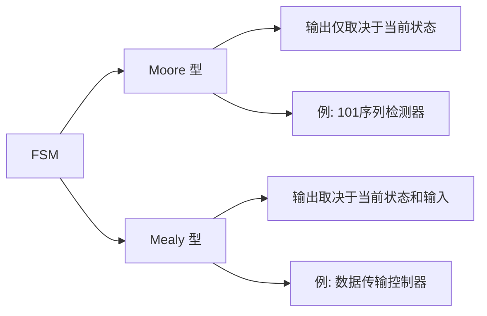

# VHDL 硬件描述 (VHDL Hardware Description)

## 一、概述 (Overview)

VHDL (VHSIC Hardware Description Language) 是一种用于描述数字电路和系统的硬件描述语言，由美国国防部在 1980 年代开发，1987 年成为 IEEE 标准 (IEEE 1076)。VHDL 支持行为级、数据流级和结构级三种描述方式，广泛用于 FPGA 和 ASIC 的设计、仿真和综合。

## 二、基本结构 (Basic Structure)

### 2.1 实体 (Entity)

实体定义了电路的输入输出端口：

```vhdl
entity AND_GATE is
    port (
        A : in  std_logic;
        B : in  std_logic;
        Y : out std_logic
    );
end entity AND_GATE;
```

端口模式 (Port Modes)：

| 模式 | 方向 | 说明 |
|------|------|------|
| in | 输入 | 只能读取 |
| out | 输出 | 只能赋值（内部不可读） |
| inout | 双向 | 可读可写（三态） |
| buffer | 缓冲 | 可读可写（内部反馈） |

### 2.2 结构体 (Architecture)

结构体描述了实体的内部功能：

```vhdl
architecture Behavioral of AND_GATE is
begin
    Y <= A and B;
end architecture Behavioral;
```

### 2.3 库和包 (Library & Package)

```vhdl
library IEEE;
use IEEE.STD_LOGIC_1164.ALL;
use IEEE.NUMERIC_STD.ALL;
```

常用库：

| 库名 | 包名 | 内容 |
|------|------|------|
| IEEE | std_logic_1164 | 9 值逻辑系统 |
| IEEE | numeric_std | 有符号/无符号算术 |
| IEEE | std_logic_arith | 算术运算（非官方） |
| IEEE | std_logic_unsigned | 无符号比较 |

## 三、数据类型 (Data Types)

### 3.1 标准数据类型 (Standard Data Types)

| 类型 | 取值 | 用途 |
|------|------|------|
| std_logic | 'U','X','0','1','Z','W','L','H','-' | 单线信号 |
| std_logic_vector | std_logic 数组 | 总线信号 |
| signed/unsigned | 有符号/无符号数 | 算术运算 |
| integer | -2³¹ ~ 2³¹-1 | 循环、计数器 |
| boolean | true, false | 条件判断 |
| bit | '0', '1' | 简单逻辑 |

### 3.2 用户自定义类型 (User-Defined Types)

```vhdl
type state_type is (IDLE, READ, WRITE, DONE);  -- 枚举类型
type word is array (7 downto 0) of std_logic;    -- 数组类型
type memory is array (0 to 255) of word;         -- 多维数组
```

## 四、并发语句 (Concurrent Statements)

### 4.1 信号赋值 (Signal Assignment)

```vhdl
Y <= A and B;        -- 组合逻辑
Z <= A when Sel = '1' else B;  -- 条件赋值
```

### 4.2 生成语句 (Generate Statement)

```vhdl
gen_label: for i in 0 to 7 generate
    Y(i) <= A(i) and B(i);
end generate;
```

## 五、进程 (Process)

### 5.1 进程结构 (Process Structure)

```vhdl
process (clk, rst) is
begin
    if rst = '1' then
        Q <= '0';
    elsif rising_edge(clk) then
        Q <= D;
    end if;
end process;
```

### 5.2 敏感信号列表 (Sensitivity List)

- **组合逻辑**：所有输入信号均在敏感列表中
- **时序逻辑**：仅时钟和复位信号在敏感列表中

### 5.3 变量与信号 (Variable vs Signal)

| 特性 | 信号 Signal | 变量 Variable |
|------|------------|--------------|
| 赋值符号 | <= | := |
| 赋值时机 | 进程结束 | 立即生效 |
| 作用域 | 全局（实体/结构体） | 局部（进程内） |
| 硬件对应 | 连线/寄存器 | 中间暂存 |

```vhdl
process (clk) is
    variable temp : integer := 0;
begin
    if rising_edge(clk) then
        temp := temp + 1;     -- 立即更新
        count <= temp;         -- 进程结束时更新
    end if;
end process;
```

## 六、有限状态机 (Finite State Machine, FSM)

### 6.1 状态机类型 (FSM Types)



### 6.2 三段式状态机 (Three-Segment FSM)

```vhdl
-- 状态寄存器
process (clk, rst) begin
    if rst = '1' then
        state <= IDLE;
    elsif rising_edge(clk) then
        state <= next_state;
    end if;
end process;

-- 次态逻辑
process (state, input) begin
    case state is
        when IDLE =>
            if input = '1' then
                next_state <= RUN;
            else
                next_state <= IDLE;
            end if;
        when RUN =>
            next_state <= DONE;
        when DONE =>
            next_state <= IDLE;
    end case;
end process;

-- 输出逻辑
process (state) begin
    case state is
        when IDLE   => output <= '0';
        when RUN    => output <= '1';
        when DONE   => output <= '0';
    end case;
end process;
```

## 七、仿真与测试 (Simulation & Testbench)

### 7.1 测试平台 (Testbench)

```vhdl
entity tb_AND_GATE is
end entity tb_AND_GATE;

architecture sim of tb_AND_GATE is
    signal A, B, Y : std_logic;
begin
    DUT: entity work.AND_GATE port map (A => A, B => B, Y => Y);

    process begin
        A <= '0'; B <= '0'; wait for 10 ns;
        A <= '0'; B <= '1'; wait for 10 ns;
        A <= '1'; B <= '0'; wait for 10 ns;
        A <= '1'; B <= '1'; wait for 10 ns;
        wait;
    end process;
end architecture sim;
```

### 7.2 时序约束 (Timing Constraints)

- **建立时间 (Setup Time)** $t_{su}$：数据在时钟沿前必须稳定的时间
- **保持时间 (Hold Time)** $t_h$：数据在时钟沿后必须稳定的时间
- **时钟到输出 (Clock-to-Output)** $t_{co}$：时钟沿到输出有效的时间
- **最大时钟频率**：$f_{max} = \frac{1}{t_{su} + t_{co} + t_{logic}}$

## 八、综合 (Synthesis)

### 8.1 可综合语法 (Synthesizable Constructs)

| 可综合 | 不可综合 |
|--------|----------|
| process (敏感表) | wait for 10 ns |
| case, if-then-else | assert/report |
| 信号赋值 | file I/O |
| entity/architecture | 动态地址访问 |
| generate | 共享变量 |

### 8.2 综合优化 (Synthesis Optimization)

- **资源共享 (Resource Sharing)**：多个运算共享一个 ALU
- **流水线 (Pipelining)**：插入寄存器减少组合延迟
- **状态编码 (State Encoding)**：binary, gray, one-hot
- **面积与速度权衡 (Area vs Speed Trade-off)**

## 九、常用电路模板 (Common Circuit Templates)

### 9.1 寄存器 (Register)

```vhdl
process (clk) begin
    if rising_edge(clk) then
        reg <= data_in;
    end if;
end process;
```

### 9.2 计数器 (Counter)

```vhdl
process (clk, rst) begin
    if rst = '1' then
        cnt <= (others => '0');
    elsif rising_edge(clk) then
        if en = '1' then
            cnt <= cnt + 1;
        end if;
    end if;
end process;
```

### 9.3 移位寄存器 (Shift Register)

```vhdl
process (clk) begin
    if rising_edge(clk) then
        shift_reg <= shift_reg(6 downto 0) & data_in;
    end if;
end process;
```

## 十、最新进展 (Recent Developments)

- **VHDL-2019 新特性**：接口包、条件编译、JSON 支持
- **高层次综合 (HLS)**：C/C++ 直接综合为 RTL
- **开源工具链**：GHDL (仿真), Yosys (综合), GTKWave (波形)
- **UVM (Universal Verification Methodology)**：SystemVerilog 验证框架的 VHDL 对应
