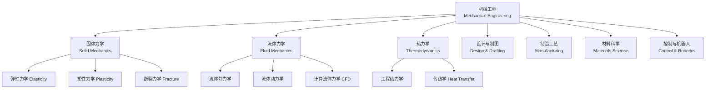
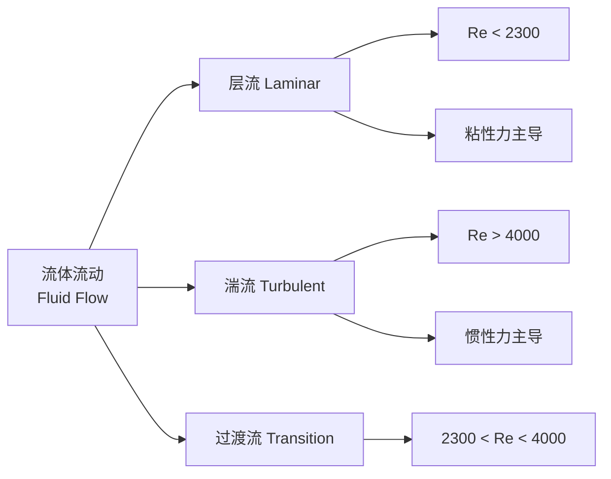

# 机械工程 Mechanical Engineering

## 概述 Overview

机械工程（Mechanical Engineering）是工程学中最古老、最广泛的学科之一，涉及力学、热学、材料、制造和设计的原理与应用。其核心任务是将能量转化为有用的运动和力，实现各种机械系统。

$$ \text{Mechanical Engineering} = \text{Mechanics} + \text{Thermodynamics} + \text{Materials} + \text{Design} + \text{Manufacturing} $$

## 子领域 Subfields

## 固体力学 Solid Mechanics

### 静力学 Statics

研究物体在力系作用下的平衡条件。

$$ \sum \vec{F} = 0, \quad \sum \vec{M} = 0 $$

### 材料力学 Mechanics of Materials

| 基本变形 | 应力公式 | 应变公式 | 工程应用 |
|---------|---------|---------|---------|
| 轴向拉伸/压缩 | $\sigma = F/A$ | $\epsilon = \Delta L/L$ | 拉杆、压杆 |
| 扭转 Torsion | $\tau = Tr/J$ | $\phi = TL/GJ$ | 传动轴 |
| 弯曲 Bending | $\sigma = My/I$ | $v'' = M/EI$ | 梁、悬臂 |
| 剪切 Shear | $\tau_{avg} = V/A$ | $\gamma = \tau/G$ | 铆接、螺栓 |

### 弹性力学 Elasticity

虎克定律（Hooke's Law）在三维中的推广：

$$ \sigma_{ij} = C_{ijkl} \epsilon_{kl}, \quad i,j,k,l \in \{1,2,3\} $$

$$ \epsilon_{ij} = \frac{1+\nu}{E} \sigma_{ij} - \frac{\nu}{E} \sigma_{kk} \delta_{ij} $$

### 应力应变曲线 Stress-Strain Curve

典型韧性材料的应力应变曲线分为：弹性阶段、屈服阶段、强化阶段和颈缩阶段。

| 阶段 | 特征 | 参数 |
|------|------|------|
| 弹性 Elastic | 可逆变形 | 弹性模量 E |
| 屈服 Yield | 塑性流动开始 | 屈服强度 $\sigma_y$ |
| 强化 Strain Hardening | 晶格滑移 | 抗拉强度 $\sigma_u$ |
| 颈缩 Necking | 局部截面收缩 | 断裂伸长率 $\delta$ |

## 流体力学 Fluid Mechanics

### 流体静力学 Fluid Statics

$$ \frac{dp}{dz} = -\rho g, \quad p = p_0 + \rho gh $$

阿基米德原理：浮力等于排开流体的重量。

### 流体动力学 Fluid Dynamics

#### 连续性方程

$$ \frac{\partial \rho}{\partial t} + \nabla \cdot (\rho \vec{v}) = 0 $$

不可压缩稳态流动：$A_1 v_1 = A_2 v_2$

#### 伯努利方程 Bernoulli's Equation

$$ \frac{p}{\rho g} + \frac{v^2}{2g} + z = \text{constant} $$

#### 纳维-斯托克斯方程 Navier-Stokes Equations

$$ \rho \left( \frac{\partial \vec{v}}{\partial t} + \vec{v} \cdot \nabla \vec{v} \right) = -\nabla p + \mu \nabla^2 \vec{v} + \rho \vec{g} $$

### 流动分类

雷诺数：$Re = \frac{\rho v D}{\mu}$

## 热力学 Thermodynamics

### 热力学定律

| 定律 | 表述 | 数学形式 |
|------|------|---------|
| 第零定律 | 热平衡的传递性 | — |
| 第一定律 | 能量守恒 | $\Delta U = Q - W$ |
| 第二定律 | 熵增原理 | $\Delta S \geq 0$ |
| 第三定律 | 绝对零度不可达 | $T \to 0 \implies S \to 0$ |

### 热力循环 Thermodynamic Cycles

| 循环 | 过程 | 效率公式 | 应用 |
|------|------|---------|------|
| 卡诺循环 Carnot | 两个等温 + 两个绝热 | $\eta = 1 - T_L/T_H$ | 理想热机极限 |
| 朗肯循环 Rankine | 蒸汽动力循环 | $\eta = (h_1-h_2)/(h_1-h_3)$ | 蒸气发电厂 |
| 奥托循环 Otto | 汽油机循环 | $\eta = 1 - 1/r^{\gamma-1}$ | 汽油发动机 |
| 迪塞尔循环 Diesel | 柴油机循环 | $\eta = 1 - (r_c^\gamma - 1)/(\gamma(r_c - 1))r^{1-\gamma}$ | 柴油发动机 |
| 布雷顿循环 Brayton | 燃气轮机 | $\eta = 1 - 1/r_p^{(\gamma-1)/\gamma}$ | 航空发动机、燃气轮机 |
| 制冷循环 Refrigeration | 逆卡诺循环 | $COP = T_L/(T_H - T_L)$ | 空调、冰箱 |

### 传热学 Heat Transfer

#### 三种基本传热方式

| 方式 | 机理 | 基本公式 |
|------|------|---------|
| 传导 Conduction | 分子振动 | $q = -kA\frac{dT}{dx}$ |
| 对流 Convection | 流体运动 | $q = hA(T_s - T_\infty)$ |
| 辐射 Radiation | 电磁波 | $q = \epsilon \sigma A(T_s^4 - T_{\text{sur}}^4)$ |

#### 热传导方程 Heat Conduction Equation

$$ \frac{\partial T}{\partial t} = \alpha \nabla^2 T, \quad \alpha = \frac{k}{\rho c_p} $$

## 材料科学 Materials Science

### 工程材料分类

| 材料类型 | 特点 | 代表材料 |
|---------|------|---------|
| 金属 Metals | 高强、导电、延展 | 钢、铝、铜 |
| 陶瓷 Ceramics | 耐热、脆性、绝缘 | 氧化铝、碳化硅 |
| 高分子 Polymers | 轻质、耐腐蚀 | 尼龙、聚碳酸酯 |
| 复合材料 Composites | 性能可设计 | 碳纤维/环氧、GFRP |

### 材料性能指标

$$ \text{Specific Strength} = \frac{\sigma_y}{\rho}, \quad \text{Stiffness} = E \cdot I $$

### 热处理 Heat Treatment

| 工艺 | 过程 | 效果 |
|------|------|------|
| 退火 Annealing | 加热 + 缓慢冷却 | 降低硬度、提高韧性 |
| 正火 Normalizing | 加热 + 空冷 | 细化晶粒 |
| 淬火 Quenching | 加热 + 快速冷却 | 提高硬度 |
| 回火 Tempering | 淬火后 + 中温回火 | 消除内应力、提高韧性 |
| 渗碳 Carburizing | 表面渗碳 + 淬火 | 表面硬化 |

## 机械设计 Mechanical Design

### 设计流程 Design Process

$$ \text{Problem} \to \text{Concept} \to \text{Embodiment} \to \text{Detail} \to \text{Manufacturing} $$

### 机械连接 Joints

| 连接类型 | 特点 | 应用 |
|---------|------|------|
| 螺纹连接 Threaded | 可拆卸、标准化 | 螺栓、螺柱 |
| 焊接 Welding | 永久连接、强度高 | 钢结构 |
| 铆接 Riveting | 永久连接 | 飞机蒙皮 |
| 键连接 Key | 传递扭矩 | 齿轮与轴 |
| 联轴器 Coupling | 连接两轴 | 电机与负载 |

### 传动系统 Transmission

| 传动方式 | 效率 | 传动比范围 | 特点 |
|---------|------|-----------|------|
| 齿轮传动 Gear | 95-99% | 1:1 ~ 10:1 | 精确、紧凑 |
| 皮带传动 Belt | 90-98% | 1:1 ~ 5:1 | 缓冲、过载保护 |
| 链传动 Chain | 97-99% | 1:1 ~ 6:1 | 大中心距 |
| 蜗轮蜗杆 Worm | 40-90% | 10:1 ~ 100:1 | 自锁、大减速比 |
| 谐波传动 Harmonic | 80-90% | 50:1 ~ 300:1 | 零背隙、高精度 |

## 制造工艺 Manufacturing Processes

| 工艺 | 原理 | 精度 | 适用材料 |
|------|------|------|---------|
| 铸造 Casting | 熔融金属注入模具 | IT10-IT16 | 铸铁、铝合金 |
| 锻造 Forging | 塑性变形 | IT8-IT12 | 钢、钛合金 |
| 轧制 Rolling | 连续塑性变形 | IT7-IT10 | 板材、型材 |
| 铣削 Milling | 旋转刀具切削 | IT6-IT9 | 金属、塑料 |
| 车削 Turning | 工件旋转切削 | IT5-IT8 | 回转体 |
| 钻削 Drilling | 孔加工 | IT10-IT13 | 通用 |
| 磨削 Grinding | 磨料切削 | IT4-IT6 | 淬硬钢 |
| 增材制造 AM | 逐层堆积 | IT12-IT15 | 塑料、金属粉末 |
| 注塑成型 Injection | 熔料注入模具 | IT6-IT9 | 热塑性塑料 |

## CAD/CAE/CAM

### 计算机辅助设计 CAD

$$ \text{CAD} = \text{Geometry} + \text{Constraints} + \text{Parameters} $$

| 软件 | 应用领域 |
|------|---------|
| SolidWorks | 通用机械设计 |
| CATIA | 航空航天、汽车 |
| NX (UG) | 高端制造 |
| AutoCAD | 二维制图 |
| Fusion 360 | 创成式设计 |
| FreeCAD | 开源参数化设计 |

### 有限元分析 Finite Element Analysis (FEA)

$$ [K]\{u\} = \{F\} $$

$$ \text{where } [K] \text{ is stiffness matrix, } \{u\} \text{ is displacement vector, } \{F\} \text{ is force vector} $$

## 相关条目

- [[Thermodynamics]]
- [[FluidMechanics]]
- [[MaterialsScience]]
- [[ManufacturingEngineering]]
- [[FiniteElementAnalysis]]
- [[CAD]]
