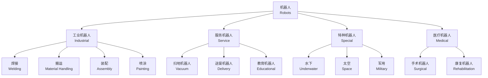

# 机器人基础 (Robotics Basics)

## 概述 (Overview)

机器人学 (Robotics) 是研究机器人 (Robot) 设计、制造和应用的综合交叉学科，涉及机械工程 (Mechanical Engineering)、电子工程 (Electrical Engineering)、计算机科学 (Computer Science) 和控制理论 (Control Theory) 等多个领域。机器人通过感知 (Perception)、决策 (Decision-making) 和执行 (Actuation) 三大环节完成预设或自适应的任务。

## 机器人分类体系

## 机器人类型对比 (Robot Type Comparison)

| 分类标准 | 类型 | 说明 | 典型自由度 |
|:---|:---|:---|:---:|
| 坐标形式 | 直角坐标型 (Cartesian) | 3 个移动关节 PPP | 3 |
| 坐标形式 | 圆柱坐标型 (Cylindrical) | 1 转 2 移 RPP | 3 |
| 坐标形式 | 球坐标型 (Spherical) | 2 转 1 移 RRP | 3 |
| 坐标形式 | 关节型 (Articulated) | 3 个转动关节 RRR | 6 |
| 坐标形式 | SCARA | 水平关节 RRP | 4 |
| 坐标形式 | 并联型 (Parallel) | Stewart 平台、Delta | 3–6 |

## 运动学基础 (Kinematics)

### 自由度 (Degrees of Freedom, DOF)
- 位置自由度：3 个（沿 $x$, $y$, $z$ 轴移动）
- 姿态自由度：3 个（绕 $x$, $y$, $z$ 轴旋转，即 Roll-Pitch-Yaw）
- 6 自由度机器人可到达工作空间内任意位姿

### 正运动学 (Forward Kinematics)

给定关节变量 $\boldsymbol{q} = [q_1, q_2, ..., q_n]^T$，求解末端执行器位姿 $\boldsymbol{T}$：

$$
\boldsymbol{T} = \boldsymbol{T}_1(q_1) \cdot \boldsymbol{T}_2(q_2) \cdots \boldsymbol{T}_n(q_n)
$$

齐次变换矩阵 (Homogeneous Transformation Matrix) 为：

$$
\boldsymbol{T}_i =
\begin{bmatrix}
\cos\theta_i & -\sin\theta_i\cos\alpha_i & \sin\theta_i\sin\alpha_i & a_i\cos\theta_i \\
\sin\theta_i & \cos\theta_i\cos\alpha_i & -\cos\theta_i\sin\alpha_i & a_i\sin\theta_i \\
0 & \sin\alpha_i & \cos\alpha_i & d_i \\
0 & 0 & 0 & 1
\end{bmatrix}
$$

### 逆运动学 (Inverse Kinematics)

已知末端位姿 $\boldsymbol{T}$，求解关节变量 $\boldsymbol{q}$：

$$
\boldsymbol{q} = f^{-1}(\boldsymbol{T})
$$

逆解通常为多解或无解问题，常用方法包括解析法 (Analytical) 和数值法 (Numerical，如牛顿-拉夫森法)。

## 机器人坐标系 (Robot Coordinate Systems)

| 坐标系 | 固定位置 | 用途 |
|:---|:---|:---|
| 基坐标系 (Base/World) | 机器人底座 | 全局定位和路径规划 |
| 关节坐标系 (Joint) | 各关节 | 关节角度控制 |
| 工具坐标系 (Tool, TCP) | 末端执行器 | 工具位姿控制 |
| 工件坐标系 (Workpiece) | 工件上 | 加工路径定义 |

**手眼标定 (Hand-Eye Calibration)**：

$$
\boldsymbol{X} = \boldsymbol{A}^{-1} \cdot \boldsymbol{Z} \cdot \boldsymbol{B}
$$

其中 $\boldsymbol{A}$ 为相机到机器人基座的变换，$\boldsymbol{B}$ 为标定板到末端执行器的变换，$\boldsymbol{Z}$ 为相机到标定板的变换。

## 动力学基础 (Dynamics)

### 拉格朗日力学 (Lagrangian Mechanics)

拉格朗日函数 $L = K - P$，其中 $K$ 为系统动能，$P$ 为势能：

$$
\frac{d}{dt}\left(\frac{\partial L}{\partial \dot{q}_i}\right) - \frac{\partial L}{\partial q_i} = \tau_i
$$

### 标准动力学方程

$$
\boldsymbol{M}(\boldsymbol{q})\ddot{\boldsymbol{q}} + \boldsymbol{C}(\boldsymbol{q}, \dot{\boldsymbol{q}})\dot{\boldsymbol{q}} + \boldsymbol{G}(\boldsymbol{q}) = \boldsymbol{\tau}
$$

其中 $\boldsymbol{M}$ 为惯性矩阵，$\boldsymbol{C}$ 为科里奥利力和向心力项，$\boldsymbol{G}$ 为重力项，$\boldsymbol{\tau}$ 为关节力矩向量。

## 控制方式 (Control Methods)

| 控制方式 | 原理 | 精度 | 适用场景 |
|:---|:---|:---:|:---|
| 点位控制 (PTP) | 仅控制终点位置 | 低 | 搬运、码垛 |
| 连续路径控制 (CP) | 沿精确路径运动 | 高 | 弧焊、涂胶 |
| 力控制 (Force Control) | 控制接触力大小 | 中 | 装配、打磨 |
| 阻抗控制 (Impedance Control) | 控制位置与力的动态关系 | 中 | 人机协作 |
| 视觉伺服 (Visual Servoing) | 视觉反馈引导运动 | 高 | 抓取、检测 |

## 末端执行器 (End Effectors)

### 夹持器 (Grippers)
| 类型 | 工作原理 | 适用对象 | 特点 |
|:---|:---|:---|:---|
| 机械夹爪 | 齿轮/连杆驱动手指开合 | 规则形状零件 | 通用性强 |
| 真空吸盘 | 负压吸附 | 平面工件/玻璃 | 快速、无损伤 |
| 磁力吸盘 | 电磁吸附 | 铁磁材料 | 快速切换 |
| 软体夹爪 | 气压驱动柔性材料 | 易碎物品 | 柔顺、自适应 |

## 机器人编程 (Robot Programming)

### 示教编程 (Teach Pendant Programming)
- 手动引导 (Manual Guidance) 示教机器人运动路径
- 记录关键点 (PTP, CP 方式) 生成运动轨迹
- 优点：编程直观，无需专业编程知识
- 缺点：占用生产时间，路径优化困难

### 离线编程 (Offline Programming)
- 在计算机仿真环境 (Simulation Environment) 中编程和验证
- 主流软件：RobotStudio (ABB)、ROBOGUIDE (FANUC)、KUKA.Sim、RoboDK
- 优点：不影响生产，可进行碰撞检测和节拍优化

### 工业机器人编程语言

| 品牌 | 语言 | 特点 |
|:---|:---|:---|
| ABB | RAPID | 类 PASCAL 语法，内置高级运动指令 |
| FANUC | KAREL | 结构化语言，支持浮动小数点运算 |
| KUKA | KRL | C 语言风格，子程序模块化 |
| Universal Robots | URScript | 基于 Python，适合协作机器人 |

## 机器人感知系统 (Robot Perception)

### 传感器类型与功能

| 传感器 | 测量物理量 | 输出信号 | 典型应用 |
|:---|:---|:---|:---|
| 位置传感器 (Encoder) | 角度/位置 | 脉冲/绝对编码 | 关节角度反馈，分辨率 0.001° |
| 力矩传感器 (Torque) | 关节力矩 | 电压/数字信号 | 力控制、碰撞检测 |
| 六维力/力矩传感器 | Fx, Fy, Fz, Mx, My, Mz | 数字总线输出 | 精密装配、打磨抛光 |
| 激光雷达 (LiDAR) | 点云距离数据 | 3D 点云 | SLAM 导航、避障 |
| 深度相机 (RGB-D) | 彩色+深度图 | 640×480–1280×720 px | 目标识别、抓取定位 |
| 惯性测量单元 (IMU) | 加速度+角速度 | 6 轴/9 轴数据 | 姿态估算、航位推算 |

### 机器人视觉 (Robot Vision)

**相机标定 (Camera Calibration)**：

$$
\begin{bmatrix} u \\ v \\ 1 \end{bmatrix} =
\boldsymbol{K} \cdot \begin{bmatrix} \boldsymbol{R} & \boldsymbol{t} \end{bmatrix}
\cdot \begin{bmatrix} X \\ Y \\ Z \\ 1 \end{bmatrix}
$$

其中 $\boldsymbol{K}$ 为相机内参矩阵，$\boldsymbol{R}$ 为旋转矩阵，$\boldsymbol{t}$ 为平移向量。

## 轨迹规划 (Trajectory Planning)

### 关节空间规划 (Joint Space Planning)
- **梯形速度曲线 (Trapezoidal Profile)**：加速段—匀速段—减速段
- **S 形速度曲线 (S-curve Profile)**：加加速度 (Jerk) 连续，运动平滑无冲击

### 笛卡尔空间规划 (Cartesian Space Planning)
- **直线插补 (Linear Interpolation)**：末端沿直线运动
- **圆弧插补 (Circular Interpolation)**：末端沿圆弧路径
- **样条插补 (Spline Interpolation)**：通过多个路径点的平滑曲线

## 协作机器人 (Collaborative Robots)

### 定义与安全标准
协作机器人 (Cobot) 是与人类在共享工作空间 (Shared Workspace) 直接协作的机器人。安全标准遵循 ISO/TS 15066。

**安全功能**：
- 力/力矩限制 (Force/Torque Limiting)：碰撞力 < 150 N
- 功率与力限制：各关节的准静止接触力限制在 30–100 N 范围
- 碰撞检测与停止：检测到碰撞时停止时间 < 10 ms
- 速度限制：人机共存时末端速度 < 250 mm/s

### 代表产品
| 品牌 | 型号 | 负载 (kg) | 重复定位精度 (mm) |
|:---|:---|:---:|:---:|
| Universal Robots | UR5e | 5 | ±0.03 |
| ABB | YuMi | 0.5 | ±0.02 |
| KUKA | LBR iiwa 14 | 14 | ±0.015 |
| FANUC | CR-35iA | 35 | ±0.03 |

## 主要应用领域 (Applications)

- **汽车制造**：焊接 (Welding)、喷涂 (Painting)、装配 (Assembly)
- **电子制造**：SMT 贴片 (Pick and Place)、精密装配
- **食品医药**：包装 (Packaging)、分拣 (Sorting)、无菌操作
- **物流仓储**：自动导引车 (AGV)、码垛机器人
- **医疗手术**：达芬奇手术系统 (Da Vinci System)、康复外骨骼
- **农业**：采摘机器人、无人机喷洒

## 经典教材 (References)

- 蔡自兴《机器人学》(Robotics)
- Craig J.J. 《Introduction to Robotics: Mechanics and Control》
- Siciliano B. 《Robotics: Modelling, Planning and Control》
- Spong M.W. 《Robot Dynamics and Control》

## 相关条目 (Related Entries)

- [[RobotKinematics]]
- [[RobotDynamics]]
- [[ControlSystems]]
- [[PLCProgramming]]
- [[IndustrialAutomation]]
