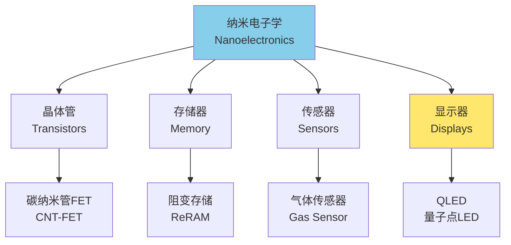

---
aliases:
  - Nanomaterials
  - Nanotechnology
  - Carbon Nanotubes
  - Graphene
  - Quantum Dots
tags:
  - materials
  - nanotechnology
  - chemistry
  - physics
  - engineering
  - quantum
---

# 纳米材料 (Nanomaterials)

## 概述 (Overview)

纳米材料（Nanomaterials）是指在三维空间中至少有一维处于纳米尺度（1-100 nm）的材料。在这个尺度下，材料表现出与宏观材料截然不同的物理、化学和生物学性质，包括量子尺寸效应、表面效应、小尺寸效应和宏观量子隧道效应。

## 纳米效应 (Nanoscale Effects)

### 量子尺寸效应 (Quantum Size Effect)

当粒子尺寸下降到某一值时，费米能级附近的电子能级由准连续变为离散能级，导致：

$$E_n = \frac{h^2}{8m^*}\left(\frac{n_x^2}{L_x^2} + \frac{n_y^2}{L_y^2} + \frac{n_z^2}{L_z^2}\right)$$

能级间距与粒子尺寸的关系：

$$\Delta E \propto \frac{1}{L^2}$$

当 $\Delta E > k_B T$ 时，量子尺寸效应显著。

### 表面效应 (Surface Effect)

纳米颗粒的比表面积：

$$S_{sp} = \frac{6}{\rho d}$$

$d$ 为颗粒直径，$\rho$ 为密度。

表面原子占比随粒径减小而急剧增加：

| 粒径 (nm) | 表面原子占比 (%) | 总原子数 |
|-----------|------------------|----------|
| 10 | 20 | $3 \times 10^4$ |
| 5 | 40 | $4 \times 10^3$ |
| 2 | 80 | $2.5 \times 10^2$ |
| 1 | 99 | $3 \times 10^1$ |

### 小尺寸效应 (Small Size Effect)

当纳米粒子尺寸与光波波长、德布罗意波长、超导态相干长度等物理特征尺寸相当或更小时，导致：

- 光吸收显著增加
- 磁性发生变化
- 超导相向正常相转变
- 等离子体共振频率移动

## 碳纳米材料 (Carbon Nanomaterials)

### 碳纳米管 (Carbon Nanotubes, CNTs)

碳纳米管可视为石墨烯片层卷曲而成的无缝中空管。根据手性可分为：

| 类型 | 手性角 | 导电性 | 代表 |
|------|--------|--------|------|
| 扶手椅型 | 30° | 金属性 | (n,n) |
| 锯齿型 | 0° | 半导体/金属 | (n,0) |
| 手性型 | 0°-30° | 半导体 | (n,m) |

碳纳米管的力学性能：

$$E_{CNT} \approx 1 \text{ TPa}, \quad \sigma_{strength} \approx 50 \text{ GPa}$$

弹性模量公式（基于连续介质近似）：

$$E = \frac{1}{A}\frac{\partial^2 U}{\partial \varepsilon^2}$$

$U$ 为应变能，$A$ 为截面积。

### 石墨烯 (Graphene)

石墨烯是单原子层厚度的二维碳材料，具有优异的电学和力学性能：

$$\sigma = \frac{Y}{1-\nu^2}\varepsilon$$

杨氏模量 $Y \approx 1$ TPa，泊松比 $\nu \approx 0.16$。

电子色散关系（狄拉克锥）：

$$E(k) = \pm \hbar v_F |k|$$

费米速度 $v_F \approx 10^6$ m/s，电子有效质量为零。

```mermaid
graph TD
    A[石墨烯<br/>Graphene] --> B[单层<br/>Monolayer]
    A --> C[少层<br/>Few-layer]
    A --> D[氧化石墨烯<br/>GO]
    A --> E[还原氧化石墨烯<br/>rGO]
    
    B --> B1[零带隙<br/>半导体]
    C --> C1[可调带隙<br/>半导体]
    D --> D1[可分散<br/>溶液加工]
    E --> E1[部分恢复<br/>导电性]
    
    style A fill:#2C3E50
    style B fill:#87CEEB
```

### 富勒烯 (Fullerenes)

$C_{60}$ 是最典型的富勒烯，由12个五边形和20个六边形组成。

分子轨道能级：

$$E_l = \frac{\hbar^2 l(l+1)}{2I}$$

$I$ 为转动惯量。

## 量子点 (Quantum Dots)

### 量子限域效应 (Quantum Confinement)

三维限域下的能级：

$$E_{n_x,n_y,n_z} = \frac{h^2}{8m^*}\left(\frac{n_x^2}{L_x^2} + \frac{n_y^2}{L_y^2} + \frac{n_z^2}{L_z^2}\right)$$

基态激子能量（强限域近似）：

$$E_g^{eff} = E_g^{bulk} + \frac{\hbar^2 \pi^2}{2\mu R^2} - \frac{1.8 e^2}{\varepsilon R}$$

$\mu$ 为约化质量，$R$ 为量子点半径。

### 发光特性 (Luminescence Properties)

量子点的发射波长可通过尺寸调控：

$$\lambda_{em} \propto R^2$$

典型量子点材料：

| 材料 | 发射范围 (nm) | 应用 |
|------|---------------|------|
| CdSe | 480-650 | 显示 |
| CdTe | 550-750 | 生物成像 |
| InP | 480-700 | 无镉显示 |
| PbS | 1000-2000 | 红外探测 |
| 钙钛矿 | 400-800 | LED |

## 纳米材料合成 (Synthesis Methods)

### 物理方法 (Physical Methods)

| 方法 | 原理 | 特点 | 产物 |
|------|------|------|------|
| 惰性气体冷凝 | 蒸发后冷凝 | 高纯、窄分布 | 金属纳米粉 |
| 机械球磨 | 机械破碎 | 简单、可量产 | 纳米晶 |
| 激光烧蚀 | 激光蒸发 | 可控性好 | 纳米颗粒 |
| 溅射 | 离子轰击 | 薄膜质量好 | 纳米薄膜 |

### 化学方法 (Chemical Methods)

液相合成：

**溶胶-凝胶法（Sol-Gel）**：

$$M(OR)_n + nH_2O \rightarrow M(OH)_n + nROH$$
$$M(OH)_n \rightarrow MO_{n/2} + \frac{n}{2}H_2O$$

**水热/溶剂热法**：

在密闭反应釜中，高温高压下合成晶体：

$$\Delta G = \Delta H - T\Delta S < 0$$

### 气相合成 (Vapor Phase Methods)

化学气相沉积（CVD）生长碳纳米管：

$$C_2H_4 \xrightarrow{Ni/Fe/Co} CNT + H_2$$

生长动力学：

$$\frac{dL}{dt} = k_0 \exp\left(-\frac{E_a}{RT}\right) P_{hydrocarbon}$$

## 纳米复合材料 (Nanocomposites)

### 增强机制 (Reinforcement Mechanisms)

纳米填料增强效果：

$$E_c = E_m(1 + \eta_L \eta_0 V_f) + E_f V_f$$

Halpin-Tsai方程：

$$\frac{E_c}{E_m} = \frac{1 + \xi \eta V_f}{1 - \eta V_f}, \quad \eta = \frac{E_f/E_m - 1}{E_f/E_m + \xi}$$

$\xi$ 为形状因子，$V_f$ 为填料体积分数。

### 界面工程 (Interface Engineering)

界面剪切强度：

$$\tau_i = \frac{\sigma_f \cdot d_f}{2l_c}$$

临界长度：

$$l_c = \frac{\sigma_f \cdot d_f}{2\tau_i}$$

界面改性方法：

| 方法 | 机理 | 效果 |
|------|------|------|
| 硅烷偶联剂 | 化学键合 | 提高界面强度 |
| 等离子处理 | 表面活化 | 改善润湿性 |
| 表面包覆 | 物理隔离 | 防止团聚 |
| 接枝聚合 | 分子缠结 | 增强结合 |

## 纳米材料应用 (Applications)

### 电子信息 (Electronics)

### 能源应用 (Energy)

- **锂离子电池**：纳米结构提高倍率性能
- **太阳能电池**：量子点敏化、多激子增益
- **燃料电池**：纳米催化剂提高Pt利用率
- **超级电容器**：高比表面积电极材料

### 生物医学 (Biomedical)

| 应用 | 纳米材料 | 机制 |
|------|----------|------|
| 药物递送 | 脂质体、胶束 | EPR效应 |
| 医学影像 | 磁性纳米颗粒 | MRI造影 |
| 光热治疗 | 金纳米壳 | 近红外吸收 |
| 组织工程 | 纳米纤维支架 | 仿生结构 |

## 纳米安全与伦理 (Safety and Ethics)

### 纳米毒理学 (Nanotoxicology)

纳米颗粒的生物效应与尺寸、形状、表面性质相关：

| 因素 | 影响 | 评价指标 |
|------|------|----------|
| 粒径 | <50nm易入细胞 | IC50 |
| 表面电荷 | 影响细胞膜作用 | Zeta电位 |
| 化学组成 | 溶出离子毒性 | 离子浓度 |
| 形貌 | 长纤维类石棉效应 | 长径比 |

### 环境风险 (Environmental Risk)

纳米材料在环境中的行为：

- 团聚/分散平衡
- 迁移转化
- 生物累积
- 生态毒性

风险评估框架：

$$Risk = f(Hazard, Exposure, Persistence)$$

## 参考文献 (References)

1. Cademartiri, L., & Ozin, G. A. (2009). *Concepts of Nanochemistry*. Wiley-VCH.
2. Rao, C. N. R., Müller, A., & Cheetham, A. K. (Eds.). (2007). *Nanomaterials Chemistry: Recent Developments*. Wiley-VCH.
3. Dresselhaus, M. S., Dresselhaus, G., & Avouris, P. (Eds.). (2001). *Carbon Nanotubes: Synthesis, Structure, Properties, and Applications*. Springer.
4. Novoselov, K. S., et al. (2004). Electric Field Effect in Atomically Thin Carbon Films. *Science*, 306(5696), 666-669.

---

**相关概念**: [[Materials Science|材料科学]] | [[Nanotechnology|纳米技术]] | [[Carbon Materials|碳材料]] | [[Quantum Physics|量子物理]]
