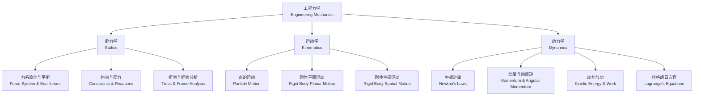

---
aliases: [EngineeringMechanics]
tags: ['Mechanics', 'EngineeringMechanics', 'SolidMechanics', 'Dynamics']
created: 2026-05-17
updated: 2026-05-17
---

# 工程力学 (Engineering Mechanics)

## 定义与概述 (Definition and Overview)

工程力学（Engineering Mechanics）是将力学基本原理——
牛顿力学（Newtonian Mechanics）和分析力学（Analytical Mechanics）——
系统应用于工程实际问题的基础学科。

主要包含静力学（Statics）、运动学（Kinematics）
和动力学（Dynamics）三大分支。

它是机械工程（Mechanical Engineering）、
土木工程（Civil Engineering）、
航空航天工程（Aerospace Engineering）
等所有工科专业的核心理论基础。

工程力学的核心目标是通过建立物理模型和数学方程，
预测工程结构与机械系统在外载荷作用下的响应，
为安全、经济、可靠的设计提供理论依据。

---

## 静力学 (Statics)

静力学研究物体在力系作用下的平衡规律。
即物体处于静止或匀速直线运动状态时力的平衡条件。
静力学是工程结构分析的基础。

**力的基本性质（Fundamental Properties of Forces）**：
力的三要素为大小（Magnitude）、方向（Direction）和作用点（Point of Application）。
力的合成与分解遵循平行四边形法则（Parallelogram Law）。

**力的平衡方程（Equilibrium Equations）**：
物体平衡时，作用其上的所有力系的合力为零：

$$
\sum \vec{F} = 0,\quad \sum \vec{M}_O = 0
$$

三维空间中展开为六个独立的标量方程：

$$
\sum F_x = 0,\quad \sum F_y = 0,\quad \sum F_z = 0
$$

$$
\sum M_x = 0,\quad \sum M_y = 0,\quad \sum M_z = 0
$$

**力矩（Moment of a Force）**：
力对某点的矩定义为 $\vec{M}_O = \vec{r} \times \vec{F}$，标量形式为 $M = rF\sin\theta$。

**力偶（Couple）**：
大小相等、方向相反、作用线不重合的两个平行力构成力偶，
力偶矩 $\vec{M} = \vec{r}_{AB} \times \vec{F}$ 为自由矢量。

**约束与约束反力（Constraints and Reactions）**：

| 约束类型 | 约束反力特征 | 自由度限制 |
|----------|-------------|-----------|
| 固定铰支座（Fixed Pin Support） | 两个正交反力分量 | 限制两个平动自由度 |
| 可动铰支座（Roller Support） | 一个垂直于支承面的反力 | 限制一个平动自由度 |
| 固定端（Fixed Support） | 三个反力 + 三个反力偶矩 | 全部六个自由度受限 |
| 光滑接触面（Smooth Surface） | 沿法线方向的反力 | 限制法线方向位移 |

**桁架分析（Truss Analysis）**：
桁架是由直杆在端点连接而成的结构，理想桁架假设所有连接均为光滑铰接，所有杆件只受轴向力。
节点法（Method of Joints）逐个节点列平衡方程，适用于求所有杆件内力。
截面法（Method of Sections）用截面截断桁架，适用于求特定杆件内力。

---

## 运动学 (Kinematics)

运动学研究物体在空间中的位置、速度和加速度随时间变化的几何规律，不涉及力的作用。

### 点的运动学 (Kinematics of a Particle)

**自然法（Natural Coordinates）**：沿轨迹切线方向描述运动：

$$
v = \dot{s},\quad a_t = \ddot{s},\quad a_n = \frac{v^2}{\rho}
$$

其中 $\rho$ 为轨迹曲率半径（Radius of Curvature）。
直角坐标法（Cartesian Coordinates）：$\vec{r} = x\hat{i} + y\hat{j} + z\hat{k}$。
极坐标法（Polar Coordinates）：$v_r = \dot{r},\quad v_\theta = r\dot{\theta}$。

### 刚体平面运动 (Rigid Body Planar Motion)

刚体平面运动可分解为平动（Translation）和转动（Rotation）。

- **速度瞬心法（Instantaneous Center of Rotation）**：$v = \omega \cdot r$（绕瞬心做瞬时转动）
- **基点法（Relative Velocity Using Base Point）**：$\vec{v}_B = \vec{v}_A + \vec{\omega} \times \vec{r}_{AB}$
- **加速度分析（Acceleration Analysis）**：

$$
\vec{a}_B = \vec{a}_A + \vec{\alpha} \times \vec{r}_{AB} + \vec{\omega} \times (\vec{\omega} \times \vec{r}_{AB})
$$

### 刚体定点运动 (Rigid Body Motion about a Fixed Point)

欧拉角（Euler Angles）用进动角 $\psi$（Precession）、章动角 $\theta$（Nutation）、自转角 $\varphi$（Spin）描述姿态。欧拉运动学方程描述角速度与欧拉角导数的关系。

---

## 动力学 (Dynamics)

动力学研究力与运动之间的因果关系，即已知力求运动或已知运动求力的两类问题。

**牛顿第二定律（Newton's Second Law）**：$\vec{F} = m\vec{a}$

**质点系动量定理（Principle of Linear Momentum for a System of Particles）**：

$$
\frac{d\vec{P}}{dt} = \sum \vec{F}^{(e)}
$$

其中 $\vec{P} = m\vec{v}_C$ 为系统的总动量，$\vec{v}_C$ 为质心速度。

**动量矩定理（Principle of Angular Momentum）**：

$$
\frac{d\vec{L}_O}{dt} = \sum \vec{M}_O^{(e)}
$$

**刚体绕定轴转动（Rotation about a Fixed Axis）**：$M_z = J_z \alpha$，其中 $J_z$ 为转动惯量。

**动能定理（Principle of Work and Energy）**：

$$
T_2 - T_1 = \sum W_{1\to2}
$$

| 运动形式 | 动能表达式 |
|----------|-----------|
| 平动（Translation） | $T = \frac{1}{2}mv^2$ |
| 绕定轴转动（Fixed-axis Rotation） | $T = \frac{1}{2}J\omega^2$ |
| 平面运动（Planar Motion） | $T = \frac{1}{2}mv_C^2 + \frac{1}{2}J_C\omega^2$ |

**达朗贝尔原理（D'Alembert's Principle）**：
在运动物体上施加惯性力 $-m\vec{a}$，即可用静力学平衡方程求解动力学问题：

$$
\sum \vec{F} + (-m\vec{a}) = 0
$$

**虚位移原理（Principle of Virtual Work）**：
理想约束下，系统平衡的充要条件是所有主动力的虚功之和为零：

$$
\sum \vec{F}_i \cdot \delta\vec{r}_i = 0
$$

**拉格朗日方程（Lagrange's Equations）**：分析力学的核心方程，适用于复杂多自由度系统：

$$
\frac{d}{dt}\frac{\partial L}{\partial \dot{q}_j} - \frac{\partial L}{\partial q_j} = Q_j
$$

其中 $L = T - V$ 为拉格朗日函数（Lagrangian），$q_j$ 为广义坐标（Generalized Coordinates），$Q_j$ 为广义力（Generalized Forces）。

---

## 经典教材 (Classic Textbooks)

- 哈尔滨工业大学理论力学教研室《理论力学》（中文经典教材）
- 刘鸿文《材料力学》（材料力学方向的标杆教材）
- Meriam & Kraige《Engineering Mechanics: Statics/Dynamics》（国际主流英文教材）
- Beer & Johnston《Vector Mechanics for Engineers》（向量力学经典）

## 主要应用领域 (Major Applications)

- **机械设计与制造（Machine Design）** — 零部件强度、刚度与稳定性分析
- **土木工程结构分析（Structural Analysis）** — 建筑、桥梁、大坝的受力计算
- **航空航天器设计（Aerospace Engineering）** — 飞行器结构强度与气动弹性分析
- **汽车工程（Automotive Engineering）** — 碰撞分析、悬架系统动力学、振动控制
- **机器人运动规划（Robot Motion Planning）** — 机械臂动力学建模与轨迹优化
- **桥梁与建筑抗震分析（Seismic Analysis）** — 地震载荷下的结构响应分析

---

## 相关条目 (Related Notes)

- [[SolidMechanics]] — 固体力学，研究固体材料在载荷下的变形与破坏
- [[FluidMechanics]] — 流体力学，研究流体的运动规律和力学行为
- [[04_EngineeringAndTechnology/CivilEngineering/StructuralEngineering/StructuralAnalysis|StructuralAnalysis]] — 结构分析，工程结构的静力与动力响应分析
- [[04_EngineeringAndTechnology/MechanicalAndElectricalEngineering/MechanicalEngineering/MachineDesign|MachineDesign]] — 机械设计，机械系统的设计理论与方法
- [[04_EngineeringAndTechnology/EngineeringFundamentals/EngineeringMechanics/Dynamics|Dynamics]] — 动力学通论
- [[VibrationAnalysis]] — 振动分析
- [[FiniteElementMethod]] — 有限元方法

