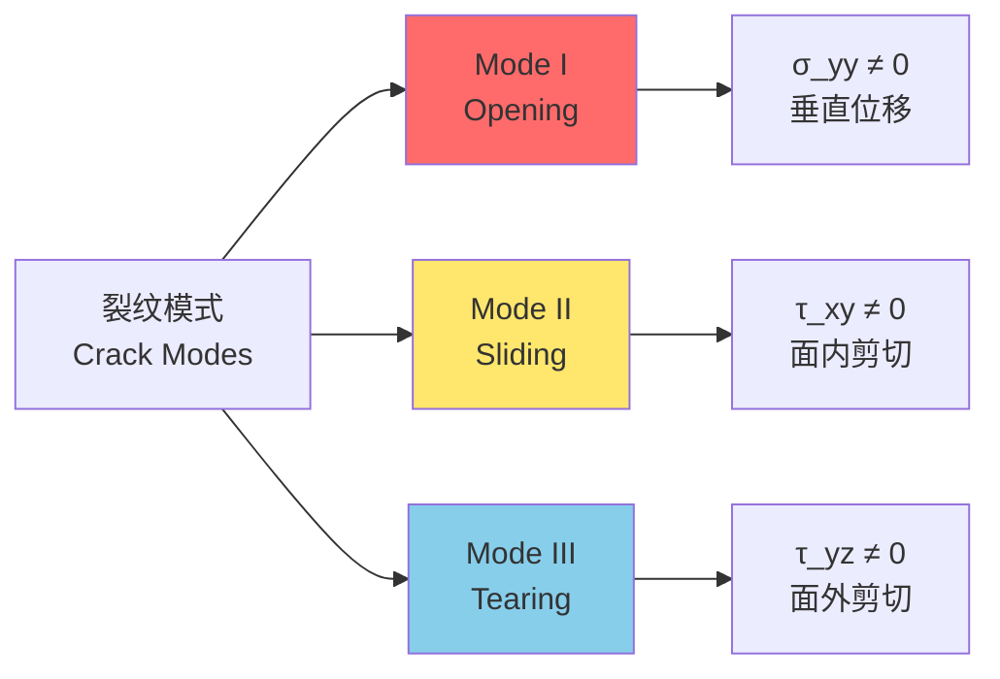

---
aliases:
  - Fracture Mechanics
  - Crack Propagation
  - Stress Intensity Factor
  - Fracture Toughness
tags:
  - engineering
  - mechanics
  - materials
  - failure-analysis
  - fatigue
  - testing
---

# 断裂力学 (Fracture Mechanics)

## 概述 (Overview)

断裂力学（Fracture Mechanics）是研究含裂纹固体材料在载荷作用下裂纹扩展规律的学科。它为工程结构的安全评估提供了理论基础，广泛应用于航空航天、核能、压力容器、桥梁等重要结构的设计和寿命预测。


## 线弹性断裂力学 (Linear Elastic Fracture Mechanics, LEFM)

### 裂纹类型 (Crack Modes)

根据裂纹面相对位移，断裂分为三种基本模式：

| 模式 | 名称 | 位移特征 | 典型例子 |
|------|------|----------|----------|
| I型 | 张开型（Opening） | 垂直于裂纹面 | 拉伸载荷 |
| II型 | 滑开型（Sliding） | 平行于裂纹面，垂直于裂纹前沿 | 面内剪切 |
| III型 | 撕开型（Tearing） | 平行于裂纹面，平行于裂纹前沿 | 反平面剪切 |




### 应力强度因子 (Stress Intensity Factor)

I型裂纹尖端应力场：

$$\sigma_{xx} = \frac{K_I}{\sqrt{2\pi r}} \cos\frac{\theta}{2}\left(1 - \sin\frac{\theta}{2}\sin\frac{3\theta}{2}\right)$$

$$\sigma_{yy} = \frac{K_I}{\sqrt{2\pi r}} \cos\frac{\theta}{2}\left(1 + \sin\frac{\theta}{2}\sin\frac{3\theta}{2}\right)$$

$$\tau_{xy} = \frac{K_I}{\sqrt{2\pi r}} \sin\frac{\theta}{2}\cos\frac{\theta}{2}\cos\frac{3\theta}{2}$$

应力强度因子 $K_I$ 综合反映远场应力和裂纹几何的影响：

$$K_I = Y \sigma \sqrt{\pi a}$$

$Y$ 为几何修正因子，$a$ 为裂纹半长。


### 断裂韧性 (Fracture Toughness)

当 $K_I$ 达到临界值 $K_{IC}$ 时，裂纹开始扩展：

$$K_I \geq K_{IC}$$

$K_{IC}$ 为平面应变断裂韧性，是材料抵抗裂纹扩展能力的度量。

典型材料的断裂韧性：

| 材料 | $K_{IC}$ (MPa·√m) | 说明 |
|------|---------------------|------|
| 高强度钢 | 20-60 | 对裂纹敏感 |
| 中强度钢 | 50-100 | 韧性较好 |
| 铝合金 | 20-40 | 轻质结构 |
| 钛合金 | 30-60 | 航空航天 |
| 陶瓷 | 2-5 | 极脆 |
| 混凝土 | 0.5-1.5 | 离散性大 |


## 弹塑性断裂力学 (Elastic-Plastic Fracture Mechanics, EPFM)

### J积分 (J-Integral)

Rice提出的J积分是围绕裂纹尖端的线积分或面积分：

$$J = \int_{\Gamma} \left(W dy - T_i \frac{\partial u_i}{\partial x} ds\right)$$

$W$ 为应变能密度，$T_i$ 为面力，$u_i$ 为位移。

J积分与应力强度因子的关系（线弹性）：

$$J = \frac{K_I^2}{E'} = \frac{K_I^2}{E}(1 - \nu^2) \quad \text{(平面应变)}$$


### 裂纹尖端张开位移 (CTOD)

裂纹尖端张开位移 $\delta_t$ 描述裂纹尖端的钝化程度。

Dugdale带状屈服模型给出：

$$\delta_t = \frac{8 \sigma_y a}{\pi E} \ln\sec\left(\frac{\pi \sigma}{2 \sigma_y}\right)$$

CTOD与J积分的关系：

$$J = m \sigma_y \delta_t$$

$m$ 为约束因子，通常 $1.4 < m < 2.1$。


### 撕裂模量 (Tearing Modulus)

描述材料抗撕裂稳定性的参数：

$$T = \frac{E}{\sigma_y^2} \frac{dJ}{da}$$

稳定性判据：

$$T_{material} > T_{applied}$$


## 疲劳裂纹扩展 (Fatigue Crack Growth)

### Paris定律 (Paris Law)

疲劳裂纹扩展速率与应力强度因子范围的关系：

$$\frac{da}{dN} = C (\Delta K)^m$$

其中 $\Delta K = K_{max} - K_{min} = Y \Delta\sigma \sqrt{\pi a}$

典型Paris参数：

| 材料 | $C$ | $m$ | 说明 |
|------|-----|-----|------|
| 钢 | $10^{-11}-10^{-12}$ | 3 | 常用范围 |
| 铝合金 | $10^{-11}-10^{-10}$ | 2.5-3 | 航空航天 |
| 钛合金 | $10^{-11}$ | 3-4 | 高温应用 |


### 裂纹扩展三阶段 (Three Regimes)

```mermaid
graph TD
    A[da/dN vs ΔK<br/>双对数坐标] --> B[第I阶段<br/>Threshold]
    A --> C[第II阶段<br/>Paris Regime]
    A --> D[第III阶段<br/>Critical]
    
    B --> B1[ΔK_th<br/>门槛值]
    C --> C1[C(ΔK)^m<br/>稳定扩展]
    D --> D1[K_IC<br/>快速断裂]
    
    style B fill:#90EE90
    style C fill:#FFE66D
    style D fill:#FF6B6B
```


### 门槛值与过载效应 (Threshold and Overload)

应力强度因子门槛值 $\Delta K_{th}$：

$$\Delta K_{th} = \Delta K_0 \left(1 - \frac{R}{R_0}\right)^{\alpha}$$

$R = K_{min}/K_{max}$ 为应力比。

过载效应（Overload Effect）：

拉伸过载会在裂纹尖端产生残余压应力场，暂时减缓裂纹扩展：

$$\frac{da}{dN}\bigg|_{post-OL} < \frac{da}{dN}\bigg|_{baseline}$$

延迟效应与过载比 $\gamma = K_{OL}/K_{max}$ 有关。


## 断裂测试方法 (Fracture Testing)

### 断裂韧性测试 (K_IC Testing)

标准试样类型（ASTM E399）：

| 试样类型 | 符号 | 特点 | 适用 |
|----------|------|------|------|
| 紧凑拉伸 | CT | 省材料 | 通用 |
| 三点弯曲 | SENB | 简单 | 厚板 |
| C形 | C(T) | 管状 | 管材 |
| 拱形 | A(T) | 特殊 | 曲面 |

平面应变条件要求：

$$B, a, (W-a) \geq 2.5\left(\frac{K_{IC}}{\sigma_y}\right)^2$$


### J积分测试 (J_IC Testing)

多试样法（Rice等人提出）：

$$J = J_e + J_p = \frac{K^2}{E'} + \frac{\eta U_p}{B b}$$

$\eta$ 为几何因子，$U_p$ 为塑性功，$b$ 为剩余韧带。

单试样卸载柔度法（ASTM E1820）：

通过周期性卸载测量柔度变化，计算裂纹扩展量 $\Delta a$。


### CTOD测试 (CTOD Testing)

BS 7448标准规定的CTOD测试：

$$\delta = \frac{K^2}{2\sigma_y E'} + \frac{r_p (W-a) V_p}{r_p (W-a) + a + z}$$

$V_p$ 为刀口位移的塑性分量，$r_p$ 为旋转因子。


## 工程应用 (Engineering Applications)

### 损伤容限设计 (Damage Tolerance Design)

损伤容限设计哲学：

1. **承认缺陷**：结构中存在可检测的初始缺陷
2. **可检性**：通过无损检测（NDT）监控裂纹
3. **可预测性**：基于断裂力学预测裂纹扩展寿命
4. **安全性**：确保在检测间隔内不达到临界尺寸

裂纹扩展寿命计算：

$$N_f = \int_{a_0}^{a_c} \frac{da}{C(\Delta K)^m} = \int_{a_0}^{a_c} \frac{da}{C(Y\Delta\sigma\sqrt{\pi a})^m}$$

对于恒定 $Y$ 和 $\Delta\sigma$：

$$N_f = \frac{2}{(m-2)C(Y\Delta\sigma\sqrt{\pi})^m}\left[\frac{1}{a_0^{(m-2)/2}} - \frac{1}{a_c^{(m-2)/2}}\right]$$


### 失效评估图 (Failure Assessment Diagram, FAD)

R6规程的失效评估曲线：

$$K_r = \frac{K_I}{K_{IC}}, \quad L_r = \frac{\sigma}{\sigma_y}$$

评估曲线：

$$K_r = \left(1 - 0.14L_r^2\right)\left[0.3 + 0.7\exp\left(-0.65L_r^6\right)\right]$$

安全区域：评估点 $(L_r, K_r)$ 位于曲线下方。


### 环境辅助开裂 (Environment-Assisted Cracking)

应力腐蚀开裂（SCC）：

$$\frac{da}{dt} = f(K_I, environment)$$

门槛值 $K_{ISCC}$ 通常远小于 $K_{IC}$。

腐蚀疲劳（Corrosion Fatigue）：

$$\left(\frac{da}{dN}\right)_{CF} = \left(\frac{da}{dN}\right)_{fatigue} + \left(\frac{da}{dN}\right)_{SCC}$$


## 参考文献 (References)

1. Anderson, T. L. (2017). *Fracture Mechanics: Fundamentals and Applications* (4th ed.). CRC Press.
2. Suresh, S. (1998). *Fatigue of Materials* (2nd ed.). Cambridge University Press.
3. Rice, J. R. (1968). A Path Independent Integral and the Approximate Analysis of Strain Concentration by Notches and Cracks. *Journal of Applied Mechanics*, 35(2), 379-386.
4. ASTM E399. (2020). *Standard Test Method for Linear-Elastic Plane-Strain Fracture Toughness K_IC of Metallic Materials*.

---

**相关概念**: [[Fatigue|疲劳]] | [[Materials Science|材料科学]] | [[Structural Mechanics|结构力学]] | [[Damage Tolerance|损伤容限]]
