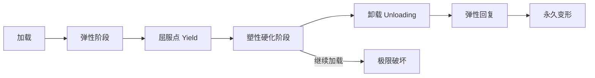

# 塑性力学

## 一、概述

塑性力学（Theory of Plasticity）研究材料在超过弹性极限后产生不可逆变形（永久变形 / 塑性变形）的力学行为。它与弹性力学（Elasticity）共同构成固体力学的基础，在金属成型、结构塑性设计、岩土工程等领域有广泛应用。

## 二、塑性变形的基本特征

### 2.1 弹塑性变形对比

| 特性 | 弹性变形 | 塑性变形 |
|------|---------|---------|
| 可逆性 | 卸载后完全恢复 | 卸载后留有永久变形 |
| 应力-应变关系 | 线性（小变形） | 非线性，路径依赖 |
| 时间依赖性 | 速率无关 | 可为速率相关（蠕变） |
| 体积变化 | 体积变化（泊松效应） | 不可压缩（$d\varepsilon_{kk}^p = 0$） |
| 热效应 | 可逆绝热 | 塑性功转化为热量（~90%） |

### 2.2 加载与卸载



## 三、屈服准则（Yield Criteria）

### 3.1 常用屈服准则

屈服准则是判断材料从弹性进入塑性的条件。一般形式：

$$
f(\sigma_{ij}) = k(\kappa)
$$

其中 $f$ 为屈服函数，$k$ 为材料硬化参数 $\kappa$ 的函数。

**Tresca 屈服准则**（最大剪应力准则，1864）：

$$
f = \max(|\sigma_1 - \sigma_2|, |\sigma_2 - \sigma_3|, |\sigma_3 - \sigma_1|) - 2k = 0
$$

其中 $k = \sigma_Y/2$ 为纯剪切屈服应力。

**von Mises 屈服准则**（畸变能准则，1913）：

$$
f = \sqrt{\frac{1}{2}[(\sigma_1-\sigma_2)^2 + (\sigma_2-\sigma_3)^2 + (\sigma_3-\sigma_1)^2]} - \sigma_Y = 0
$$

即等效应力 $\sigma_{eq} = \sqrt{3J_2}$ 达到屈服应力 $\sigma_Y$。

其中 $J_2$ 为第二偏应力不变量：

$$
J_2 = \frac{1}{6}[(\sigma_1-\sigma_2)^2 + (\sigma_2-\sigma_3)^2 + (\sigma_3-\sigma_1)^2] = \frac{1}{2}s_{ij}s_{ij}
$$

**Mohr-Coulomb 准则**（岩土材料）：

$$
f = \frac{\sigma_1 - \sigma_3}{2} + \frac{\sigma_1 + \sigma_3}{2} \sin\phi - c \cos\phi = 0
$$

其中 $c$ 为黏聚力（Cohesion），$\phi$ 为内摩擦角（Friction Angle）。

**Drucker-Prager 准则**（von Mises 的推广）：

$$
f = \alpha I_1 + \sqrt{J_2} - k = 0
$$

其中 $I_1 = \sigma_{kk}$ 为第一应力不变量，$\alpha$ 和 $k$ 由 $c$ 和 $\phi$ 确定。

### 3.2 屈服面在主应力空间的几何表示

- Tresca 屈服面：在主应力空间中是正六边形柱面
- von Mises 屈服面：是圆柱面
- Mohr-Coulomb 屈服面：是不规则六边形棱锥
- Drucker-Prager 屈服面：是圆锥面

偏平面（$\pi$ 平面）上的屈服曲线对比显示 von Mises 为圆，Tresca 为正六边形。

## 四、塑性流动法则

### 4.1 关联流动法则（Associated Flow Rule）

塑性应变增量垂直于屈服面（正交条件，Normality Condition）：

$$
d\varepsilon_{ij}^p = d\lambda \frac{\partial f}{\partial \sigma_{ij}}
$$

其中 $d\lambda \geq 0$ 为塑性乘子（Plastic Multiplier）。对 von Mises 屈服函数：

$$
\frac{\partial f}{\partial \sigma_{ij}} = \frac{3s_{ij}}{2\sigma_{eq}}
$$

因此：

$$
d\varepsilon_{ij}^p = d\lambda \frac{3s_{ij}}{2\sigma_{eq}}
$$

即在偏应力方向上的塑性流动。

### 4.2 非关联流动法则（Non-Associated Flow Rule）

对于岩土材料，常采用非关联流动法则：

$$
d\varepsilon_{ij}^p = d\lambda \frac{\partial g}{\partial \sigma_{ij}}
$$

其中 $g(\sigma_{ij})$ 为塑性势函数（Plastic Potential），与屈服函数 $f$ 不同。

## 五、硬化规律

### 5.1 各向同性硬化（Isotropic Hardening）

屈服面均匀扩张，形状不变：

$$
f(\sigma_{ij}) - \sigma_Y(\bar{\varepsilon}^p) = 0
$$

等效应变 $\bar{\varepsilon}^p = \int \sqrt{\frac{2}{3} d\varepsilon_{ij}^p d\varepsilon_{ij}^p}$。

硬化曲线可用幂律描述：

$$
\sigma_Y(\bar{\varepsilon}^p) = \sigma_{Y0} + K (\bar{\varepsilon}^p)^n
$$

或线性硬化：

$$
\sigma_Y(\bar{\varepsilon}^p) = \sigma_{Y0} + H \bar{\varepsilon}^p
$$

### 5.2 随动硬化（Kinematic Hardening）

屈服面在应力空间中平移（Bauschinger 效应）：

$$
f(\sigma_{ij} - \alpha_{ij}) - \sigma_{Y0} = 0
$$

其中 $\alpha_{ij}$ 为背应力（Back Stress），其演化律（Prager 模型）：

$$
d\alpha_{ij} = C d\varepsilon_{ij}^p
$$

随动硬化描述材料的各向异性硬化行为——拉后压的屈服应力降低。

### 5.3 混合硬化（Combined Hardening）

各向同性硬化和随动硬化的组合：

$$
f(\sigma_{ij} - \alpha_{ij}) - \sigma_Y(\bar{\varepsilon}^p) = 0
```

## 六、应力-应变关系

### 6.1 增量本构关系

总应变增量分解为弹性和塑性两部分：

$$
d\varepsilon_{ij} = d\varepsilon_{ij}^e + d\varepsilon_{ij}^p
$$

弹性部分由 Hooke 定律给出：

$$
d\sigma_{ij} = C_{ijkl} d\varepsilon_{kl}^e = C_{ijkl} (d\varepsilon_{kl} - d\varepsilon_{kl}^p)
$$

代入流动法则后可得弹塑性切线刚度张量 $C_{ijkl}^{ep}$：

$$
d\sigma_{ij} = C_{ijkl}^{ep} d\varepsilon_{kl}
$$

### 6.2 加载/卸载判据（Kuhn-Tucker 条件）

$$
\dot{\lambda} \geq 0, \quad f \leq 0, \quad \dot{\lambda} f = 0
$$

一致性条件（Consistency Condition）：

$$
\dot{f} = 0 \quad \text{（塑性加载时）}
$$

## 七、塑性极限分析

### 7.1 极限分析定理

- **下限定理（Lower Bound Theorem）**：如果存在一个静力容许的应力场处处满足屈服条件，则对应的荷载是极限荷载的下限
- **上限定理（Upper Bound Theorem）**：如果存在一个运动容许的塑性机构（破坏机构），则对应的外功率等于内功率损耗，该荷载是极限荷载的上限

下限解 $\leq$ 真实极限荷载 $\leq$ 上限解。

### 7.2 塑性铰（Plastic Hinge）

梁在弯曲作用下，截面屈服后形成一个"塑性铰"，截面弯矩维持在塑性极限弯矩 $M_p$：

$$
M_p = \sigma_Y S
$$

其中 $S$ 为塑性截面模量（Plastic Section Modulus）。

对矩形截面 $b \times h$：

$$
S = \frac{bh^2}{4}, \quad M_p = \frac{bh^2}{4} \sigma_Y
$$

### 7.3 塑性极限荷载

**梁的塑性极限荷载**：当结构中形成足够数量的塑性铰使结构变为机构时，达到极限荷载。

连续梁和框架的塑性分析与弹性分析的差异：

- 弹性设计：弹性截面最大应力 $\leq \sigma_Y$
- 塑性设计：结构极限荷载 / 安全系数

## 九、塑性力学应用

| 领域 | 应用 | 分析方法 |
|------|------|---------|
| 金属成型 | 轧制、锻造、挤压、拉拔 | 上限法、滑移线场法、FEM |
| 结构设计 | 塑性设计、极限承载力 | 极限分析、pushover |
| 岩土工程 | 地基承载力、边坡稳定 | Mohr-Coulomb、D-P 模型 |
| 机械工程 | 冲压、弯管 | 弹塑性有限元 |
| 地震工程 | 延性抗震设计 | 塑性铰模型 |
| 断裂力学 | 裂纹尖端塑性区 | Irwin 塑性区修正 |

Irwin 塑性区修正半径：

$$
r_p = \frac{1}{\pi}\left(\frac{K_I}{\sigma_Y}\right)^2 \quad \text{（平面应力）}
$$

## 九、数值方法

弹塑性有限元通常使用：

- 显式积分（Forward Euler）：速度较快，但会在屈服面漂移
- 隐式积分（Backward Euler / Radial Return）：精确返回屈服面
- 子增量法：在大应变增量下以保证精度

径向返回算法（Radial Return Mapping）是 $J_2$ 塑性最广泛使用的算法：

1. 计算弹性试应力（Elastic Trial Stress）
2. 检查屈服条件
3. 如果屈服，将试应力拉回屈服面

## 十、塑性力学数值方法

### 10.1 弹塑性有限元

弹塑性有限元求解步骤：

1. 施加载荷增量 $\Delta F$
2. 用切线刚度矩阵 $K_T$ 求解位移增量 $\Delta u$
3. 计算应变增量 $\Delta \varepsilon$ 和应力增量 $\Delta \sigma$
4. 检查屈服条件，计算塑性应变
5. 更新应力和状态变量
6. 检查残余力是否满足收敛容差
7. 不收敛则迭代（Newton-Raphson 法）

### 10.2 返回映射算法

径向返回算法（Radial Return）是 $J_2$ 塑性最广泛使用的算法：

1. 计算弹性试应力（Trial Stress）：$\boldsymbol{\sigma}^{\text{trial}} = \boldsymbol{\sigma}_n + \mathbf{D} : \Delta \boldsymbol{\varepsilon}$
2. 检查屈服：$f^{\text{trial}} = \sigma_{eq}^{\text{trial}} - \sigma_Y \leq 0$？是→弹性步完成
3. 塑性修正：$\Delta\lambda = \frac{\sigma_{eq}^{\text{trial}} - \sigma_Y}{3G + H}$
4. 更新应力：$\boldsymbol{\sigma}_{n+1} = \boldsymbol{\sigma}^{\text{trial}} - 3G \Delta\lambda \frac{\mathbf{s}^{\text{trial}}}{\sigma_{eq}^{\text{trial}}}$
5. 更新等效塑性应变：$\bar{\varepsilon}_{n+1}^p = \bar{\varepsilon}_n^p + \Delta\lambda$

### 10.3 有限元软件

| 软件 | 塑性模型库 | 特色功能 |
|------|-----------|---------|
| ABAQUS | 丰富（+Umat 自定义） | 显式/隐式求解 |
| ANSYS | 全面 | Workbench 界面友好 |
| LS-DYNA | 显式动力学 | 冲击、碰撞、成型 |
| MSC Marc | 先进加工模拟 | 大变形分析 |
| Deform | 金属成型专用 | 刚塑性/热力耦合 |

## 相关条目
- [[04_EngineeringAndTechnology/MechanicsAndMaterials/Mechanics/INDEX|当前目录索引]]
- [[Elasticity]]
- [[FractureMechanics]]
