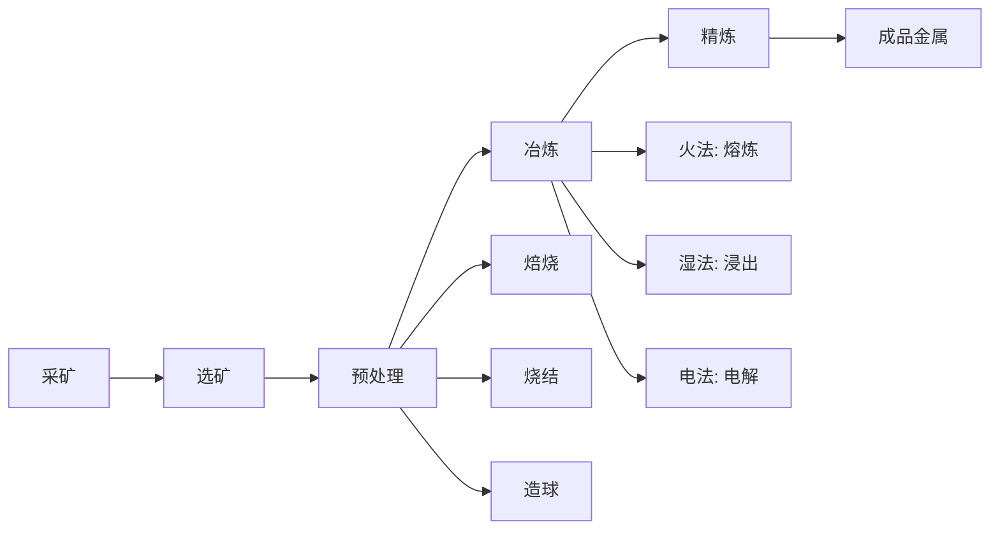

# 提取冶金

## 一、概述
提取冶金（Extractive Metallurgy）是从矿石或其他含金属原料中通过物理和化学方法提取金属并将其精炼为纯金属或合金的工程学科。根据处理过程温度不同，分为火法冶金（Pyrometallurgy）、湿法冶金（Hydrometallurgy）和电冶金（Electrometallurgy）三大类。

## 二、提取冶金流程

## 三、火法冶金（Pyrometallurgy）
### 3.1 原理
火法冶金利用高温将矿石或精矿中的目标金属以熔融态分离出来。其热力学基础是 Gibbs 自由能变化：

$$
\Delta G^\circ = \Delta H^\circ - T\Delta S^\circ
$$

反应自发进行的方向：$\Delta G < 0$。
**Ellingham 图**（Ellingham Diagram）是火法冶金的核心工具，显示各种金属氧化物生成自由能与温度的关系，用于判断还原剂的适用性。

### 3.2 主要工艺

| 工序 | 目的 | 化学反应示例 | 设备 |
|------|------|-------------|------|
| 焙烧（Roasting） | 将硫化物转化为氧化物 | $2\text{ZnS} + 3\text{O}_2 \rightarrow 2\text{ZnO} + 2\text{SO}_2$ | 流化床焙烧炉 |
| 烧结（Sintering） | 粉料结块，脱除杂质 | $2\text{PbO} + \text{PbS} \rightarrow 3\text{Pb} + \text{SO}_2$ | 烧结机 |
| 熔炼（Smelting） | 熔融分离金属与渣 | $\text{FeO} + \text{C} \rightarrow \text{Fe} + \text{CO}$ | 鼓风炉、闪速炉 |
| 吹炼（Converting） | 氧化脱除杂质 | $2\text{FeS} + 3\text{O}_2 \rightarrow 2\text{FeO} + 2\text{SO}_2$ | 转炉 |
| 精炼（Refining） | 提高金属纯度 | 电解精炼、区域熔炼 | 电解槽 |

### 3.3 钢铁冶金
钢铁冶炼是最大的提取冶金工业。
高炉（Blast Furnace）炼铁：将铁矿石（Fe$_2$O$_3$ / Fe$_3$O$_4$）、焦炭和石灰石加入高炉，通入热风进行还原反应：

$$
\text{C} + \text{O}_2 \rightarrow \text{CO}_2
$$

$$
\text{CO}_2 + \text{C} \rightarrow 2\text{CO}
$$

$$
\text{Fe}_2\text{O}_3 + 3\text{CO} \rightarrow 2\text{Fe} + 3\text{CO}_2
$$

铁水成分：~4% C，~0.5% Si，~0.5% Mn，~0.05% S，~0.1% P。
转炉炼钢（BOF, Basic Oxygen Furnace）：向铁水中吹氧，氧化脱碳至 < 0.1%：

$$
\text{C} + \frac{1}{2}\text{O}_2 \rightarrow \text{CO}
$$

同时加入造渣剂（石灰 CaO）脱除 S、P 等有害元素。
电炉炼钢（EAF, Electric Arc Furnace）：以废钢为主要原料，电弧熔化后精炼。
连铸（Continuous Casting）：钢水经结晶器连续凝固成坯（板坯、方坯、圆坯）。

### 3.4 有色金属火法冶金
**铜冶炼**（闪速熔炼 Outokumpu / Inco）：
铜精矿（CuFeS$_2$）→ 闪速熔炼 → 冰铜（Cu$_2$S·FeS）→ 转炉吹炼 → 粗铜（98.5% Cu）→ 电解精炼（99.99% Cu）。
闪速熔炼反应：

$$
2\text{CuFeS}_2 + 4\text{O}_2 \rightarrow \text{Cu}_2\text{S} + 2\text{FeO} + 3\text{SO}_2
$$

**铅冶炼**：烧结焙烧 → 鼓风炉还原熔炼 → 粗铅 → 电解/火法精炼。
**镍冶炼**：闪速熔炼 → 镍冰铜 → 加压浸出/电解精炼。

### 3.5 熔炼热力学
在熔炼炉中，金属与炉渣的分离基于密度差（金属密度 > 渣密度）和化学亲合力。
炉渣的物理化学性质：粘度（Viscosity）、碱度（Basicity $B = \text{CaO}/\text{SiO}_2$）、熔点、氧化还原电位。
渣型设计：合适的渣成分确保低熔点（< 1300°C）、低粘度（< 10 Poise）和高脱硫脱磷能力。

## 四、湿法冶金（Hydrometallurgy）
### 4.1 浸出（Leaching）
浸出是湿法冶金的第一个步骤，用溶剂选择性溶解矿石中的目标金属。
**浸出类型**：

| 浸出方法 | 溶剂 | 反应示例 | 适用矿物 |
|---------|------|---------|---------|
| 酸浸 | H$_2$SO$_4$ | $\text{CuO} + \text{H}_2\text{SO}_4 \rightarrow \text{CuSO}_4 + \text{H}_2\text{O}$ | 氧化铜矿 |
| 碱浸 | NaOH, NaCN | $4\text{Au} + 8\text{NaCN} + \text{O}_2 + 2\text{H}_2\text{O} \rightarrow 4\text{Na[Au(CN)}_2] + 4\text{NaOH}$ | 金矿氧化 |
| 氨浸 | NH$_3$ | $\text{NiO} + 6\text{NH}_3 + 2\text{NH}_4^+ \rightarrow [\text{Ni(NH}_3)_6]^{2+} + \text{H}_2\text{O}$ | 镍矿 |
| 氯化浸出 | Cl$_2$ / HCl | $2\text{Au} + 3\text{Cl}_2 + 2\text{HCl} \rightarrow 2\text{H[AuCl}_4]$ | 难处理金矿 |
| 细菌浸出 | 细菌+酸 | $\text{FeS}_2 + 7/2\text{O}_2 + \text{H}_2\text{O} \xrightarrow{\text{At.ferrooxidans}} \text{Fe}^{2+} + 2\text{SO}_4^{2-} + 2\text{H}^+$ | 低品位硫化矿 |

### 4.2 固液分离与净化工序
浸出后矿浆需要经过浓密（Thickening）、过滤（Filtration）实现固液分离。溶液中含有杂质金属离子，需通过净化（Purification）去除。

### 4.3 溶剂萃取（Solvent Extraction）
利用有机萃取剂的选择性从水溶液中萃取目标金属离子。
萃取平衡：

$$
M^{n+}_{(aq)} + nHR_{(org)} \rightleftharpoons MR_{n(org)} + nH^+_{(aq)}
$$

**萃取剂**：- 酸性萃取剂（D2EHPA 萃取稀土、Zn、Co、Ni）；- 碱性萃取剂（Alamine 336 萃取 U、Mo、V）；- 中性萃取剂（TBP 萃取 U、Pu 核燃料后处理）；- 螯合型萃取剂（LIX 系列萃取 Cu）。
**萃取等温线**：分配比 $D = C_{org}/C_{aq}$，分离因子 $\beta = D_A/D_B$。

### 4.4 离子交换
离子交换树脂用于低浓度金属的富集和分离，广泛应用于铀、稀土、贵金属提取。

### 4.5 从溶液中回收金属

| 方法 | 原理 | 产物 | 应用 |
|------|------|------|------|
| 电积（EW, Electrowinning） | 电解沉积金属 | 阴极金属板 | 铜、锌 |
| 置换沉淀（Cementation） | 活泼金属置换 | 金属粉 | Cu + Fe → Cu↓ + Fe$^{2+}$ |
| 氢还原（Hydrogen Reduction） | H$_2$ 还原金属离子 | 金属粉末 | Ni、Co |
| 结晶（Crystallization） | 蒸发浓缩 | 金属盐 | Li$_2$CO$_3$、NiSO$_4$ |

## 五、电冶金（Electrometallurgy）
### 5.1 电解精炼（Electrolytic Refining）
粗金属作阳极，纯金属在阴极析出，杂质进入电解液或阳极泥。
Cu 电解精炼：阳极为粗铜（98.5% Cu），阴极为纯铜始极片，电解液为 CuSO$_4$ + H$_2$SO$_4$。
**阳极反应（溶解）**：

$$
\text{Cu} \rightarrow \text{Cu}^{2+} + 2e^- \quad (E^\circ = +0.34 \text{ V})
$$

**阴极反应（沉积）**：

$$
\text{Cu}^{2+} + 2e^- \rightarrow \text{Cu} \quad (E^\circ = +0.34 \text{ V})
$$

槽电压：~0.3 V，电流密度：200-300 A/m$^2$。

### 5.2 熔盐电解（Fused Salt Electrolysis）
用于活泼金属（Al、Mg、Na、Li、Ca）的生产，这些金属的还原电位太负无法从水溶液中电积。
**Hall-Héroult 法炼铝**：冰晶石（Na$_3$AlF$_6$）+ 氧化铝（Al$_2$O$_3$）熔盐电解：

阴极反应：

$$
2\text{Al}_2\text{O}_3 + 3\text{C} \rightarrow 4\text{Al} + 3\text{CO}_2
$$

温度：~960°C，电流：~300 kA，电流效率：~95%，吨铝能耗：~13 MWh。

## 六、稀土提取冶金
### 6.1 稀土精矿分解
稀土（Rare Earth Elements, REEs）包括镧系 15 种元素 + Sc + Y。主要矿物：独居石（Monazite, LnPO$_4$）、氟碳铈矿（Bastnaesite, LnFCO$_3$）。
精矿分解方法：

| 方法 | 条件 | 适用矿物 | 稀土回收率 |
|------|------|---------|-----------|
| 浓硫酸焙烧 | 200-500°C | 混合稀土精矿 | > 95% |
| NaOH 碱转化 | 140-200°C | 独居石 | > 98% |
| 盐酸优先溶解 | 室温-80°C | 氟碳铈矿 | > 92% |

### 6.2 稀土分离
稀土元素之间的化学性质极其相似，分离非常困难。利用镧系收缩（Lanthanide Contraction）导致的微小离子半径差异：
离子半径从 La$^{3+}$（1.06 Å）到 Lu$^{3+}$（0.85 Å）递减。
液液萃取分离使用 P507（HEHEHP）或 D2EHPA 作为萃取剂，采用多级分馏萃取流程（数百级）。
分离系数 $\beta$ 对相邻稀土：

$$
\beta_{\text{Pr/Nd}} \approx 1.3-1.5, \quad \beta_{\text{Eu/Sm}} \approx 1.5-2.0
$$

### 6.3 单一稀土金属制备
- 氧化物熔盐电解（La、Ce、Pr、Nd 等轻稀土）
- 金属热还原（Sm、Eu、Yb、Tm 等中重稀土）

## 七、稀有金属冶金
### 7.1 钨冶金
主要矿物：黑钨矿（Fe,Mn)WO$_4$、白钨矿 CaWO$_4$。
浸出方法：
- 碱浸：$\text{WO}_3 + 2\text{NaOH} \rightarrow \text{Na}_2\text{WO}_4 + \text{H}_2\text{O}$
- 离子交换/溶剂萃取净化 → 蒸发结晶：$\text{Na}_2\text{WO}_4 \cdot 2\text{H}_2\text{O}$
APT（仲钨酸铵 (NH$_4$)$_{10}$H$_2$W$_{12}$O$_{42}\cdot$4H$_2$O）是钨的重要中间产品。

### 7.2 钽铌冶金
主要矿物：钽铁矿-铌铁矿（(Fe,Mn)(Ta,Nb)$_2$O$_6$）。
HF-H$_2$SO$_4$ 分解 → 溶剂萃取分离 Ta/Nb → K$_2$TaF$_7$ / Nb$_2$O$_5$ → 钠热还原制金属。

## 八、环境与可持续发展

| 环境问题 | 来源 | 治理措施 |
|---------|------|---------|
| SO$_2$ 排放 | 硫化矿焙烧、熔炼 | 硫酸制造、石灰石脱硫 |
| CO$_2$ 排放 | 碳还原、发电 | 低碳冶炼（氢还原、碳捕获） |
| 废渣 | 炉渣、尾矿 | 综合利用（建材、回填） |
| 废水 | 湿法冶金溶液 | 中和沉淀、膜处理 |
| 重金属污染 | 浸出过程 | 零排放、闭路循环 |

## 九、关键金属回收与循环经济
### 9.1 城市矿产（Urban Mining）
从电子废弃物、废旧电池、催化剂中回收有价金属：
**锂离子电池回收**：
1. 预处理：放电→拆解→破碎分选
2. 火法回收：熔炼得到 Co-Ni-Cu-Fe 合金
3. 湿法回收：酸浸→萃取/沉淀分离 Li、Co、Ni、Mn
回收效率目标：Co > 98%，Ni > 95%，Li > 85%，石墨 > 70%（EU Battery Regulation 2023）。

### 9.2 循环利用指标

| 金属 | 全球回收率 | 主要回收来源 |
|------|-----------|-------------|
| Fe | ~70% | 废钢 |
| Cu | ~40% | 电缆、电子废料 |
| Al | ~50% | 包装、汽车 |
| Au | ~30% | 首饰、电子产品 |
| REE | < 1% | 荧光粉、磁铁 |

## 十、提取冶金热力学基础
### 10.1 Ellingham 图
Ellingham 图是火法冶金的核心工具，绘制各类氧化物的 $\Delta G^\circ-T$ 线。线越低的氧化物越稳定越难还原。$\Delta G^\circ = 0$ 的交点对应还原温度。
还原次序（从易到难）：Cu → Ni → Fe → Zn → Cr → Mg → Al → Ca。

### 10.2 Pourbaix 图
Pourbaix 图（电位-pH 图）是湿法冶金的工具，显示金属-水体系中各物种的稳定区域，用于确定浸出和沉淀条件。

### 10.3 相图
二元/三元相图在造渣、熔炼工艺设计中至关重要。炉渣的 CaO-SiO$_2$-Al$_2$O$_3$ 三元相图决定了渣系选择。

## 十一、总结
提取冶金是人类文明发展的基石。从火法冶金的高温熔炼到湿法冶金的化学分离，从钢铁的大规模生产到稀贵金属的精炼提取，每一次冶金技术的进步都推动了工业文明的跃升。面向未来，低碳冶金、循环经济和城市矿产是提取冶金的重要发展方向。绿色、智能、高效是当代冶金技术追求的核心目标。掌握提取冶金的基本原理对资源高效利用至关重要。

## 相关条目
- [[04_EngineeringAndTechnology/MetallurgicalEngineering/ExtractiveMetallurgy/INDEX|当前目录索引]]
- [[04_EngineeringAndTechnology/MetallurgicalEngineering/MaterialsProcessing/INDEX]]
- [[MiningEngineering]]
