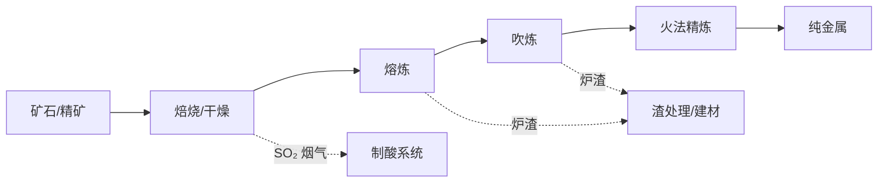

# 火法冶金（Pyrometallurgy）

## 定义

火法冶金（Pyrometallurgy）是在高温条件（通常高于 500°C，常见区间为 800–1800°C）下，利用热能对矿石、精矿或二次资源进行物理-化学转变，从而分离并提取金属的冶金技术路线。它与湿法冶金（Hydrometallurgy）和电冶金（Electrometallurgy）并列，是提取冶金三大分支之一。火法冶金是人类最早掌握的金属提取技术——铜的还原熔炼可追溯至公元前 5000 年。现代火法冶金的核心挑战在于提高能源效率、降低碳排放和应对低品位复杂矿的冶炼需求。

## 工艺单元

火法冶金的完整工艺链通常包含四个核心单元操作，每个单元可在多种炉型中实现。

### 1. 焙烧（Roasting）

焙烧是将矿石加热至低于其熔点的温度（通常 500–1000°C），使其发生化学转变以便后续处理的预备工序。

**常见焙烧类型与反应**：

| 类型 | 典型反应 | 目的 |
|------|----------|------|
| 氧化焙烧（Oxidative Roasting） | $2ZnS + 3O_2 \to 2ZnO + 2SO_2$ | 将硫化矿转化为氧化物，便于后续还原或浸出 |
| 硫化焙烧（Sulfidation Roasting） | $2CuO + 3S \to Cu_2S + SO_2$ | 将氧化矿转化为硫化物，便于造锍熔炼 |
| 氯化焙烧（Chlorination Roasting） | $TiO_2 + 2Cl_2 + C \to TiCl_4 + CO_2$ | 生成挥发性氯化物，实现气相分离 |
| 还原焙烧（Reduction Roasting） | $Fe_2O_3 + CO \to 2FeO + CO_2$ | 将高价氧化物部分还原，改善后续磁选或浸出性 |
| 硫酸化焙烧（Sulfation Roasting） | $CuS + 2O_2 \to CuSO_4$ | 生成水溶性硫酸盐，适用于铜钴矿 |

### 2. 熔炼（Smelting）

熔炼在高于物料熔点的温度下操作，目标是通过熔体反应将目标金属富集于金属相或锍相，同时使脉石成分进入渣相。熔炼是火法冶金中能源消耗最大的单元。

**还原熔炼（Reduction Smelting）**：利用还原剂（通常为焦炭或 CO）将金属氧化物还原为金属。

$$MO + C \to M + CO$$

最典型的工业案例是高炉炼铁：

$$Fe_2O_3 + 3CO \xrightarrow{>1500°C} 2Fe + 3CO_2$$

**造锍熔炼（Matte Smelting）**：将硫化矿物熔炼生成冰锍——一种由金属硫化物组成的熔体。以铜冶炼为例，硫化铜精矿经造锍熔炼生成 Cu₂S·FeS 冰锍。现代技术包括闪速熔炼（Flash Smelting）、艾萨熔炼（IsaSmelt）和诺兰达熔炼（Noranda Process）。

### 3. 吹炼（Converting）

吹炼是对熔炼产物进行选择性氧化的工序。将空气或富氧空气吹入熔体，利用杂质元素对氧的亲和力差异将其氧化进入渣相或气相，得到粗金属。铜转炉吹炼（Peirce-Smith Converter）反应如下：

$$Cu_2S + O_2 \to 2Cu + SO_2$$

钢的转炉吹炼（BOF, Basic Oxygen Furnace）脱碳反应如下：

$$C + \frac{1}{2}O_2 \to CO$$

### 4. 精炼（Refining）

**火法精炼（Fire Refining）**包括氧化精炼（利用杂质与氧亲和力差异优先氧化杂质）、还原精炼/脱氧（加入 Si、Al、CaC₂ 降低熔体中溶解氧）和真空精炼（利用低压使挥发性杂质沸点降低而挥发除去）。

**区域熔炼（Zone Refining）**利用杂质在固相和液相中分配系数的差异，使局部熔化区沿锭移动，将杂质推向一端，实现超纯金属（纯度达 99.9999% 以上）的制备。主要用于半导体材料（Si、Ge）和特种金属。

## 热力学基础

### Ellingham 图（Ellingham Diagram）

Ellingham 图是火法冶金热力学的核心工具。它绘制了各种金属氧化物标准生成自由能 $\Delta G^\circ$ 与温度的关系线。图线越低（越负），该氧化物越稳定。两条线的交点对应某一氧化物被另一金属还原的温度。

### 关键热力学公式

**标准生成自由能**：
$$\Delta G^\circ = \Delta H^\circ - T\Delta S^\circ$$

**平衡常数与自由能的关系**：
$$\Delta G^\circ = -RT \ln K$$

**非标准状态下的反应自由能**：
$$\Delta G = \Delta G^\circ + RT \ln Q$$

其中 $K$ 为平衡常数，$Q$ 为反应商（实际活度商），$R$ 为气体常数，$T$ 为绝对温度。

### 动力学考量

火法冶金中多数反应受传质控制而非本征化学反应控制。高温条件下化学反应速率极高，限制步骤通常是反应物通过边界层或渣层的扩散。

## 主要炉型与设备

| 炉型 | 英文名 | 主要用途 | 工作温度范围 | 加热方式 |
|------|--------|----------|-------------|----------|
| 高炉 | Blast Furnace | 炼铁 | 1500–1900°C | 焦炭燃烧 |
| 转炉 | BOF / Converter | 炼钢 / 吹炼 | 1200–1600°C | 化学热 |
| 电弧炉 | EAF | 废钢熔炼 | 1600–1800°C | 电弧加热 |
| 闪速熔炼炉 | Flash Furnace | 铜/镍冶炼 | 1200–1400°C | 自热反应 |
| 反射炉 | Reverberatory Furnace | 铜熔炼（已渐淘汰） | 1200–1500°C | 燃料燃烧 |
| 矿热电炉 | Submerged Arc Furnace | 铁合金冶炼 | 1600–2000°C | 电阻热 |

## 火法冶金的物料与能流

## 经典教材

- 《火法冶金学》（傅崇说）
- 《钢铁冶金学——炼铁部分》（王筱留）
- 《有色金属冶金学》（邱竹贤）
- 《冶金物理化学》（张家芸）
- Rosenqvist, T. *Principles of Extractive Metallurgy*
- Habashi, F. *Handbook of Extractive Metallurgy*

## 主要应用领域

- 高炉炼铁（Blast Furnace Ironmaking）——全球粗钢产量中约 70% 以高炉-转炉路线生产
- 转炉炼钢（BOF Steelmaking）——最主流的炼钢工艺
- 电炉炼钢（EAF Steelmaking）——以废钢为主要原料，碳排放较低
- 铜冶炼——闪速熔炼 + 转炉吹炼 + 阳极精炼
- 铅锌冶炼——烧结-鼓风炉（ISP）或 QSL 法
- 铝电解——Hall–Héroult 法（虽属熔盐电解，但需 960°C 高温）
- 镍冶炼——闪速熔炼 + 转炉吹炼
- 锡冶炼——还原熔炼 + 精炼除杂

## 环境与能源挑战

传统火法冶金面临的核心挑战是碳排放。高炉炼铁每吨生铁排放约 1.8–2.0 吨 CO₂，占全球工业碳排放的 7–9%。当前变革方向包括：氢基直接还原（H₂-DRI，用绿氢替代焦炭还原铁矿石）、碳捕集利用与封存（CCUS）、电弧炉短流程（以废钢替代铁矿石减少 60% 以上碳排放）、以及氧气高炉与炉顶煤气循环等技术。

## 相关条目

- [[Hydrometallurgy]]
- [[INDEX|ExtractiveMetallurgy 索引]]
