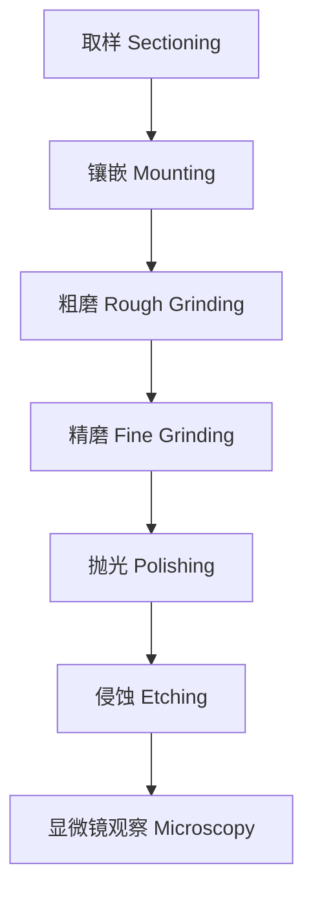
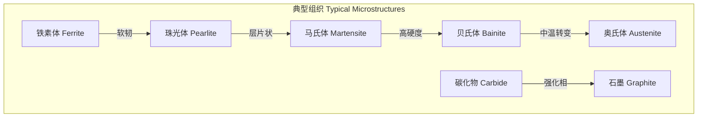
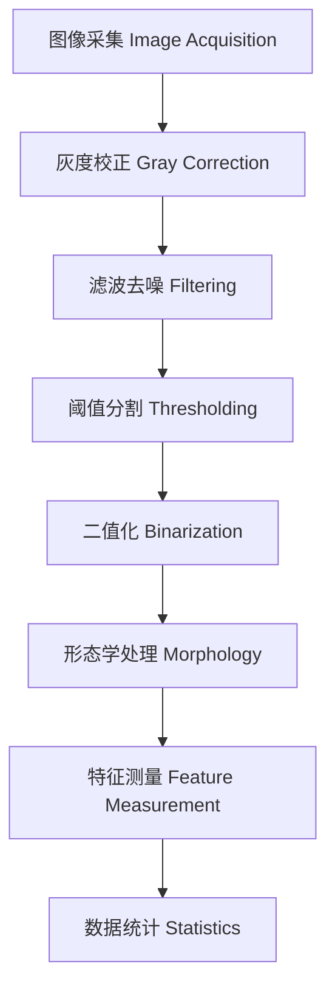

---
aliases: [Metallography, 金相学, 金相分析, Metallographic Analysis, Microscopy]
tags: ['MetallurgicalEngineering', 'PhysicalMetallurgy', 'Metallography', 'Microscopy']
created: 2026-05-17
updated: 2026-05-17
---

# 金相分析

## 概述

金相学（Metallography）是研究金属和合金微观组织结构的科学。通过显微镜观察材料的相组成、晶粒形态、缺陷分布等信息，是材料科学中最核心的表征手段之一。

## 金相样品制备

### 制备流程

### 各步骤要点

| 步骤 | 目的 | 常用方法/材料 | 注意事项 |
|------|------|-------------|---------|
| 取样（Sectioning） | 获取代表性试样 | 砂轮切割、线切割 | 避免过热损伤 |
| 镶嵌（Mounting） | 便于手持和抛光 | 热镶嵌（电木粉）、冷镶嵌（环氧树脂） | 边缘保护 |
| 粗磨（Rough Grinding） | 去除切割损伤层 | SiC 砂纸 60# — 400# | 逐级过渡 |
| 精磨（Fine Grinding） | 减小表面粗糙度 | SiC 砂纸 600# — 1200# | 旋转90°消除划痕 |
| 抛光（Polishing） | 获得镜面光洁度 | 金刚石喷雾 6µm — 1µm | 保持湿润 |
| 侵蚀（Etching） | 显示组织衬度 | 硝酸酒精（Nital）、苦味酸（Picral） | 侵蚀时间适中 |

### 侵蚀剂选择

| 材料类型 | 推荐侵蚀剂 | 成分 | 作用时间 |
|---------|-----------|------|---------|
| 碳钢/低合金钢 | Nital | 2% — 5% HNO₃ + 乙醇 | 5 — 15 s |
| 不锈钢 | 王水甘油 | HCl:HNO₃:甘油 = 3:1:2 | 30 — 60 s |
| 铸铁 | Nital + Picral | 4% Picral + 2% Nital | 10 — 20 s |
| 铝合金 | Keller 试剂 | HF:HCl:HNO₃:H₂O | 5 — 15 s |
| 铜合金 | 氯化铁试剂 | FeCl₃ + HCl + H₂O | 5 — 30 s |

## 光学显微镜

### 明场与暗场

明场成像（Bright Field, BF）是最常用的观察模式，垂直照明光经物镜聚焦到试样表面，垂直反射光进入物镜成像。

暗场成像（Dark Field, DF）利用环形光照射，仅散射光进入物镜，适用于观察晶界、析出相等细微结构。

### 偏振光与 DIC

| 技术 | 原理 | 应用 |
|------|------|------|
| 偏振光（Polarized Light） | 利用各向异性组织的双折射效应 | 铀化物、Ti 合金等 |
| 微分干涉差（DIC） | Nomarski 棱镜产生光程差 | 表面浮凸、细微划痕 |
| 相衬（Phase Contrast） | 将相位差转化为振幅差 | 低衬度侵蚀试样 |

## 扫描电子显微镜

### SEM 在金相中的应用

SEM（Scanning Electron Microscopy）比光学显微镜有更高的分辨率和更大的景深：

- 二次电子像（SEI）：形貌衬度，分辨率约 3 — 5 nm
- 背散射电子像（BSE）：原子序数衬度，区分不同相
- EDS（Energy Dispersive Spectroscopy）：成分分析

## 晶粒度测量

### 测量方法

| 方法 | 标准 | 计算公式 | 适用范围 |
|------|------|---------|---------|
| 比较法 | ASTM E112 | 与标准图对比 | 均匀等轴晶 |
| 截线法 | ASTM E112 | $G = -6.6457\lg L + 3.298$ | 任何晶粒形态 |
| 面积法 | ASTM E1382 | $N_A = N/A$ | 自动图像分析 |

### Hall-Petch 关系

晶粒大小与屈服强度的关系：

$$
\sigma_y = \sigma_0 + \frac{k_y}{\sqrt{d}}
$$

其中 $d$ 为平均晶粒直径，$k_y$ 为 Hall-Petch 常数。

## 相鉴定与定量分析

### X 射线衍射

Bragg 定律是 XRD 相鉴定的基础：

$$
n\lambda = 2d\sin\theta
$$

| 应用 | 方法 | 输出 |
|------|------|------|
| 物相鉴定 | 对比 PDF 卡片 | 相组成与晶体结构 |
| 残余奥氏体量 | 峰面积积分 | 体积分数 $V_\gamma$ |
| 织构分析 | 极图测量（Pole Figure） | 取向分布函数 ODF |

### 定量金相

体视学（Stereology）基本公式：

| 测量量 | 符号 | 含义 | 关系式 |
|-------|------|------|--------|
| 体积分数 | $V_V$ | 某相所占体积比 | $V_V = A_A = L_L = P_P$ |
| 比表面积 | $S_V$ | 单位体积内的界面面积 | $S_V = 4L_A/\pi$ |
| 平均截距 | $\bar{L}$ | 随机线穿过晶粒的平均长度 | $\bar{L} = 1/N_L$ |

Delesse 原理：二维截面上的面积分数等于三维体积分数：

$$
V_V = A_A
$$

## 典型金相组织

### 常见组织的金相特征

| 组织 | 侵蚀后颜色 | 形态特征 | 硬度范围 |
|------|-----------|---------|---------|
| 铁素体（Ferrite） | 白色/浅色 | 等轴多边形晶粒 | 80 — 120 HV |
| 珠光体（Pearlite） | 层状黑白相间 | 交替层片 | 200 — 300 HV |
| 马氏体（Martensite） | 深色针状 | 交叉针状/板条 | 500 — 900 HV |
| 贝氏体（Bainite） | 深灰色 | 羽毛状/针状 | 300 — 500 HV |
| 渗碳体（Cementite） | 白色凸起 | 网状/片状/球状 | 800 — 1000 HV |
| 石墨（Graphite） | 黑色 | 片状/球状/蠕虫状 | 极低 |

## 高级金相技术

### 热蚀与着色

| 技术 | 原理 | 应用 |
|------|------|------|
| 热蚀（Thermal Etching） | 高温真空下表面扩散 | 晶界显示、无污染 |
| 着色蚀刻（Tint Etching） | 化学沉积干涉膜 | 相衬度增强 |
| 电解抛光与蚀刻（Electropolishing） | 阳极溶解 | 无变形层表面 |
| 离子蚀刻（Ion Milling） | 惰性离子轰击 | EBSD 试样制备 |

### 自动图像分析

定量金相中自动图像分析（Automated Image Analysis, AIA）的流程：

## 特殊材料金相

### 铸铁金相

铸铁中石墨形态的分类（GB/T 7216 — 2019）：

| 石墨形态 | 类型号 | 特征 | 基体组织 | 力学性能 |
|---------|-------|------|---------|---------|
| 片状石墨 | I 型 | 长条片状 | 铁素体/珠光体 | 低韧性 |
| 蠕虫状石墨 | II 型 | 短厚蠕虫状 | 铁素体 | 中韧性 |
| 球状石墨 | VI 型 | 球状颗粒 | 铁素体/珠光体 | 高强度高韧性 |

### 不锈钢金相

不锈钢类型与金相特征：

| 不锈钢类型 | 基体组织 | 典型侵蚀剂 | 金相特征 |
|-----------|---------|-----------|---------|
| 奥氏体（304, 316） | FCC γ | 王水甘油、10% 草酸 | 孪晶、晶界清晰 |
| 铁素体（430） | BCC α | Murakami | 等轴晶、无孪晶 |
| 马氏体（410, 420） | BCT α' | Vilella | 针状组织 |
| 双相（2205） | α + γ | 40% KOH | 两相衬度差异 |

## 显微硬度测量

### 硬度换算

| 显微硬度标尺 | 压头类型 | 载荷范围 | 压痕特征 | 典型应用 |
|------------|---------|---------|---------|---------|
| Vickers (HV) | 正四棱锥 136° | 1 g — 100 kg | 方形压痕 | 通用 |
| Knoop (HK) | 菱形棱锥 | 1 g — 1000 g | 细长压痕 | 薄层/脆性材料 |

Vickers 硬度计算公式：

$$
HV = \frac{1.8544 \cdot F}{d^2}
$$

其中 $F$ 为载荷（kgf），$d$ 为压痕对角线均值（mm）。

### 相鉴别辅助手段

| 方法 | 分辨率 | 可获取信息 | 样品要求 |
|------|-------|-----------|---------|
| EDS | 1 µm³ | 元素成分半定量 | 导电、抛光 |
| EBSD | 0.1 µm | 晶体取向、相鉴定 | 无变形、倾转 70° |
| WDS | 0.5 µm | 元素成分定量 | 导电、抛光 |
| Auger | 10 nm | 表面成分 | 超高真空 |

## 参考

- ASTM E3 — 11. *Standard Guide for Preparation of Metallographic Specimens*.
- Vander Voort, G. F. (2004). *ASM Handbook, Volume 9: Metallography and Microstructures*. ASM International.
- 中国机械工程学会热处理分会. (2018). 《金相检验》. 机械工业出版社.
- ASTM E112 — 13. *Standard Test Methods for Determining Average Grain Size*.
- Goldstein, J., et al. (2017). *Scanning Electron Microscopy and X-ray Microanalysis*. Springer.
- 汪守朴. (2015). 《金相分析基础》. 机械工业出版社.

