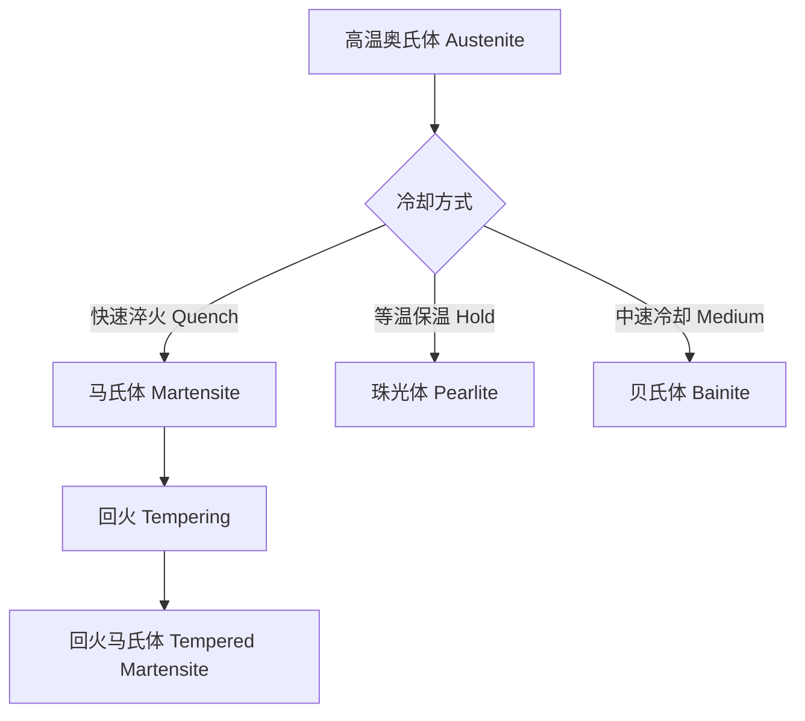
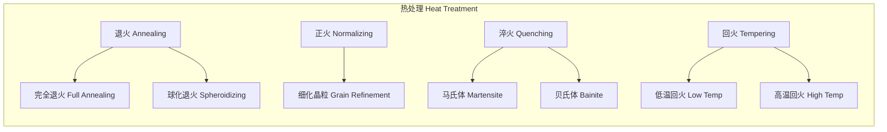
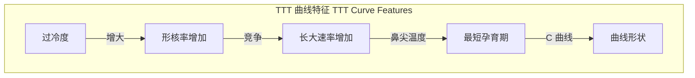

---
aliases: [PhaseTransformations, 相变, Phase Change, Phase Transition]
tags: ['MetallurgicalEngineering', 'PhysicalMetallurgy', 'PhaseTransformations', 'HeatTreatment']
created: 2026-05-17
updated: 2026-05-17
---

# 相变原理

## 概述

相变（Phase Transformation）是材料在温度、压力或成分变化时，从一种相转变为另一种相的过程。在金属学中，相变是调控微观组织和力学性能的核心手段。

## 相变热力学

### 自由能与驱动力

相变的驱动力来自系统吉布斯自由能（Gibbs Free Energy）的降低：

$$
\Delta G = \Delta H - T\Delta S
$$

其中 $\Delta G < 0$ 是相变自发进行的必要条件。

### 临界形核半径

均匀形核（Homogeneous Nucleation）的临界半径：

$$
r^* = -\frac{2\gamma}{\Delta G_v}
$$

其中 $\gamma$ 为界面能，$\Delta G_v$ 为体积自由能变化。

## 相变动力学

### TTT 曲线（Time-Temperature-Transformation）



TTT 曲线描述了等温条件下相变开始与结束的时间-温度关系，包含：

| 特征区域 | 温度范围 | 产物 | 显微组织特征 |
|---------|---------|------|------------|
| 高温区 | 727°C — A₃ | 珠光体（Pearlite） | 层片状铁素体+渗碳体 |
| 中温区 | Ms — 550°C | 贝氏体（Bainite） | 羽毛状或针状 |
| 低温区 | Mf — Ms | 马氏体（Martensite） | 针状或板条状 |

### CCT 曲线（Continuous Cooling Transformation）

CCT 曲线描述连续冷却条件下的相变行为，与 TTT 曲线相比，CCT 曲线向右下方偏移。

## 扩散型相变

### 珠光体转变

珠光体（Pearlite）是铁素体（Ferrite）与渗碳体（Cementite）的层片状共析组织：

$$
\gamma \rightarrow \alpha + \text{Fe}_3\text{C}
$$

层片间距 $\lambda$ 与过冷度 $\Delta T$ 的关系：

$$
\lambda \propto \frac{1}{\Delta T}
$$

### 贝氏体转变

贝氏体（Bainite）是介于珠光体和马氏体之间的中温转变产物：

| 类型 | 形成温度 | 形貌 | 碳化物分布 |
|------|---------|------|-----------|
| 上贝氏体（Upper Bainite） | 350°C — 550°C | 羽毛状 | 碳化物在板条间 |
| 下贝氏体（Lower Bainite） | Ms — 350°C | 针状 | 碳化物在板条内 |

## 无扩散型相变

### 马氏体转变

马氏体（Martensite）是碳在 $\alpha$-Fe 中的过饱和固溶体，通过无扩散切变转变形成：

$$
\gamma \ (\text{FCC}) \xrightarrow{\text{切变}} \alpha' \ (\text{BCT})
$$

马氏体转变特点：

- 无扩散（Diffusionless）
- 共格切变（Cooperative Shear）
- 表面浮凸（Surface Relief）
- 变温形成（Athermal）

马氏体形态与含碳量的关系：

| 含碳量 (wt%) | 马氏体形态 | 硬度 (HRC) | Ms 温度 (°C) |
|-------------|-----------|-----------|-------------|
| 0.1 — 0.3 | 板条状（Lath） | 30 — 45 | 350 — 450 |
| 0.3 — 0.6 | 混合型（Mixed） | 45 — 55 | 200 — 350 |
| 0.6 — 1.2 | 针状（Plate） | 55 — 65 | 100 — 200 |

### 马氏体转变动力学公式

$$
f = 1 - \exp\left[-\beta(T_q - M_s)^n\right]
$$

其中 $f$ 为马氏体体积分数，$T_q$ 为淬火温度。

## 沉淀相变

### 时效强化

过饱和固溶体分解过程的序列：

```
过饱和固溶体 → GP 区（Guinier-Preston Zones）→ 过渡相（θ'' → θ'）→ 平衡相（θ）
```

奥斯瓦尔德熟化（Ostwald Ripening）动力学：

$$
\bar{r}^3 - \bar{r}_0^3 = \frac{8\gamma D C_\infty V_m^2}{9RT} t
$$

## 相图基础

### 铁碳相图关键点

| 关键点 | 温度 (°C) | 碳含量 (wt%) | 意义 |
|-------|-----------|-------------|------|
| A₁（共析点） | 727 | 0.77 | 共析转变 |
| A₃ | 912 | 0 | $\gamma \rightarrow \alpha$ 开始 |
| Aₘ | 1147 | 4.30 | 共晶转变 |
| 包晶点 | 1495 | 0.16 | 包晶反应 |

## 热处理工艺



### 常见热处理工艺参数

| 工艺 | 加热温度 | 冷却方式 | 目的 |
|------|---------|---------|------|
| 完全退火 | A₃ + 30~50°C | 炉冷 | 消除内应力，细化晶粒 |
| 正火 | A₃ + 50~80°C | 空冷 | 调整硬度，改善切削性 |
| 淬火 | A₃ + 30~50°C | 水/油冷 | 获得马氏体 |
| 回火 | 150~650°C | 空冷 | 消除脆性，调整性能 |

## 相变晶体学

### 取向关系

| 转变类型 | 取向关系 | 惯习面 |
|---------|---------|--------|
| 珠光体 | Pitsch: (001)ₘ ∥ (5̄21)ₓ | — |
| 马氏体 | K-S: (111)ᵧ ∥ (110)ₐ' | {225}ᵧ 或 {259}ᵧ |
| 贝氏体 | 介于 K-S 与 Pitsch 之间 | {111}ᵧ |

## 相变动力学曲线绘制



### 等温转变动力学

Avrami 方程描述等温转变动力学：

$$
f = 1 - \exp(-Kt^n)
$$

其中 $f$ 为转变分数，$K$ 为速率常数，$n$ 为 Avrami 指数（与形核和长大机制相关）。

| 转变类型 | Avrami 指数 n | 形核方式 | 长大方式 |
|---------|--------------|---------|---------|
| 珠光体 | 3 — 4 | 界面形核 | 各向同性 |
| 贝氏体 | 2 — 3 | 晶界形核 | 板条伸长 |
| 再结晶 | 1 — 2 | 择优形核 | 晶界迁移 |

## 非平衡相变

### 马氏体变体选择

马氏体相变中存在 24 种可能的变体（Variant），在外应力作用下发生变体选择（Variant Selection），导致织构形成。

变体对（Variant Pair）的类型：

| 变体对类型 | 取向差角 | 界面类型 | 自协调效应 |
|-----------|---------|---------|-----------|
| Type I | 60° | 孪晶界（Twin Boundary） | 强 |
| Type II | 60° | 扭折界（Kink Boundary） | 中 |
| Type III | 10.5° | 小角度晶界 | 弱 |

### 形状记忆效应

马氏体相变的热弹性（Thermoelastic）特性：

- 应力诱发马氏体（Stress-Induced Martensite, SIM）
- 超弹性（Superelasticity / Pseudoelasticity）
- 单向形状记忆效应（One-Way SME）
- 双向形状记忆效应（Two-Way SME）

```
奥氏态 → 冷却 → 马氏态（变体自协调）
    ↓ 施加应力               ↓ 加热
   马氏体变体重排 ←──────── 奥氏体恢复
        （去孪晶 Detwinning）
```

## 纳米析出强化

### Orowan 机制

析出相阻碍位错运动的 Orowan 绕过机制：

$$
\Delta\tau = \frac{0.84 Gb}{L_p} \cdot \ln\left(\frac{r}{b}\right)
$$

其中 $L_p$ 为析出相间距，$r$ 为析出相半径，$G$ 为剪切模量，$b$ 为柏氏矢量。

### 析出序列示例

铝合金时效析出序列：

```
Al-Cu: SSSS → GP I → GP II (θ'') → θ' → θ (Al₂Cu)
Al-Mg-Si: SSSS → GP 区 → β'' → β' → β (Mg₂Si)
Al-Zn-Mg: SSSS → GP 区 → η' → η (MgZn₂)
```

| 合金系 | 主要强化相 | 峰值时效温度 | 峰值硬度 |
|-------|-----------|------------|---------|
| 2024 (Al-Cu-Mg) | S (Al₂CuMg) | 190°C | 140 HV |
| 6061 (Al-Mg-Si) | β'' — Mg₅Si₆ | 175°C | 110 HV |
| 7075 (Al-Zn-Mg-Cu) | η' — MgZn₂ | 120°C | 175 HV |

## 参考

- Porter, D. A., Easterling, K. E., & Sherif, M. (2009). *Phase Transformations in Metals and Alloys*. CRC Press.
- 刘宗昌等. (2015). 《金属固态相变原理》. 冶金工业出版社.
- Bhadeshia, H. K. D. H., & Honeycombe, R. (2017). *Steels: Microstructure and Properties*. Butterworth-Heinemann.
- Christian, J. W. (2002). *The Theory of Transformations in Metals and Alloys*. Pergamon.
- ASM Handbook, Volume 4: *Heat Treating*. (1991). ASM International.

