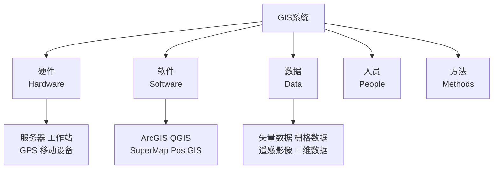
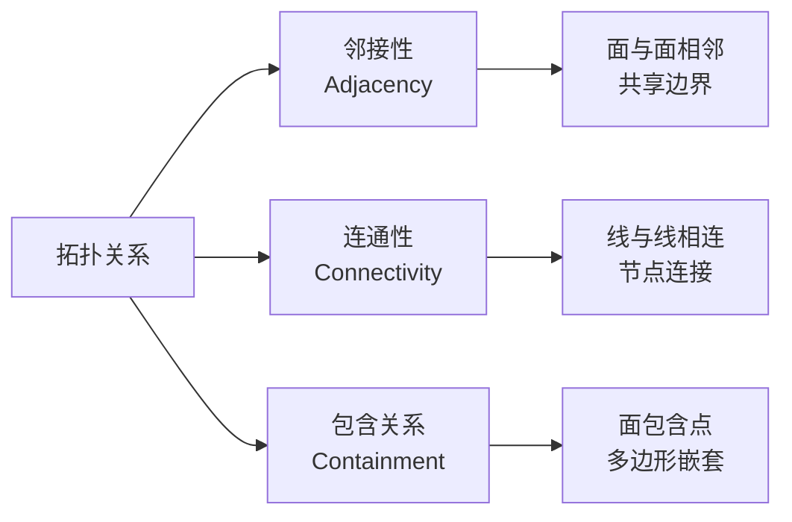

# GIS 基础（GIS Fundamentals）

## 概述

地理信息系统（Geographic Information System, GIS）是用于采集（Acquisition）、存储（Storage）、管理（Management）、分析（Analysis）和显示（Display）地理空间数据（Geospatial Data）的计算机系统。GIS 集成了地图学（Cartography）、数据库技术（Database Technology）和空间分析（Spatial Analysis），为地理问题的研究和决策支持提供强大工具。

GIS 的起源可追溯至 20 世纪 60 年代，加拿大地理信息系统（CGIS）被认为是世界上第一个 operational GIS。经过半个多世纪的发展，GIS 已从专业领域的研究工具演变为智慧城市（Smart City）、自然资源管理、应急指挥和日常生活的基础设施。

## GIS 组成

### 硬件系统

| 硬件类型 | 功能 | 典型设备 |
|----------|------|----------|
| 数据采集设备 | 获取空间数据 | GPS 接收机、全站仪、激光雷达（LiDAR） |
| 数据处理设备 | 运行 GIS 软件 | 工作站、服务器、GPU 集群 |
| 数据存储设备 | 海量数据存储 | SAN/NAS 存储阵列、云存储 |
| 输出设备 | 成果展示 | 大幅面绘图仪、显示器、VR 设备 |
| 网络设备 | 数据传输与共享 | 交换机、路由器、防火墙 |

### 软件平台

| 软件名称 | 开发商 | 特点 | 许可模式 |
|----------|--------|------|----------|
| ArcGIS | Esri | 功能最全面、行业标杆 | 商业软件 |
| QGIS | 开源社区 | 免费开源、插件丰富 | 开源免费 |
| SuperMap | 超图软件 | 国产 GIS 平台、二三维一体化 | 商业软件 |
| MapGIS | 中地数码 | 国产老牌 GIS、地质领域强 | 商业软件 |
| GRASS GIS | 开源社区 | 强大的栅格分析和建模 | 开源免费 |
| PostGIS | 开源社区 | 空间数据库扩展 | 开源免费 |

## 空间数据模型

### 矢量数据模型（Vector Data Model）

矢量数据使用离散的几何对象表示地理要素：

| 几何类型 | 数学表示 | 示例 |
|----------|----------|------|
| 点（Point） | $P(x, y)$ 或 $P(x, y, z)$ | 采样点、监测站、POI |
| 线（Line/Polyline） | $L = \{(x_1,y_1), (x_2,y_2), \ldots, (x_n,y_n)\}$ | 道路、河流、管线 |
| 面（Polygon） | $A = \{(x_1,y_1), \ldots, (x_n,y_n), (x_1,y_1)\}$ | 行政区划、地块、湖泊 |
| 多点（MultiPoint） | 点的集合 | 降雨站群 |
| 多线（MultiLine） | 线的集合 | 河流系统 |
| 多面（MultiPolygon） | 面的集合 | 群岛、飞地 |

矢量数据的优势：数据结构紧凑、图形精度高、拓扑关系明确。适合表示离散的、边界清晰的地理要素。

### 栅格数据模型（Raster Data Model）

栅格数据将空间划分为规则的像元（Cell/Pixel）矩阵：

| 参数 | 说明 | 典型值 |
|------|------|--------|
| 分辨率（Resolution） | 单个像元代表的地面尺寸 | 0.5 m, 10 m, 30 m, 1 km |
| 波段数（Bands） | 每个像元存储的数值层数 | 1（DEM）、3（RGB）、多光谱 |
| 像元深度 | 每个数值的比特数 | 8 bit, 16 bit, 32 bit |
| 数据量 | 行数 × 列数 × 波段数 × 像元深度 / 8 | 随分辨率指数增长 |

栅格数据分辨率与数据量的关系：

$$\text{数据量} = \frac{W \times H \times B \times D}{8} \quad \text{(Bytes)}$$

其中 $W$ 为宽度（像元数），$H$ 为高度，$B$ 为波段数，$D$ 为像元深度（bit）。

### 栅格与矢量的比较

| 特性 | 矢量数据 | 栅格数据 |
|------|----------|----------|
| 数据结构 | 紧凑 | 随分辨率增长 |
| 图形精度 | 高（与比例尺无关） | 受分辨率限制 |
| 拓扑分析 | 方便 | 困难 |
| 叠加分析 | 复杂 | 简单 |
| 连续表面 | 不适用 | 适用 |
| 遥感影像 | 不适用 | 原生支持 |
| 制图输出 | 美观 | 块状 |

## 空间数据库

### 数据组织

| 组织层级 | 定义 | 示例 |
|----------|------|------|
| 图层（Layer/Feature Class） | 同类地理要素的集合 | 道路图层、建筑物图层 |
| 要素数据集（Feature Dataset） | 同一坐标系下相关图层的集合 | 城市规划要素集 |
| 地理数据库（Geodatabase） | 完整的空间数据库 | 城市 GIS 数据库 |
| 工作空间（Workspace） | 数据存储的目录或数据库 | 文件地理数据库 |

### 拓扑关系

拓扑（Topology）描述空间要素之间的逻辑关系：

| 拓扑规则 | 定义 | 应用 |
|----------|------|------|
| 不能重叠（Must Not Overlap） | 同一图层要素边界不重叠 | 行政区划 |
| 不能有空隙（Must Not Have Gaps） | 面要素完全覆盖区域 | 土地利用 |
| 必须被覆盖（Must Be Covered By） | 要素被另一类要素包含 | 建筑物在地块内 |
| 不能自相交（Must Not Self-Intersect） | 线不与自己交叉 | 道路中心线 |

## 空间参考系统

### 坐标系统

| 坐标系统类型 | 定义 | 适用场景 |
|-------------|------|----------|
| 地理坐标系（GCS） | 经纬度表示 | 全球数据、大尺度分析 |
| 投影坐标系（PCS） | 平面直角坐标 | 制图、距离面积量算 |

常用坐标系统：

| 坐标系统 | EPSG 代码 | 适用范围 |
|----------|----------|----------|
| WGS 84 | 4326 | GPS 定位、全球数据交换 |
| CGCS 2000 | 4490 | 中国法定大地坐标系 |
| 北京 54 | 4214 | 历史数据 |
| 西安 80 | 4610 | 历史数据 |
| UTM 投影 | 32601–32660 | 全球 6° 分带投影 |
| 高斯-克吕格 | 各带独立 | 中国大比例尺制图 |

## 空间分析

### 叠置分析（Overlay Analysis）

将多个图层的空间要素进行几何运算：

| 运算类型 | 结果 | 应用 |
|----------|------|------|
| 交集（Intersect） | 保留共同区域 | 多条件叠加筛选 |
| 并集（Union） | 合并所有区域 | 完整覆盖分析 |
| 差集（Erase/Difference） | 去除重叠部分 | 排除特定区域 |
| 对称差（Symmetrical Difference） | 保留非重叠部分 | 变化检测 |
| 裁剪（Clip） | 按边界裁切 | 数据提取 |

### 缓冲区分析（Buffer Analysis）

以空间要素为中心建立一定宽度的影响区域：

$$\text{缓冲区} = \{p \in \mathbb{R}^2 \mid d(p, F) \leq r\}$$

其中 $F$ 为目标要素，$r$ 为缓冲距离，$d$ 为距离函数。

| 缓冲类型 | 特点 | 示例 |
|----------|------|------|
| 等距缓冲 | 固定距离 | 道路两侧 50 m 噪声影响区 |
| 变距缓冲 | 按属性变化 | 河流按流量分级缓冲 |
| 多重缓冲 | 多层同心圆 | 机场噪声分级区 |

### 网络分析（Network Analysis）

基于网络数据模型的分析：

| 分析类型 | 算法 | 应用 |
|----------|------|------|
| 最短路径（Shortest Path） | Dijkstra、A* | 导航、管线规划 |
| 最优路径（Optimal Path） | 多目标优化 | 物流配送 |
| 服务区分析（Service Area） | 网络扩展 | 设施覆盖范围 |
| 最近设施（Closest Facility） | 网络距离计算 | 应急资源调配 |
| 位置分配（Location-Allocation） | 组合优化 | 设施选址 |

Dijkstra 最短路径算法：

$$d(v) = \min_{u \in \text{前驱}} \{d(u) + w(u,v)\}$$

### 空间插值（Spatial Interpolation）

从离散采样点推断连续表面：

| 方法 | 原理 | 适用条件 | 局限性 |
|------|------|----------|--------|
| 反距离加权（IDW） | 距离越近权重越大 | 采样点密集均匀 | 产生牛眼效应 |
| 克里金（Kriging） | 考虑空间自相关 | 有空间结构的数据 | 计算复杂 |
| 样条函数（Spline） | 最小曲率插值 | 平滑表面 | 边缘效应 |
| 自然邻域（Natural Neighbor） | Voronoi 权重 | 不规则分布 | 局部性 |
| 趋势面（Trend Surface） | 多项式拟合 | 大趋势分析 | 忽略局部变异 |

克里金插值的半方差函数：

$$\gamma(h) = \frac{1}{2N(h)} \sum_{i=1}^{N(h)} [Z(x_i) - Z(x_i+h)]^2$$

## GIS 开发与应用

### WebGIS

WebGIS 技术栈：

| 层级 | 技术 | 代表产品 |
|------|------|----------|
| 地图服务器 | 地图服务发布 | GeoServer、MapServer、ArcGIS Server |
| 前端库 | 地图渲染与交互 | Leaflet、OpenLayers、Mapbox GL、Cesium |
| 数据服务 | 瓦片、要素服务 | WMS、WFS、WMTS、矢量瓦片 |
| 后端框架 | 空间数据处理 | GeoDjango、GeoServer REST |

### 二次开发

| 开发方式 | 工具/语言 | 适用场景 |
|----------|----------|----------|
| ArcPy | Python + ArcGIS | ArcGIS 自动化 |
| QGIS API | Python/C++ | QGIS 插件开发 |
| GDAL/OGR | C++/Python | 数据格式转换与处理 |
| PostGIS | SQL | 空间数据库操作 |
| ArcGIS Engine | .NET/Java | 桌面应用开发 |

### 应用领域

| 领域 | 典型应用 | 关键技术 |
|------|----------|----------|
| 智慧城市 | 城市信息模型（CIM）、数字孪生 | 三维 GIS、IoT 集成 |
| 自然资源 | 国土调查、不动产登记 | 空间数据库、拓扑分析 |
| 环境保护 | 环境影响评价、生态红线 | 叠置分析、缓冲区 |
| 交通运输 | 路径优化、交通流量分析 | 网络分析、时空大数据 |
| 应急管理 | 灾害预警、救援路径规划 | 实时数据、网络分析 |
| 公共卫生 | 疫情时空扩散分析 | 空间统计、热点分析 |

## 经典教材

| 教材名称 | 作者 | 特点 |
|----------|------|------|
| 《地理信息系统基础》 | 龚健雅 | 中国 GIS 经典教材 |
| 《地理信息系统原理与方法》 | 吴信才 | 国产 GIS 理论与实践 |
| *Geographic Information Systems and Science* | Longley et al. | 国际权威教材 |
| *GIS Fundamentals* | Paul Bolstad | 入门经典 |
| 《ArcGIS 从基础到实践》 | 汤国安 | 软件操作指南 |

## 相关条目

- [[RemoteSensing|遥感技术]]
- [[Cartography|地图学]]
- [[Surveying|测量学]]
- [[SpatialAnalysis|空间分析]]
- [[RemoteSensing|遥感]]
- [[GPS|全球定位系统]]
- [[INDEX|Cartography 索引]]
