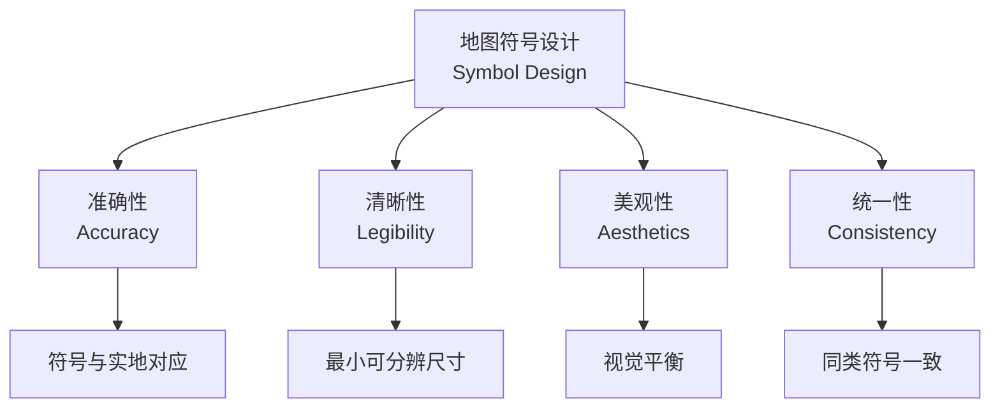
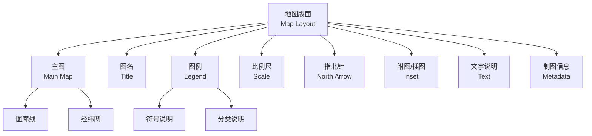

# 地图设计 (Map Design)

## 概述 (Overview)

地图设计（Map Design / Cartographic Design）是研究地图内容选取、表示方法、符号设计和版面布局的学科。优秀的地图设计需要在科学准确性、视觉清晰度和美学吸引力之间取得平衡，使地图信息能够被读者快速、准确地获取。

地图设计是地图学（Cartography）的核心组成部分，涵盖从传统纸质地图到数字地图、网络地图和移动地图的广泛领域。

## 地图投影 (Map Projections)

### 投影分类

地图投影（Map Projection）是将地球椭球面转换为平面的数学方法：

| 投影性质 | 保持特性 | 适用场景 |

|----------|----------|----------|

| 等角投影 (Conformal) | 角度不变、局部形状保持 | 导航图、海图 |

| 等积投影 (Equal-area) | 面积不变 | 人口分布、土地利用 |

| 等距投影 (Equidistant) | 特定方向距离不变 | 范围图、航空图 |

| 任意投影 (Aphylactic) | 无特定保持 | 一般参考图 |

### 常用投影系统

| 投影名称 | 分带方式 | 适用地区 | 中央经线 |

|----------|----------|----------|----------|

| 高斯-克吕格投影 (Gauss-Krüger) | 6° 或 3° 分带 | 中国、俄罗斯 | 每带中央 |

| UTM 投影 (Universal Transverse Mercator) | 6° 分带 | 全球 | 每带中央 |

| 兰勃特投影 (Lambert) | 圆锥投影 | 中纬度地区 | 标准纬线 |

| 墨卡托投影 (Mercator) | 圆柱投影 | 航海 | 赤道 |

投影变形公式（长度比）：

$$m = \frac{\text{投影面上长度}}{\text{椭球面上长度}}$$

## 地图符号 (Map Symbology)

### 符号类型

地图符号（Map Symbols）是地图语言的基本单元：

| 符号类型 | 几何特征 | 示例 | 视觉变量 |

|----------|----------|------|----------|

| 点状符号 (Point) | 无面积扩展 | 居民地、独立地物 | 形状、大小、颜色 |

| 线状符号 (Line) | 一维延伸 | 道路、河流、等高线 | 宽度、颜色、线型 |

| 面状符号 (Area) | 二维扩展 | 湖泊、森林、行政区 | 色相、亮度、纹理 |

| 体状符号 (Volume) | 三维表达 | 地形、建筑 | 晕渲、透视 |

### 符号设计原则

- **准确性**：符号所表达的内容应与实地一致
- **清晰性**：符号应易于识别和区分
- **美观性**：符号整体布局应协调美观
- **统一性**：同类符号在不同地图中应保持一致

## 地图内容 (Map Content)

### 自然要素

| 要素类型 | 表示方法 | 常用符号 |

|----------|----------|----------|

| 地形 (Terrain) | 等高线、分层设色、晕渲 | 等高线、高程注记 |

| 水系 (Hydrography) | 线状、面状符号 | 蓝色线/面 |

| 植被 (Vegetation) | 面状符号 | 绿色填充 |

| 土壤 (Soil) | 面状分区 | 图案填充 |

### 社会经济要素

| 要素类型 | 表示方法 | 常用符号 |

|----------|----------|----------|

| 居民地 (Settlements) | 点状、面状 | 圈形、轮廓线 |

| 交通网络 (Transportation) | 线状符号 | 道路分级线型 |

| 行政区划 (Administrative) | 面状边界线 | 境界线型 |

| 产业设施 (Industry) | 点状符号 | 特定行业符号 |

## 地图综合 (Map Generalization)

地图综合（Cartographic Generalization）是在缩小比例尺时，对地图内容进行取舍和简化的过程。

### 综合方法

| 方法 | 定义 | 应用 |

|------|------|------|

| 取舍 (Selection) | 选取重要信息、舍弃次要信息 | 地物选取 |

| 简化 (Simplification) | 减少图形细节 | 海岸线、道路 |

| 合并 (Aggregation) | 合并同类要素 | 小居民地合并 |

| 位移 (Displacement) | 移动符号避免重叠 | 密集区域 |

| 夸张 (Exaggeration) | 夸大重要微小要素 | 小岛、窄河 |

| 分类 (Classification) | 合并相邻类别 | 土地利用 |

## 色彩设计 (Color Design)

### 色彩视觉变量

| 变量 | 定义 | 适用数据 |

|------|------|----------|

| 色相 (Hue) | 颜色种类 | 定性数据（类别） |

| 亮度 (Value/Lightness) | 明暗程度 | 定量数据（顺序） |

| 饱和度 (Saturation/Chroma) | 纯度 | 强调程度 |

### 配色原则

- **色相协调**：避免过多色相（一般 ≤7 种）
- **对比度适中**：前景与背景应有足够对比
- **色觉友好**：考虑色盲用户（避免红绿组合）
- **文化含义**：不同文化对颜色的理解不同

## 版面布局 (Layout Design)

### 地图要素配置

### 视觉层次

地图应建立清晰的视觉层次（Visual Hierarchy）：

1. **一级**：主图内容（最重要）
2. **二级**：图名、图例
3. **三级**：比例尺、指北针
4. **四级**：附图、文字说明

## 数字制图 (Digital Cartography)

### GIS 制图流程

| 步骤 | 内容 | 工具 |

|------|------|------|

| 数据符号化 | 图层样式设置 | ArcGIS、QGIS |

| 标注配置 | 文字注记位置 | 标注引擎 |

| 出图排版 | 页面布局设计 | 布局视图 |

| 导出打印 | 分辨率设置 | PDF、PNG |

### 专题地图 (Thematic Maps)

| 专题类型 | 表示方法 | 示例 |

|----------|----------|------|

| 等值线图 (Isarithmic) | 等值线 | 等高线、等温线 |

| 分级统计图 (Choropleth) | 面状色阶 | 人口密度 |

| 分区统计图 (Dasymetric) | 面状密度 | 土地利用 |

| 点值图 (Dot Map) | 点密度 | 人口分布 |

| 流向图 (Flow Map) | 线状箭头 | 迁徙、贸易 |

## 字体与注记 (Typography)

### 字体选择原则

| 要素 | 字体类型 | 字号 |

|------|----------|------|

| 图名 | 黑体/宋体 | 大 |

| 居民地 | 宋体/等线体 | 中 |

| 水系 | 左斜宋体 | 中 |

| 山脉 | 耸肩体 | 中 |

| 说明文字 | 宋体/楷体 | 小 |

## 经典教材与规范

- 祝国瑞《地图学》
- 《地图设计与编绘》
- 《国家基本比例尺地形图编绘规范》(GB/T 12343)
- 《地图符号库标准》(GB/T 20257)

## 相关条目

- [[Cartography|地图学 (Cartography)]]
- [[MapProjection|地图投影 (Map Projection)]]
- [[ThematicMapping|专题制图 (Thematic Mapping)]]
- [[GIS|地理信息系统 (GIS)]]
- [[RemoteSensing|遥感 (Remote Sensing)]]
- [[INDEX|Cartography 索引]]
