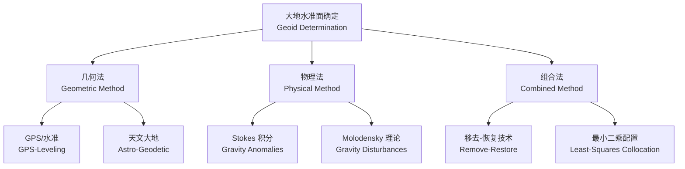

# 重力测量 (Gravity Measurement)

## 概述 (Overview)

重力测量（Gravity Measurement / Gravimetry）是精确测定**地球重力场 (Earth's Gravity Field)** 空间分布与时间变化的科学技术，为**大地测量学 (Geodesy)**、**地球物理学 (Geophysics)**、**资源勘探 (Resource Exploration)** 与**惯性导航 (Inertial Navigation)** 提供基础数据。

地球重力由**引力 (Gravitation)** 与**惯性离心力 (Centrifugal Force)** 合成：

$$
\vec{g} = \vec{g}_{gravitation} + \vec{g}_{centrifugal}
$$

正常重力公式（Somigliana 公式）：

$$
\gamma = \gamma_e \frac{1 + k \sin^2\phi}{\sqrt{1 - e^2 \sin^2\phi}}
$$

其中 $\gamma_e = 9.7803253359 \, \text{m/s}^2$ 为赤道正常重力，$\phi$ 为大地纬度，$k$ 与 $e$ 为椭球参数。

## 重力测量方法 (Gravity Measurement Methods)

### 绝对重力测量 (Absolute Gravity Measurement)

直接测定重力加速度的量值，无需外部基准。

| 方法 (Method) | 原理 (Principle) | 精度 (Accuracy) | 仪器 (Instrument) |
|--------------|-----------------|----------------|------------------|
| 自由落体 (Free-Fall) | $h = \frac{1}{2}gt^2$ | $1$–$2$ µGal | FG5-X、A10 |
| 上抛法 (Rise-and-Fall) | 对称消除空气阻力 | $< 1$ µGal | IMGC-02 |
| 原子干涉 (Atom Interferometry) | 冷原子干涉条纹 | $\sim 10^{-9} g$ | 实验室原型 |

自由落体法核心公式：

$$
g = \frac{2h}{t^2}
$$

通过激光干涉测量下落距离 $h$ 与时间 $t$，现代仪器采用**落体-抛体组合 (Drop-and-Throw)** 消除残余空气阻力影响。

### 相对重力测量 (Relative Gravity Measurement)

测定两点间**重力差 (Gravity Difference)**，需已知基准点绝对重力值。

| 类型 (Type) | 原理 (Principle) | 精度 (Accuracy) | 应用场景 (Application) |
|------------|-----------------|----------------|----------------------|
| 弹簧重力仪 (Spring Gravimeter) | 胡克定律 $F = k\Delta x$ | $5$–$20$ µGal | 区域重力网、流动测量 |
| 超导重力仪 (Superconducting Gravimeter) | 磁悬浮超导球 | $0.01$–$0.05$ µGal | 台站连续观测、潮汐分析 |
| 旋转重力仪 (Rotating Gravimeter) | 旋转摆频率变化 | $10$–$50$ µGal | 航空/船载动态测量 |

零长弹簧（Zero-Length Spring）重力仪灵敏度：

$$
\frac{\partial z}{\partial g} = \frac{m}{k_{eff}}
$$

其中 $m$ 为摆质量，$k_{eff}$ 为有效弹簧常数。

## 重力场模型 (Gravity Field Models)

### 地球重力场球谐展开 (Spherical Harmonic Expansion)

扰动位（Disturbing Potential）$T$ 展开：

$$
T(r, \theta, \lambda) = \frac{GM}{r} \sum_{n=2}^{N_{max}} \left(\frac{a}{r}\right)^n \sum_{m=0}^{n} \left(\bar{C}_{nm} \cos m\lambda + \bar{S}_{nm} \sin m\lambda\right) \bar{P}_{nm}(\cos\theta)
$$

其中：
- $GM$：地心引力常数
- $a$：参考椭球长半轴
- $\bar{C}_{nm}, \bar{S}_{nm}$：完全正常化球谐系数
- $\bar{P}_{nm}$：完全正常化缔合勒让德函数
- $N_{max}$：最大展开阶数

现代模型如 EGM2008（$N_{max}=2190$）、XGM2019e（$N_{max}=5399$）。

### 重力异常 (Gravity Anomalies)

| 异常类型 (Anomaly Type) | 定义 (Definition) | 应用 (Application) |
|------------------------|------------------|-------------------|
| 自由空气异常 (Free-Air) | $\Delta g_{FA} = g_{obs} - \gamma + 0.3086 h$ | 全球重力场建模 |
| 布格异常 (Bouguer) | $\Delta g_B = \Delta g_{FA} - 0.1119 h$ | 地壳结构、矿产勘探 |
| 均衡异常 (Isostatic) | $\Delta g_I = \Delta g_B - g_{compensation}$ | 岩石圈均衡研究 |

布格改正（Bouguer Correction）：

$$
\delta g_B = 2\pi G \rho h = 0.1119 \, h \quad (\mu\text{Gal}, h \text{ in m})
$$

假设地壳密度 $\rho = 2670 \, \text{kg/m}^3$。

## 大地水准面 (Geoid)

大地水准面（Geoid）是**重力等位面 (Equipotential Surface)** 中与全球平均海平面最接近者，是高程系统基准。

### 大地水准面高 (Geoid Height)

大地水准面相对于参考椭球的高：

$$
N = \frac{T}{\gamma}
$$

Bruns 公式（Bruns Formula），其中 $T$ 为扰动位。

### 大地水准面确定方法

Stokes 公式（Stokes' Formula）：

$$
N = \frac{R}{4\pi G \bar{\rho}} \iint_\sigma \Delta g \, S(\psi) \, d\sigma
$$

其中 $S(\psi)$ 为 Stokes 函数，$\psi$ 为计算点与流动点的球面角距。

## 重力测量应用 (Applications)

### 大地测量与导航 (Geodesy & Navigation)

| 应用 (Application) | 原理/方法 (Principle/Method) | 精度要求 (Accuracy Requirement) |
|-------------------|---------------------------|------------------------------|
| 高程基准统一 | 精确大地水准面模型 | $N$ 精度 $< 5$ cm |
| INS/GNSS 组合导航 | 重力梯度辅助惯性导航 | 重力异常 $< 1$ mGal |
| 卫星定轨 | 非保守力模型修正 | 地球重力场模型 |
| 垂直基准转换 | 大地高 ↔ 正高/正常高 | 厘米级 |

### 地球物理勘探 (Geophysical Exploration)

| 勘探目标 (Target) | 重力特征 (Gravity Signature) | 典型异常幅度 (Typical Anomaly) |
|------------------|----------------------------|------------------------------|
| 金属矿床 | 高密度体引起正异常 | $0.5$–$10$ mGal |
| 油气构造 | 盐丘/背斜引起环状异常 | $1$–$20$ mGal |
| 地下空洞 | 低密度区引起负异常 | $-0.1$ 至 $-5$ mGal |
| 断裂带 | 密度界面突变 | 梯度带异常 |

### 地球动力学 (Geodynamics)

- **冰川均衡调整 (GIA)**：冰期后地壳回弹引起的重力长期变化
- **地壳形变**：地震同震与震后重力变化
- **水循环**：地下水、冰川质量变化引起的时变重力场
- **潮汐**：固体潮引起的重力周期变化

重力潮汐理论振幅：

$$
\delta g_{tide} = \sum_i A_i \cos(\omega_i t + \phi_i)
$$

主要分潮：$M_2$（主太阴半日潮，$\approx 55$ µGal）、$S_2$（主太阳半日潮，$\approx 25$ µGal）、$O_1$（主太阴全日潮，$\approx 30$ µGal）。

## 重力卫星任务 (Gravity Satellite Missions)

| 任务 (Mission) | 时期 (Period) | 技术 (Technique) | 科学目标 (Science Objective) |
|---------------|--------------|-----------------|----------------------------|
| CHAMP | 2000–2010 | SST-hl | 时变重力场初步探测 |
| GRACE | 2002–2017 | SST-ll | 水循环、冰川变化 |
| GRACE-FO | 2018–至今 | SST-ll + 激光测距 | 延续 GRACE 任务 |
| GOCE | 2009–2013 | SGG | 静态重力场高分辨率 |

SST-hl（Satellite-to-Satellite Tracking, high-low）：
SST-ll（Satellite-to-Satellite Tracking, low-low）：
SGG（Satellite Gravity Gradiometry）：

## 测量规范与标准 (Standards)

| 标准 (Standard) | 内容 (Content) | 适用范围 (Scope) |
|----------------|---------------|----------------|
| IAGBN | 国际绝对重力基准网 | 全球重力基准 |
| 国家重力基本网 | 中国 2000 重力网 | 国家基准 |
| 一等重力点 | 相对精度 $< 25$ µGal | 区域控制 |
| 加密重力点 | 相对精度 $< 100$ µGal | 详细调查 |

## 参考文献 (References)

1. Torge, W., & Müller, J. (2012). *Geodesy* (4th ed.). De Gruyter.
2. Hofmann-Wellenhof, B., & Moritz, H. (2006). *Physical Geodesy* (2nd ed.). Springer.
3. Li, X., & Götze, H.-J. (2001). *Tutorial: Ellipsoid, Geoid, Gravity, Geodesy, and Geophysics*. Geophysics, 66(6), 1660–1668.
4. 宁津生 等. (2016). 《大地测量学基础》. 武汉大学出版社.
5. 郭俊义. (2006). 《重力测量学》. 测绘出版社.
